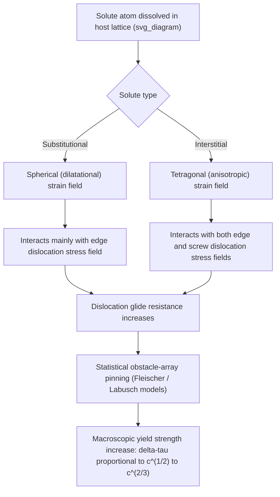

## Solid Solution Strengthening

### Definition and Physical Basis

Solid solution strengthening is the increase in yield and flow strength of a metal achieved by dissolving foreign (solute) atoms into the crystal lattice of the host (solvent) metal, forming a homogeneous solid solution. Solute atoms distort the surrounding crystal lattice — either by local expansion or contraction, depending on their atomic size relative to the host, and/or by altering local elastic and electronic properties. These distortions interact elastically with the strain fields of moving dislocations, impeding dislocation glide and thereby raising the stress required for plastic deformation.

Unlike precipitation or dispersion strengthening, solid solution strengthening does not involve a second phase; the solute atoms remain individually dissolved within the parent lattice, either substitutionally (replacing host atoms at lattice sites) or interstitially (occupying the small gaps between host atoms).

### Key Points

- Two principal categories: **substitutional solid solutions** (e.g., Cu-Ni, Cu-Zn, Fe-Ni) and **interstitial solid solutions** (e.g., C or N in α-Fe or γ-Fe)
- Strengthening generally scales with solute concentration, typically following a power-law or square-root dependence depending on the dominant interaction mechanism
- Interstitial solutes generally produce a stronger strengthening effect per atomic percent than substitutional solutes, due to larger and more asymmetric (tetragonal) lattice distortion
- Solid solution strengthening is one of the few mechanisms compatible with high ductility and toughness, though generally weaker in absolute magnitude than precipitation hardening or grain refinement
- A key contributor to solute strengthening in stainless steels, brasses, Al-Mg alloys, and interstitial-free vs. non-interstitial-free low-carbon steels

### Mechanisms of Solute-Dislocation Interaction

**Size (Elastic Misfit) Interaction**

A substitutional solute atom with atomic radius different from the host produces a spherically symmetric (dilatational) strain field. This interacts with the hydrostatic (dilatational) component of a dislocation's stress field — significant for edge dislocations, which possess both shear and hydrostatic stress components, but essentially absent for screw dislocations (pure shear stress field, no hydrostatic component). The size misfit parameter is commonly defined as:

$$\varepsilon_b = \frac{1}{a}\frac{da}{dc}$$

where $a$ is the lattice parameter and $c$ is solute concentration.

**Modulus (Elastic Interaction) Effect**

Solute atoms with elastic (shear) modulus different from the host locally alter the energy of a dislocation passing nearby, since dislocation strain energy scales with local shear modulus $G$. This modulus-mismatch interaction affects both edge and screw dislocations and is characterized by:

$$\varepsilon_G = \frac{1}{G}\frac{dG}{dc}$$

**Interstitial (Tetragonal Distortion) Interaction**

Interstitial solutes such as carbon and nitrogen in BCC iron occupy octahedral interstitial sites, producing a strongly **anisotropic (tetragonal)** local lattice distortion rather than a simple spherical one. This tetragonal strain field interacts strongly with *both* the dilatational and shear components of dislocation stress fields — including screw dislocations, which are otherwise unaffected by simple size misfit — making interstitial strengthening in BCC metals disproportionately potent compared to substitutional solutes of similar concentration. This is the basis for **strain aging** and the pronounced yield-point phenomenon in low-carbon steels (Cottrell atmospheres, discussed below).

**Electronic/Valence Effects**

In some alloy systems, differences in valence electron concentration between solute and solvent atoms contribute an additional strengthening component distinct from purely elastic (size/modulus) effects, historically discussed in terms of "electronic" or Mott-Nabarro-type contributions [Inference: the relative importance of electronic versus purely elastic contributions is system-dependent and has been a subject of ongoing refinement in solute-strengthening theory].

### Quantitative Strengthening Relationships

**Fleischer Model**

For dilute substitutional solid solutions, Fleischer's model combines size and modulus misfit effects into a single interaction parameter $\varepsilon_s$ and predicts a square-root dependence of strengthening on solute concentration $c$:

$$\Delta\tau = A \, G \, \varepsilon_s^{3/2} \, c^{1/2}$$

where $A$ is a constant and $\varepsilon_s$ combines size and modulus misfit terms (often as $\varepsilon_s = |\varepsilon_G' - \beta\varepsilon_b|$ with $\varepsilon_G' = \varepsilon_G/(1+0.5|\varepsilon_G|)$ to avoid overweighting large modulus mismatches, and $\beta \approx 3$ for edge dislocations). The $c^{1/2}$ dependence arises because dislocations statistically sample the solute distribution and bow between the strongest randomly-spaced obstacles, analogous to a random obstacle array problem.

**Labusch Model (Refined Statistical Treatment)**

The **Labusch model** provides a more general statistical-mechanical treatment of dislocation interaction with an array of randomly distributed weak point obstacles, also yielding:

$$\Delta\tau \propto c^{2/3}$$

in certain regimes (the exact exponent depends on the strength of individual solute-dislocation interactions relative to thermal activation and obstacle spacing statistics), reducing to Fleischer's $c^{1/2}$ result in appropriate limits [Inference: the crossover between $c^{1/2}$ and $c^{2/3}$ scaling regimes depends on obstacle strength and concentration range, and different experimental systems have been fit to either exponent depending on conditions].

**General Empirical Form**

Across many alloy systems, an empirical relationship of the form

$$\Delta\sigma_y = k \, c^n$$

with $n$ typically between 0.5 and 1 is used to fit experimental strengthening data, where $k$ is an alloy-system-specific constant.

### Mermaid Diagram: Solute-Dislocation Interaction Pathway

### Cottrell Atmospheres and the Yield Point Phenomenon

**Key Points**

- Interstitial solute atoms (C, N) in BCC iron diffuse toward and segregate around dislocation cores at ambient/moderate temperature, forming a **Cottrell atmosphere** — a solute-enriched region that lowers the total elastic strain energy of the dislocation
- This atmosphere effectively "locks" the dislocation in place; additional stress is required to either tear the dislocation away from its atmosphere or to nucleate new, unlocked dislocations
- This locking mechanism produces the characteristic **upper and lower yield point** and **Lüders band** propagation observed in low-carbon steel tensile tests: stress rises to an upper yield point, drops sharply as dislocations break free/multiply, then a distinct Lüders strain plateau occurs as deformation bands propagate along the gauge length before uniform work hardening resumes
- **Strain aging**: if a steel is strained slightly (past the yield point), unloaded, and then re-tested after a period at ambient or slightly elevated temperature, the yield point phenomenon reappears because interstitial atoms have had time to re-diffuse and re-form atmospheres around dislocations that were previously freed — a practically important consideration for stretcher-strain (Lüders marking) defects in sheet-metal-formed automotive panels
- **Interstitial-free (IF) steels**, stabilized by Ti and/or Nb additions that tie up carbon and nitrogen as stable carbonitrides, are specifically designed to eliminate free interstitial solute and thereby suppress the yield point/strain-aging phenomenon, improving formability and surface finish in deep-drawn automotive body panels

### SVG Diagram: Cottrell Atmosphere Around an Edge Dislocation

<svg xmlns="http://www.w3.org/2000/svg" viewBox="0 0 600 420" font-family="Helvetica, Arial, sans-serif">
<text x="300" y="28" text-anchor="middle" font-size="18" font-weight="bold" fill="#1a1a1a">Cottrell Atmosphere at an Edge Dislocation (svg_diagram)</text>

<line x1="300" y1="80" x2="300" y2="220" stroke="#1a1a1a" stroke-width="4" />
<line x1="280" y1="220" x2="320" y2="220" stroke="#1a1a1a" stroke-width="4" />
<text x="330" y="215" font-size="16" font-weight="bold" fill="#1a1a1a">⊥ (edge dislocation)</text>

<rect x="296" y="80" width="8" height="140" fill="#ccc" opacity="0.5" />

<text x="300" y="70" text-anchor="middle" font-size="12" fill="`#c0392b`">Tensile strain region (below slip plane)</text>

<text x="300" y="245" text-anchor="middle" font-size="12" fill="`#2980b9`">Compressive strain region (above slip plane)</text>

<line x1="120" y1="220" x2="480" y2="220" stroke="#666" stroke-width="1.5" stroke-dasharray="4,3" />

<circle cx="270" cy="240" r="7" fill="#27ae60" />
<circle cx="330" cy="245" r="7" fill="#27ae60" />
<circle cx="300" cy="265" r="7" fill="#27ae60" />
<circle cx="255" cy="270" r="7" fill="#27ae60" />
<circle cx="345" cy="270" r="7" fill="#27ae60" />
<circle cx="300" cy="290" r="7" fill="#27ae60" />
<circle cx="270" cy="300" r="7" fill="#27ae60" />
<circle cx="330" cy="300" r="7" fill="#27ae60" />

<text x="300" y="330" text-anchor="middle" font-size="13" fill="`#1a1a1a`" font-weight="bold">Interstitial solute atoms (C, N)</text>

<text x="300" y="348" text-anchor="middle" font-size="12" fill="#555">segregated in dilated lattice region below core</text>

<text x="300" y="366" text-anchor="middle" font-size="12" fill="#555">— "locks" dislocation, requiring extra stress to move</text>

<circle cx="90" cy="390" r="7" fill="#27ae60" />
<text x="105" y="395" font-size="12" fill="#333">Interstitial solute atom</text>
</svg>

### Alloy System Examples

**Example**

| Alloy System | Solute Type | Strengthening Notes |
| --- | --- | --- |
| α-Fe + C (or N) | Interstitial | Very strong per-atom strengthening; source of yield point phenomenon and strain aging |
| Cu-Ni (all proportions, isomorphous) | Substitutional | Classic Fleischer-model validation system; smooth, continuous strengthening across full composition range |
| Cu-Zn (α-brass) | Substitutional | Strengthening plus stacking-fault-energy reduction promotes twinning and Brass-type deformation texture |
| Al-Mg (5xxx series) | Substitutional | Primary strengthening mechanism (non-heat-treatable alloy series); also contributes to serrated flow (Portevin-Le Chatelier effect) at certain strain rates/temperatures |
| Austenitic stainless steel (Fe-Cr-Ni + N) | Mixed substitutional (Cr, Ni) + interstitial (N) | Nitrogen additions provide disproportionate strengthening; used in high-strength austenitic grades (e.g., nitrogen-strengthened 200-series and duplex stainless steels) |

### Dynamic Strain Aging and the Portevin-Le Chatelier Effect

**Key Points**

- At elevated temperature and appropriate strain rate, solute atoms can diffuse rapidly enough to repeatedly catch and re-lock mobile dislocations *during* ongoing plastic deformation, rather than only during static aging between tests
- This produces **serrated (jerky) flow** on the stress-strain curve — repeated small load drops as dislocations break free then are re-locked — known as the **Portevin-Le Chatelier (PLC) effect**
- Common in Al-Mg alloys, some austenitic stainless steels, and certain steels at intermediate temperatures; the specific strain-rate/temperature window for serrated flow depends on the solute diffusivity and dislocation velocity in the given alloy [Inference: precise PLC onset conditions are alloy- and microstructure-specific and are typically mapped experimentally as a strain-rate/temperature domain]
- PLC-related surface markings (Lüders-like bands) can be a cosmetic/functional concern in formed sheet products, motivating alloy design or processing adjustments to avoid the relevant deformation regime

### Relationship to Other Strengthening Mechanisms

**Key Points**

- Solid solution strengthening is generally the **weakest** of the classical strengthening mechanisms per unit addition (compared to precipitation hardening or grain refinement), but is valued for preserving ductility and toughness while raising strength
- Combines with other mechanisms in commercial alloys — e.g., microalloyed HSLA steels use combined solid-solution (Mn, Si) + grain refinement (Hall-Petch) + minor precipitation strengthening (Nb, Ti, V carbonitrides)
- Superposition with other mechanisms (grain refinement, precipitation, dislocation hardening) is commonly approximated as additive in engineering strength models, though the mechanisms are not strictly independent at the dislocation-obstacle interaction level [Inference: additive superposition is an approximation whose accuracy depends on the relative strength and spacing of different obstacle types present simultaneously]
- Unlike precipitation hardening, solid solution strengthening does not typically exhibit an "overaging" or strength-loss regime with time/temperature exposure (assuming the solute remains in solution and does not itself precipitate out)

### Next Steps

- Explore precipitation/age hardening as the complementary strengthening mechanism operating via second-phase particles rather than dissolved solute
- Study the Cottrell-Bilby model of atmosphere formation kinetics and its relation to strain-rate sensitivity
- Examine solute strengthening's interaction with dynamic strain aging in high-temperature creep-resistant alloy design
- Investigate interstitial-free (IF) steel metallurgy and Ti/Nb stabilization chemistry
- Review the Labusch statistical theory of random solute obstacle arrays in greater mathematical depth

### Related Topics

- Precipitation (age) hardening mechanisms and Orowan bypass
- Cottrell atmosphere formation kinetics and dislocation locking
- Portevin-Le Chatelier effect and dynamic strain aging
- Interstitial-free (IF) steel design and carbonitride stabilization
- Fleischer and Labusch statistical models of solute strengthening
- Yield point phenomenon and Lüders band propagation in mild steel
- Hall-Petch grain boundary strengthening (complementary mechanism)
- Stacking fault energy effects on deformation mode in substitutional alloys