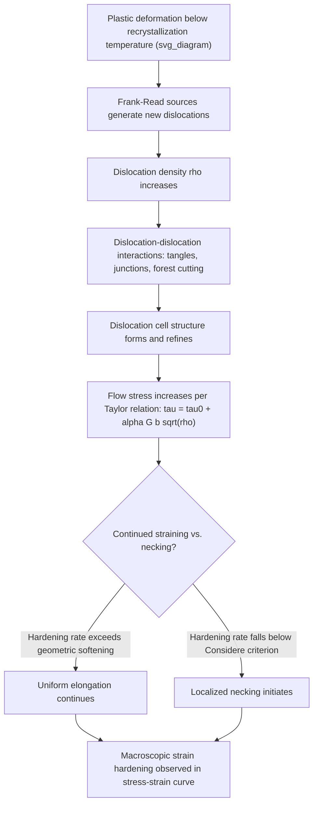

## Strain Hardening and Cold Work

### Definition and Physical Basis

Strain hardening (also called work hardening) is the increase in flow stress of a metal as a function of increasing plastic strain at a temperature low enough that dynamic recovery and recrystallization do not significantly relieve the accumulated dislocation structure — a condition generally referred to as **cold working**. As a metal is plastically deformed, dislocations multiply (via Frank-Read sources and other multiplication mechanisms) and interact with one another, forming increasingly dense and complex dislocation networks, tangles, and cell structures. These dislocation-dislocation interactions progressively impede further dislocation motion, requiring higher applied stress to sustain continued plastic flow.

Cold work refers to plastic deformation carried out below the recrystallization temperature (typically taken as roughly $0.3$–$0.5\, T_m$, where $T_m$ is the absolute melting point), such that the strengthening effect of dislocation accumulation persists in the microstructure rather than being annealed out.

### Key Points

- Strain hardening is the dominant strengthening mechanism exploited in cold-worked/cold-drawn products: wire, rod, sheet, and tube
- Increases yield and tensile strength while decreasing ductility (elongation to failure) and, generally, fracture toughness
- Fully reversible by recrystallization annealing, distinguishing it from precipitation or grain-refinement strengthening, which require different processing to reverse
- Quantified via empirical constitutive laws (Hollomon, Ludwik, Voce) fit to true stress-true strain data
- The rate of strain hardening (hardening exponent) is itself an important formability parameter — a high hardening rate promotes uniform strain distribution and delays localized necking

### Dislocation Multiplication and Interaction Mechanisms

**Frank-Read Source Operation**

A pinned dislocation segment, under sufficient resolved shear stress, bows out and operates as a **Frank-Read source**, repeatedly generating new dislocation loops that expand across the slip plane. Each operation cycle adds a new dislocation loop to the crystal, progressively increasing dislocation density $\rho$.

**Dislocation Storage and the Taylor Relationship**

As dislocation density increases, dislocations increasingly obstruct one another's motion — through direct elastic interactions, formation of sessile dislocation junctions (e.g., Lomer-Cottrell locks in FCC metals), and forest-dislocation cutting mechanisms. The resulting flow stress is well described by the **Taylor hardening relationship**:

$$\tau = \tau_0 + \alpha \, G \, b \, \sqrt{\rho}$$

where $\alpha$ is a geometric constant (typically $0.2$–$0.4$), $G$ is shear modulus, $b$ is the Burgers vector magnitude, and $\rho$ is the total dislocation density. Since strain hardening is fundamentally a consequence of increasing $\rho$ with plastic strain, this relationship connects the microstructural state (dislocation density) to the macroscopic flow stress.

**Dislocation Cell Structure Evolution**

At larger strains, dislocations self-organize into **cell structures**: dense dislocation tangles forming cell walls surrounding relatively dislocation-free cell interiors. As deformation proceeds, cell walls sharpen and cell size decreases, and at very large strains, cell walls can evolve into low-angle (and eventually higher-angle) sub-grain boundaries — a precursor microstructural state relevant to subsequent recrystallization behavior (see cell-to-subgrain transition in severe plastic deformation processing).

### Constitutive (True Stress-True Strain) Hardening Laws

**Hollomon Equation**

The most widely used empirical power-law relationship between true stress $\sigma$ and true plastic strain $\varepsilon_p$:

$$\sigma = K \, \varepsilon_p^{\,n}$$

where $K$ is the strength coefficient and $n$ is the **strain-hardening exponent** (typically $0.1$–$0.5$ for common structural metals). A log-log plot of true stress versus true plastic strain yields a straight line of slope $n$ under this model, providing a standard experimental method for extracting $n$ from a tensile test.

**Physical Significance of $n$**

- $n$ close to $0$: little strain hardening (already heavily cold-worked or naturally soft-hardening material); strain tends to localize early (early necking)
- $n$ close to $1$: strong, ideally elastic-plastic-like hardening (rare in practice for common metals; some very high-hardening alloys approach $n \approx 0.5$)
- $n$ correlates directly with resistance to necking (see Considère criterion below) and thus with sheet-metal stretch-formability

**Ludwik Equation**

A modification incorporating an initial yield stress term:

$$\sigma = \sigma_0 + K\,\varepsilon_p^{\,n}$$

useful when a finite, non-zero yield stress at $\varepsilon_p = 0$ must be captured explicitly (the Hollomon law predicts $\sigma \to 0$ as $\varepsilon_p \to 0$, which is physically incorrect for real yielding materials).

**Voce Equation (Saturation Hardening)**

For materials exhibiting hardening saturation at large strain (a plateau in flow stress rather than continued power-law increase):

$$\sigma = \sigma_{sat} - (\sigma_{sat} - \sigma_0)\exp(-\varepsilon_p/\varepsilon_c)$$

where $\sigma_{sat}$ is the saturation stress and $\varepsilon_c$ is a characteristic strain constant. This form is often more physically appropriate for metals undergoing significant dynamic recovery even at the deformation temperature considered "cold working" for that alloy [Inference: the choice between Hollomon, Ludwik, and Voce forms is typically made by which best fits the specific experimental data set over the relevant strain range, rather than by a universal physical preference].

### The Considère Criterion and Necking Instability

**Key Points**

- Plastic instability (onset of localized necking) in a tensile test occurs when the strain-hardening rate can no longer compensate for the geometric reduction in cross-sectional area — expressed by the **Considère criterion**:

$$\frac{d\sigma}{d\varepsilon} = \sigma$$

- Substituting the Hollomon relationship, this condition gives the strain at uniform (pre-necking) elongation as $\varepsilon_p = n$ — meaning the strain-hardening exponent directly predicts the true strain at which necking begins in a tensile test
- Materials with higher $n$ sustain uniform elongation to larger strains before localized necking initiates, directly linking strain-hardening capacity to tensile ductility and formability limits (e.g., in Forming Limit Diagrams for sheet metal)

### Mermaid Diagram: Strain Hardening Mechanism Pathway

### SVG Diagram: True Stress-Strain Curve Illustrating Strain Hardening and Necking Onset

<svg xmlns="http://www.w3.org/2000/svg" viewBox="0 0 640 460" font-family="Helvetica, Arial, sans-serif">
<text x="320" y="28" text-anchor="middle" font-size="18" font-weight="bold" fill="#1a1a1a">True Stress-Strain Curve and Necking Onset (svg_diagram)</text>

<line x1="90" y1="400" x2="580" y2="400" stroke="#333" stroke-width="2" />
<line x1="90" y1="400" x2="90" y2="60" stroke="#333" stroke-width="2" />
<text x="330" y="430" text-anchor="middle" font-size="14" fill="#333">True plastic strain, ε_p</text>
<text x="45" y="230" text-anchor="middle" font-size="14" fill="#333" transform="rotate(-90 45 230)">True stress, σ</text>

<path d="M 90 390 Q 180 260, 300 190 Q 420 140, 560 100" fill="none" stroke="`#c0392b`" stroke-width="3.5" />

<circle cx="330" cy="182" r="7" fill="#2980b9" stroke="#1a1a1a" stroke-width="1" />
<line x1="330" y1="182" x2="330" y2="400" stroke="#2980b9" stroke-width="1.5" stroke-dasharray="4,3" />
<text x="335" y="175" font-size="12" fill="#1a1a1a" font-weight="bold">Necking onset (ε_p = n)</text>
<text x="290" y="418" text-anchor="middle" font-size="11" fill="#555">ε_p = n</text>

<path d="M 330 182 Q 420 150, 500 130" fill="none" stroke="#999" stroke-width="2.5" stroke-dasharray="6,4" />
<text x="470" y="120" font-size="11" fill="#777">Diffuse/local necking region</text>

<text x="180" y="330" font-size="12" fill="`#c0392b`">Uniform elongation region</text>

<text x="470" y="230" font-size="12" fill="#555">Hardening rate d(sigma)/d(eps)</text>

<text x="470" y="245" font-size="12" fill="#555">falls below sigma</text>

</svg>

### Cold Working: Practical Processing and Structure-Property Relationships

**Example**

Consider a copper wire cold-drawn from an initial diameter $d_0$ to final diameter $d_f$. Percent cold work is conventionally defined via area reduction:

$$\%CW = \frac{A_0 - A_f}{A_0}\times 100$$

For a wire drawn from $d_0 = 10$ mm to $d_f = 7$ mm:

$$\%CW = \left(1 - \frac{d_f^2}{d_0^2}\right)\times 100 = \left(1 - \frac{49}{100}\right)\times 100 = 51\%$$

Typical trends observed as %CW increases (illustrative, alloy-dependent):

| %CW | Relative Yield Strength | Relative Tensile Strength | Relative Elongation |
| --- | --- | --- | --- |
| 0% (annealed) | 1.0 (baseline) | 1.0 (baseline) | 100% (baseline) |
| 20% | ~1.5–1.8× | ~1.2–1.4× | ~40–60% of baseline |
| 40% | ~1.9–2.3× | ~1.4–1.6× | ~20–35% of baseline |
| 60%+ | ~2.2–2.6× (approaching saturation) | ~1.5–1.7× | ~10–20% of baseline |

[Inference: exact multipliers are strongly alloy- and initial-microstructure-dependent; values shown illustrate the general trend of diminishing returns in strength increase alongside a steep, often earlier-onset drop in ductility, consistent with typical cold-drawn copper and brass behavior.]

### Annealing and the Reversal of Cold Work

**Key Points**

- Cold-worked microstructures are thermodynamically metastable (elevated stored dislocation energy); subsequent annealing above the recrystallization temperature reverses strain hardening through three sequential stages:
  1. **Recovery** — dislocation rearrangement and partial annihilation (climb, cross-slip) without migration of high-angle boundaries; partially relieves internal stress and modestly softens the material while largely retaining the cold-worked grain shape
  2. **Recrystallization** — nucleation and growth of new, strain-free grains consuming the deformed microstructure; produces the most significant softening and ductility recovery
  3. **Grain growth** — continued annealing beyond full recrystallization causes average grain size to increase, which (via Hall-Petch) causes further, more gradual softening
- This staged reversal underlies standard commercial tempers (e.g., "quarter-hard," "half-hard," "full-hard" designations for cold-rolled sheet and strip products) achieved by controlled combinations of cold reduction and partial (recovery-stage or partial-recrystallization) annealing

### Bauschinger Effect Interaction

**Key Points**

- Strain hardening accumulated during cold work is *not* generally isotropic — dislocation substructures (pile-ups, cell walls) formed during unidirectional cold work produce internal back-stresses that manifest as a Bauschinger effect upon load reversal, meaning the effective "hardened" strength is direction-dependent relative to the original straining direction
- This has direct practical consequences for subsequent forming operations (e.g., a cold-drawn wire subsequently bent, or sheet cold-rolled then later formed in a different strain path) where the isotropic-hardening assumption embedded in simple strength tables can be non-conservative

### Related Topics

- Dislocation density evolution and the Taylor hardening equation
- Hollomon, Ludwik, and Voce constitutive hardening laws
- Considère criterion and necking instability in tensile testing
- Recovery, recrystallization, and grain growth annealing stages
- Bauschinger effect and kinematic hardening interactions with cold work
- Forming Limit Diagrams and sheet-metal formability
- Dislocation cell structure evolution and sub-grain formation
- Commercial temper designations for cold-rolled sheet and strip products