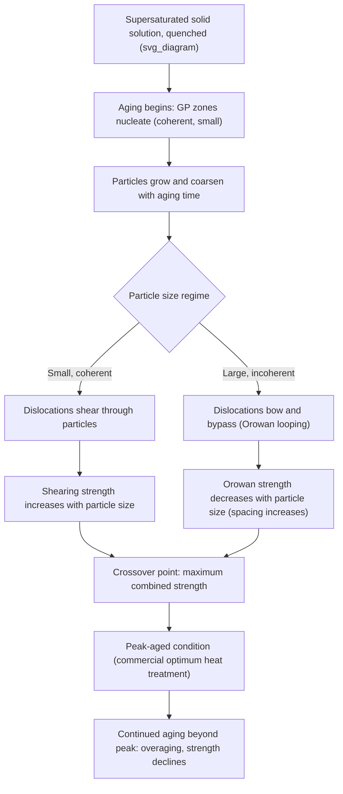

## Precipitation and Dispersion Strengthening

### Definition and Physical Basis

Precipitation strengthening (also called age hardening) and dispersion strengthening are strengthening mechanisms that rely on fine, second-phase particles distributed throughout a metallic matrix to impede dislocation motion. Although often discussed together, they differ in origin:

- **Precipitation hardening** involves particles that form *in situ* from a supersaturated solid solution via controlled heat treatment (solution treatment, quenching, and aging), and are therefore thermodynamically coupled to the matrix — they can dissolve, coarsen, or transform on further heating
- **Dispersion strengthening** involves particles introduced *externally* (typically via powder metallurgy, mechanical alloying, or internal oxidation) that are thermodynamically stable and largely insoluble in the matrix even at high temperature, making dispersion-strengthened alloys resistant to overaging and suitable for elevated-temperature service

In both cases, second-phase particles act as discrete obstacles that a moving dislocation must either cut through or bow around, and the mechanism that operates — along with the resulting strengthening magnitude — depends critically on particle size, spacing, and coherency with the matrix.

### Key Points

- One of the most powerful strengthening mechanisms available in metallurgy, capable of very large strength increases (e.g., 2000-series and 7000-series aluminum alloys, nickel-based superalloys)
- Strength as a function of aging time/temperature exhibits a characteristic curve rising to a peak ("peak-aged" condition) then declining ("overaged") as particles coarsen
- Governed by two competing dislocation-particle interaction mechanisms: **particle shearing** (for small, coherent, weak particles) and **Orowan looping/bypass** (for larger, incoherent, or widely spaced particles)
- The maximum strengthening occurs near the transition between these two mechanisms — the classic peak-aging condition

### Precipitation Sequence and Coherency Evolution

**Solution Treatment, Quenching, and Aging**

The classical precipitation-hardening heat treatment sequence:

1. **Solution treatment** — heating into the single-phase field to dissolve all solute into a homogeneous solid solution
2. **Quenching** — rapid cooling to room temperature to retain a supersaturated solid solution (SSSS), suppressing equilibrium precipitation
3. **Aging** — controlled reheating (natural aging at room temperature or artificial aging at elevated temperature) to allow controlled, fine-scale precipitation

**Coherency Progression (Illustrated for Al-Cu System)**

As aging proceeds, the precipitate sequence typically evolves through several transitional (metastable) phases before reaching the stable equilibrium phase:

$$\text{SSSS} \rightarrow \text{GP zones} \rightarrow \theta'' \rightarrow \theta' \rightarrow \theta\ (\text{Al}_2\text{Cu}, \text{equilibrium})$$

- **GP (Guinier-Preston) zones**: fully coherent, solute-rich clusters/platelets, essentially fully strained-in with the matrix lattice — produce large coherency strain fields that strongly interact with dislocations despite tiny size
- **θ″ and θ′**: partially coherent transitional phases with progressively increasing size and reduced coherency strain per unit volume, but larger overall particle size
- **θ (equilibrium)**: fully incoherent equilibrium precipitate, largest size, least effective per-particle strengthening due to wide interparticle spacing at the volume fractions typical of age-hardenable alloys

Peak strength in most age-hardenable aluminum alloys corresponds to a fine dispersion of the intermediate (GP zone or θ″-type) semi-coherent precipitates, *not* the equilibrium phase.

### Dislocation-Particle Interaction Mechanisms

**Particle Shearing (Coherent, Weak Particles)**

When precipitates are small, coherent (or semi-coherent) with the matrix, and mechanically "soft" relative to the matrix, dislocations can cut directly through them. The strengthening increment for the shearing mechanism scales with several particle-property-dependent contributions, generally combined as:

$$\Delta\tau_{shear} \propto \left(\frac{\gamma_{APB}}{2b}\right)\sqrt{\frac{f \, r}{b}}$$

for ordered precipitates sheared with formation of an antiphase boundary (APB) of energy $\gamma_{APB}$, where $f$ is precipitate volume fraction and $r$ is average particle radius (this specific form applies to ordered-precipitate shearing, such as γ′ in Ni-superalloys; coherency-strain-controlled shearing follows a related but distinct functional form). In general, shearing-mechanism strengthening *increases* with increasing particle size at fixed volume fraction, because larger (but still shearable) particles present a greater cross-section for the dislocation to cut through.

**Orowan Bypass (Incoherent or Large Particles)**

When particles become too large, too hard, or fully incoherent for dislocations to shear, the dislocation instead bows between particles and bypasses them, leaving a residual dislocation loop encircling each particle (Orowan looping). The critical stress for this bypass mechanism is:

$$\Delta\tau_{Orowan} = \frac{Gb}{L}$$

where $L$ is the effective interparticle spacing. Because $L$ increases with increasing particle size at fixed volume fraction (fewer, larger particles are farther apart than many small ones), Orowan-mechanism strengthening *decreases* with increasing particle size — the opposite trend from the shearing mechanism.

**Peak Aging as the Crossover Point**

Since shearing strength increases with particle size while Orowan strength decreases with particle size, the two curves cross at an optimum particle size, producing the maximum overall strengthening — this crossover point corresponds to the peak-aged condition in commercial heat treatment practice. Aging beyond this point ("overaging") shifts the microstructure fully into the Orowan-bypass regime with increasingly coarse, widely spaced particles, and both bypass stress and total strengthening decline.

### Mermaid Diagram: Precipitation Strengthening Mechanism Crossover

### SVG Diagram: Age-Hardening Curve Showing Shearing/Orowan Crossover

<svg xmlns="http://www.w3.org/2000/svg" viewBox="0 0 640 460" font-family="Helvetica, Arial, sans-serif">
<text x="320" y="28" text-anchor="middle" font-size="18" font-weight="bold" fill="#1a1a1a">Age-Hardening Curve: Shearing vs. Orowan Mechanisms (svg_diagram)</text>

<line x1="90" y1="400" x2="580" y2="400" stroke="#333" stroke-width="2" />
<line x1="90" y1="400" x2="90" y2="60" stroke="#333" stroke-width="2" />
<text x="330" y="430" text-anchor="middle" font-size="14" fill="#333">Aging time / particle size (increasing right)</text>
<text x="45" y="230" text-anchor="middle" font-size="14" fill="#333" transform="rotate(-90 45 230)">Strength contribution</text>

<path d="M 90 380 Q 200 300, 320 150" fill="none" stroke="#2980b9" stroke-width="3" />
<path d="M 320 150 Q 400 90, 480 55" fill="none" stroke="#2980b9" stroke-width="2" stroke-dasharray="5,4" />
<text x="150" y="290" font-size="12" fill="#2980b9" font-weight="bold">Shearing mechanism (rising)</text>

<path d="M 200 60 Q 260 100, 320 150" fill="none" stroke="#27ae60" stroke-width="2" stroke-dasharray="5,4" />
<path d="M 320 150 Q 420 220, 560 320" fill="none" stroke="#27ae60" stroke-width="3" />
<text x="400" y="260" font-size="12" fill="#27ae60" font-weight="bold">Orowan mechanism (falling)</text>

<path d="M 90 380 Q 200 290, 320 150 Q 420 220, 560 320" fill="none" stroke="#c0392b" stroke-width="4" />

<circle cx="320" cy="150" r="8" fill="#c0392b" stroke="#1a1a1a" stroke-width="1.5" />
<line x1="320" y1="150" x2="320" y2="400" stroke="#c0392b" stroke-width="1.5" stroke-dasharray="4,3" />
<text x="330" y="145" font-size="13" font-weight="bold" fill="#1a1a1a">Peak-aged</text>

<text x="170" y="418" text-anchor="middle" font-size="11" fill="#777">Underaged</text>

<text x="450" y="418" text-anchor="middle" font-size="11" fill="#777">Overaged</text>

<rect x="380" y="60" width="230" height="65" fill="#f7f7f7" stroke="#999" stroke-width="1" rx="6" />
<line x1="392" y1="80" x2="420" y2="80" stroke="#c0392b" stroke-width="4" />
<text x="428" y="85" font-size="12" fill="#333">Combined (observed) strength</text>
<line x1="392" y1="100" x2="420" y2="100" stroke="#2980b9" stroke-width="3" />
<text x="428" y="105" font-size="12" fill="#333">Shearing contribution</text>
<line x1="392" y1="118" x2="420" y2="118" stroke="#27ae60" stroke-width="3" />
<text x="428" y="123" font-size="12" fill="#333">Orowan contribution</text>
</svg>

### Dispersion Strengthening: Distinguishing Features

**Key Points**

- Dispersion-strengthened alloys use thermodynamically stable, insoluble particles — commonly oxides (e.g., Y₂O₃, Al₂O₃, ThO₂) — introduced by **mechanical alloying** (high-energy ball milling of matrix and oxide powders) followed by consolidation, or by **internal oxidation** of dilute alloy powders
- Because the particles do not dissolve or coarsen significantly even near the matrix melting point, dispersion-strengthened alloys retain strength at temperatures where conventional precipitation-hardened alloys would overage and soften rapidly
- **Oxide Dispersion Strengthened (ODS) alloys** — such as ODS nickel superalloys (MA754, MA6000) and ODS ferritic steels (developed for nuclear fission/fusion reactor cladding applications) — exploit this thermal stability for high-temperature creep resistance
- The strengthening mechanism is predominantly **Orowan bypass** (since oxide dispersoids are typically large and fully incoherent), meaning dispersion strengthening does not exhibit a shearing regime or an overaging peak — strength is comparatively stable over a wide temperature/time service window [Inference: some fine secondary strengthening contribution from residual dislocation substructure interaction with dispersoids may occur but the dominant, temperature-stable contribution is Orowan-type]

### Commercial Alloy Examples

**Example**

| Alloy System | Precipitate Phase | Application |
| --- | --- | --- |
| Al-Cu (2xxx series, e.g., 2024) | GP zones → θ′ → θ (Al₂Cu) | Aerospace structural sheet/plate |
| Al-Zn-Mg-Cu (7xxx series, e.g., 7075) | η′/η (MgZn₂-based) | High-strength aerospace structures |
| Ni-Cr-Al superalloys (e.g., Inconel 718, René 41) | γ′ (Ni₃(Al,Ti)), ordered L1₂ structure | Turbine blades/discs, high-temperature structural components |
| Cu-Be | Coherent Be-rich precipitates | High-strength, high-conductivity springs and electrical contacts |
| ODS ferritic/nickel alloys (MA956, MA754) | Y₂O₃ (or similar oxide) dispersoids | High-temperature creep-resistant structural components, nuclear applications |

### Requirements for Effective Precipitation Hardening

**Key Points**

- Solute must have appreciable solid solubility at elevated temperature that **decreases significantly** with decreasing temperature (a sloped solvus boundary), enabling supersaturation upon quenching
- The alloy system must permit formation of a metastable, finely dispersed precipitate sequence rather than direct, coarse precipitation of the equilibrium phase upon aging
- Quench rate must be sufficient to suppress premature precipitation during cooling (avoiding "quench sensitivity," where slow cooling through a critical temperature range causes coarse, ineffective precipitation before controlled aging begins) — a particular concern in thick-section 7xxx aluminum forgings
- Not all alloy systems are age-hardenable: systems lacking a suitably sloped solvus (e.g., many non-heat-treatable 5xxx Al-Mg alloys) rely instead on solid-solution strengthening and strain hardening

### Common Processing Pitfalls and Considerations

**Next Steps / Practical Considerations**

- **Overaging avoidance** during any subsequent service or joining thermal exposure (e.g., welding heat-affected zones in age-hardenable aluminum alloys can locally overage and soften the material — a critical design consideration in aerospace welded structures)
- **Natural vs. artificial aging** — some Al-Cu alloys (e.g., 2024-T4) achieve useful strength via room-temperature natural aging over days, while others require artificial (elevated-temperature) aging to reach peak properties (e.g., 6061-T6)
- **Retrogression and re-aging (RRA)** treatments — specialized multi-step heat treatments used in some 7xxx aerospace alloys to recover a favorable combination of strength and stress-corrosion cracking resistance beyond what standard peak-aging alone provides
- **Coarsening kinetics** during prolonged high-temperature service generally follow Ostwald ripening (LSW theory), with particle radius growing as $r^3 \propto t$ under diffusion-controlled coarsening [Inference: exact coarsening exponent and rate constant depend on diffusivity, interfacial energy, and volume fraction specific to each alloy-precipitate system]

### Related Topics

- Orowan looping mechanics and residual dislocation loops
- GP zone formation and coherency strain theory
- Ostwald ripening (LSW coarsening theory) and overaging kinetics
- Oxide Dispersion Strengthened (ODS) alloy processing via mechanical alloying
- Nickel-based superalloy γ′ strengthening and high-temperature creep resistance
- Quench sensitivity and time-temperature-transformation behavior in age-hardenable alloys
- Retrogression and re-aging (RRA) treatments for stress-corrosion-resistant aerospace alloys
- Superposition of strengthening mechanisms in multi-mechanism alloy design