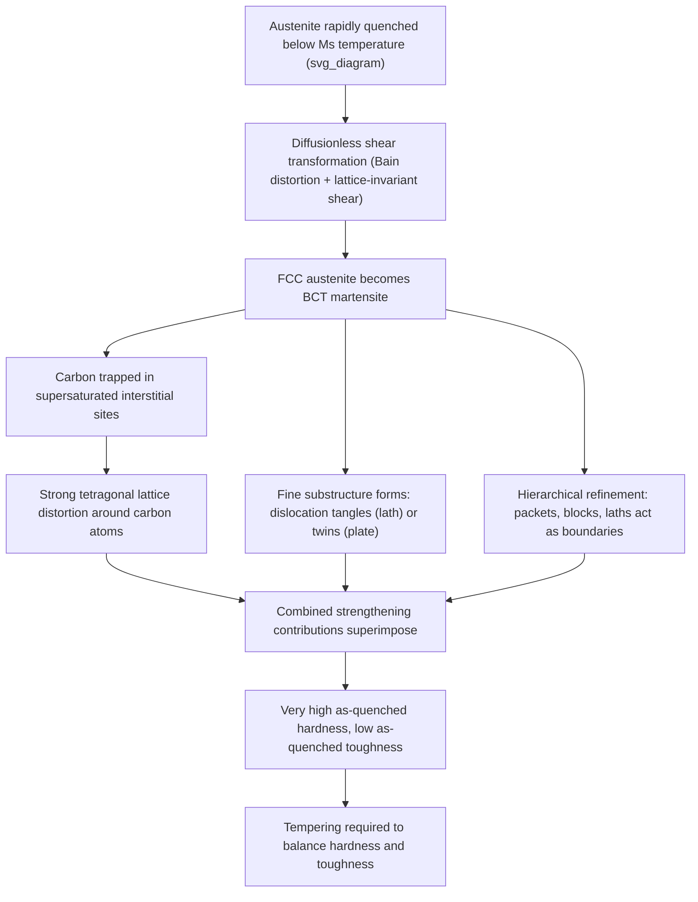

## Martensitic Strengthening

### Definition and Physical Basis

Martensitic strengthening refers to the substantial increase in hardness and strength achieved when a metal (most notably steel) undergoes a **diffusionless, shear-dominated phase transformation** from a high-temperature parent phase (austenite in steels) to martensite upon sufficiently rapid cooling (quenching). Unlike diffusion-controlled transformations, martensite forms via a cooperative, near-instantaneous shear/shuffle of atoms across the transformation interface, with no long-range atomic diffusion — atoms move less than one interatomic spacing, and their relative neighbor relationships are preserved.

In steels, martensite forms from the face-centered cubic (FCC) austenite phase into a **body-centered tetragonal (BCT)** structure, with carbon atoms trapped in supersaturated interstitial positions that would otherwise diffuse out during slower cooling. This combination of an inherently hard crystal structure, extreme carbon supersaturation, and the transformation-induced substructure produces the highest strength/hardness levels attainable in conventional carbon and low-alloy steels.

### Key Points

- Requires cooling rate exceeding the **critical cooling rate** to bypass diffusional transformations (pearlite, bainite) and suppress the nose of the TTT/CCT curve
- Martensite start ($M_s$) and finish ($M_f$) temperatures are compositionally determined and generally decrease with increasing carbon and most alloying element content
- Strengthening arises from multiple simultaneous contributions: interstitial (carbon) solid-solution strengthening, extremely fine substructure (high dislocation density or fine twins), and the inherently distorted BCT lattice itself
- As-quenched martensite is typically very hard but extremely brittle; **tempering** (controlled reheating) is almost universally required to restore usable toughness at some sacrifice of peak hardness

### Crystallographic Transformation Mechanism

**Diffusionless Shear Transformation**

The austenite-to-martensite transformation proceeds via a coordinated lattice shear (often described by the **Bain distortion**, which describes the geometric strain path converting the FCC austenite lattice into the BCT martensite lattice through a combination of compression along one axis and expansion along the other two) combined with an additional shear or lattice-invariant deformation (slip or twinning) needed to minimize the overall shape and volume change and produce an observed macroscopic habit plane consistent with experimental crystallography. This transformation occurs at speeds approaching the speed of sound in the material — far too fast for thermally activated diffusion of substitutional or even interstitial atoms to keep pace.

**Habit Plane and Orientation Relationships**

The martensite plates or laths form along specific crystallographic habit planes relative to the parent austenite, with well-documented orientation relationships (e.g., Kurdjumov-Sachs, Nishiyama-Wassermann relationships in steels) describing the precise lattice correspondence between parent and product phases [Inference: which orientation relationship is observed can depend on alloy composition and transformation temperature, and has been a subject of ongoing crystallographic study].

**Athermal and Isothermal Martensite**

In most steels, martensite formation is predominantly **athermal** — the transformed fraction depends primarily on the temperature reached below $M_s$ (not on time held at that temperature), following relationships such as the Koistinen-Marburger equation:

$$f_M = 1 - \exp[-\alpha(M_s - T)]$$

where $f_M$ is the volume fraction transformed to martensite, $T$ is the quench temperature, and $\alpha$ is a material-specific constant. Some alloy systems (e.g., certain high-alloy steels, Fe-Ni-Mn systems) additionally exhibit an **isothermal martensite** component, where transformation continues (or is even nucleated) via a time-dependent process at constant temperature below $M_s$ [Inference: the relative athermal versus isothermal character depends strongly on alloy chemistry].

### Contributions to Martensitic Strengthening

**Interstitial Solid-Solution Strengthening (Dominant Contribution in Steel)**

The trapped, supersaturated carbon in the BCT lattice produces exceptionally strong strengthening because of the tetragonal (highly anisotropic) local lattice distortion around each carbon atom — the same interstitial mechanism discussed in solid-solution strengthening, but at a supersaturation level (up to the full carbon content of the steel) vastly exceeding equilibrium solubility in ferrite. This is widely regarded as the single largest contributor to as-quenched martensite hardness in medium- and high-carbon steels, with hardness increasing steeply and nearly linearly with carbon content up to roughly 0.6 wt% C.

**Substructure Strengthening (Dislocations or Twins)**

Martensite forms with one of two characteristic internal substructures depending on carbon content and $M_s$ temperature:

- **Lath martensite** (low-to-medium carbon, higher $M_s$): high density of tangled dislocations within each lath, morphologically similar to heavily cold-worked ferrite; strengthening contribution analogous to dislocation (strain) hardening
- **Plate (twinned) martensite** (high carbon, lower $M_s$): internally twinned substructure rather than dislocation tangles, since the lower transformation temperature favors twinning as the lattice-invariant deformation mode over slip

**Grain/Lath/Block Size Refinement (Hall-Petch-Type Contribution)**

The martensitic microstructure is hierarchically subdivided — prior austenite grains subdivide into packets, which subdivide into blocks, which subdivide into individual laths (in lath martensite) — with each successively finer boundary type acting as an additional barrier to dislocation motion, contributing a Hall-Petch-like size-dependent strengthening term tied to the finest relevant microstructural unit (typically the block or lath boundary spacing) [Inference: which hierarchical level dominates the effective barrier spacing is still an active area of steel microstructure research].

**Solute (Substitutional Alloying) Contribution**

Substitutional alloying elements (Mn, Cr, Ni, Mo, etc.) present in the parent austenite carry over into the martensite and contribute an additional, comparatively smaller solid-solution strengthening increment on top of the dominant carbon effect.

### Mermaid Diagram: Martensitic Strengthening Contribution Pathway

### SVG Diagram: Martensite Hardness vs. Carbon Content

<svg xmlns="http://www.w3.org/2000/svg" viewBox="0 0 640 460" font-family="Helvetica, Arial, sans-serif">
<text x="320" y="28" text-anchor="middle" font-size="18" font-weight="bold" fill="#1a1a1a">As-Quenched Martensite Hardness vs. Carbon Content (svg_diagram)</text>

<line x1="90" y1="400" x2="580" y2="400" stroke="#333" stroke-width="2" />
<line x1="90" y1="400" x2="90" y2="60" stroke="#333" stroke-width="2" />
<text x="330" y="430" text-anchor="middle" font-size="14" fill="#333">Carbon content (wt.% C)</text>
<text x="45" y="230" text-anchor="middle" font-size="14" fill="#333" transform="rotate(-90 45 230)">Hardness (HRC, approx.)</text>

<text x="90" y="418" text-anchor="middle" font-size="11" fill="#555">0</text>

<text x="580" y="418" text-anchor="middle" font-size="11" fill="#555">1.0</text>

<text x="75" y="405" text-anchor="end" font-size="11" fill="#555">20</text>

<text x="75" y="75" text-anchor="end" font-size="11" fill="#555">65</text>

<path d="M 100 390 C 180 260, 260 140, 340 100 C 420 80, 500 72, 570 70" fill="none" stroke="`#c0392b`" stroke-width="3.5" />

<circle cx="200" cy="220" r="6" fill="#2980b9" />
<text x="210" y="210" font-size="11" fill="#333">~0.2% C: lath martensite dominant</text>
<circle cx="380" cy="95" r="6" fill="#2980b9" />
<text x="390" y="85" font-size="11" fill="#333">~0.6% C: mixed lath/plate</text>
<circle cx="540" cy="72" r="6" fill="#2980b9" />
<text x="380" y="130" font-size="11" fill="#333">~0.8%+ C: plate (twinned) martensite, plateau region</text>

<text x="200" y="330" font-size="12" fill="#777">Steep rise: dominant interstitial C strengthening</text>

</svg>

### Tempering: Reversing Excess Brittleness While Retaining Strength

**Key Points**

- **As-quenched martensite** is typically too brittle for direct engineering use except in specific applications (e.g., some cutting tool edges, certain case-hardened surface layers); virtually all structural martensitic steel components are subsequently **tempered** — reheated to a controlled temperature below the lower critical temperature ($A_1$)
- Tempering proceeds through recognized stages with increasing temperature: (1) precipitation of transition carbides (e.g., ε-carbide) from supersaturated martensite at low temperature (~100–200°C), (2) decomposition of retained austenite, (3) cementite formation and coarsening, (4) recovery and spheroidization of the carbide/ferrite structure at higher tempering temperatures
- Tempering reduces hardness/strength progressively while substantially restoring ductility and toughness, allowing engineers to select a tempering temperature that provides an application-appropriate balance (e.g., high-hardness tool steels tempered at low temperature vs. tough structural quenched-and-tempered steels tempered at higher temperature)
- **Tempered martensite embrittlement (TME)**, occurring in certain alloy steels tempered within specific intermediate temperature ranges (commonly cited around 260–370°C, alloy-dependent), is a practically important phenomenon to avoid in heat-treatment specification, associated with impurity segregation to prior austenite grain boundaries and/or interlath cementite film formation [Inference: the precise embrittlement mechanism and temperature range are alloy-composition-dependent and remain subjects of detailed metallurgical study]

### Hardenability and Its Relation to Achieving Martensitic Strengthening

**Key Points**

- **Hardenability** (distinct from hardness itself) describes the *depth* to which a given steel can be hardened (transformed to martensite) upon quenching, governed primarily by the cooling-rate dependence embedded in the steel's TTT/CCT diagram
- Alloying elements (Mn, Cr, Mo, Ni, B) generally shift the pearlite/bainite noses of the CCT diagram to longer times, slowing the required critical cooling rate and thereby increasing hardenability — allowing martensite to form even in thicker sections or with less severe quenchants
- **Jominy end-quench test** is the standard method for quantifying hardenability, producing a hardness-versus-distance profile along a standardized specimen subjected to a controlled, spatially varying cooling rate
- Achieving full martensitic strengthening throughout a component's cross-section (not just the surface) requires matching steel hardenability to section size and selected quenching medium (water, oil, polymer, or air), since insufficient hardenability results in softer transformation products (bainite, pearlite) forming in the interior despite a fully martensitic surface

### Example: Practical Heat Treatment Selection

**Example**

For a medium-carbon low-alloy steel (e.g., AISI 4140) intended for a structural shaft:

1. Austenitize at approximately 845–870°C to fully dissolve carbides into austenite
2. Quench in oil (appropriate given 4140's Cr-Mo alloying provides sufficient hardenability for oil quenching of moderate section sizes, avoiding the higher distortion/cracking risk of water quenching)
3. Temper at a selected temperature (e.g., 425–650°C) chosen to balance the required tensile strength/hardness against toughness and impact resistance specifications for the shaft's service loading
4. Verify hardenability adequacy via Jominy testing or CCT-diagram-based section-size calculations prior to full-scale production heat treatment

[Inference: specific temperatures and quenchant selection illustrate standard practice for this alloy class; exact parameters are specified per relevant heat-treatment standards and application requirements.]

### Related Topics

- TTT and CCT diagrams and critical cooling rate determination
- Bain distortion and martensite crystallography (Kurdjumov-Sachs, Nishiyama-Wassermann relationships)
- Tempering stages and tempered martensite embrittlement
- Hardenability and the Jominy end-quench test
- Retained austenite and its effect on as-quenched steel properties
- Lath vs. plate martensite morphology and substructure
- Case hardening (carburizing, nitriding) and localized martensitic strengthening
- Quenching media selection and quench cracking/distortion avoidance