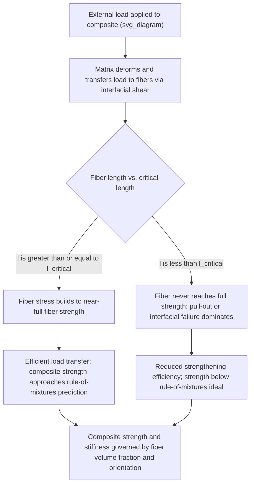

## Composite and Fiber Strengthening

### Definition and Physical Basis

Composite and fiber strengthening is the enhancement of mechanical properties (stiffness, strength, and often toughness) achieved by combining a continuous matrix phase with a distinct, load-bearing reinforcement phase — typically fibers, but also whiskers or particulates — such that the resulting composite material exhibits properties superior to either constituent alone. Unlike solid-solution, precipitation, or grain-boundary strengthening (which strengthen a single-phase or matrix-dominated microstructure through obstacle-dislocation interactions at the atomic-to-micron scale), fiber strengthening operates at a coarser structural scale, relying on efficient **load transfer** from a relatively compliant, lower-strength matrix into stiff, high-strength reinforcing fibers via interfacial shear stress.

The matrix serves several critical functions: it binds fibers together, transfers and distributes applied load to the fibers, protects fibers from environmental degradation and mechanical damage, and (in the case of discontinuous fibers) governs the efficiency of load transfer via shear-lag mechanics at fiber ends. The fibers themselves carry the majority of the applied load, owing to their high intrinsic strength and stiffness relative to the matrix.

### Key Points

- Applicable across metal-matrix composites (MMCs), polymer-matrix composites (PMCs), and ceramic-matrix composites (CMCs); this treatment emphasizes metal-matrix and general composite mechanics principles relevant to materials science and metallurgy
- Governed by the **rule of mixtures** for continuous, aligned fiber composites under idealized conditions
- Load transfer efficiency depends critically on fiber aspect ratio (length-to-diameter), interfacial bond strength, and fiber-matrix modulus mismatch
- A **critical fiber length** exists below which a discontinuous fiber cannot be stressed to its full strength before pulling out of the matrix — a central design consideration in short-fiber and whisker-reinforced composites

### Rule of Mixtures for Continuous, Aligned Fiber Composites

**Longitudinal (Isostrain) Loading**

When load is applied parallel to continuous, aligned fibers, both matrix and fibers experience approximately equal strain (isostrain condition), and the composite elastic modulus is given by the **rule of mixtures**:

$$E_c = E_f V_f + E_m V_m$$

where $E_c$, $E_f$, $E_m$ are the composite, fiber, and matrix elastic moduli respectively, and $V_f$, $V_m$ are their volume fractions ($V_f + V_m = 1$). The corresponding longitudinal composite strength (assuming fibers fail before the matrix, the common case for high-performance reinforcing fibers) is approximated as:

$$\sigma_c^* = \sigma_f^* V_f + \sigma_m' (1 - V_f)$$

where $\sigma_f^*$ is fiber tensile strength and $\sigma_m'$ is the matrix stress at the fiber failure strain (not necessarily the matrix's own ultimate strength).

**Transverse (Isostress) Loading**

When load is applied perpendicular to the fiber axis, both phases experience approximately equal stress (isostress condition), and the transverse modulus follows an **inverse rule of mixtures**:

$$\frac{1}{E_{c,\perp}} = \frac{V_f}{E_f} + \frac{V_m}{E_m}$$

This produces a substantially lower transverse modulus than the longitudinal case, illustrating the fundamentally anisotropic mechanical response of unidirectional fiber composites — a critical practical consideration in composite structural design, motivating cross-ply and quasi-isotropic laminate architectures.

### Critical Fiber Length and Load Transfer (Shear-Lag Theory)

**Key Points**

- For discontinuous (short) fibers, load is transferred from matrix to fiber via **interfacial shear stress** along the fiber length, rather than being applied directly at fiber ends; stress in the fiber builds from zero at each fiber tip to a maximum at the fiber center
- The **critical fiber length** $l_c$ is the minimum fiber length required for the fiber to reach its full tensile strength $\sigma_f^*$ at its midpoint before the fiber-matrix interface fails (debonding/pull-out) or the matrix yields:

$$l_c = \frac{\sigma_f^* \, d}{2\tau_c}$$

where $d$ is fiber diameter and $\tau_c$ is the interfacial (or matrix, whichever is weaker) shear strength

- Fibers with length $l \geq l_c$ (typically $l \geq 15$–$20\, l_c$ for near-maximal reinforcement efficiency) are termed effectively "continuous" for strengthening purposes; shorter fibers contribute progressively less strengthening as length decreases below $l_c$, since the fiber center never reaches its full strength before interfacial failure or pull-out occurs
- This shear-lag framework (originating from Cox and Kelly-Tyson analyses) underlies short-fiber and whisker-reinforced composite design, including chopped-fiber MMCs and discontinuously reinforced aluminum

### Mermaid Diagram: Load Transfer and Strengthening Pathway in Fiber Composites

### SVG Diagram: Fiber Stress Distribution Along Length (Shear-Lag Model)

<svg viewBox="0 0 640 420" xmlns="http://www.w3.org/2000/svg" font-family="Helvetica, Arial, sans-serif">
<text x="320" y="28" text-anchor="middle" font-size="18" font-weight="bold" fill="#1a1a1a">Fiber Stress Distribution: Shear-Lag Model (svg_diagram)</text>
<!-- Fiber outline -->
<rect x="100" y="180" width="440" height="40" fill="#d8d8d8" stroke="#333" stroke-width="1.5"/>
<text x="320" y="240" text-anchor="middle" font-size="12" fill="#333">Fiber (length l)</text>
<!-- Stress profile curve, long fiber (l > lc) -->

<path d="M 100 170 Q 160 90, 220 85 L 420 85 Q 480 90, 540 170"
fill="none" stroke="`#c0392b`" stroke-width="3"/>

<text x="320" y="70" text-anchor="middle" font-size="12" fill="`#c0392b`" font-weight="bold">l ≥ l_c: fiber reaches full strength σf* over central plateau</text>

<!-- Stress profile curve, short fiber (l < lc), shown offset below for comparison -->

<path d="M 100 320 Q 200 260, 320 255 Q 440 260, 540 320"
fill="none" stroke="`#2980b9`" stroke-width="3" stroke-dasharray="6,3"/>

<text x="320" y="245" text-anchor="middle" font-size="12" fill="`#2980b9`" font-weight="bold">l < l_c: peak stress never reaches σf*</text>

<!-- Reference line for full fiber strength -->
<line x1="100" y1="85" x2="540" y2="85" stroke="#999" stroke-width="1" stroke-dasharray="3,3"/>
<text x="60" y="88" text-anchor="end" font-size="11" fill="#777">σf*</text>
<!-- Axis labels -->

<text x="320" y="400" text-anchor="middle" font-size="13" fill="#333">Position along fiber length</text>

</svg>

### Fiber and Reinforcement Types in Metal Matrix Composites

**Example**

| Reinforcement | Typical Matrix | Key Property Contribution |
| --- | --- | --- |
| Continuous SiC or carbon fibers | Al, Ti alloys | High specific stiffness/strength for aerospace structural applications |
| SiC particulates/whiskers | Al alloys (discontinuously reinforced Al, DRA) | Improved stiffness and wear resistance; lower cost than continuous fiber, easier secondary processing |
| Boron fibers | Al, Ti (early aerospace MMCs) | Historically significant high-stiffness reinforcement; largely supplanted by SiC and carbon fiber in modern practice |
| Alumina (Al₂O₃) fibers/whiskers | Al alloys | Wear-resistant, moderate-cost reinforcement for automotive/industrial MMC components (e.g., some diesel piston applications) |
| Steel wire/rebar | Concrete (non-metallic matrix, included for contrast) | Illustrates the general composite reinforcement principle beyond metal matrices |

### Interfacial Bonding: The Critical Design Variable

**Key Points**

- Effective load transfer requires a fiber-matrix interface strong enough to transmit shear stress without premature debonding, but the interface must also avoid excessive brittle reaction-product formation, which can degrade fiber strength and composite toughness
- In many MMC systems (e.g., SiC-reinforced Ti or Al), controlled interfacial reaction layers or fiber coatings (e.g., carbon or boron nitride coatings on SiC fibers) are engineered to optimize the trade-off between adequate load transfer and avoidance of interfacial embrittlement
- Excessive interfacial reaction (common at high processing temperatures or long exposure times) can degrade fiber strength directly, reducing composite performance below the rule-of-mixtures prediction — a key processing/design constraint in MMC fabrication (e.g., via powder metallurgy, squeeze casting, or diffusion bonding) [Inference: the specific reaction kinetics and degradation extent are fiber-matrix-chemistry and processing-temperature/time dependent]
- Interfacial debonding is not purely detrimental: in some composite designs, a degree of controlled interfacial sliding/debonding is intentionally engineered to promote toughening mechanisms such as fiber pull-out and crack deflection, particularly important in ceramic-matrix composites where matrix brittleness would otherwise dominate failure behavior

### Off-Axis and Discontinuous Reinforcement Considerations

**Key Points**

- Real composite components rarely experience load purely along the fiber axis; off-axis loading introduces a strong dependence of both stiffness and strength on the angle between the load direction and fiber orientation, generally described using transformed (anisotropic) elasticity relationships beyond the simple rule-of-mixtures treatment [Inference: precise off-axis property prediction typically requires laminate theory or micromechanics modeling beyond the basic rule-of-mixtures framework presented here]
- **Randomly oriented short-fiber composites** exhibit quasi-isotropic behavior at the macroscale but with substantially reduced reinforcement efficiency compared to continuous, aligned fibers loaded along their axis — commonly captured via empirical efficiency factors (e.g., Krenchel orientation efficiency factors) applied to the rule-of-mixtures prediction
- Design of MMC and composite components must account for this directional dependence, often via careful control of fiber architecture (unidirectional, cross-ply, woven, or randomly oriented short-fiber/particulate) matched to the anticipated in-service loading directions

### Related Topics

- Rule of mixtures and micromechanics of continuous fiber composites
- Shear-lag theory and critical fiber length (Cox, Kelly-Tyson models)
- Metal-matrix composite processing (powder metallurgy, squeeze casting, diffusion bonding)
- Fiber-matrix interfacial engineering and coating strategies
- Ceramic-matrix composite toughening via fiber pull-out and crack deflection
- Laminate theory and anisotropic elastic property prediction
- Discontinuously reinforced aluminum (DRA) and particulate MMC design
- Comparison of composite strengthening with dislocation-based strengthening mechanisms