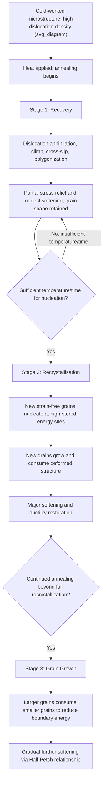

## Recovery and Annealing After Cold Work

### Definition and Physical Basis

Recovery and annealing describe the sequence of thermally activated processes by which a cold-worked (strain-hardened) metal returns toward a lower-energy, less-defected microstructural state upon heating. Cold working stores substantial free energy in the microstructure primarily in the form of dislocations (elevated dislocation density and associated strain fields), along with residual stresses and, to a lesser extent, point-defect concentrations generated during deformation. This stored energy is thermodynamically metastable, and given sufficient thermal activation, the material spontaneously evolves toward lower-energy configurations through a well-established sequence of stages: **recovery**, **recrystallization**, and **grain growth**.

Each stage occurs over a characteristic temperature range (relative to the alloy's melting point) and produces distinct, sequential effects on mechanical properties and microstructure, making controlled annealing a fundamental tool for tailoring the strength-ductility balance of cold-worked products.

### Key Points

- The three-stage sequence — recovery, recrystallization, grain growth — occurs with increasing temperature and/or time, generally in that order, though the stages can overlap
- Driving force for all three stages is reduction of stored strain energy (recovery, recrystallization) or reduction of grain boundary surface energy (grain growth)
- Recovery produces partial property restoration (softening, stress relief) with minimal change in grain structure or texture
- Recrystallization produces the most dramatic property changes (large softening, ductility restoration) via nucleation and growth of new, strain-free grains
- Grain growth, occurring after recrystallization is complete, causes further gradual softening via Hall-Petch-governed grain coarsening

### Stage 1: Recovery

**Mechanisms**

Recovery encompasses a range of dislocation rearrangement and partial annihilation processes that occur without migration of high-angle grain boundaries and without changing the overall deformed grain shape:

- **Dislocation annihilation**: dislocations of opposite sign on the same or nearby slip planes glide together and annihilate, reducing overall dislocation density
- **Dislocation climb**: edge dislocations climb (via vacancy absorption/emission) out of their original slip plane, enabling rearrangement into lower-energy configurations
- **Cross-slip**: screw dislocation segments cross-slip onto intersecting planes, allowing bypass of obstacles and further rearrangement
- **Polygonization**: climb and glide processes organize dislocations into regularly spaced walls, forming low-angle sub-grain boundaries that subdivide the original deformed grains into a substructure of nearly dislocation-free sub-grains separated by these walls — a particularly important recovery phenomenon in metals with high stacking fault energy (e.g., Al) where cross-slip and climb are easy

**Property Effects**

- Recovery produces significant **stress relief** (reduction of internal/residual stresses) with comparatively modest changes to hardness/strength — typically a partial, gradual softening rather than the abrupt drop associated with recrystallization
- Electrical conductivity, which is highly sensitive to point-defect and dislocation density, often recovers substantially during this stage even before significant softening occurs, since point-defect annihilation (a fast, low-activation-energy process) precedes larger-scale dislocation rearrangement
- Because the original elongated (deformed) grain shape and crystallographic texture are largely retained, recovery-only annealing ("stress-relief annealing") is used industrially when partial softening/stress relief is desired without full loss of the cold-worked grain structure or strength level — e.g., stress-relieving cold-drawn wire or cold-rolled sheet destined to retain a "quarter-hard" or "half-hard" temper

### Stage 2: Recrystallization

**Nucleation and Growth**

Recrystallization is the nucleation and growth of new, strain-free (low dislocation density) grains within the deformed microstructure, consuming the cold-worked structure entirely and replacing the elongated, dislocation-dense grains with new, more equiaxed grains. Nucleation preferentially occurs at sites of highest local stored energy and lattice curvature — typically prior grain boundaries, deformation bands, and regions near second-phase particles (particle-stimulated nucleation, PSN) — because these locations provide both the driving force and pre-existing high-angle boundary mobility needed for rapid nucleus growth.

**Key Points**

- **Recrystallization temperature** ($T_{rx}$) is empirically defined as the temperature at which a given (heavily cold-worked, ~50%+ reduction) material fully recrystallizes within approximately one hour; commonly approximated as $T_{rx} \approx 0.3$–$0.5\, T_m$ (absolute melting temperature), though this rule of thumb varies with purity and alloy content
- $T_{rx}$ **decreases** with increasing prior cold work (more stored energy provides greater driving force and lowers the nucleation barrier) and **increases** with increasing alloy purity's opposite — i.e., alloying additions and impurities generally *raise* $T_{rx}$ by pinning dislocations/boundaries (solute drag) and reducing boundary mobility
- Recrystallization produces the most significant softening and ductility recovery of the three annealing stages, essentially restoring properties toward the original annealed (pre-cold-work) condition
- The recrystallized grain size depends on the balance between nucleation rate and growth rate: higher prior cold work and higher annealing temperature generally favor a **finer** recrystallized grain size (more nucleation sites active, less time for individual grains to grow before impinging on neighbors) — an important processing lever for final grain size control

### Mermaid Diagram: Recovery-Recrystallization-Grain Growth Sequence

### SVG Diagram: Property Evolution During Annealing (Hardness, Ductility, Grain Size vs. Temperature)

<svg xmlns="http://www.w3.org/2000/svg" viewBox="0 0 660 480" font-family="Helvetica, Arial, sans-serif">
<text x="330" y="28" text-anchor="middle" font-size="18" font-weight="bold" fill="#1a1a1a">Property Evolution During Annealing of Cold-Worked Metal (svg_diagram)</text>

<line x1="90" y1="410" x2="600" y2="410" stroke="#333" stroke-width="2" />
<line x1="90" y1="410" x2="90" y2="60" stroke="#333" stroke-width="2" />
<text x="345" y="440" text-anchor="middle" font-size="14" fill="#333">Annealing temperature (increasing right)</text>
<text x="45" y="240" text-anchor="middle" font-size="14" fill="#333" transform="rotate(-90 45 240)">Relative property value</text>

<line x1="230" y1="60" x2="230" y2="410" stroke="#bbb" stroke-width="1.5" stroke-dasharray="4,4" />
<line x1="430" y1="60" x2="430" y2="410" stroke="#bbb" stroke-width="1.5" stroke-dasharray="4,4" />
<text x="160" y="80" text-anchor="middle" font-size="13" font-weight="bold" fill="#555">Recovery</text>
<text x="330" y="80" text-anchor="middle" font-size="13" font-weight="bold" fill="#555">Recrystallization</text>
<text x="515" y="80" text-anchor="middle" font-size="13" font-weight="bold" fill="#555">Grain growth</text>

<path d="M 90 110 Q 160 118, 230 130 Q 320 260, 430 340 Q 510 355, 600 365" fill="none" stroke="`#c0392b`" stroke-width="3.5" />

<text x="120" y="100" font-size="11" fill="`#c0392b`" font-weight="bold">Hardness/Strength</text>

<path d="M 90 375 Q 160 368, 230 355 Q 320 220, 430 140 Q 510 125, 600 118" fill="none" stroke="`#2980b9`" stroke-width="3.5" />

<text x="470" y="110" font-size="11" fill="`#2980b9`" font-weight="bold">Ductility</text>

<path d="M 90 395 L 230 393 Q 320 388, 430 380 Q 510 300, 600 200" fill="none" stroke="`#27ae60`" stroke-width="3.5" stroke-dasharray="7,4" />

<text x="500" y="230" font-size="11" fill="`#27ae60`" font-weight="bold">Grain size</text>

</svg>

### Stage 3: Grain Growth

**Key Points**

- Once recrystallization is complete (the deformed structure is fully consumed by new strain-free grains), continued annealing provides no further stored-deformation-energy driving force, but grain boundaries themselves possess surface energy that the system can reduce by decreasing total grain boundary area — driving **grain growth**, in which larger grains grow at the expense of smaller ones (grains with fewer than six sides in a 2D cross-section tend to shrink and disappear, per von Neumann-Mullins-type boundary curvature arguments)
- Grain growth causes further, generally more gradual softening via the Hall-Petch relationship, since increasing average grain size raises $d^{-1/2}$-dependent yield strength downward
- **Abnormal (secondary recrystallization) grain growth** can occur when most grains are pinned (by fine precipitates, solute drag, or strong texture) while a small population of grains escape pinning and grow to very large size at the expense of the matrix — an important, sometimes deliberately engineered phenomenon (e.g., Goss-texture development in grain-oriented electrical steel relies on controlled secondary recrystallization) but is generally undesirable in structural sheet products where it degrades property uniformity and surface finish
- Grain growth kinetics are frequently described by a parabolic-type rate law, $d^2 - d_0^2 = Kt$ (or more generally $d^n - d_0^n = Kt$ with $n$ often found experimentally to exceed the ideal value of 2 due to pinning effects), where $K$ is a temperature-dependent rate constant [Inference: the specific growth exponent $n$ observed experimentally is frequently found to deviate from the ideal boundary-curvature-driven value of 2 due to solute drag, second-phase pinning, and texture effects present in real alloys]

### Recrystallization Texture

**Key Points**

- The crystallographic texture of the recrystallized grain structure is not necessarily the same as the deformation texture that preceded it; recrystallization texture can arise via **oriented nucleation** (certain orientations nucleate preferentially) and/or **oriented growth** (certain orientations grow faster than others due to higher boundary mobility relative to the deformed matrix)
- A classic example is the **Cube texture** {001}⟨100⟩ commonly observed in recrystallized high-purity FCC metals (Al, Cu) after heavy cold rolling — distinct from the deformation texture (Copper, S, Brass components) present prior to annealing
- Recrystallization texture directly affects final sheet formability, earing behavior, and magnetic properties (in electrical steels), making annealing schedule (temperature, time, prior cold-work level) a key lever for texture-property control in commercial sheet production

### Practical Processing: Recrystallization Diagrams and Annealing Schedule Selection

**Example**

Recrystallization behavior is commonly summarized using a **recrystallization diagram** — a three-dimensional plot of recrystallized grain size as a function of prior percent cold work and annealing temperature, from which several practically important features are read:

- A **critical minimum cold work** (typically only a few percent) exists below which insufficient stored energy exists to nucleate recrystallization at all within practical annealing times — material deformed below this level remains permanently in a recovered (or even unrecovered) state regardless of subsequent annealing
- Just above the critical minimum cold work, recrystallized grain size is very large (few nucleation sites, extensive individual grain growth) — a condition generally avoided in commercial practice since coarse grains reduce strength (Hall-Petch) and can produce surface defects ("orange peel") in subsequently formed sheet
- With increasing prior cold work, recrystallized grain size decreases (more nucleation sites), motivating the common industrial practice of applying sufficient cold reduction before a final anneal to guarantee a fine, uniform recrystallized grain size

[Inference: exact critical cold-work percentages and grain-size trends are alloy- and purity-specific; the recrystallization diagram itself is empirically constructed per alloy system rather than derived from a single universal equation.]

### Practical Applications: Commercial Temper Control

**Next Steps / Practical Considerations**

- **Full-anneal**: complete recrystallization (and typically some controlled grain growth) to restore maximum ductility — used when subsequent forming operations require maximum formability
- **Process (stress-relief) anneal**: recovery-stage-only annealing to relieve residual stress and partially soften an intermediate cold-worked product without fully recrystallizing it, common between cold-reduction passes in wire/sheet processing
- **Partial anneal / commercial tempers** (e.g., "quarter-hard," "half-hard," "full-hard" designations in brass, copper, and aluminum sheet products): achieved via controlled combinations of final cold reduction percentage and a calibrated annealing treatment that intentionally stops within or just past the recrystallization stage, producing an intermediate strength-ductility combination
- **Continuous annealing lines** in modern sheet steel production precisely control heating rate, soak temperature, and cooling rate to simultaneously manage recrystallization, desired final grain size, and (in some advanced high-strength steels) subsequent phase transformation behavior in a single integrated processing line [Inference: specific continuous annealing cycle parameters are proprietary/alloy-specific and optimized per product grade]

### Related Topics

- Dislocation density evolution and strain hardening during cold work
- Recrystallization nucleation mechanisms and particle-stimulated nucleation (PSN)
- Recrystallization diagrams and critical cold-work thresholds
- Recrystallization texture (Cube texture) versus deformation texture
- Hall-Petch grain boundary strengthening and grain growth kinetics
- Secondary (abnormal) recrystallization and Goss texture in electrical steel
- Continuous annealing line processing for sheet steel
- Commercial temper designations for cold-worked sheet and strip products