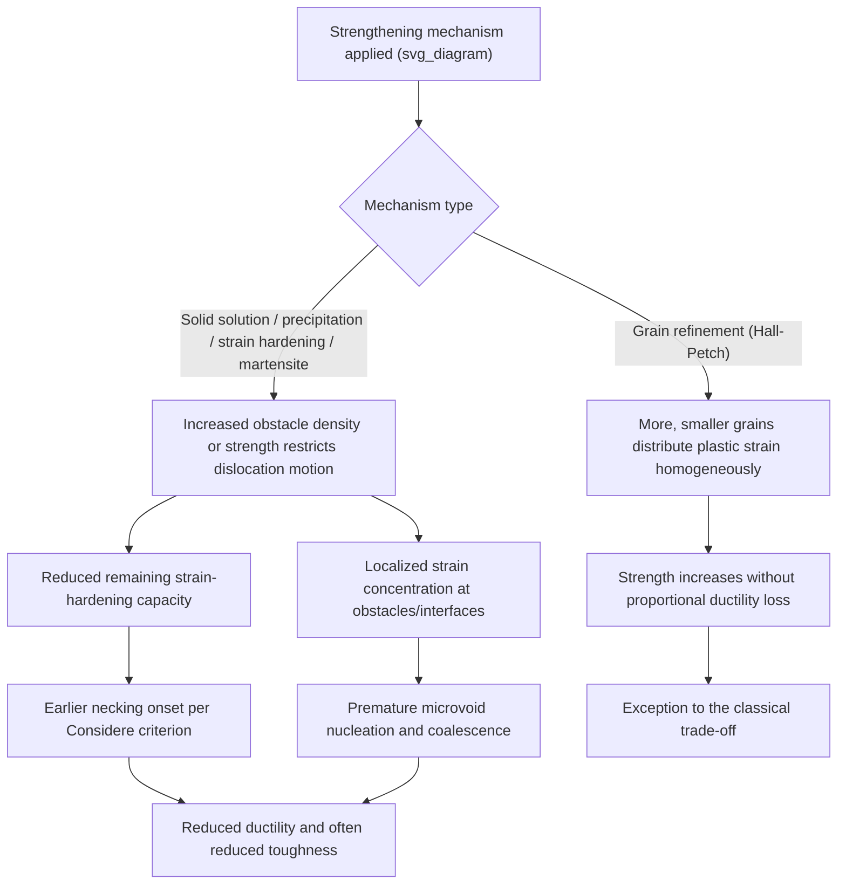

## Trade Offs Between Strength and Ductility

### Definition and Physical Basis

The strength-ductility trade-off refers to the near-universal inverse relationship observed across metallic alloys: interventions that raise yield or tensile strength typically reduce ductility (uniform and total elongation, reduction of area) and often fracture toughness as well. This trade-off is not a strict physical law but an extremely robust empirical trend rooted in the shared microstructural mechanisms that most strengthening approaches rely upon — the same obstacles that impede dislocation motion (and thus raise strength) simultaneously restrict the material's capacity to redistribute strain homogeneously and to generate/store additional dislocations before fracture-triggering strain localization or damage accumulation occurs.

Because essentially every classical strengthening mechanism (solid solution, precipitation, grain refinement, strain hardening, martensitic transformation) increases obstacle density or obstacle strength against dislocation glide, most conventional alloy design exists on or near a "strength-ductility trade-off curve" — often referred to informally as the material's position relative to the "banana curve" or trade-off envelope typically plotted for structural alloys.

### Key Points

- The trade-off is empirically visualized as strength (often ultimate tensile strength) plotted against total elongation for a given alloy class — data cluster along a downward-sloping envelope, with different processing routes/compositions occupying different points along or below that envelope
- **Grain refinement (Hall-Petch strengthening) is the notable exception** among classical mechanisms — it can increase strength while maintaining or even improving ductility and toughness, unlike solid-solution, precipitation, or strain hardening
- Modern alloy design strategies (TRIP/TWIP steels, multi-phase microstructures, gradient/heterogeneous structures, high-entropy alloys) specifically target improving the strength-ductility combination beyond the classical trade-off envelope
- The trade-off has direct engineering consequences: material selection for a given application must balance the required load-bearing capacity against necessary formability (during manufacturing) and damage tolerance (during service, particularly for impact or fatigue loading)

### Microstructural Origins of the Trade-Off

**Reduced Dislocation Mobility and Strain Hardening Capacity**

Most strengthening mechanisms operate by increasing the density or strength of obstacles to dislocation glide. A material already containing many strong obstacles (fine precipitates, high solute content, high pre-existing dislocation density from cold work) has correspondingly less additional strain-hardening capacity remaining — dislocations rapidly become immobilized, the strain-hardening exponent $n$ decreases, and per the Considère criterion ($d\sigma/d\varepsilon = \sigma$), necking initiates at correspondingly lower strain, directly reducing uniform elongation.

**Reduced Ability to Accommodate Local Strain Concentrations**

Strengthening mechanisms that rely on fine, hard second-phase particles (precipitation/dispersion strengthening) or that produce localized stress concentrations (dislocation pile-ups) inherently create potential sites for microvoid nucleation. At sufficiently high strength levels, these particles or interfaces can nucleate voids that grow and coalesce prematurely, reducing ductility through a **ductile fracture** mechanism governed by particle-matrix decohesion or particle cracking rather than by intrinsic loss of dislocation mobility alone.

**Reduced Fracture Toughness via Constrained Plastic Zone**

At a fracture mechanics level, higher yield strength reduces the size of the crack-tip plastic zone for a given applied stress intensity, generally reducing the energy dissipated in the process zone ahead of an advancing crack, and often correlating with reduced fracture toughness $K_{IC}$ — though the precise strength-toughness relationship is alloy-system- and microstructure-specific rather than universally quantifiable by a single formula [Inference: the strength-toughness trade-off, while broadly correlated with the strength-ductility trade-off, is governed by additional factors such as inclusion content, grain size, and crack-tip constraint that are not captured by tensile ductility alone].

### Mechanism-by-Mechanism Trade-Off Comparison

**Example**

| Strengthening Mechanism | Typical Ductility Effect | Underlying Reason |
| --- | --- | --- |
| Solid solution strengthening | Mild reduction | Solute atoms impede dislocation glide but generally preserve relatively homogeneous slip distribution |
| Precipitation/dispersion strengthening | Moderate to significant reduction, especially near/past peak aging | Fine hard particles promote localized strain concentration, void nucleation at particle-matrix interfaces |
| Strain hardening (cold work) | Significant reduction, worsening with %CW | Reduced remaining strain-hardening capacity; earlier necking onset per Considère criterion |
| Martensitic transformation | Severe reduction (as-quenched) | Extreme interstitial supersaturation and internal substructure produce very high strength but very low as-quenched toughness; requires tempering to recover usable ductility |
| **Grain boundary (Hall-Petch) strengthening** | **Minimal reduction, often improved ductility/toughness** | More boundary area distributes plastic strain more homogeneously across more, smaller grains; delays localized damage/fracture initiation |

### Mermaid Diagram: Strength-Ductility Trade-Off Origins

### SVG Diagram: Strength-Ductility Trade-Off Envelope for Steel Grades

<svg xmlns="http://www.w3.org/2000/svg" viewBox="0 0 640 460" font-family="Helvetica, Arial, sans-serif">
<text x="320" y="28" text-anchor="middle" font-size="18" font-weight="bold" fill="#1a1a1a">Strength-Ductility Trade-Off Envelope (svg_diagram)</text>

<line x1="90" y1="400" x2="580" y2="400" stroke="#333" stroke-width="2" />
<line x1="90" y1="400" x2="90" y2="60" stroke="#333" stroke-width="2" />
<text x="330" y="430" text-anchor="middle" font-size="14" fill="#333">Tensile strength (increasing right)</text>
<text x="45" y="230" text-anchor="middle" font-size="14" fill="#333" transform="rotate(-90 45 230)">Total elongation (increasing up)</text>

<path d="M 130 100 Q 300 180, 450 300 Q 500 335, 550 365" fill="none" stroke="`#c0392b`" stroke-width="3.5" />

<text x="180" y="120" font-size="12" fill="`#c0392b`" font-weight="bold">Classical trade-off envelope</text>

<circle cx="150" cy="110" r="7" fill="#2980b9" />
<text x="160" y="105" font-size="11" fill="#333">Mild steel</text>
<circle cx="280" cy="175" r="7" fill="#2980b9" />
<text x="230" y="160" font-size="11" fill="#333">HSLA steel</text>
<circle cx="420" cy="280" r="7" fill="#2980b9" />
<text x="390" y="265" font-size="11" fill="#333">Dual-phase steel</text>
<circle cx="530" cy="355" r="7" fill="#2980b9" />
<text x="470" y="380" font-size="11" fill="#333">Martensitic steel</text>

<circle cx="440" cy="180" r="8" fill="#27ae60" stroke="#1a1a1a" stroke-width="1.5" />
<text x="450" y="175" font-size="11" fill="#1a1a1a" font-weight="bold">TRIP/TWIP steel</text>
<text x="450" y="192" font-size="10" fill="#555">(breaks above classical envelope)</text>

<path d="M 420 280 Q 430 220, 440 185" fill="none" stroke="#27ae60" stroke-width="2" stroke-dasharray="4,3" marker-end="url(#arrow)" />
</svg>

### Advanced Strategies to Overcome the Trade-Off

**Key Points**

**TRIP (Transformation-Induced Plasticity) Steels**

TRIP steels contain a controlled fraction of metastable retained austenite within a ferrite/bainite matrix. During subsequent plastic deformation, this retained austenite progressively transforms to martensite (strain-induced transformation), continuously generating fresh strain-hardening capacity exactly when and where local strain concentration would otherwise trigger necking — effectively delaying instability and substantially extending uniform elongation at a given strength level compared to conventional steels of similar strength.

**TWIP (Twinning-Induced Plasticity) Steels**

High-Mn austenitic TWIP steels deform extensively via mechanical twinning in addition to dislocation slip. The continuously refining twin substructure acts as an evolving, dynamic Hall-Petch-type barrier (the "dynamic Hall-Petch effect"), providing sustained high strain-hardening rates to very large strains and enabling simultaneously very high strength and exceptional total elongation (in some compositions, elongations exceeding 50–60% combined with tensile strengths approaching 1000 MPa) [Inference: exact strength-elongation combinations achieved are composition- and processing-route-specific across the range of TWIP steel grades reported in the literature].

**Multi-Phase and Gradient Microstructures**

Dual-phase (ferrite-martensite), complex-phase, and quenching-and-partitioning (Q&P) steels combine soft, ductile phases with hard, strong phases at a fine microstructural scale, distributing strain preferentially into the softer phase initially while the harder phase carries load, producing a favorable combined strength-ductility response relative to a single-phase alloy of equivalent average strength. **Gradient** and **heterogeneous-grain-structure** materials (e.g., surface-mechanical-attrition-treated metals with a fine-grained surface layer and coarse-grained core) exploit similar synergistic strain-partitioning principles at a different length scale, generating extra (geometrically necessary dislocation-based) hardening from strain-gradient effects at phase or grain-size interfaces.

**High-Entropy and Compositionally Complex Alloys**

Some high-entropy alloy (HEA) systems, particularly certain FCC-structured compositions, have demonstrated combinations of strength and ductility exceeding conventional alloy trade-off envelopes, attributed to mechanisms including sluggish diffusion effects on solute strengthening, deformation-induced nanotwinning, and in some systems, transformation-induced plasticity analogous to steel TRIP behavior [Speculation: the relative contribution of each proposed mechanism in HEA strength-ductility synergy remains an active area of ongoing research debate, and reported property combinations vary considerably across the wide compositional space explored].

### Practical Engineering Selection Considerations

**Next Steps / Practical Considerations**

- Component design must specify strength requirements alongside minimum ductility/formability requirements (e.g., minimum total elongation for crash-worthy automotive structural members, or minimum fracture toughness for pressure vessel steels) rather than optimizing tensile strength in isolation
- Manufacturing route selection (e.g., choice between conventional HSLA, dual-phase, or TRIP/TWIP steel grades in automotive body-in-white design) is directly driven by where on or beyond the trade-off envelope a given application's requirements fall
- Post-forming heat treatments (tempering after martensitic hardening, partial annealing after cold work) are standard practical tools for deliberately trading some peak strength for necessary ductility/toughness recovery
- When evaluating "beyond-trade-off" advanced alloys (TRIP/TWIP/HEA), engineers should verify reported property combinations against standardized test conditions (strain rate, temperature, specimen geometry), since some of the most impressive reported combinations are sensitive to these testing parameters [Inference: property comparisons across different research reports and processing routes should account for testing methodology differences]

### Related Topics

- Considère criterion and necking instability in relation to strain-hardening capacity
- Hall-Petch grain boundary strengthening as an exception to the trade-off
- TRIP and TWIP steel metallurgy and dynamic strengthening mechanisms
- Dual-phase and quenching-and-partitioning (Q&P) steel microstructure design
- Fracture toughness and its relationship to yield strength (strength-toughness trade-off)
- Gradient and heterogeneous-grain-structure materials for strength-ductility synergy
- High-entropy alloy deformation mechanisms and property combinations
- Ductile fracture mechanisms: microvoid nucleation, growth, and coalescence