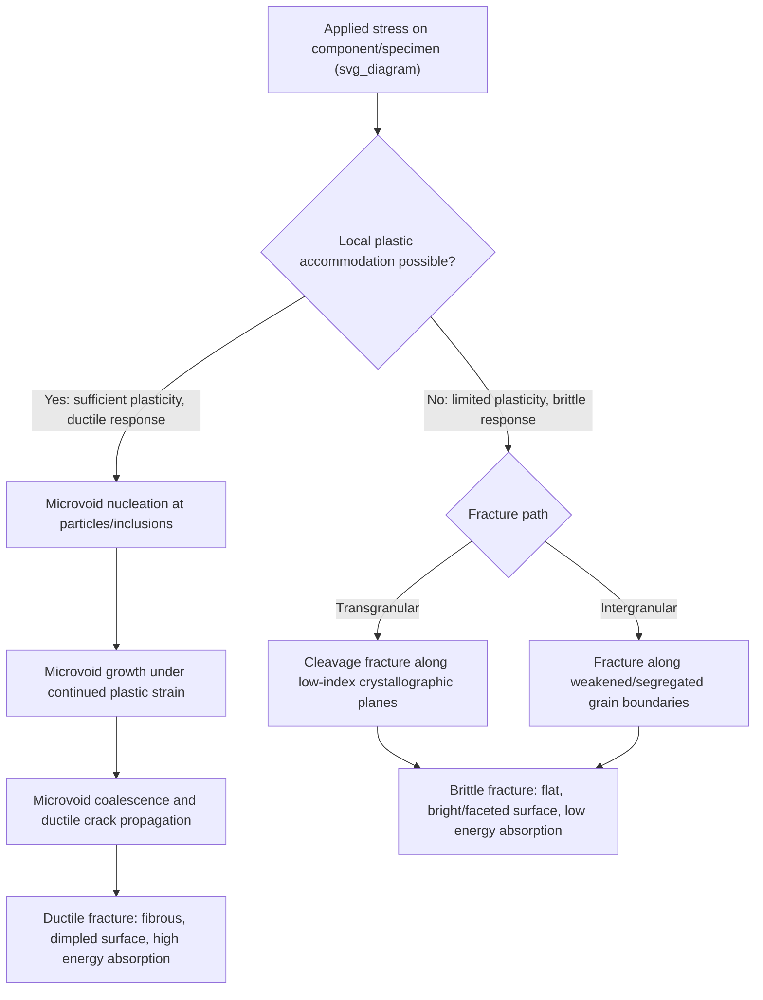

## Ductile versus Brittle Fracture

### Definition and Fundamental Distinction

Fracture is the separation of a material into two or more pieces under applied stress. Metallic fracture is broadly classified into two limiting categories — **ductile** and **brittle** — distinguished primarily by the amount of plastic deformation that accompanies crack initiation and propagation, rather than by the applied stress level or material strength alone. In practice, many fractures exhibit mixed-mode characteristics, and the same material can fail in either a ductile or brittle manner depending on temperature, strain rate, stress state, and microstructural condition.

- **Ductile fracture** involves substantial plastic deformation prior to and during crack propagation, absorbing significant energy, typically preceded by visible necking (in tension) and producing a characteristic fibrous, dull, cup-and-cone fracture surface
- **Brittle fracture** involves minimal plastic deformation, propagates rapidly (often at speeds approaching the material's elastic wave velocity), absorbs comparatively little energy, and produces a characteristically flat, bright, granular or crystalline-appearing fracture surface

### Key Points

- The distinction is primarily about **energy absorption and deformation extent**, not fracture stress magnitude — a brittle fracture can occur at a stress well below the material's nominal yield strength if a sufficiently sharp flaw is present (fracture mechanics regime), while ductile fracture generally requires stresses reaching or exceeding yield across a significant volume
- The **ductile-to-brittle transition (DBT)** — a temperature-dependent shift in fracture mode — is a critical design consideration for body-centered cubic (BCC) metals (most notably ferritic steels), while face-centered cubic (FCC) metals generally remain ductile across all practically encountered temperatures
- Fracture surface examination (fractography) is a primary forensic tool for distinguishing fracture mode and diagnosing failure root cause
- Both fracture modes are of central concern in structural integrity assessment; brittle fracture is particularly hazardous because of its sudden, low-warning nature (e.g., historical Liberty ship and T-2 tanker brittle fractures in cold seawater)

### Ductile Fracture: Micromechanism and Stages

**Microvoid Nucleation, Growth, and Coalescence**

Ductile fracture in metals typically proceeds through a well-characterized three-stage micromechanism:

1. **Microvoid nucleation**: voids nucleate at second-phase particles, inclusions, or grain boundary triple points via particle-matrix decohesion or particle cracking, driven by local stress/strain concentration around these heterogeneities
2. **Microvoid growth**: as plastic strain continues, nucleated voids grow via continued plastic deformation of the surrounding matrix, with growth rate strongly dependent on stress triaxiality (higher triaxiality, as found ahead of a crack tip or in a necked region, accelerates void growth)
3. **Microvoid coalescence**: growing voids link up, either through simple impingement or through localized shear-band linkage between neighboring voids, ultimately forming a continuous fracture surface

**Cup-and-Cone Fracture in Tensile Testing**

In a standard round tensile specimen, this micromechanism manifests macroscopically as the classic **cup-and-cone** fracture: necking concentrates stress triaxiality at the specimen center, initiating microvoid coalescence there first and producing a central fibrous (flat) zone; the fracture then propagates outward along an approximately 45° shear lip toward the specimen surface, driven by the maximum shear stress orientation, producing the characteristic conical rim.

**Fractographic Signature**

Examined via scanning electron microscopy, ductile fracture surfaces display characteristic **dimples** — the remnants of coalesced microvoids — often with an inclusion or second-phase particle visible at the dimple base. Dimple shape provides loading-mode information: equiaxed dimples indicate predominantly tensile (Mode I) loading, while elongated/parabolic dimples pointing in consistent directions on matching fracture halves indicate shear loading contribution.

### Brittle Fracture: Micromechanism and Modes

**Cleavage Fracture**

The dominant brittle fracture mechanism in metals is **cleavage** — fracture along specific low-index crystallographic planes (e.g., {100} planes in BCC iron/steel) with minimal accompanying plasticity. Cleavage propagates via a *transgranular* path (through grains rather than along boundaries), typically nucleated by a local stress concentration (often a cracked or debonded second-phase particle, such as a carbide in steel) exceeding a critical local cleavage fracture stress $\sigma_f^*$, which is essentially temperature-independent, in contrast to yield strength, which rises sharply as temperature decreases — this crossing of the yield strength and cleavage stress curves with decreasing temperature underlies the ductile-to-brittle transition phenomenon.

**Intergranular (Grain Boundary) Fracture**

Brittle fracture can alternatively propagate *along* grain boundaries rather than through grains, typically associated with:

- Grain boundary segregation of embrittling impurity elements (e.g., P, S, Sb, Sn segregation in temper-embrittled steels)
- Precipitation of brittle second-phase films along boundaries (e.g., grain-boundary carbide/cementite networks)
- Environmental factors (hydrogen embrittlement, stress-corrosion cracking, liquid-metal embrittlement) that preferentially weaken grain boundary cohesion

Intergranular fracture surfaces show a characteristic "rock-candy" or faceted appearance under SEM, reflecting the underlying grain shape and boundary geometry, and its presence is often a strong diagnostic indicator of an embrittlement mechanism rather than simple low-temperature cleavage.

### Mermaid Diagram: Fracture Mode Decision Pathway

### The Ductile-to-Brittle Transition (DBT)

**Key Points**

- BCC metals (ferritic steels, in particular) exhibit a strong temperature dependence of impact energy absorption, transitioning from high-energy ductile (shear) fracture at higher temperature to low-energy brittle (cleavage) fracture below a characteristic **ductile-to-brittle transition temperature (DBTT)**
- This behavior is standardly characterized using the **Charpy V-notch impact test**, plotting absorbed energy versus test temperature; the DBTT is defined via various conventions (e.g., temperature at 50% of the upper-shelf energy, temperature corresponding to a specified fixed absorbed-energy value such as 20 J, or the temperature at which fracture surface appearance transitions from 50% ductile/50% brittle)
- FCC metals (austenitic stainless steels, aluminum, copper, nickel) generally do **not** exhibit a pronounced DBT within practically encountered temperature ranges, remaining ductile even at cryogenic temperatures — this is a key reason austenitic stainless steels are preferred for cryogenic and Arctic/polar service applications where ferritic steels would risk brittle failure
- Factors that **raise** DBTT (shifting brittle behavior to higher, more practically relevant temperatures — undesirable) include: increasing grain size, increasing interstitial (C, N) content, increasing strain rate, presence of notches/stress concentrators, neutron irradiation embrittlement (relevant to reactor pressure vessel steels), and certain alloying/impurity segregation effects
- Factors that **lower** DBTT (desirable) include: grain refinement (Hall-Petch strengthening being the notable exception that improves both strength and low-temperature toughness simultaneously), reduction of interstitial content, and appropriate microalloying/microstructural control

### SVG Diagram: Charpy Impact Energy vs. Temperature Curve

<svg xmlns="http://www.w3.org/2000/svg" viewBox="0 0 640 460" font-family="Helvetica, Arial, sans-serif">
<text x="320" y="28" text-anchor="middle" font-size="18" font-weight="bold" fill="#1a1a1a">Charpy Impact Energy vs. Temperature (svg_diagram)</text>

<line x1="90" y1="400" x2="580" y2="400" stroke="#333" stroke-width="2" />
<line x1="90" y1="400" x2="90" y2="60" stroke="#333" stroke-width="2" />
<text x="330" y="430" text-anchor="middle" font-size="14" fill="#333">Temperature (increasing right)</text>
<text x="45" y="230" text-anchor="middle" font-size="14" fill="#333" transform="rotate(-90 45 230)">Absorbed impact energy</text>

<path d="M 100 370 Q 180 368, 230 355 Q 300 300, 350 200 Q 400 110, 470 90 Q 520 80, 560 78" fill="none" stroke="`#c0392b`" stroke-width="3.5" />

<text x="160" y="390" text-anchor="middle" font-size="12" fill="#555">Lower shelf (brittle, cleavage fracture)</text>

<text x="500" y="65" text-anchor="middle" font-size="12" fill="#555">Upper shelf (ductile, fibrous fracture)</text>

<circle cx="350" cy="200" r="7" fill="#2980b9" stroke="#1a1a1a" stroke-width="1.5" />
<line x1="350" y1="200" x2="350" y2="400" stroke="#2980b9" stroke-width="1.5" stroke-dasharray="4,3" />
<text x="360" y="195" font-size="13" font-weight="bold" fill="#1a1a1a">DBTT (transition region)</text>

<text x="350" y="420" text-anchor="middle" font-size="11" fill="#777">Mixed-mode transition zone</text>

</svg>

### Effect of Stress State: Triaxiality and Notch Effects

**Key Points**

- Stress triaxiality (the ratio of hydrostatic to von Mises equivalent stress) strongly influences fracture mode even within a nominally ductile material: high-triaxiality stress states (e.g., ahead of a sharp notch or crack tip, or in a thick section under plane-strain constraint) suppress plastic flow and promote earlier microvoid growth/coalescence or, in susceptible materials, cleavage — meaning geometry and constraint, not material identity alone, influence observed fracture mode
- **Notches** concentrate stress and constrain plastic flow triaxially, generally promoting more brittle-appearing failure at a given temperature compared to an equivalent smooth (unnotched) specimen — the physical basis for using notched (Charpy) rather than smooth specimens in transition-temperature testing, since notched geometry accentuates the transition behavior relevant to real flawed/notched structural components
- Thick sections favor **plane-strain** conditions (higher constraint, more brittle-like behavior) while thin sections favor **plane-stress** conditions (lower constraint, more ductile-like behavior) at a given nominal stress and temperature — a key reason why thickness effects must be considered in fracture-critical structural design (captured formally in fracture mechanics via plane-strain fracture toughness $K_{IC}$ versus the generally higher, thickness-dependent plane-stress values)

### Practical Fractographic Diagnosis

**Example**

| Fracture Feature (SEM) | Indicates | Common Associated Cause |
| --- | --- | --- |
| Equiaxed dimples | Ductile, tensile (Mode I) dominant | Normal ductile overload failure |
| Elongated/parabolic dimples | Ductile, shear-dominant | Shear overload, off-axis loading |
| Cleavage facets, river patterns | Brittle, transgranular | Low temperature, high strain rate, notch/constraint |
| Faceted "rock-candy" surface | Brittle, intergranular | Temper embrittlement, hydrogen embrittlement, grain boundary segregation |
| Beach marks / striations | Fatigue crack growth | Cyclic loading (see fatigue fracture, a related but distinct mechanism) |

### Historical Case Study Context

**Example**

The World War II-era **Liberty ship** and subsequent **T-2 tanker** brittle fracture failures are among the most cited historical illustrations of the ductile-to-brittle transition in engineering practice: these all-welded (rather than riveted) steel hull structures experienced catastrophic, sudden brittle fractures — in some cases splitting the ship in two — during cold-water service. Post-failure investigation identified contributing factors including the steel's relatively high DBTT (by modern standards), stress concentrations at welded structural details (hatch corners, weld defects), and the continuous, defect-transmitting nature of welded (versus riveted, crack-arresting) construction, collectively illustrating the practical consequences of designing without adequate consideration of the ductile-to-brittle transition and notch sensitivity. These failures were highly influential in the subsequent development of Charpy-based structural steel specification practices and fracture-mechanics-based structural design philosophy [Inference: while the general contributing factors are well documented historically, the precise quantitative contribution of each individual factor to any specific failure incident varied by case and is a matter of historical engineering-failure analysis].

### Related Topics

- Fracture mechanics fundamentals: stress intensity factor and fracture toughness $K_{IC}$
- Charpy V-notch impact testing and DBTT determination conventions
- Microvoid nucleation, growth, and coalescence modeling
- Temper embrittlement and grain boundary segregation mechanisms
- Hydrogen embrittlement and stress-corrosion cracking (environment-assisted brittle fracture)
- Neutron irradiation embrittlement in reactor pressure vessel steels
- Stress triaxiality and constraint effects in fracture (plane-stress vs. plane-strain)
- Historical failure case studies: Liberty ships and structural steel fracture-safe design philosophy