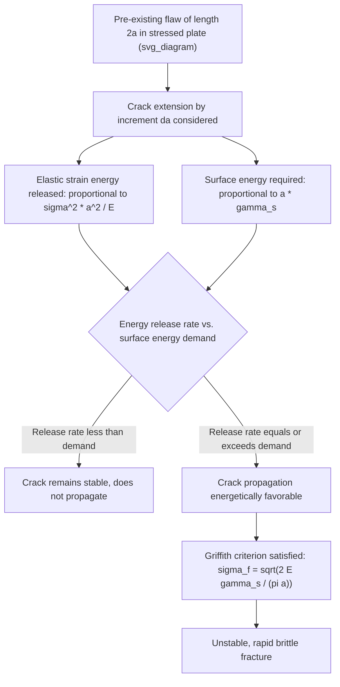

## Griffith Theory of Fracture

### Historical Context and Motivation

The Griffith theory of fracture, developed by **A.A. Griffith in 1920–1921**, was formulated to resolve a fundamental discrepancy in brittle material behavior: measured fracture strengths of brittle solids (notably glass) were consistently found to be orders of magnitude lower than the theoretical cohesive strength predicted from interatomic bonding considerations. Griffith proposed that this discrepancy arises because real materials contain small, pre-existing flaws (cracks, voids, surface scratches) that act as local stress concentrators, and that fracture is fundamentally an **energy balance problem** rather than simply a matter of local stress exceeding a material constant.

Griffith's original work was conducted on glass fibers (chosen for their relative freedom from the complicating effects of plasticity present in metals), but the underlying energy-balance framework was subsequently extended and remains foundational to modern fracture mechanics, including its later adaptation to account for plastic deformation in metals (Irwin's modification, discussed below).

### Key Points

- Reframes fracture from a stress-based criterion (does local stress exceed a critical value) to an **energy-based criterion** (does crack extension release enough stored elastic energy to supply the energy required to create new fracture surface)
- Explains why measured/practical fracture strengths of brittle solids fall so far below theoretical cohesive strength — pre-existing flaws act as stress concentrators that trigger fracture at much lower nominal applied stress
- Introduces the concept of a **critical flaw size** below which a given applied stress cannot propagate a crack, and above which fracture becomes energetically favorable
- Forms the direct conceptual and mathematical foundation for **Linear Elastic Fracture Mechanics (LEFM)** and the stress intensity factor approach used throughout modern fracture-critical structural design

### Theoretical Cohesive Strength (Background)

A simplified estimate of the theoretical cohesive strength of a solid, based on the interatomic bond-breaking stress required to separate two atomic planes, gives:

$$\sigma_{th} \approx \sqrt{\frac{E\gamma_s}{a_0}}$$

where $E$ is elastic modulus, $\gamma_s$ is surface energy, and $a_0$ is the equilibrium interatomic spacing. This theoretical estimate typically predicts strengths on the order of $E/10$ — vastly higher (often by a factor of 100–1000) than experimentally measured strengths of real brittle materials, motivating Griffith's search for an explanation grounded in the presence of flaws rather than a failure of the cohesive-strength estimate itself.

### The Griffith Energy Balance Criterion

**Derivation Framework**

Griffith considered an infinite, thin, linearly elastic plate containing a central through-thickness crack of length $2a$, subjected to a remote uniform tensile stress $\sigma$ perpendicular to the crack. As the crack extends by an increment $da$, two competing energy terms change:

1. **Release of stored elastic strain energy**: crack extension relaxes the surrounding elastic stress field, releasing stored strain energy. For the idealized Griffith plate geometry (plane stress), the released elastic strain energy per unit thickness is:

$$U_{el} = -\frac{\pi \sigma^2 a^2}{E}$$

2. **Increase of surface energy**: creating new crack surface requires energy input proportional to the newly created surface area. For a crack of length $2a$ (two surfaces), the surface energy term is:

$$U_s = 4a\gamma_s$$

**Critical Condition for Crack Propagation**

The total energy of the cracked system is minimized (crack propagation becomes energetically favorable) when the rate of elastic energy release with crack extension equals or exceeds the rate of surface energy increase:

$$\frac{d}{da}(U_{el} + U_s) = 0$$

Differentiating and solving yields the **Griffith criterion** for the critical stress at which an existing crack of half-length $a$ will propagate (plane stress condition):

$$\sigma_f = \sqrt{\frac{2E\gamma_s}{\pi a}}$$

For plane strain conditions (more representative of thick sections where through-thickness contraction is constrained), the equivalent expression incorporates Poisson's ratio $\nu$:

$$\sigma_f = \sqrt{\frac{2E\gamma_s}{\pi a (1-\nu^2)}}$$

### Physical Interpretation

**Key Points**

- The Griffith relationship shows that critical fracture stress scales as $a^{-1/2}$ — **longer pre-existing cracks fracture at lower applied stress**, explaining the strong flaw-size sensitivity of brittle fracture
- Equivalently, for a given applied stress, there exists a **critical crack length** $a_c$ above which the crack is unstable and will propagate spontaneously; below $a_c$, the crack remains stable (will not grow under that applied stress, though it may under a higher stress or with further flaw growth via a separate mechanism such as fatigue or stress-corrosion cracking)
- The theory correctly predicts that measured strength of a real brittle solid depends strongly on the size of its largest pre-existing flaw, consistent with the wide experimental scatter and size/geometry-dependence observed in brittle fracture testing (e.g., glass rod diameter effects, Weibull statistical treatment of ceramic strength)
- The Griffith criterion is fundamentally an **instability** criterion, not a criterion for crack initiation from a perfectly sharp, flaw-free surface — it describes when an *existing* flaw becomes unstable, distinguishing it from strength-of-materials-based yield/fracture criteria applied to defect-free material

### Mermaid Diagram: Griffith Energy Balance Logic

### SVG Diagram: Griffith Fracture Stress vs. Crack Length

<svg xmlns="http://www.w3.org/2000/svg" viewBox="0 0 640 460" font-family="Helvetica, Arial, sans-serif">
<text x="320" y="28" text-anchor="middle" font-size="18" font-weight="bold" fill="#1a1a1a">Griffith Criterion: Fracture Stress vs. Crack Length (svg_diagram)</text>

<line x1="90" y1="400" x2="580" y2="400" stroke="#333" stroke-width="2" />
<line x1="90" y1="400" x2="90" y2="60" stroke="#333" stroke-width="2" />
<text x="330" y="430" text-anchor="middle" font-size="14" fill="#333">Crack half-length, a</text>
<text x="45" y="230" text-anchor="middle" font-size="14" fill="#333" transform="rotate(-90 45 230)">Fracture stress, σf</text>

<path d="M 110 85 Q 160 160, 220 230 Q 300 300, 400 345 Q 480 365, 570 378" fill="none" stroke="`#c0392b`" stroke-width="3.5" />

<text x="180" y="120" font-size="12" fill="#555">Unstable region (fracture occurs)</text>

<text x="420" y="390" font-size="12" fill="#555">Stable region (crack does not propagate)</text>

<circle cx="280" cy="260" r="7" fill="#2980b9" stroke="#1a1a1a" stroke-width="1.5" />
<line x1="280" y1="260" x2="280" y2="400" stroke="#2980b9" stroke-width="1.5" stroke-dasharray="4,3" />
<line x1="90" y1="260" x2="280" y2="260" stroke="#2980b9" stroke-width="1.5" stroke-dasharray="4,3" />
<text x="290" y="255" font-size="12" fill="#1a1a1a">(a_c, σf) — critical pair</text>

<text x="330" y="60" text-anchor="middle" font-size="12" fill="#777">Curve: σf ∝ 1/√a</text>

</svg>

### Irwin's Modification: Extension to Metals (Elastic-Plastic Materials)

**Key Points**

- Griffith's original theory, based purely on surface energy $\gamma_s$, dramatically **underestimates** the fracture toughness of metals, because it neglects the substantial energy dissipated via localized plastic deformation at the crack tip — even in materials considered "brittle" in an engineering sense, some plastic zone forms at the crack tip
- **G.R. Irwin (1948)**, working independently and in parallel with similar work by Orowan, modified the Griffith energy balance to include a plastic work term $\gamma_p$ (typically $\gamma_p \gg \gamma_s$ for metals — often by several orders of magnitude) alongside the true surface energy:

$$\sigma_f = \sqrt{\frac{2E(\gamma_s + \gamma_p)}{\pi a}}$$

- This modification transforms the Griffith framework from a theory strictly applicable to ideally brittle solids (glass, some ceramics) into the foundation of modern engineering fracture mechanics applicable to metals, by recognizing that the *total* work of fracture (surface energy plus plastic dissipation) — not surface energy alone — governs the critical condition
- Irwin further reformulated this energy-balance approach in terms of the **strain energy release rate** $G$ (the "crack driving force"), defining a critical value $G_c$ at fracture, and subsequently connected this energy-based description to the equivalent, and now more commonly used, **stress intensity factor** $K$ approach, related by $G = K^2/E$ (plane stress) — providing the bridge from Griffith's original energy criterion to the $K_{IC}$-based fracture toughness parameter used throughout contemporary structural fracture assessment

### Limitations of the Original Griffith Theory

**Key Points**

- Applicable in its original, strictly energy-based form primarily to **ideally brittle materials** (glass, some ceramics, and certain very high-strength/low-toughness metallic conditions) where crack-tip plasticity is negligible or highly localized
- Assumes an idealized, sharp, pre-existing elliptical/through-thickness crack in an infinite plate under simple remote uniaxial tension — real components have arbitrary flaw geometries, finite dimensions, and complex, often multiaxial stress states, requiring geometry-dependent correction factors in practical application (embedded in the modern stress-intensity-factor formulation, $K = Y\sigma\sqrt{\pi a}$, where $Y$ is a dimensionless geometry factor)
- Does not, in its original form, address subcritical crack growth phenomena (fatigue crack growth, stress-corrosion cracking, creep crack growth) that occur below the critical (catastrophic) Griffith/Irwin condition — these require separate, later-developed frameworks (e.g., Paris law for fatigue crack growth)
- Does not directly address crack initiation at a flaw-free location (nucleation of a new crack from an intrinsically sound region), since the theory presumes an already-existing flaw whose stability is being assessed [Inference: crack nucleation mechanisms, particularly in fatigue, are addressed by separate theoretical frameworks not covered by the original Griffith energy-balance criterion]

### Worked Example: Critical Crack Length Calculation

**Example**

Consider a glass plate with $E = 70$ GPa and surface energy $\gamma_s = 1$ J/m² (illustrative values typical of soda-lime glass), subjected to a remote applied stress of $\sigma = 20$ MPa. The critical crack half-length at which this stress becomes sufficient to propagate a pre-existing crack (plane stress) is found by rearranging the Griffith equation:

$$a_c = \frac{2E\gamma_s}{\pi\sigma^2} = \frac{2 \times (70\times10^9) \times 1}{\pi \times (20\times10^6)^2}$$

$$a_c = \frac{1.4\times10^{11}}{\pi \times 4\times10^{14}} \approx \frac{1.4\times10^{11}}{1.257\times10^{15}} \approx 1.11\times10^{-4}\ \text{m} \approx 0.11\ \text{mm}$$

This illustrates the practical implication of Griffith theory: a flaw only on the order of a tenth of a millimeter — far too small to detect by unaided visual inspection — is sufficient to trigger fracture in glass at a comparatively modest applied stress, consistent with the empirically observed strength scatter and flaw sensitivity of brittle ceramic/glass materials.

### Related Topics

- Linear Elastic Fracture Mechanics (LEFM) and the stress intensity factor $K$
- Irwin's strain energy release rate $G$ and its relation to $K$
- Plane-strain fracture toughness $K_{IC}$ and its experimental determination
- Crack-tip plastic zone size estimation (Irwin plastic zone correction)
- Weibull statistics and strength scatter in brittle/ceramic materials
- Paris law and fatigue crack growth (subcritical crack extension beyond Griffith's scope)
- Ductile versus brittle fracture mechanisms in metals
- J-integral and elastic-plastic fracture mechanics for large-scale yielding conditions