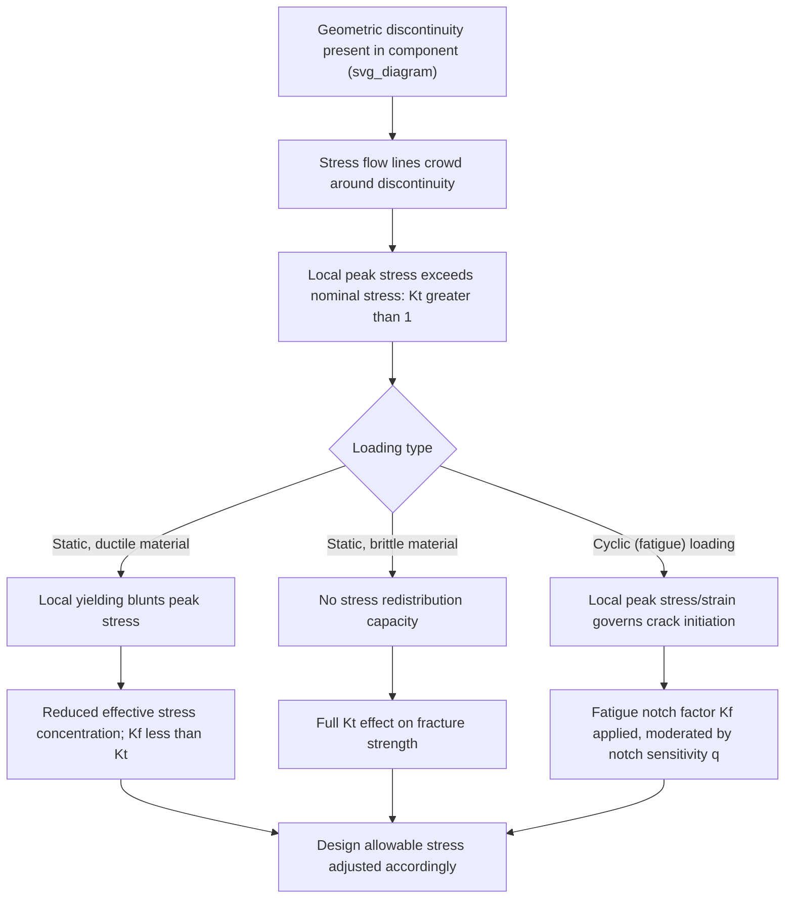

## Stress Concentration and Notch Effects

### Definition and Physical Basis

Stress concentration refers to the localized amplification of stress that occurs in the vicinity of a geometric discontinuity — a hole, notch, fillet, groove, keyway, thread root, or any other feature that interrupts the otherwise uniform flow of stress through a loaded component. Rather than distributing applied load uniformly across a cross-section, geometric discontinuities force stress lines ("force flow lines") to crowd together as they divert around the discontinuity, producing local stress values substantially higher than the nominal (average) stress calculated from simple load-divided-by-area considerations.

This phenomenon is central to both fracture mechanics (where notches and cracks represent extreme stress concentrators) and fatigue design (where even mild stress concentrations at fillets, holes, or surface features can dominate component life), making stress concentration analysis a foundational tool across structural and mechanical design.

### Key Points

- Quantified via the dimensionless **theoretical (elastic) stress concentration factor** $K_t$, defined purely from geometry and independent of material — applicable within the linear elastic regime
- The actual, observed strengthening/weakening effect on a real material's static and fatigue strength is captured separately via **notch sensitivity** and the **fatigue notch factor** $K_f$, which account for the material's ability to blunt the stress concentration through local plastic flow (static loading) or through the material-dependent phenomena discussed below (cyclic loading)
- Ductile materials under static loading are comparatively insensitive to stress concentrations because local yielding redistributes and blunts the peak stress; brittle materials remain highly sensitive because they lack this stress-redistribution capacity
- Fatigue behavior is generally far more sensitive to stress concentration than static (monotonic) strength, even in otherwise ductile materials, because fatigue crack initiation is fundamentally a local, near-surface phenomenon governed by local peak stress/strain rather than average section stress

### Theoretical Stress Concentration Factor ($K_t$)

**Definition**

For a given geometry under linear elastic conditions, the theoretical stress concentration factor is defined as:

$$K_t = \frac{\sigma_{max}}{\sigma_{nom}}$$

where $\sigma_{max}$ is the peak local stress at the discontinuity (determined analytically, via finite element analysis, or experimentally via photoelasticity/strain gauging) and $\sigma_{nom}$ is the nominal stress calculated from simple mechanics-of-materials formulas (e.g., $P/A$ for axial loading, $Mc/I$ for bending) based on the *net* (reduced) cross-section unless otherwise specified.

**Elliptical Hole Solution (Inglis)**

A foundational analytical result, derived by **Inglis (1913)** — predating and directly informing Griffith's later fracture theory — considers an elliptical hole of semi-major axis $a$ (perpendicular to load) and semi-minor axis $b$ (parallel to load) in an infinite plate under remote uniaxial tension. The stress concentration factor at the ends of the major axis is:

$$K_t = 1 + 2\frac{a}{b}$$

This can be re-expressed in terms of the radius of curvature at the ellipse tip, $\rho = b^2/a$:

$$K_t = 1 + 2\sqrt{\frac{a}{\rho}}$$

**Physical Significance**

This relationship reveals the critical governing parameters: $K_t$ increases with increasing flaw depth/length $a$ and, crucially, increases without bound as the tip radius $\rho \rightarrow 0$ (an infinitely sharp crack) — directly connecting the notch-mechanics stress-concentration framework to the crack-tip stress singularity treated by linear elastic fracture mechanics. For a circular hole (the special case $a = b$), this reduces to the well-known result $K_t = 3$ for a circular hole in an infinite plate under uniaxial tension.

### Mermaid Diagram: Stress Concentration to Fracture/Fatigue Pathway

### SVG Diagram: Stress Distribution Around a Circular Hole in a Loaded Plate

<svg xmlns="http://www.w3.org/2000/svg" viewBox="0 0 640 460" font-family="Helvetica, Arial, sans-serif">
<text x="320" y="28" text-anchor="middle" font-size="18" font-weight="bold" fill="#1a1a1a">Stress Concentration Around a Circular Hole (svg_diagram)</text>

<rect x="120" y="90" width="400" height="260" fill="none" stroke="#333" stroke-width="2" />

<circle cx="320" cy="220" r="45" fill="#f0f0f0" stroke="#1a1a1a" stroke-width="2" />

<line x1="160" y1="60" x2="160" y2="90" stroke="#c0392b" stroke-width="2.5" marker-end="url(#arrowdown)" />
<line x1="220" y1="60" x2="220" y2="90" stroke="#c0392b" stroke-width="2.5" marker-end="url(#arrowdown)" />
<line x1="280" y1="60" x2="280" y2="90" stroke="#c0392b" stroke-width="2.5" marker-end="url(#arrowdown)" />
<line x1="360" y1="60" x2="360" y2="90" stroke="#c0392b" stroke-width="2.5" marker-end="url(#arrowdown)" />
<line x1="420" y1="60" x2="420" y2="90" stroke="#c0392b" stroke-width="2.5" marker-end="url(#arrowdown)" />
<line x1="480" y1="60" x2="480" y2="90" stroke="#c0392b" stroke-width="2.5" marker-end="url(#arrowdown)" />
<path d="M 160 90 Q 200 160, 270 200 Q 300 215, 320 175 Q 340 215, 370 200 Q 440 160, 480 90" fill="none" stroke="`#2980b9`" stroke-width="1.5" stroke-dasharray="3,3" />

<path d="M 220 90 Q 240 150, 285 195 Q 300 200, 305 180 Q 335 180, 340 195 Q 380 150, 420 90" fill="none" stroke="`#2980b9`" stroke-width="1.5" stroke-dasharray="3,3" />

<circle cx="320" cy="175" r="5" fill="#c0392b" />
<circle cx="320" cy="265" r="5" fill="#c0392b" />
<text x="340" y="170" font-size="12" font-weight="bold" fill="#1a1a1a">σmax (Kt = 3 for circular hole)</text>

<text x="320" y="400" text-anchor="middle" font-size="12" fill="#555">Stress crowds at hole edges perpendicular to loading direction</text>

</svg>

### Static Loading: Notch Sensitivity in Ductile vs. Brittle Materials

**Key Points**

- In **ductile materials** under static (monotonic) loading, once the peak local stress at a notch reaches the material's yield strength, further load increase causes localized plastic flow that redistributes stress to adjacent, still-elastic material — this progressive redistribution means the notch has comparatively little effect on the *overall* static strength of a ductile component, though it still concentrates strain and can affect ductility/necking behavior locally
- In **brittle materials**, no significant plastic redistribution capacity exists, so the material fractures essentially as soon as the local peak stress reaches the material's fracture strength — the full theoretical $K_t$ effect is realized, making notches (and their associated $K_t$ values) directly and severely detrimental to brittle material strength
- This static-loading ductile/brittle distinction is a key reason stress concentration is often treated as a secondary concern for static strength in ductile structural steel design but as a first-order concern in ceramic, glass, cast iron, and high-strength/low-ductility metal component design

### Fatigue Notch Factor and Notch Sensitivity

**Key Points**

- Under cyclic loading, even ductile materials exhibit substantial sensitivity to stress concentration, because fatigue crack initiation is a localized, near-surface, microstructurally governed process driven by local cyclic stress/strain amplitude rather than average section stress — the local plastic redistribution beneficial under monotonic static loading does not equivalently protect against fatigue damage accumulation
- The effective, material-dependent stress concentration factor for fatigue is the **fatigue notch factor** $K_f$, defined as the ratio of the smooth-specimen fatigue strength to the notched-specimen fatigue strength at a given fatigue life, and is generally **less than** the theoretical $K_t$ (i.e., materials are not fully notch-sensitive in fatigue)
- The relationship between $K_t$ and $K_f$ is captured by the **notch sensitivity factor** $q$:

$$q = \frac{K_f - 1}{K_t - 1}$$

where $q$ ranges from $0$ (material completely insensitive to the notch in fatigue, $K_f = 1$) to $1$ (material fully notch-sensitive, $K_f = K_t$)

- Notch sensitivity $q$ generally **increases** with increasing material strength/hardness (higher-strength steels tend toward $q \rightarrow 1$) and **decreases** with increasing notch root radius (sharper notches are associated with lower measured $q$ in some empirical correlations, e.g., Peterson's and Neuber's notch-sensitivity charts, reflecting the complex interplay between notch geometry, material microstructure, and the characteristic material length scale over which fatigue-relevant stress/strain averaging effectively occurs) [Inference: the specific empirical trends and underlying microstructural length-scale interpretation vary between the classical Peterson and Neuber formulations, and selection between them is typically guided by the specific material class and notch geometry being analyzed in engineering practice]

### Worked Example: Notched Shaft in Fatigue

**Example**

Consider a stepped steel shaft with a fillet radius producing a theoretical stress concentration factor $K_t = 2.2$ under bending. If experimental testing establishes a notch sensitivity $q = 0.8$ for this steel at the relevant hardness/strength level, the fatigue notch factor is:

$$K_f = 1 + q(K_t - 1) = 1 + 0.8(2.2 - 1) = 1 + 0.8(1.2) = 1.96$$

This means the effective stress concentration governing fatigue design is $K_f \approx 1.96$ — meaningfully less severe than the full theoretical $K_t = 2.2$, but still requiring the design (fatigue) allowable stress to be reduced by nearly a factor of 2 relative to a smooth, notch-free specimen at the same target fatigue life — illustrating why fillet radius, surface finish, and local geometry are first-order fatigue design variables even when static strength margins appear generous.

### Notch Effects in Fracture Mechanics: The Bridge to Sharp Cracks

**Key Points**

- As notch root radius $\rho \rightarrow 0$, the Inglis-type $K_t$ formulation predicts an unbounded stress concentration — physically corresponding to the transition from a blunt, finite-radius notch (elastic stress-concentration regime, governed by $K_t$) to a mathematically sharp crack (fracture mechanics regime, governed by the stress intensity factor $K$ and its associated crack-tip stress singularity)
- This is the conceptual bridge connecting classical stress-concentration analysis (Inglis) to Griffith's energy-based fracture criterion and the subsequent stress-intensity-factor-based Linear Elastic Fracture Mechanics (LEFM) framework — a sharp crack can be viewed as the limiting case of an infinitely sharp notch
- Practically, this means that for design purposes, features with a well-defined, non-zero radius (holes, fillets, grooves) are properly analyzed using $K_t$/$K_f$ notch methods, while genuinely crack-like flaws (fatigue cracks, weld defects, inclusions treated as sharp) require the separate stress-intensity-factor/fracture-toughness framework rather than a notch-factor approach

### Design Mitigation Strategies

**Next Steps / Practical Considerations**

- **Increase fillet/transition radii** wherever geometrically permissible at cross-section changes (shoulders, keyways, holes) — the single most effective and commonly applied stress-concentration mitigation strategy, since $K_t$ decreases directly with increasing radius per the Inglis-type relationships
- **Avoid sharp internal corners** in design details; where unavoidable (e.g., keyway corners), consider full-radius or specially profiled features
- **Locate holes and discontinuities away from regions of high nominal stress** where possible, since the local peak stress is the product of nominal stress and $K_t$
- **Apply surface treatments** (shot peening, cold rolling of fillets, case hardening) to introduce beneficial compressive residual stress at notch-prone locations, counteracting the tensile stress amplification and improving fatigue performance without necessarily changing the underlying geometric $K_t$
- **Use gradual, blended transitions** (elliptical fillets, multiple-radius blends) rather than single-radius fillets in critical fatigue-loaded components, following established design-chart guidance (e.g., Peterson's Stress Concentration Factors reference charts) appropriate to the specific geometry and loading mode

### Related Topics

- Griffith theory of fracture and the transition from notch to sharp-crack stress fields
- Linear Elastic Fracture Mechanics (LEFM) and the stress intensity factor $K$
- Fatigue crack initiation mechanisms and S-N curve testing
- Peterson's and Neuber's notch sensitivity charts and empirical correlations
- Residual stress engineering via shot peening and surface cold working
- Photoelastic and finite-element methods for experimental/computational stress concentration determination
- Inglis elliptical hole solution and its historical role preceding Griffith's theory
- Surface finish effects on fatigue strength (a related, non-geometric stress-concentration analog)