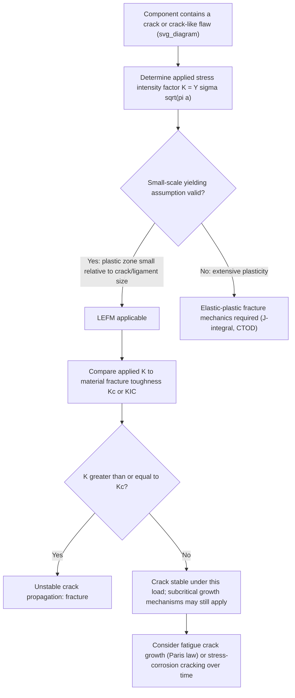

## Linear Elastic Fracture Mechanics

### Definition and Scope

Linear Elastic Fracture Mechanics (LEFM) is the branch of fracture mechanics that quantitatively characterizes the stress and displacement fields surrounding a crack tip using the assumptions of linear elasticity, and provides a rigorous engineering framework for predicting fracture based on a single governing parameter — the **stress intensity factor** $K$ — rather than nominal stress alone. LEFM extends and formalizes the energy-based Griffith fracture criterion into a stress-field-based approach directly applicable to engineering design, and remains the dominant analytical framework for fracture-critical structural design wherever the assumption of small-scale yielding (a plastic zone small relative to crack length and remaining ligament) is valid.

LEFM applies most rigorously to high-strength, relatively low-toughness metals, ceramics, and glasses where crack-tip plasticity is confined to a small region; more ductile materials exhibiting extensive crack-tip plasticity require the elastic-plastic fracture mechanics extensions (J-integral, CTOD) discussed briefly at the end of this material.

### Key Points

- LEFM's central result is that the stress field near any sharp crack tip has the **same mathematical form** (an inverse-square-root singularity) regardless of the overall component geometry or loading configuration — only the magnitude of this field, captured by $K$, differs between cases
- Fracture is predicted to occur when the applied $K$ reaches a material-specific critical value, the **fracture toughness** $K_{IC}$ (for the most conservative, plane-strain condition)
- The three fundamental **loading modes** — Mode I (opening), Mode II (in-plane shear), Mode III (out-of-plane/tearing shear) — describe the basic ways a crack surface can be displaced relative to its opposing face, with Mode I being by far the most commonly analyzed and most critical for typical structural fracture
- LEFM directly connects to Griffith's energy-balance theory through the relationship $G = K^2/E'$ (with $E' = E$ for plane stress, $E' = E/(1-\nu^2)$ for plane strain), unifying the energy-based and stress-based fracture criteria into a single consistent framework

### Crack-Tip Stress Field and the Stress Intensity Factor

**Near-Tip Stress Field (Mode I)**

For a sharp crack under Mode I (opening mode) loading, the stress field in the vicinity of the crack tip, expressed in polar coordinates $(r, \theta)$ centered at the crack tip, takes the universal form:

$$\sigma_{ij} = \frac{K_I}{\sqrt{2\pi r}} f_{ij}(\theta)$$

where $f_{ij}(\theta)$ are known angular functions specific to each stress component, and $r$ is the radial distance from the crack tip. Crucially, this $1/\sqrt{r}$ singularity and the angular distribution $f_{ij}(\theta)$ are **universal** — identical in mathematical form for any cracked geometry — while $K_I$ alone carries all the information about applied load magnitude and specific component/crack geometry.

**General Stress Intensity Factor Expression**

For a wide range of practical crack geometries, the stress intensity factor takes the general form:

$$K_I = Y\sigma\sqrt{\pi a}$$

where $\sigma$ is the remotely applied (nominal) stress, $a$ is the characteristic crack length (half-length for a central crack, full length for an edge crack), and $Y$ is a dimensionless geometry correction factor (sometimes denoted $f(a/W)$) that depends on crack geometry, specimen/component geometry, and loading configuration relative to overall dimensions. For an idealized infinite plate with a central through-crack under remote tension, $Y = 1$; extensive handbook compilations (e.g., Tada, Paris & Irwin's "The Stress Analysis of Cracks Handbook," and standards such as ASTM E399) provide $Y$ solutions for the wide variety of practical geometries (edge cracks, surface cracks, compact tension specimens, pressurized cylinders, etc.).

### The Three Fracture Modes

**Key Points**

- **Mode I (opening mode)**: crack surfaces separate directly apart, perpendicular to the crack plane — the dominant mode in most structural fracture scenarios and the primary focus of standard fracture toughness testing ($K_{IC}$)
- **Mode II (in-plane/sliding shear mode)**: crack surfaces slide relative to each other in the crack plane, in a direction perpendicular to the crack front
- **Mode III (out-of-plane/tearing shear mode)**: crack surfaces slide relative to each other parallel to the crack front (analogous to tearing a sheet of paper)
- Real cracks frequently experience **mixed-mode loading** (combinations of Mode I, II, and III), particularly for cracks not oriented perpendicular to the principal loading direction, or under complex multiaxial loading; mixed-mode fracture criteria (e.g., maximum tangential stress criterion, strain energy density criterion) are used to predict fracture direction and onset under such conditions [Inference: the specific mixed-mode criterion selected in practice depends on the material class and loading configuration, and different criteria can give differing predictions for highly mixed-mode cases]

### Mermaid Diagram: LEFM Fracture Assessment Pathway

### SVG Diagram: Three Modes of Crack Loading

<svg xmlns="http://www.w3.org/2000/svg" viewBox="0 0 660 420" font-family="Helvetica, Arial, sans-serif">
<text x="330" y="28" text-anchor="middle" font-size="18" font-weight="bold" fill="#1a1a1a">Three Fundamental Crack Loading Modes (svg_diagram)</text>

<g>
<rect x="60" y="80" width="150" height="10" fill="#333" />
<line x1="70" y1="80" x2="70" y2="55" stroke="#c0392b" stroke-width="2.5" marker-end="url(#arrup)" />
<line x1="130" y1="80" x2="130" y2="55" stroke="#c0392b" stroke-width="2.5" marker-end="url(#arrup)" />
<line x1="190" y1="80" x2="190" y2="55" stroke="#c0392b" stroke-width="2.5" marker-end="url(#arrup)" />
<rect x="60" y="105" width="150" height="10" fill="#333" />
<line x1="70" y1="105" x2="70" y2="130" stroke="#c0392b" stroke-width="2.5" marker-end="url(#arrdown)" />
<line x1="130" y1="105" x2="130" y2="130" stroke="#c0392b" stroke-width="2.5" marker-end="url(#arrdown)" />
<line x1="190" y1="105" x2="190" y2="130" stroke="#c0392b" stroke-width="2.5" marker-end="url(#arrdown)" />
<text x="135" y="165" text-anchor="middle" font-size="14" font-weight="bold" fill="#1a1a1a">Mode I</text>
<text x="135" y="182" text-anchor="middle" font-size="11" fill="#555">Opening</text>
</g>

<g>
<rect x="270" y="90" width="150" height="10" fill="#333" />
<line x1="280" y1="95" x2="250" y2="95" stroke="#2980b9" stroke-width="2.5" marker-end="url(#arrleft)" />
<rect x="270" y="102" width="150" height="10" fill="#333" />
<line x1="410" y1="107" x2="440" y2="107" stroke="#2980b9" stroke-width="2.5" marker-end="url(#arrright)" />
<text x="345" y="165" text-anchor="middle" font-size="14" font-weight="bold" fill="#1a1a1a">Mode II</text>
<text x="345" y="182" text-anchor="middle" font-size="11" fill="#555">In-plane shear</text>
</g>

<g>
<rect x="480" y="90" width="150" height="10" fill="#333" />
<rect x="480" y="102" width="150" height="10" fill="#333" />
<circle cx="490" cy="95" r="3" fill="#27ae60" />
<circle cx="530" cy="95" r="3" fill="#27ae60" />
<circle cx="570" cy="95" r="3" fill="#27ae60" />
<text x="500" y="80" font-size="10" fill="#27ae60">(out of page)</text>
<text x="490" y="120" font-size="10" fill="#27ae60">×</text>
<text x="530" y="120" font-size="10" fill="#27ae60">×</text>
<text x="570" y="120" font-size="10" fill="#27ae60">×</text>
<text x="500" y="135" font-size="10" fill="#27ae60">(into page)</text>
<text x="555" y="165" text-anchor="middle" font-size="14" font-weight="bold" fill="#1a1a1a">Mode III</text>
<text x="555" y="182" text-anchor="middle" font-size="11" fill="#555">Tearing shear</text>
</g>
<text x="330" y="220" text-anchor="middle" font-size="12" fill="#777">Crack shown as gap between the two rectangular plate segments in each mode</text>

</svg>

### Fracture Toughness ($K_{IC}$): Definition and Constraint Dependence

**Key Points**

- **Fracture toughness** $K_{IC}$ (plane-strain fracture toughness) is the critical stress intensity factor at which unstable, rapid crack propagation occurs under Mode I loading, under conditions of maximum through-thickness constraint (plane strain)
- $K_{IC}$ is a genuine **material property** (for a given microstructure, temperature, and strain rate) only under plane-strain conditions, generally achieved in sufficiently thick sections; thinner sections exhibit a lower degree of constraint (moving toward plane stress) and correspondingly exhibit a **higher, thickness-dependent apparent toughness** $K_c$, meaning $K_c$ is not a fixed material property but varies with specimen/component thickness
- Standard test methods (e.g., **ASTM E399**) specify minimum specimen thickness and other size requirements to ensure a valid, thickness-independent $K_{IC}$ measurement is obtained (based on ensuring the plastic zone size is small relative to specimen dimensions, per the small-scale-yielding validity criterion)
- $K_{IC}$ is temperature- and, for many BCC metals, strongly temperature-dependent (paralleling the Charpy-based ductile-to-brittle transition, since fracture toughness testing probes the same underlying cleavage-versus-plastic-flow competition, but with quantitative rather than purely qualitative/comparative output)

### Crack-Tip Plastic Zone and the Small-Scale Yielding Requirement

**Key Points**

- Real materials cannot sustain the infinite stress predicted by the elastic $1/\sqrt{r}$ singularity at $r = 0$; local yielding truncates and modifies the stress field within a finite **plastic zone** surrounding the crack tip
- Irwin's first-order estimate of plane-stress plastic zone size:

$$r_p = \frac{1}{2\pi}\left(\frac{K_I}{\sigma_y}\right)^2$$

with the plane-strain plastic zone size typically estimated as approximately one-third of this value (reflecting the greater constraint suppressing plastic flow), owing to the higher effective yield criterion under plane-strain triaxial stress states

- **LEFM validity (small-scale yielding) requires** the plastic zone size to be small relative to both the crack length and the remaining uncracked ligament — commonly expressed via the ASTM E399 size requirement:

$$a, B, (W-a) \geq 2.5\left(\frac{K_{IC}}{\sigma_y}\right)^2$$

where $B$ is specimen thickness and $W$ is specimen width — when this condition is violated (relatively tough, low-yield-strength material, or a small/thin specimen), LEFM becomes invalid and elastic-plastic fracture mechanics (EPFM) methods are required instead

### Worked Example: Applying LEFM to a Component Design Check

**Example**

Consider a pressure vessel steel plate with $K_{IC} = 100\ \text{MPa}\sqrt{\text{m}}$ and yield strength $\sigma_y = 700$ MPa, containing a detected surface flaw modeled as an edge crack of depth $a = 5$ mm, subjected to a design stress of $\sigma = 300$ MPa. Using a geometry factor $Y \approx 1.12$ (standard edge-crack correction factor):

$$K_I = Y\sigma\sqrt{\pi a} = 1.12 \times 300\times10^6 \times \sqrt{\pi \times 0.005}$$

$$K_I = 1.12 \times 300\times10^6 \times 0.1253 = 4.21\times10^7\ \text{Pa}\sqrt{\text{m}} = 42.1\ \text{MPa}\sqrt{\text{m}}$$

Since the applied $K_I \approx 42.1\ \text{MPa}\sqrt{\text{m}}$ is well below $K_{IC} = 100\ \text{MPa}\sqrt{\text{m}}$, the component has a substantial margin against fracture from this flaw under the stated design stress — providing a quantitative basis for either accepting the detected flaw ("fitness-for-service" assessment) or establishing an inspection interval based on subsequent subcritical (fatigue) crack growth analysis before $K_I$ could approach $K_{IC}$.

### Practical Applications of LEFM in Engineering Practice

**Next Steps / Practical Applications**

- **Damage-tolerant design and fitness-for-service assessment**: using LEFM to justify continued safe operation of a component containing a known, sub-critical flaw rather than mandatory immediate replacement, common in aerospace, pressure vessel, and pipeline engineering
- **Fracture-critical material selection and qualification testing**: specifying minimum $K_{IC}$ requirements for structural steels, pressure vessel materials, and aerospace alloys, verified via standardized ASTM E399 (or related) testing
- **Non-destructive inspection (NDI) interval planning**: combining LEFM (critical crack size determination) with fatigue crack growth analysis (Paris law) to establish safe inspection intervals ensuring a growing crack cannot reach critical size between inspections
- **Residual strength assessment following in-service damage discovery** (e.g., a detected crack in an aircraft structure or pipeline), using LEFM to calculate the remaining safe operating stress or remaining life before repair/replacement is mandatory

### Brief Note on Elastic-Plastic Fracture Mechanics (EPFM)

**Key Points**

- When small-scale yielding assumptions are violated — common in lower-strength, higher-toughness structural steels and many structural applications generally — LEFM's single-parameter $K$ characterization becomes invalid, and **elastic-plastic fracture mechanics (EPFM)** parameters are required instead
- The **J-integral** (Rice, 1968) generalizes the energy-release-rate concept to nonlinear (elastic-plastic) material behavior and remains path-independent under appropriate conditions, providing a robust single parameter characterizing crack-tip conditions even with significant plasticity
- **Crack Tip Opening Displacement (CTOD)**, denoted $\delta$, offers an alternative, more physically direct measure of crack-tip deformation, particularly favored in some structural steel and welding-related fracture assessment codes
- These EPFM parameters connect back to LEFM in the small-scale-yielding limit (e.g., $J \rightarrow G = K^2/E'$ as plasticity becomes negligible), providing a unified, continuous fracture-mechanics framework spanning from brittle to fully ductile material behavior [Inference: the specific EPFM parameter favored in practice — J-integral versus CTOD — varies by industry sector and applicable design code/standard]

### Related Topics

- Griffith theory of fracture and its energy-based foundation for LEFM
- Fracture toughness testing standards (ASTM E399) and specimen size requirements
- Crack-tip plastic zone estimation (Irwin correction) and constraint effects
- Fatigue crack growth and the Paris law (subcritical crack growth under LEFM framework)
- J-integral and Crack Tip Opening Displacement (CTOD) in elastic-plastic fracture mechanics
- Mixed-mode fracture criteria and crack path prediction
- Stress intensity factor handbook solutions for practical crack geometries
- Ductile-to-brittle transition and its relation to temperature-dependent $K_{IC}$