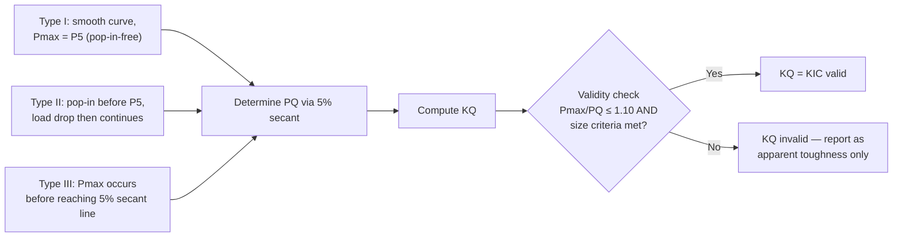
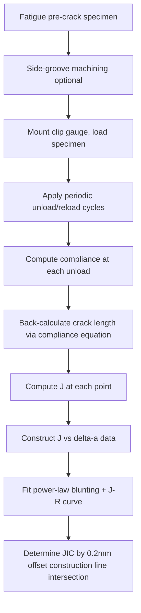
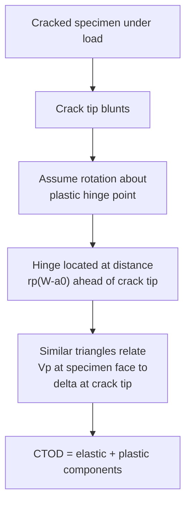

## Fracture Toughness Testing

### Overview

Fracture toughness testing quantifies a material's resistance to crack propagation, producing material property values ($K_{IC}$, $J_{IC}$, $\delta_c$, or the $J$-$R$ curve) that are used in damage-tolerant design, structural integrity assessment, and material selection/qualification. These tests deliberately introduce a sharp, natural crack (via fatigue pre-cracking) into a specimen and load it to determine the critical driving force at which unstable or ductile crack growth initiates.

Unlike Charpy impact testing, which produces a qualitative energy absorption value, fracture toughness tests produce quantitative, geometry-independent material properties (under proper size/validity constraints) that can be transferred to real structural geometries via fracture mechanics analysis.

**Key Points**

- Fracture toughness testing bridges the linear elastic fracture mechanics (LEFM) and elastic-plastic fracture mechanics (EPFM) regimes.
- Governing standards: ASTM E399 ($K_{IC}$, plane-strain), ASTM E1820 ($J$-integral and CTOD, unified standard), ASTM E1921 (Master Curve, $K_{Jc}$ in the ductile-to-brittle transition), ISO 12135 and ISO 12737 (international equivalents).
- The choice of test method depends on the material's expected fracture behavior: brittle/high-strength materials favor $K_{IC}$; ductile materials require $J_{IC}$ or CTOD.

---

### Fundamental Concepts

#### The Need for Fracture Toughness

Traditional strength-based design (using yield or ultimate strength) assumes flaw-free materials. Real components contain defects — inclusions, welding discontinuities, machining marks, fatigue cracks — that act as stress concentrators. Fracture mechanics provides the framework:

$$K_I = Y\sigma\sqrt{\pi a}$$

where $K_I$ is the mode I stress intensity factor, $\sigma$ is the remote applied stress, $a$ is the crack length, and $Y$ is a dimensionless geometry factor. Fracture occurs when $K_I$ reaches the material's critical value, $K_{IC}$.

Fracture toughness testing exists to measure that critical value experimentally, under standardized and reproducible conditions.

#### Three Toughness Parameters

| Parameter | Regime | Physical Meaning | Governing Standard |
| --- | --- | --- | --- |
| $K_{IC}$ | Linear elastic (brittle) | Critical stress intensity factor at unstable fracture under plane-strain | ASTM E399 |
| $J_{IC}$ | Elastic-plastic (ductile) | Critical value of the $J$-integral at onset of stable crack growth | ASTM E1820 |
| CTOD ($\delta_c$) | Elastic-plastic | Critical crack-tip opening displacement | ASTM E1820, BS 7448 |

These parameters are related through the relationship (under small-scale yielding):

$$J = \frac{K^2}{E'}$$

where $E' = E$ for plane stress and $E' = E/(1-\nu^2)$ for plane strain.

---

### Specimen Types and Preparation

#### Common Specimen Geometries

1. **Compact Tension (C(T)) specimen** — most widely used; efficient material use, requires clevis/pin loading.
2. **Single Edge Notch Bend (SE(B)) specimen** — three-point bend loading; simpler fixturing.
3. **Middle Tension (M(T)) specimen** — used for thin sheet and some aerospace applications.
4. **Disk-Shaped Compact Tension (DC(T))** — for round stock.
5. **Arc-shaped specimens** — for pipe/tube sections.

**SVG Diagram: Compact Tension (C(T)) Specimen Geometry (svg_diagram)**

<svg xmlns="http://www.w3.org/2000/svg" viewBox="0 0 640 420" font-family="Arial, sans-serif">
<text x="320" y="24" text-anchor="middle" font-size="16" font-weight="bold">Compact Tension C(T) Specimen (svg_diagram)</text>
<rect x="140" y="80" width="300" height="240" fill="none" stroke="black" stroke-width="2" />
<circle cx="200" cy="130" r="14" fill="none" stroke="black" stroke-width="2" />
<circle cx="200" cy="270" r="14" fill="none" stroke="black" stroke-width="2" />
<line x1="140" y1="200" x2="330" y2="200" stroke="black" stroke-width="2" />
<polygon points="330,192 360,200 330,208" fill="black" />
<line x1="330" y1="180" x2="330" y2="220" stroke="black" stroke-width="1.5" />
<line x1="330" y1="192" x2="345" y2="196" stroke="black" stroke-width="1" />
<text x="380" y="204" font-size="13">Fatigue precrack</text>
<line x1="200" y1="60" x2="200" y2="80" stroke="black" stroke-width="1" />
<line x1="200" y1="320" x2="200" y2="340" stroke="black" stroke-width="1" />
<text x="205" y="55" font-size="12">Load pin (top)</text>
<text x="205" y="355" font-size="12">Load pin (bottom)</text>
<line x1="140" y1="360" x2="440" y2="360" stroke="black" stroke-width="1" />
<line x1="140" y1="350" x2="140" y2="370" stroke="black" stroke-width="1" />
<line x1="440" y1="350" x2="440" y2="370" stroke="black" stroke-width="1" />
<text x="270" y="378" text-anchor="middle" font-size="12">W (width)</text>
<line x1="460" y1="80" x2="460" y2="320" stroke="black" stroke-width="1" />
<line x1="450" y1="80" x2="470" y2="80" stroke="black" stroke-width="1" />
<line x1="450" y1="320" x2="470" y2="320" stroke="black" stroke-width="1" />
<text x="500" y="204" font-size="12">B (thickness,</text>
<text x="500" y="220" font-size="12">out of plane)</text>
<line x1="140" y1="200" x2="140" y2="200" stroke="black" />
<text x="150" y="215" font-size="12">a (crack length)</text>
<line x1="140" y1="230" x2="200" y2="230" stroke="black" stroke-width="1" stroke-dasharray="3,2" />
</svg>

#### Pre-Cracking Requirements

All fracture toughness specimens require a **fatigue pre-crack** at the notch tip, introduced under carefully controlled cyclic loading:

- The starter notch is machined (EDM notch or machined V-notch with razor tip).
- Fatigue loading is applied at low $\Delta K$ (to minimize plastic zone size and residual compressive stresses affecting the subsequent toughness measurement).
- The final stress intensity factor range during the last stage of pre-cracking, $K_{max,fatigue}$, must not exceed a specified fraction of the anticipated $K_{IC}$ (typically 60-80% depending on the standard) to avoid crack-tip blunting that would artificially elevate the measured toughness.
- Crack length is measured optically at multiple points across the thickness (typically 9-point average per ASTM E399/E1820) after fracture, checking straightness criteria.

**Key Points**

- Improper pre-cracking (too high $\Delta K$, crack curvature, non-straight crack front) invalidates the test.
- Side-grooving (typically 20% total thickness reduction) is often applied in $J$/CTOD testing to promote straight crack fronts and suppress shear-lip formation at specimen edges.

---

### $K_{IC}$ Testing (ASTM E399)

#### Procedure

1. Machine and fatigue pre-crack the specimen ($a/W$ typically 0.45–0.55).
2. Load the specimen in tension (C(T)) or bending (SE(B)) while recording load ($P$) versus crack-mouth-opening displacement (CMOD) using a clip gauge.
3. Determine $P_Q$ (a candidate critical load) using the 5% secant offset method: draw a line from the origin with a slope 5% less than the initial elastic slope; $P_5$ is where this line intersects the load-CMOD curve. $P_Q$ is $P_5$ if it is the maximum load prior to $P_5$, otherwise it is the maximum load below $P_5$.
4. Compute the provisional $K_Q$ using the specimen-specific compliance function:

$$K_Q = \frac{P_Q}{B\sqrt{W}} f\left(\frac{a}{W}\right)$$

5. Validate size requirements:

$$B, a, (W-a) \geq 2.5\left(\frac{K_Q}{\sigma_{ys}}\right)^2$$

If satisfied, $K_Q = K_{IC}$ (a valid plane-strain fracture toughness). If not satisfied, the test only yields $K_Q$, an invalid/apparent toughness, indicating insufficient specimen thickness for plane-strain constraint.

**Load-CMOD Curve Types**

#### Why Plane-Strain Constraint Matters

At the crack tip, material directly ahead experiences triaxial stress. In thick sections, through-thickness contraction is constrained by surrounding material, producing plane-strain conditions with high triaxiality and low toughness (conservative, geometry-independent value). In thin sections, plane-stress conditions dominate near free surfaces, allowing more plastic deformation and apparent toughness that varies with thickness — not a true material property.

$$B \geq 2.5\left(\frac{K_{IC}}{\sigma_{ys}}\right)^2$$

This thickness requirement ensures small-scale yielding — the plastic zone at the crack tip is small relative to specimen dimensions, so the elastic $K$-field still dominates around the plastic zone (LEFM validity).

**[Inference]** For very high-toughness, low-yield-strength materials (e.g., structural steels, many aluminum alloys), the required specimen thickness to satisfy plane-strain constraints can become impractically large (tens to hundreds of millimeters), which is a primary motivation for elastic-plastic fracture mechanics testing methods.

---

### Elastic-Plastic Fracture Toughness Testing (ASTM E1820)

When materials exhibit significant plasticity before fracture (most structural steels, aluminum alloys, many polymers), $K_{IC}$ testing is impractical or physically meaningless. ASTM E1820 provides a unified method for $J$-integral and CTOD determination.

#### The J-Integral

The $J$-integral is a path-independent contour integral representing the energy release rate for a crack in a nonlinear elastic (or, by extension, elastic-plastic) material:

$$J = \int_{\Gamma} \left( W\, dy - T_i \frac{\partial u_i}{\partial x} ds \right)$$

where $W$ is the strain energy density, $T_i$ are traction vector components, $u_i$ are displacement vector components, and $\Gamma$ is a contour surrounding the crack tip.

Experimentally, $J$ is computed from the area under the load-displacement curve:

$$J = J_{el} + J_{pl}$$

$$J_{el} = \frac{K^2(1-\nu^2)}{E}$$

$$J_{pl} = \frac{\eta A_{pl}}{B_N (W-a)}$$

where $A_{pl}$ is the plastic area under the load-displacement curve, $\eta$ is a geometry-dependent factor (≈2 for SE(B), ≈2.0-2.2 for C(T) depending on $a/W$), and $B_N$ is the net thickness (accounting for side grooves).

#### Test Methods: Single-Specimen vs. Multiple-Specimen

**Multiple-specimen method**: Several identical specimens are loaded to different displacement levels, unloaded, heat-tinted or fatigue-marked to identify the stable crack growth region, then broken open (often after cooling in liquid nitrogen for brittle final fracture) to measure crack extension optically. Each specimen gives one ($J$, $\Delta a$) data point; multiple points construct the $J$-$R$ curve.

**Single-specimen (unloading compliance) method**: A single specimen is loaded with periodic small unloading/reloading cycles. Each unloading slope gives the instantaneous elastic compliance, from which crack length is inferred (compliance increases as the crack grows). This produces a full $J$-$R$ curve from one test — now the industry-preferred approach due to efficiency.

#### Determining $J_{IC}$

1. Plot $J$ versus crack extension $\Delta a$.
2. Construct the **blunting line**: $J = 2\sigma_Y \Delta a$ (where $\sigma_Y$ is the average of yield and ultimate strength), representing apparent crack extension due to crack-tip blunting before real growth.
3. Construct an **offset line** parallel to the blunting line, offset by 0.2 mm.
4. Fit a power-law regression line through valid $J$-$\Delta a$ data within a qualified window (between 0.15 mm and 1.5 mm offset lines, or per exclusion lines defined in E1820).
5. $J_{IC}$ (technically $J_Q$ until validated) is the intersection of the regression line with the 0.2 mm offset line.
6. Validate size requirements:

$$B, (W - a) \geq \frac{25 J_Q}{\sigma_Y}$$

If satisfied, $J_Q = J_{IC}$.

**SVG Diagram: J-R Curve Construction (svg_diagram)**

<svg xmlns="http://www.w3.org/2000/svg" viewBox="0 0 640 440" font-family="Arial, sans-serif">
<text x="320" y="24" text-anchor="middle" font-size="16" font-weight="bold">J-R Curve Construction (svg_diagram)</text>
<line x1="80" y1="380" x2="580" y2="380" stroke="black" stroke-width="2" />
<line x1="80" y1="380" x2="80" y2="50" stroke="black" stroke-width="2" />
<text x="580" y="400" font-size="13">Δa (mm)</text>
<text x="40" y="60" font-size="13">J (kJ/m²)</text>
<line x1="80" y1="380" x2="280" y2="80" stroke="gray" stroke-width="1.5" stroke-dasharray="4,3" />
<text x="150" y="250" font-size="11" fill="gray">Blunting line: J = 2σY·Δa</text>
<line x1="180" y1="380" x2="380" y2="80" stroke="black" stroke-width="1.5" stroke-dasharray="4,3" />
<text x="330" y="150" font-size="11">0.2mm offset line</text>
<path d="M 200 330 Q 300 200 480 130" fill="none" stroke="blue" stroke-width="2.5" />
<text x="420" y="115" font-size="12" fill="blue">Power-law J-R fit</text>
<circle cx="240" cy="290" r="4" fill="blue" />
<circle cx="300" cy="230" r="4" fill="blue" />
<circle cx="360" cy="180" r="4" fill="blue" />
<circle cx="420" cy="150" r="4" fill="blue" />
<circle cx="305" cy="212" r="6" fill="red" stroke="black" />
<line x1="305" y1="212" x2="305" y2="380" stroke="red" stroke-width="1" stroke-dasharray="2,2" />
<line x1="305" y1="212" x2="80" y2="212" stroke="red" stroke-width="1" stroke-dasharray="2,2" />
<text x="315" y="205" font-size="12" fill="red" font-weight="bold">JIC (JQ)</text>
</svg>

---

### Crack Tip Opening Displacement (CTOD) Testing

CTOD ($\delta$) measures the displacement at the original crack tip as it blunts under load, providing an alternative elastic-plastic fracture parameter widely used in the offshore, pipeline, and pressure vessel industries (particularly in the UK/European tradition, per BS 7448 and now unified into ASTM E1820).

#### Plastic Hinge Model

CTOD is calculated from the clip-gauge displacement measured at the specimen's front face, using a plastic hinge rotation model:

$$\delta = \delta_{el} + \delta_{pl} = \frac{K^2(1-\nu^2)}{2\sigma_{ys}E} + \frac{r_p (W-a_0) V_p}{r_p(W-a_0) + a_0 + z}$$

where $r_p$ is the plastic rotation factor (typically ≈0.4-0.46), $V_p$ is the plastic component of clip-gauge displacement, and $z$ is the knife-edge thickness (if a clip gauge is mounted on knife edges rather than directly on the specimen face).

#### CTOD Critical Values

- $\delta_c$: CTOD at onset of unstable fracture or pop-in, before significant stable crack growth.
- $\delta_u$: CTOD at unstable fracture after some stable crack growth (typically for tougher, more ductile materials).
- $\delta_m$: CTOD at first attainment of a maximum force plateau with continuing displacement.

---

### Master Curve Method (ASTM E1921)

For ferritic steels in the ductile-to-brittle transition temperature (DBTT) region, fracture toughness ($K_{Jc}$) is highly scattered and temperature-dependent, following statistical (Weibull) rather than deterministic behavior. ASTM E1921 provides:

$$K_{Jc(median)} = 30 + 70\exp\left[0.019(T - T_0)\right]$$

where $T_0$ is the **reference temperature**, defined as the temperature at which the median $K_{Jc}$ for a 1T (25.4 mm thick) specimen equals 100 MPa√m. $T_0$ is determined from a set of small precracked Charpy-sized SE(B) or C(T) specimens tested at a single temperature (or multiple temperatures) using a maximum-likelihood statistical procedure.

**Key Points**

- Master Curve testing allows the use of small, broken Charpy-sized specimens (10×10×55 mm) to characterize fracture toughness in the transition region, dramatically reducing material requirements versus full-size $K_{IC}$ specimens.
- Widely used in nuclear reactor pressure vessel surveillance programs, since only small surveillance specimens can be irradiated and later tested.
- Size adjustment between specimen thicknesses uses weakest-link statistical scaling:

$$K_{Jc(x)} = 20 + [K_{Jc(1T)} - 20]\left(\frac{1T}{xT}\right)^{1/4}$$

---

### Test Equipment and Instrumentation

| Component | Function |
| --- | --- |
| Servo-hydraulic or electromechanical test frame | Applies controlled tensile or bend load |
| Clip-gauge (extensometer) | Measures CMOD/load-line displacement across the crack mouth |
| Environmental chamber | Controls test temperature (critical for transition-region and cryogenic testing) |
| Data acquisition system | Records load, displacement, and (for unloading compliance) time-synchronized unload/reload cycles |
| Optical/traveling microscope | Post-test crack length measurement on fracture surface |
| Heat-tinting furnace | Oxidizes stable crack growth surface for post-test optical distinction (multi-specimen $J$-$R$ method) |

---

### Fracture Surface Analysis

Post-test fractography confirms the validity of the test and characterizes the fracture mechanism:

- **Crack front straightness**: measured at 9 equally spaced points across the thickness; deviation limits are specified (e.g., no point should differ from the average by more than a specified percentage, and surface measurements are excluded from the average per some standards due to plane-stress effects at free surfaces).
- **Fatigue precrack region**: identifiable by striations/flat, featureless morphology.
- **Stable ductile tearing region** (for $J$/CTOD tests): identifiable by dimpled, fibrous morphology, often heat-tinted (bronze/purple oxide color) to distinguish from the final fast-fracture region.
- **Final fast-fracture region**: often cleavage (brittle, faceted) or dimple rupture (ductile), depending on material and temperature; produced by rapid unloading/overload or brittle fracture in liquid nitrogen after the test.

---

### Practical Considerations and Common Pitfalls

**Example**

Consider an A517 high-strength steel plate with $\sigma_{ys} = 760$ MPa. A trial $K_Q$ value of 120 MPa√m is measured. Checking the size requirement:

$$B_{min} = 2.5\left(\frac{120}{760}\right)^2 = 2.5 \times 0.02493 \approx 62.3\ \text{mm}$$

If the tested specimen thickness was only 25 mm, the plane-strain constraint is not satisfied, and $K_Q$ cannot be reported as $K_{IC}$ — it would overestimate the true (lower) plane-strain toughness, being unconservative for thick-section structural design. This is a common motivation to switch to $J_{IC}$ testing on a specimen of practical size, then convert (with appropriate caution) using $K_{Jc} = \sqrt{J_{IC} E'}$.

**Common pitfalls:**

- Excessive fatigue pre-cracking load causing crack-tip blunting, artificially raising the apparent toughness.
- Non-straight or curved crack fronts (often from residual stresses or non-uniform pre-cracking) violating validity criteria.
- Insufficient specimen thickness relative to the material's toughness-to-yield-strength ratio, invalidating $K_{IC}$.
- Incorrect $\eta$ and compliance function selection for a given specimen geometry (each geometry has standard-specified equations; using the wrong one produces systematic error).
- Testing at the wrong temperature for transition-region steels, producing highly scattered and non-representative results without Master Curve statistical treatment.

**[Inference]** Round-robin interlaboratory testing programs on nominally identical steels have historically shown that unloading-compliance $J_{IC}$ results and multiple-specimen $J_{IC}$ results converge well when specimen preparation and data reduction closely follow ASTM E1820 procedures, though minor systematic differences between methods have been reported in some studies and may depend on operator technique and material homogeneity.

---

### Applications in Materials Selection and Structural Integrity

- **Pressure vessel and piping codes** (ASME Section XI, API 579/ASME FFS-1) use measured $K_{IC}$/$K_{Jc}$ or Master Curve $T_0$ values in fitness-for-service flaw assessments.
- **Aerospace damage tolerance analysis** uses $K_{IC}$ and fatigue crack growth data to establish inspection intervals for detectable flaw sizes.
- **Weld qualification** commonly requires CTOD testing (per BS 7448 or ASTM E1820) on weld metal and heat-affected zone (HAZ) locations, since HAZ toughness is frequently the limiting factor in structural steel fabrication.
- **Nuclear reactor pressure vessel embrittlement monitoring** uses Master Curve $T_0$ shift tracking from surveillance capsules to predict end-of-life toughness margins.

---

**Next Steps / Related Topics**

- Linear Elastic Fracture Mechanics (LEFM) fundamentals and stress intensity factor solutions
- Elastic-Plastic Fracture Mechanics (EPFM) and crack-tip plasticity models
- Charpy V-Notch Impact Testing and its correlation to fracture toughness
- Ductile-to-Brittle Transition Temperature (DBTT) behavior in ferritic steels
- Fatigue Crack Growth Testing and Paris' Law
- Fitness-for-Service Assessment (API 579/ASME FFS-1)
- Weld Metal and HAZ Toughness Qualification
- Fractography and Fracture Surface Characterization Techniques
- Constraint Effects and the Q-parameter in fracture mechanics
- Statistical (Weibull) Treatment of Cleavage Fracture Data