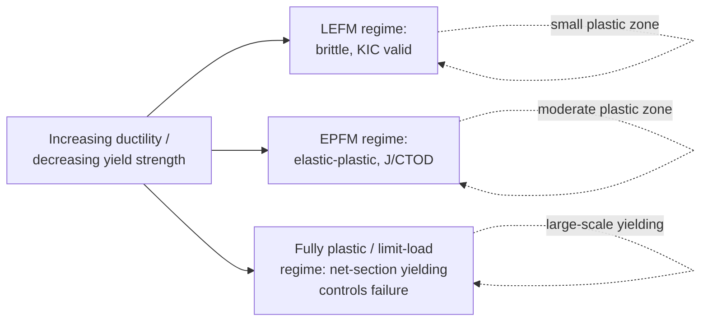
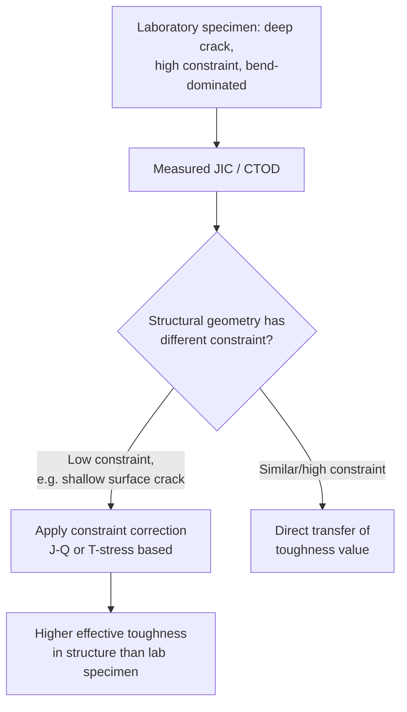
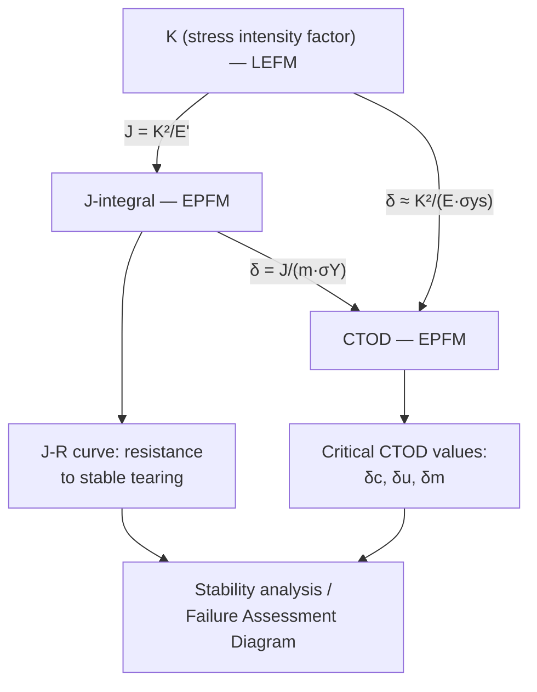

## Elastic Plastic Fracture Mechanics

### Overview

Elastic-Plastic Fracture Mechanics (EPFM) extends fracture mechanics beyond the small-scale yielding assumption of Linear Elastic Fracture Mechanics (LEFM) to materials and geometries where significant plastic deformation occurs at the crack tip before fracture. EPFM is required whenever the plastic zone size becomes a non-negligible fraction of specimen or component dimensions, which is the case for most structural steels, aluminum alloys, and other ductile metals at typical service thicknesses.

EPFM provides the theoretical and experimental framework — centered on the $J$-integral and Crack Tip Opening Displacement (CTOD) — for characterizing fracture initiation and stable crack growth in these materials, enabling damage-tolerant design where LEFM alone would be physically inapplicable.

**Key Points**

- EPFM is necessary when the plastic zone size $r_p$ is not small relative to crack length, ligament, or specimen thickness — i.e., when LEFM's small-scale yielding (SSY) assumption breaks down.
- The two central parameters are the $J$-integral and CTOD ($\delta$), both of which reduce to LEFM-equivalent quantities under SSY conditions.
- Governing standard for testing: ASTM E1820 (unified $J$/CTOD standard); governing standard for assessment: BS 7910, API 579/ASME FFS-1.

---

### Why LEFM Breaks Down

#### The Plastic Zone Problem

LEFM assumes an elastic stress field with a singularity at the crack tip ($\sigma \sim 1/\sqrt{r}$). In reality, stresses cannot exceed the material's yield strength, so a plastic zone forms ahead of the crack tip. The first-order (Irwin) plastic zone size estimate is:

$$r_p = \frac{1}{2\pi}\left(\frac{K_I}{\sigma_{ys}}\right)^2 \quad \text{(plane stress)}$$

$$r_p = \frac{1}{6\pi}\left(\frac{K_I}{\sigma_{ys}}\right)^2 \quad \text{(plane strain)}$$

LEFM remains valid only when $r_p$ is small compared to crack length $a$, remaining ligament $(W-a)$, and thickness $B$ — the small-scale yielding condition. When toughness is high and yield strength is low (many structural steels, aluminum alloys, austenitic stainless steels), $r_p$ can become comparable to or larger than specimen dimensions, and the elastic $K$-field description of the crack-tip environment is no longer accurate.

**SVG Diagram: Plastic Zone Regimes Ahead of a Crack Tip (svg_diagram)**

<svg xmlns="http://www.w3.org/2000/svg" viewBox="0 0 640 320" font-family="Arial, sans-serif">
<text x="320" y="24" text-anchor="middle" font-size="16" font-weight="bold">Small-Scale vs. Large-Scale Yielding (svg_diagram)</text>
<line x1="40" y1="160" x2="280" y2="160" stroke="black" stroke-width="3" />
<circle cx="280" cy="160" r="10" fill="lightgray" stroke="black" stroke-width="1.5" />
<text x="120" y="150" font-size="12">Small-scale yielding (LEFM valid)</text>
<text x="60" y="200" font-size="11">Elastic K-field dominates</text>
<text x="60" y="215" font-size="11">outside small plastic zone</text>
<line x1="360" y1="160" x2="600" y2="160" stroke="black" stroke-width="3" />
<circle cx="600" cy="160" r="55" fill="lightgray" stroke="black" stroke-width="1.5" opacity="0.7" />
<text x="420" y="150" font-size="12">Large-scale/net-section yielding</text>
<text x="440" y="250" font-size="11">Plastic zone dominates —</text>
<text x="440" y="265" font-size="11">requires EPFM (J, CTOD)</text>
</svg>

#### Regimes of Fracture Behavior

---

### The J-Integral

#### Definition and Physical Interpretation

Proposed by Rice (1968), the $J$-integral is a path-independent line integral around the crack tip:

$$J = \int_{\Gamma} \left( W\, dy - T_i \frac{\partial u_i}{\partial x}\, ds \right)$$

where $W = \int \sigma_{ij}\, d\varepsilon_{ij}$ is the strain energy density, $T_i = \sigma_{ij} n_j$ are traction components on the contour $\Gamma$, and $u_i$ are displacement components.

For a nonlinear elastic material (a mathematical idealization used to justify path-independence, and a reasonable approximation to elastic-plastic behavior provided the material does not unload), $J$ represents the energy release rate per unit crack advance:

$$J = -\frac{1}{B}\frac{d\Pi}{da}$$

where $\Pi$ is the potential energy of the cracked body and $B$ is thickness. Under linear elastic conditions, $J$ reduces exactly to the strain energy release rate $G$:

$$J = G = \frac{K^2}{E'}$$

**Key Points**

- Path-independence means $J$ can be evaluated on any contour surrounding the crack tip, giving the same value — a powerful property for both analytical and finite-element (domain-integral) evaluation.
- $J$ characterizes the intensity of the crack-tip stress and strain fields under the HRR (Hutchinson-Rice-Rosengren) singularity for power-law hardening materials, analogous to the role $K$ plays in LEFM.
- $J$ is strictly valid for monotonic loading without unloading (deformation theory of plasticity); it becomes an approximation once significant stable crack growth or unloading occurs, though it remains widely used engineering practice within specified validity limits.

#### The HRR Singularity

For a material following the Ramberg-Osgood relation:

$$\frac{\varepsilon}{\varepsilon_0} = \frac{\sigma}{\sigma_0} + \alpha\left(\frac{\sigma}{\sigma_0}\right)^n$$

the crack-tip stress field takes the form:

$$\sigma_{ij} = \sigma_0 \left(\frac{J}{\alpha \sigma_0 \varepsilon_0 I_n r}\right)^{1/(n+1)} \tilde{\sigma}_{ij}(\theta, n)$$

where $n$ is the strain-hardening exponent and $I_n$ is an integration constant. As $n \to 1$ (linear elastic), this recovers the familiar $1/\sqrt{r}$ singularity; for fully plastic materials ($n \to \infty$), the singularity weakens toward $1/r$ in strain and remains bounded in stress far from the tip, reflecting spreading plasticity.

#### Experimental Determination of J

$$J = J_{el} + J_{pl} = \frac{K^2(1-\nu^2)}{E} + \frac{\eta A_{pl}}{B_N(W-a)}$$

- $J_{el}$: elastic contribution, computed from $K$ using standard specimen compliance functions.
- $J_{pl}$: plastic contribution, computed from the plastic area under the load-displacement (or load-CMOD) curve, using the geometry-dependent factor $\eta$ (≈2.0 for deeply cracked bend specimens).
- $B_N$: net specimen thickness (accounting for side grooves, which promote crack front straightness).

---

### Crack Tip Opening Displacement (CTOD)

#### Concept

CTOD ($\delta$) measures the opening displacement at the (blunted) original crack tip location, providing a direct, physically intuitive measure of local crack-tip deformation. Wells (1961) originally proposed CTOD after observing that cracks in structural steel blunted substantially before fracture, invalidating a purely LEFM description.

**SVG Diagram: Crack-Tip Blunting and CTOD Definition (svg_diagram)**

<svg xmlns="http://www.w3.org/2000/svg" viewBox="0 0 620 300" font-family="Arial, sans-serif">
<text x="310" y="24" text-anchor="middle" font-size="16" font-weight="bold">CTOD Definition at Blunted Crack Tip (svg_diagram)</text>
<line x1="60" y1="150" x2="330" y2="150" stroke="black" stroke-width="2" />
<path d="M 330 150 Q 370 130 400 150 Q 370 170 330 150" fill="none" stroke="black" stroke-width="2" />
<line x1="60" y1="150" x2="330" y2="150" stroke="black" stroke-width="2" transform="translate(0,0)" />
<line x1="400" y1="150" x2="400" y2="130" stroke="red" stroke-width="2" />
<line x1="400" y1="150" x2="400" y2="170" stroke="red" stroke-width="2" />
<line x1="390" y1="130" x2="410" y2="130" stroke="red" stroke-width="1.5" />
<line x1="390" y1="170" x2="410" y2="170" stroke="red" stroke-width="1.5" />
<text x="415" y="155" font-size="13" fill="red" font-weight="bold">δ (CTOD)</text>
<text x="150" y="140" font-size="12">Original sharp crack (blunted under load)</text>
<path d="M 330 150 Q 380 90 450 90" fill="none" stroke="gray" stroke-dasharray="4,3" stroke-width="1.5" />
<path d="M 330 150 Q 380 210 450 210" fill="none" stroke="gray" stroke-dasharray="4,3" stroke-width="1.5" />
<text x="460" y="95" font-size="11" fill="gray">Deformed crack flanks</text>
</svg>

#### Relationship Between CTOD, K, and J

Under small-scale yielding, CTOD relates to $K$ and $J$ via the dimensionless constraint factor $m$:

$$\delta = \frac{J}{m\,\sigma_Y}$$

where $\sigma_Y$ is the flow stress (average of yield and ultimate tensile strength) and $m$ is typically in the range 1.0-2.0, depending on strain hardening and stress state (plane stress vs. plane strain). This provides a bridge allowing $J$-based and CTOD-based fracture assessments to be cross-compared.

#### Strip Yield (Dugdale-Barenblatt) Model

An alternative, mathematically tractable derivation of CTOD uses the Dugdale strip-yield model, which replaces the crack-tip plastic zone with a strip of length $\rho$ ahead of the crack, over which a closing stress equal to yield strength acts:

$$\rho = \frac{\pi}{8}\left(\frac{K_I}{\sigma_{ys}}\right)^2 \sec\left(\frac{\pi\sigma}{2\sigma_{ys}}\right) - a$$

(for a through-thickness crack in an infinite plate under remote stress $\sigma$), giving:

$$\delta = \frac{8\sigma_{ys}a}{\pi E}\ln\left[\sec\left(\frac{\pi\sigma}{2\sigma_{ys}}\right)\right]$$

At low applied stress, this expression reduces (via series expansion) to $\delta \approx K_I^2/(E\sigma_{ys})$, consistent with the small-scale yielding relationship between CTOD and $K$.

---

### Elastic-Plastic Fracture Testing Overview

EPFM testing (per ASTM E1820) produces either single critical values or full resistance curves:

| Quantity | Meaning |
| --- | --- |
| $J_{IC}$ | $J$ at technical onset of stable ductile crack growth (0.2 mm offset construction) |
| $J$-$R$ curve | $J$ versus crack extension $\Delta a$, characterizing the material's growing resistance to tearing |
| $\delta_c$ | CTOD at onset of unstable fracture/pop-in before stable tearing |
| $\delta_u$ | CTOD at unstable fracture after some stable tearing |
| Tearing modulus $T$ | Non-dimensional slope of the $J$-$R$ curve: $T = \frac{E}{\sigma_Y^2}\frac{dJ}{da}$, used in stability analysis of ductile crack growth |

**Key Points**

- The single-specimen unloading compliance technique is standard practice, back-calculating crack length from periodic elastic unloading slopes during a single monotonic test.
- Validity requires sufficiently deep cracks ($a/W$ between 0.45-0.70) and sufficient remaining ligament to maintain a predominantly bending/deformation-controlled stress state (the "J-dominance" or "J-controlled" requirement, roughly $(W-a), B \geq 25 J_Q/\sigma_Y$).

---

### Constraint Effects

A central limitation of single-parameter EPFM ($J$ or CTOD alone) is that these parameters do not fully capture crack-tip stress triaxiality (constraint), which strongly affects the material's local fracture resistance. Two-parameter approaches have been developed to address this:

- **$J$-$Q$ theory** (O'Dowd and Shih): a second parameter $Q$ quantifies the deviation of the near-tip stress field from the reference (high-constraint) HRR field, allowing constraint-corrected toughness locus construction.
- **$T$-stress**: the second, non-singular term in the Williams elastic crack-tip stress expansion; negative $T$-stress is associated with reduced constraint (higher apparent toughness), positive $T$-stress with elevated constraint.
- **Toughness scaling models** (e.g., Anderson-Dodds): allow transfer of toughness measured in a high-constraint laboratory specimen (typically deeply-cracked SE(B) or C(T)) to lower-constraint structural configurations (e.g., shallow surface cracks, wide plates in tension).

**[Inference]** Constraint-loss effects are generally most significant for shallow-cracked or tension-loaded (as opposed to bend-loaded) configurations; the magnitude of the toughness elevation is material- and geometry-specific and is typically established through dedicated wide-plate or biaxial testing programs rather than universal correction factors.

---

### Ductile Tearing and Crack Growth Resistance

#### The J-R Curve and Stability

For many structural materials, fracture does not occur as a single unstable event but as progressive stable ductile tearing, characterized by a rising $J$-$R$ curve:

$$J = J(\Delta a)$$

typically fit to a power-law form: $J = C_1(\Delta a)^{C_2}$.

**Stability analysis** compares the driving force slope to the material's tearing resistance slope:

$$\frac{dJ_{applied}}{da}\bigg|_{\Delta = const} \quad \text{vs.} \quad \frac{dJ_{material}}{da}$$

Instability occurs when the applied driving force curve becomes tangent to (and would exceed) the material's resistance curve — analogous to the classic Griffith energy-balance instability criterion, but generalized to the elastic-plastic regime.

**Example**

For a through-wall-cracked pipe under internal pressure, engineering critical assessment (per BS 7910 or API 579) constructs a Failure Assessment Diagram (FAD) using both a fracture ratio $K_r = K_{applied}/K_{mat}$ and a plasticity/load ratio $L_r = \sigma_{ref}/\sigma_Y$. A point plotting inside the FAD envelope indicates the flaw is acceptable; a point on or outside the envelope indicates predicted failure by either brittle fracture (low $L_r$, controlled by $K_r$) or plastic collapse (high $L_r$). This FAD approach is the primary industrial application bridging EPFM material characterization ($J_{IC}$/CTOD test data, converted to $K_{mat}$) to structural flaw assessment.

---

### Numerical (Finite Element) Evaluation of J

Modern practice frequently computes $J$ directly from finite element analysis using the **domain integral method** (equivalent domain integral, EDI), which converts the contour integral into an area/volume integral more suitable for FE discretization:

$$J = \int_A \left(\sigma_{ij}\frac{\partial u_i}{\partial x_1} - W\delta_{1j}\right)\frac{\partial q}{\partial x_j}\, dA$$

where $q$ is a weighting function that varies smoothly from 1 at the crack tip to 0 at the domain's outer boundary. This method is implemented in most commercial FE packages (ABAQUS, ANSYS) and is largely insensitive to mesh distortion near the crack tip when a properly collapsed/quarter-point element or focused mesh is used to capture the crack-tip singularity.

**[Inference]** For elastic-plastic FE-based $J$ evaluations under non-proportional loading or significant crack growth, path/domain independence in the numerical solution may degrade compared to purely elastic problems; analysts typically check $J$ values across at least two or three nested contours/domains to confirm convergence before accepting the result.

---

### Relationship Summary: LEFM to EPFM

---

**Next Steps / Related Topics**

- Fracture Toughness Testing (ASTM E1820, E399, E1921 procedures)
- The J-Integral: Theoretical Derivation and Path Independence
- HRR Singularity and Crack-Tip Stress/Strain Fields
- Constraint Effects and the J-Q Theory
- Ductile Tearing Instability and Tearing Modulus Analysis
- Failure Assessment Diagrams (FAD) and Engineering Critical Assessment
- Master Curve Method for Ductile-to-Brittle Transition
- Finite Element Methods for Fracture Parameter Extraction
- Dugdale-Barenblatt Strip Yield Model
- Weld Metal and HAZ Fracture Toughness Qualification