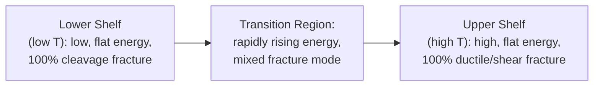
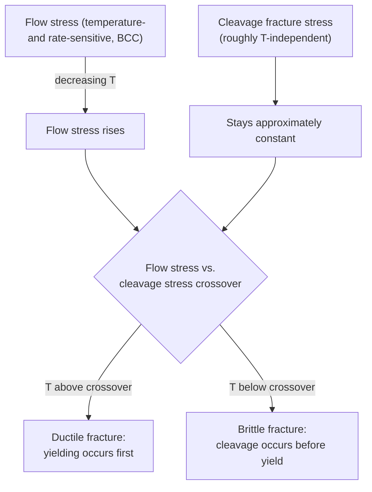
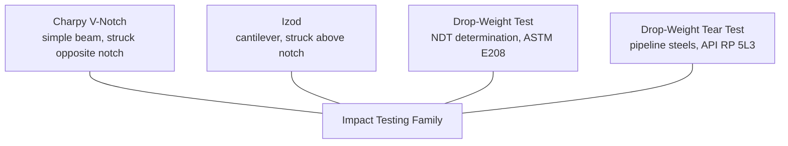

## Impact Testing and Ductile to Brittle Transition

### Overview

Impact testing subjects a notched specimen to a single, high-strain-rate blow, measuring the energy absorbed during fracture. Unlike quasi-static fracture toughness tests, impact tests are simple, inexpensive, and highly sensitive to temperature, strain rate, and microstructure — making them the dominant tool for characterizing the **ductile-to-brittle transition** (DBT) exhibited by body-centered cubic (BCC) metals, most notably ferritic and martensitic steels.

The DBT phenomenon — a material's fracture mode shifting from ductile (high energy absorption, shear fracture) to brittle (low energy absorption, cleavage fracture) as temperature decreases — is one of the most safety-critical behaviors in structural materials engineering, historically responsible for catastrophic failures including Liberty ship hull fractures and pipeline ruptures.

**Key Points**

- The Charpy V-Notch (CVN) test (ASTM E23, ISO 148) is the dominant industrial impact test; the Izod test (ASTM D256, primarily for polymers) is a less common alternative geometry.
- Face-centered cubic (FCC) metals (aluminum, copper, austenitic stainless steels) and most non-ferrous alloys do **not** exhibit a sharp ductile-to-brittle transition; the phenomenon is essentially specific to BCC and HCP crystal structures.
- Key transition metrics: Ductile-to-Brittle Transition Temperature (DBTT), Fracture Appearance Transition Temperature (FATT), Nil-Ductility Transition (NDT) temperature (via drop-weight test), and upper/lower shelf energy.

---

### The Charpy V-Notch Impact Test

#### Specimen and Apparatus

The standard Charpy specimen is a $10 \times 10 \times 55$ mm bar with a machined 45° V-notch, 2 mm deep, with a 0.25 mm root radius, centered on one face. The specimen is supported horizontally as a simple beam and struck on the face opposite the notch by a swinging pendulum hammer, fracturing the specimen in a single blow.

**SVG Diagram: Charpy Impact Test Setup (svg_diagram)**

<svg xmlns="http://www.w3.org/2000/svg" viewBox="0 0 640 400" font-family="Arial, sans-serif">
<text x="320" y="24" text-anchor="middle" font-size="16" font-weight="bold">Charpy V-Notch Impact Test (svg_diagram)</text>
<circle cx="150" cy="80" r="6" fill="black" />
<line x1="150" y1="80" x2="380" y2="280" stroke="black" stroke-width="2" stroke-dasharray="5,3" />
<circle cx="380" cy="280" r="22" fill="lightgray" stroke="black" stroke-width="2" />
<text x="410" y="270" font-size="11">Pendulum hammer</text>
<text x="410" y="285" font-size="11">(striking edge)</text>
<line x1="150" y1="80" x2="150" y2="320" stroke="black" stroke-width="1" stroke-dasharray="2,2" />
<text x="90" y="80" font-size="11">Pivot</text>
<rect x="250" y="315" width="140" height="18" fill="none" stroke="black" stroke-width="2" />
<polygon points="320,315 328,333 312,333" fill="white" stroke="black" stroke-width="1.5" />
<text x="300" y="360" font-size="12">Specimen (10×10×55mm)</text>
<text x="300" y="375" font-size="11">V-notch, 2mm deep, on tension face</text>
<rect x="240" y="333" width="15" height="25" fill="none" stroke="black" stroke-width="2" />
<rect x="385" y="333" width="15" height="25" fill="none" stroke="black" stroke-width="2" />
<text x="230" y="365" font-size="10">Anvil</text>
<path d="M 420 100 A 150 150 0 0 1 500 260" fill="none" stroke="gray" stroke-width="1" stroke-dasharray="3,2" />
<text x="440" y="130" font-size="10" fill="gray">Swing arc</text>
</svg>

#### Test Procedure and Energy Measurement

1. The specimen is conditioned to the desired test temperature (using a liquid bath, environmental chamber, or cryogenic dewar) and transferred quickly (per standard time limits) to the anvil to minimize temperature drift.
2. The pendulum, released from a fixed height $h_1$, swings down and fractures the specimen, then continues to a reduced height $h_2$ on the far side.
3. The absorbed energy is calculated from the height difference:

$$E = mg(h_1 - h_2)$$

directly read from a calibrated dial or digital encoder on modern instrumented machines.

4. Instrumented Charpy testing (ASTM E2298) additionally records the load-time (or load-displacement) history via a strain-gauged striker, allowing separation of crack initiation energy and crack propagation energy, and identification of features like the general yield load and maximum load.

**Key Points**

- Energy is reported in Joules (or ft-lbf in older US practice); typical structural steel Charpy energies range from a few joules (brittle, lower shelf) to 150-300+ J (ductile, upper shelf) depending on strength grade and orientation.
- Specimen orientation relative to rolling direction is standardized (L-T, T-L, etc. per ASTM E399/A370 nomenclature) because Charpy energy is often highly anisotropic due to inclusion elongation and grain flow.
- Sub-size specimens (e.g., $5 \times 10 \times 55$ mm, $2.5 \times 10 \times 55$ mm) are used when material availability is limited (surveillance specimens, thin plate) and require energy normalization/correlation factors to compare with full-size results.

---

### The Ductile-to-Brittle Transition Curve

#### Shape and Regions

Plotting absorbed energy versus test temperature for a BCC ferritic steel produces a characteristic sigmoidal (S-shaped) curve:

**SVG Diagram: Charpy Energy vs. Temperature Transition Curve (svg_diagram)**

<svg xmlns="http://www.w3.org/2000/svg" viewBox="0 0 640 380" font-family="Arial, sans-serif">
<text x="320" y="24" text-anchor="middle" font-size="16" font-weight="bold">Ductile-to-Brittle Transition Curve (svg_diagram)</text>
<line x1="70" y1="330" x2="590" y2="330" stroke="black" stroke-width="2" />
<line x1="70" y1="330" x2="70" y2="50" stroke="black" stroke-width="2" />
<text x="560" y="355" font-size="13">Temperature</text>
<text x="20" y="60" font-size="13">Energy (J)</text>
<path d="M 100 310 C 200 305, 260 290, 310 200 C 360 110, 420 70, 560 65" fill="none" stroke="blue" stroke-width="2.5" />
<line x1="70" y1="310" x2="590" y2="310" stroke="gray" stroke-width="1" stroke-dasharray="3,2" />
<text x="450" y="305" font-size="11" fill="gray">Lower shelf energy</text>
<line x1="70" y1="70" x2="590" y2="70" stroke="gray" stroke-width="1" stroke-dasharray="3,2" />
<text x="450" y="65" font-size="11" fill="gray">Upper shelf energy</text>
<line x1="330" y1="330" x2="330" y2="150" stroke="red" stroke-width="1.5" stroke-dasharray="4,2" />
<text x="335" y="150" font-size="12" fill="red" font-weight="bold">DBTT (e.g. 50% energy or 41J criterion)</text>
<text x="150" y="325" font-size="12">Lower shelf</text>
<text x="280" y="240" font-size="12">Transition region</text>
<text x="470" y="90" font-size="12">Upper shelf</text>
</svg>

#### Defining the Transition Temperature

Because the transition is a gradual curve rather than a discrete point, several criteria are used to define a single "DBTT" value, and the choice significantly affects the reported number:

| Criterion | Definition |
| --- | --- |
| Fixed-energy criterion | Temperature at which absorbed energy crosses a specified value (e.g., 20 J, 27 J, or 41 J — common in pressure vessel and pipeline codes) |
| 50% Shear Area (FATT) | Fracture Appearance Transition Temperature — temperature at which the fracture surface shows 50% shear (fibrous) and 50% cleavage (crystalline) appearance |
| Average energy criterion | Temperature corresponding to the average of upper and lower shelf energies |
| Lateral expansion criterion | Temperature at which lateral expansion (plastic bulging opposite the notch) reaches a specified value (e.g., 0.38 mm / 15 mils, used in ASME nuclear code) |

**[Inference]** Because these criteria can yield different numerical transition temperatures for the same material and dataset (sometimes by tens of degrees), engineering codes explicitly specify which criterion and threshold value must be used for a given qualification, and transition temperatures from different criteria should generally not be directly compared.

---

### Metallurgical Basis of the Transition

#### Why BCC Metals Transition and FCC Metals Do Not

The DBT phenomenon arises from the competition between two temperature-dependent deformation mechanisms:

1. **Dislocation motion (plastic flow)**: In BCC metals, the Peierls-Nabarro lattice friction stress is highly temperature- and strain-rate-sensitive because dislocation glide requires thermally-activated kink-pair nucleation on non-close-packed slip planes. Yield/flow stress rises sharply as temperature decreases.
2. **Cleavage fracture stress**: The stress required to propagate a cleavage crack along low-index crystallographic planes (e.g., {100} in BCC iron) is comparatively temperature-insensitive.

At high temperature, flow stress is low, so the material yields and deforms plastically (absorbing significant energy) before the cleavage stress is reached — ductile behavior. As temperature drops, flow stress rises above the (roughly constant) cleavage stress, and the material fractures by cleavage before significant plasticity occurs — brittle behavior.

In FCC metals, dislocation glide occurs on close-packed planes with low, weakly temperature-dependent lattice friction stress (Peierls stress is intrinsically low), so flow stress never rises steeply enough at low temperature to intersect a cleavage criterion — hence no sharp transition (though FCC metals can still show gradual toughness reduction and other low-temperature embrittlement mechanisms).

#### Factors Shifting the DBTT

| Factor | Effect on DBTT |
| --- | --- |
| Increasing grain size | Raises DBTT (Hall-Petch: coarser grains reduce the stress needed to propagate a cleavage crack across a grain, and reduce pile-up-based crack nucleation resistance) |
| Increasing strain rate | Raises DBTT (less time for thermally-activated dislocation motion; impact loading itself raises DBTT versus slow bend tests on the same material) |
| Interstitial content (C, N) | Raises DBTT (interstitial solutes strongly increase lattice friction stress in BCC iron — classic steel embrittlement mechanism) |
| Notch sharpness / triaxiality | Raises DBTT (higher triaxial constraint favors cleavage over shear) |
| Neutron irradiation | Raises DBTT (irradiation-induced defect clusters and precipitates impede dislocation motion — critical concern for reactor pressure vessel steels) |
| Grain refinement, microalloying (Nb, V, Ti) | Lowers DBTT (finer effective grain size via controlled rolling) |
| Nickel alloying | Lowers DBTT (used extensively in cryogenic and Arctic-service steels, e.g., 9% Ni steel for LNG tanks) |

**Key Points**

- The Hall-Petch relationship for cleavage fracture stress, $\sigma_f = \sigma_i + k_y d^{-1/2}$, combined with the Hall-Petch relationship for yield stress, provides the classical metallurgical justification for grain refinement as a simultaneous strengthening and toughening mechanism — one of the few strengthening methods that does not degrade toughness.
- Radiation embrittlement monitoring in nuclear reactor pressure vessels relies on tracking DBTT shift ($\Delta T_{41J}$ or Master Curve $\Delta T_0$) via surveillance capsule testing over plant life.

---

### Fracture Surface Appearance

Post-test fractography directly reflects the fracture mechanism at the test temperature:

- **Lower shelf**: flat, bright, faceted (crystalline) cleavage fracture surface; little to no shear lips.
- **Upper shelf**: dull, fibrous, dimpled surface with pronounced shear lips at the specimen edges (45° shear fracture); high plastic deformation evident from lateral expansion.
- **Transition region**: mixed-mode surface, with a cleavage "thumbnail" or central region surrounded by fibrous/shear regions; percent shear area is estimated visually or by image analysis and reported alongside energy.

---

### Other Impact and Transition-Related Tests

#### Drop-Weight Test (ASTM E208) — Nil-Ductility Transition (NDT)

A notched, brittle-weld-bead specimen is struck by a falling weight in three-point bending, with a stop that limits maximum deflection (preventing full fracture). The specimen either breaks (crack propagates to at least one edge) or does not break. Testing a series of specimens at decreasing temperatures identifies the **NDT temperature** — the highest temperature at which a brittle-type "break" occurs. NDT is a key reference temperature in the ASME Boiler and Pressure Vessel Code (Section III) for setting minimum pressurization temperatures in nuclear reactor vessels.

#### Drop-Weight Tear Test (DWTT, API RP 5L3)

Used primarily for line pipe steels, DWTT uses a larger, pressed-notch specimen tested in three-point bend impact, reporting percent shear area versus temperature. It is preferred over Charpy for predicting full-scale pipeline fracture propagation behavior because its larger specimen size and geometry more closely replicate constraint conditions in thick-walled pipe.

#### Izod Test

Similar energy-absorption principle to Charpy, but the specimen is clamped vertically as a cantilever and struck above the notch. Predominantly used for polymers and some non-ferrous applications (ASTM D256); less common for structural steel qualification than Charpy.

---

### Correlation Between Charpy Energy and Fracture Toughness

Because Charpy testing is inexpensive and long-established (large historical databases exist), extensive empirical correlations have been developed to estimate fracture toughness ($K_{IC}$) from Charpy upper-shelf energy (CVN) for structural and pressure vessel steels, most notably the **Rolfe-Novak-Barsom correlation**:

$$\left(\frac{K_{IC}}{\sigma_{ys}}\right)^2 = \frac{5}{\sigma_{ys}}\left(\text{CVN} - \frac{\sigma_{ys}}{20}\right)$$

(units: $K_{IC}$ in ksi√in, CVN in ft-lbf, $\sigma_{ys}$ in ksi — a classic empirical form from the fitness-for-service literature).

**[Inference]** Such correlations are inherently approximate, material-class-specific (developed primarily from structural and pressure vessel steel datasets), and are generally intended only for preliminary screening or where direct fracture toughness testing is unavailable; they are not a substitute for direct $K_{IC}$/$J_{IC}$ testing in critical structural integrity assessments, and most codes explicitly limit or caveat their use accordingly.

---

### Historical Significance

**Example**

The World War II Liberty ship hull failures (multiple ships fracturing suddenly, some literally breaking in half while docked or in calm seas) are the canonical historical case demonstrating the ductile-to-brittle transition's engineering significance. Post-failure investigation identified that the ships' welded (rather than riveted) all-steel hull construction, combined with steels having relatively high DBTT and stress concentrators at hatch corners and weld defects, allowed brittle cleavage cracks to initiate and propagate catastrophically at ambient/cold seawater temperatures near or below the steel's transition temperature. This episode was a primary historical driver for the development of Charpy impact specification requirements in ship steel and structural steel codes, and for subsequent fracture mechanics research broadly.

---

### Applications and Code Requirements

- **Structural steel codes** (e.g., AISC, EN 10025) specify minimum Charpy energy at a given test temperature as a function of service temperature and section thickness, to ensure adequate toughness margin above the DBTT.
- **Pressure vessel and piping codes** (ASME Section VIII, Section III) specify Charpy impact test requirements and exemption curves based on minimum design metal temperature (MDMT) and material toughness.
- **Pipeline steel specifications** (API 5L) specify minimum DWTT shear area and Charpy energy to ensure ductile (rather than brittle, rapidly-propagating) fracture behavior in service.
- **Nuclear reactor vessel codes** use NDT and Master Curve $T_0$ shift tracking (via Charpy and small fracture-mechanics surveillance specimens) to establish safe pressure-temperature operating limits throughout plant life, accounting for irradiation embrittlement.

---

**Next Steps / Related Topics**

- Fracture Toughness Testing ($K_{IC}$, $J_{IC}$, CTOD methods)
- Master Curve Method for the Transition Region (ASTM E1921)
- Cleavage Fracture Micromechanisms and the Weakest-Link Model
- Neutron Irradiation Embrittlement of Reactor Pressure Vessel Steels
- Hall-Petch Relationship and Grain Refinement Strengthening
- Strain-Rate Effects on Yield and Flow Stress in BCC Metals
- Fractography: Cleavage, Dimple Rupture, and Mixed-Mode Fracture Surfaces
- Controlled Rolling and Microalloyed Steel Design for Low DBTT
- Fitness-for-Service Assessment Using Charpy-Based Correlations
- Liberty Ship and Comet Aircraft Case Studies in Fracture Mechanics History