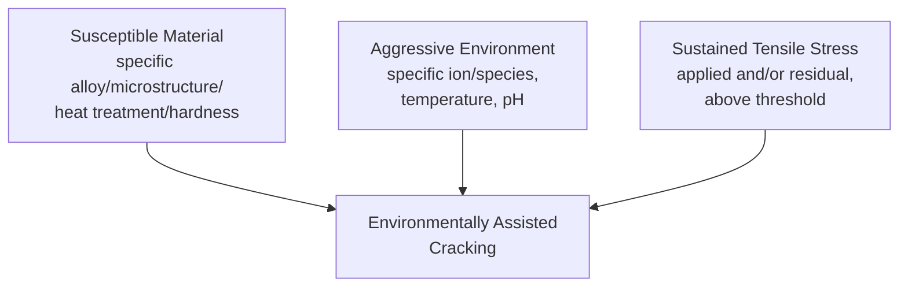
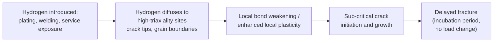
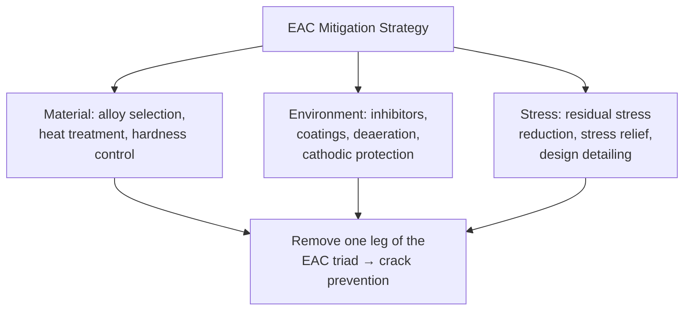

## Environmentally Assisted Cracking

### Overview

Environmentally Assisted Cracking (EAC) describes a family of failure mechanisms in which crack initiation and/or propagation occurs through the combined, synergistic action of a mechanical stress (or strain) and a chemically aggressive environment, at stress or stress-intensity levels far below what the material would tolerate in the environment's absence. EAC is a leading cause of unexpected in-service structural failures because components can fail well below their design load, often with minimal or no visible warning (macroscopically brittle fracture in otherwise ductile alloys).

EAC encompasses several distinct but related mechanisms — Stress Corrosion Cracking (SCC), Hydrogen Embrittlement (HE), Corrosion Fatigue, and Liquid Metal Embrittlement (LME) — each with characteristic mechanisms, susceptible material-environment combinations, and mitigation strategies.

**Key Points**

- EAC requires three simultaneous conditions: a susceptible material (specific microstructure/alloy), a specific aggressive environment, and a sustained tensile stress (residual or applied) above a threshold value.
- Governing standards: ASTM G36, G37, G38, G39, G49 (SCC test methods), ASTM F1624 (hydrogen embrittlement), NACE MR0175/ISO 15156 (sour service material selection), ASTM E1681 ($K_{ISCC}$/$K_{IH}$ threshold determination).
- EAC failures are frequently catastrophic and delayed, often occurring after years of successful service once a critical combination of stress, environment, and time is reached.

---

### The EAC Triad

Removing any single leg of this triad prevents EAC — this principle underlies most practical mitigation strategies (material substitution, environment modification/inhibition, or stress reduction).

---

### Stress Corrosion Cracking (SCC)

#### Mechanism

SCC is the growth of cracks in a susceptible alloy under tensile stress in a specific corrosive environment, at stress levels below the material's yield strength and in the near-total absence of general (uniform) corrosion. SCC is characteristically highly specific to particular alloy-environment combinations — a given alloy may be immune in most environments but severely susceptible in one specific chemical species.

Two principal (and sometimes overlapping) mechanistic models are recognized:

1. **Anodic dissolution / Slip-Dissolution model**: Localized plastic deformation at the crack tip continuously ruptures a protective passive film, exposing fresh, highly anodic (electrochemically active) metal that dissolves preferentially, advancing the crack. Repassivation partially reforms the film between rupture events, giving a characteristic incremental, often intergranular or transgranular crack growth pattern correlated with local strain rate.
2. **Hydrogen-assisted cracking within SCC**: In some systems (notably high-strength steels in various environments), cathodic reactions at the crack tip generate atomic hydrogen that is absorbed into the metal ahead of the crack tip, embrittling the material locally — overlapping mechanistically with classical hydrogen embrittlement (see below).

**SVG Diagram: Slip-Dissolution SCC Mechanism (svg_diagram)**

<svg xmlns="http://www.w3.org/2000/svg" viewBox="0 0 640 320" font-family="Arial, sans-serif">
<text x="320" y="24" text-anchor="middle" font-size="16" font-weight="bold">Slip-Dissolution SCC Mechanism (svg_diagram)</text>
<rect x="60" y="120" width="500" height="80" fill="none" stroke="black" stroke-width="1" />
<text x="70" y="115" font-size="12">Passive oxide film</text>
<line x1="60" y1="160" x2="300" y2="160" stroke="darkgray" stroke-width="4" />
<line x1="300" y1="160" x2="330" y2="145" stroke="black" stroke-width="2" />
<line x1="300" y1="160" x2="330" y2="175" stroke="black" stroke-width="2" />
<text x="150" y="150" font-size="11">Crack (film-covered flanks)</text>
<circle cx="335" cy="160" r="10" fill="red" opacity="0.6" />
<text x="350" y="165" font-size="11" fill="red">Bare metal exposed at tip</text>
<text x="350" y="185" font-size="11" fill="red">(film rupture by slip step)</text>
<path d="M 335 160 L 320 140 M 335 160 L 350 140" stroke="black" stroke-width="1" />
<text x="200" y="240" font-size="12">1. Slip step ruptures film → 2. Anodic dissolution advances crack → 3. Repassivation → repeat</text>
</svg>

#### Fracture Surface Morphology

SCC can propagate either **intergranular** (along grain boundaries — the most common mode, e.g., sensitized austenitic stainless steel in chloride environments) or **transgranular** (crossing grains, often along specific crystallographic planes — e.g., some brass/ammonia and high-strength steel systems), sometimes with branching crack morphology distinguishing SCC from fatigue (which typically produces a single, non-branching crack with characteristic striations).

#### Classic Alloy-Environment Susceptibility Pairs

| Alloy System | Aggressive Environment |
| --- | --- |
| Austenitic stainless steels (300-series) | Chloride ions (Cl⁻), especially at elevated temperature; classic "chloride SCC" |
| Sensitized austenitic stainless steels | Polythionic acid (intergranular SCC after weld sensitization) |
| High-strength steels (>1200 MPa) | Hydrogen-bearing environments, sour (H₂S) environments |
| Copper alloys (brass) | Ammonia and ammonium compounds ("season cracking") |
| Aluminum alloys (high-strength 7xxx, 2xxx) | Chloride-containing aqueous environments, especially with unfavorable grain orientation (short-transverse) |
| Carbon/low-alloy steels | Caustic solutions (caustic embrittlement), nitrates, carbonate-bicarbonate (pipeline SCC) |
| Nickel-based alloys | High-temperature caustic, high-purity water with dissolved oxygen (nuclear steam generator tubing) |
| Titanium alloys | Anhydrous methanol, red fuming nitric acid, hot salt |

**[Inference]** The chemical specificity of SCC susceptibility pairs is generally attributed to the particular electrochemical or adsorption interactions between the specific ionic/molecular species and the alloy's passive film or crack-tip surface chemistry; the precise mechanistic detail can differ substantially between systems and remains an active area of corrosion science research for some alloy-environment combinations.

---

### Hydrogen Embrittlement (HE)

#### Mechanism

Atomic hydrogen, generated by corrosion reactions, cathodic charging (electroplating, cathodic protection overprotection), welding, or pickling, diffuses into the metal lattice and segregates to regions of high hydrostatic stress (ahead of crack tips, at grain boundaries, and at other trap sites), severely reducing local fracture toughness and ductility. Several complementary mechanistic theories are used to explain the embrittling effect:

- **Hydrogen-Enhanced Decohesion (HEDE)**: Dissolved hydrogen reduces the cohesive strength of interatomic (often grain boundary) bonds, promoting brittle (often intergranular) fracture at stresses below the hydrogen-free fracture strength.
- **Hydrogen-Enhanced Localized Plasticity (HELP)**: Hydrogen increases local dislocation mobility, promoting highly localized, planar slip that leads to microvoid coalescence concentrated in a narrow band — a fundamentally different (locally ductile, but macroscopically embrittling) mechanism.
- **Hydride formation and cracking**: In hydride-forming metals (titanium, zirconium, vanadium), hydrogen precipitates as brittle metal hydride phases that crack readily under stress — mechanistically distinct from HEDE/HELP.

**Key Points**

- Susceptibility to HE generally increases with material strength/hardness — high-strength steels (>1000-1200 MPa tensile) are markedly more susceptible than low-strength steels, which is why high-strength fastener and spring specifications carry strict hydrogen embrittlement relief (baking) requirements after electroplating.
- HE is often reversible (partially or fully) upon hydrogen removal via low-temperature baking, unlike most other EAC mechanisms which cause permanent, irreversible microstructural or crack damage.
- Sources of hydrogen: electroplating/pickling (internal hydrogen embrittlement, IHE), welding (moisture in electrode coatings/flux), cathodic protection (overprotection of steel structures), and gaseous H₂ or H₂S service environments (environmental hydrogen embrittlement, EHE).

#### Delayed Fracture

A hallmark of HE is **delayed fracture** — a component under sustained static load fails after an incubation period (minutes to years) with no prior load increase, as hydrogen diffuses to and accumulates at the critical crack-tip or grain-boundary location. This time-dependence is captured by the incubation time's strong sensitivity to applied stress intensity and hydrogen fugacity/concentration.

---

### Corrosion Fatigue

Corrosion fatigue is the acceleration of fatigue crack initiation and/or growth by a corrosive environment acting synergistically with cyclic stress. Unlike classical SCC (which typically has a stress-intensity threshold, $K_{ISCC}$, below which no cracking occurs) and unlike pure mechanical fatigue (which has an endurance limit in some materials), corrosion fatigue generally exhibits:

- No true endurance limit — the S-N curve continues to decline with increasing cycles rather than flattening, even in materials (like plain carbon steel) that show a distinct endurance limit in air.
- Reduced fatigue life at all stress amplitudes compared to equivalent testing in inert/air environments.
- Frequency dependence — lower cyclic frequency (more time per cycle for environmental interaction) generally produces greater life reduction, distinguishing corrosion fatigue from purely mechanical fatigue.
- Fracture surfaces often show a combination of classic fatigue striations with corrosion products, pitting-initiated cracking, and sometimes intergranular facets.

---

### Liquid Metal Embrittlement (LME)

LME is catastrophic, often extremely rapid, brittle cracking of a solid metal in contact with a specific liquid metal, under tensile stress. Unlike SCC and HE, LME can proceed extremely fast (crack velocities approaching the speed of sound in the material in some systems) with essentially no incubation period once contact and stress are established. Classic examples include liquid mercury embrittlement of aluminum alloys and brass, liquid zinc embrittlement of steel during hot-dip galvanizing of stressed/welded components, and liquid cadmium embrittlement of high-strength steel (historically a serious concern for cadmium-plated aerospace fasteners).

**[Speculation]** The extremely rapid crack propagation rates observed in some LME systems have been attributed by various researchers to atomic-scale liquid-metal-induced reduction of interatomic bond strength directly at the crack tip; however, the precise atomistic mechanism remains debated in the metallurgical literature and may vary between specific metal-metal couples.

---

### Testing Methods for EAC

#### Threshold Stress Intensity Testing ($K_{ISCC}$ / $K_{IH}$)

ASTM E1681 (and related standards) determines the threshold stress intensity factor below which sub-critical crack growth does not occur in a given environment, analogous in concept to a fatigue endurance limit:

1. Fatigue pre-crack a fracture mechanics specimen (typically C(T) or DCB — double cantilever beam).
2. Load the specimen to a fixed initial $K_I$ (constant-load) or fixed initial displacement (constant-displacement, using a bolt-loaded DCB specimen, allowing $K$ to decrease as the crack grows since compliance increases).
3. Expose to the target environment for an extended period (weeks to months).
4. Monitor for crack growth (via crack-mouth displacement, DC potential drop, or periodic optical measurement).
5. Determine $K_{ISCC}$ (or $K_{IH}$ for hydrogen environments) as the highest $K_I$ at which no measurable crack growth occurs within the test duration (or by extrapolation of a $da/dt$ versus $K$ curve to a defined negligible growth rate).

**SVG Diagram: da/dt vs. K Curve for EAC (svg_diagram)**

<svg xmlns="http://www.w3.org/2000/svg" viewBox="0 0 620 360" font-family="Arial, sans-serif">
<text x="310" y="24" text-anchor="middle" font-size="16" font-weight="bold">Crack Growth Rate vs. K (EAC) (svg_diagram)</text>
<line x1="80" y1="310" x2="580" y2="310" stroke="black" stroke-width="2" />
<line x1="80" y1="310" x2="80" y2="50" stroke="black" stroke-width="2" />
<text x="560" y="330" font-size="13">K (stress intensity)</text>
<text x="30" y="60" font-size="13">log(da/dt)</text>
<path d="M 180 300 L 180 240" fill="none" stroke="blue" stroke-width="2.5" />
<path d="M 180 240 C 220 180, 260 165, 320 160" fill="none" stroke="blue" stroke-width="2.5" />
<path d="M 320 160 L 460 160" fill="none" stroke="blue" stroke-width="2.5" />
<path d="M 460 160 C 490 150, 510 100, 530 60" fill="none" stroke="blue" stroke-width="2.5" />
<line x1="180" y1="330" x2="180" y2="240" stroke="red" stroke-width="1.5" stroke-dasharray="4,2" />
<text x="130" y="345" font-size="12" fill="red" font-weight="bold">KISCC (threshold)</text>
<text x="140" y="220" font-size="11">Stage I: strong K-dependence</text>
<text x="330" y="145" font-size="11">Stage II: plateau, </text>
<text x="330" y="155" font-size="10">rate-limited by environment</text>
<text x="480" y="90" font-size="11">Stage III: rapid growth, </text>
<text x="480" y="100" font-size="10">approaching KIC</text>
<line x1="540" y1="310" x2="540" y2="65" stroke="gray" stroke-width="1" stroke-dasharray="3,2" />
<text x="545" y="65" font-size="11" fill="gray">KIC</text>
</svg>

The resulting curve typically shows three stages: Stage I (steep threshold region near $K_{ISCC}$), Stage II (plateau, where crack velocity is controlled by the rate of an environmental transport process such as hydrogen diffusion or ionic transport, largely independent of $K$), and Stage III (rapid acceleration as $K$ approaches $K_{IC}$, mechanical fracture dominates).

#### Slow Strain Rate Testing (SSRT, ASTM G129)

A smooth or notched tensile specimen is pulled to failure at a very slow, constant strain rate (typically $10^{-6}$ to $10^{-7}$ s⁻¹) in the target environment, compared against an inert-environment baseline. SCC susceptibility is indicated by reduced elongation/reduction-in-area, reduced time-to-failure, reduced maximum load, and/or a shift toward brittle (intergranular or cleavage-like) fracture morphology relative to the inert baseline. SSRT is favored for rapid screening (test durations of days rather than months) but is considered a more aggressive/conservative test than constant-load or constant-displacement threshold testing.

#### U-Bend and C-Ring Tests (ASTM G30, G38)

Simple, low-cost qualitative screening tests: a specimen is bent to a fixed geometry (imposing a known, sustained near-yield-level stress) and exposed to the service or accelerated environment; results are reported as pass/fail (crack/no crack) after a specified exposure duration, useful for alloy ranking and environment screening rather than for design-basis quantitative data.

---

### Mitigation Strategies

Consistent with the EAC triad concept, mitigation approaches target one or more of the three required conditions:

**Material selection/modification**

- Select alloys with documented immunity or resistance in the specific service environment (e.g., duplex or super-austenitic stainless steels in place of standard 300-series for chloride-rich service).
- Control microstructure/heat treatment (e.g., solution annealing to avoid sensitization in austenitic stainless steels; tempering high-strength steels to reduce hardness and HE susceptibility).
- Limit material strength/hardness below documented HE-susceptibility thresholds for a given sour or hydrogen-charging service (per NACE MR0175/ISO 15156 hardness limits).

**Environmental control**

- Chemical inhibitors, deaeration (oxygen removal), pH control, and temperature reduction where process conditions allow.
- Protective coatings and linings to physically separate the susceptible alloy from the aggressive environment.
- Cathodic protection (careful control to avoid hydrogen overcharging/embrittlement from overprotection).

**Stress management**

- Design to minimize residual tensile stresses (avoid cold work, sharp geometric discontinuities, and unfavorable weld residual stress patterns).
- Post-weld heat treatment / stress relief to reduce residual stresses below SCC threshold levels.
- Shot peening or other surface treatments to introduce beneficial compressive residual stresses at the surface.
- Hydrogen bake-out (low-temperature post-plating heat treatment, typically 190-220°C for several hours) to diffuse out embrittling hydrogen before it can cause delayed cracking.

---

### Case Example

**Example**

A cold-formed and welded 304 stainless steel tank used to store hot (60-80°C) chloride-containing process water experiences unexpected through-wall cracking near weld heat-affected zones after approximately two years of service, despite the material meeting all specified mechanical property requirements at installation. Failure analysis reveals fine, branching, predominantly transgranular cracks initiating at the outer surface near weld toes, consistent with classic chloride-induced transgranular SCC of austenitic stainless steel. Contributing factors typically identified in such cases include: elevated residual tensile stress from cold forming and welding (not stress-relieved), sustained exposure to a chloride-bearing environment at moderately elevated temperature (a well-documented susceptibility window for 300-series stainless), and possible surface chloride concentration by evaporative cycling. Remediation typically combines material substitution (e.g., to duplex stainless steel with substantially higher chloride SCC resistance) and/or stress-relief heat treatment plus chloride level control in the process water.

---

**Next Steps / Related Topics**

- Stress Corrosion Cracking Mechanisms and Susceptible Alloy Systems
- Hydrogen Embrittlement: Sources, Testing, and Mitigation (ASTM F1624)
- Corrosion Fatigue and S-N Behavior in Aggressive Environments
- NACE MR0175/ISO 15156 Sour Service Material Qualification
- Threshold Stress Intensity ($K_{ISCC}$/$K_{IH}$) Testing (ASTM E1681)
- Slow Strain Rate Testing (SSRT) for SCC Screening (ASTM G129)
- Cathodic Protection Design and Hydrogen Overcharging Risk
- Residual Stress Measurement and Stress-Relief Heat Treatment
- Liquid Metal Embrittlement in Galvanizing and Fastener Applications
- Fractography of Intergranular vs. Transgranular Environmental Cracking