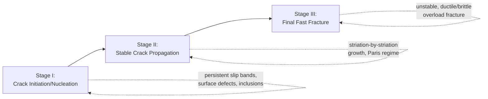
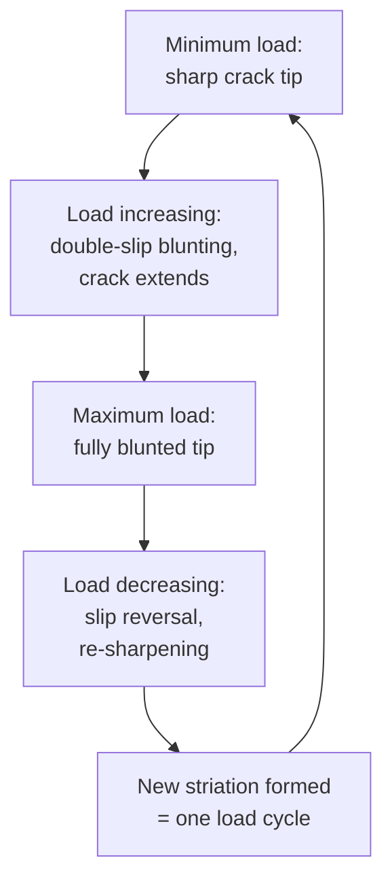
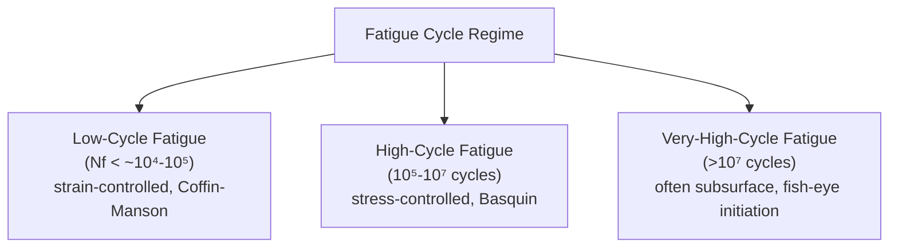

## Fatigue Failure Mechanisms

### Overview

Fatigue is the progressive, localized structural damage that occurs when a material is subjected to cyclic (repeated or fluctuating) stresses or strains, ultimately leading to crack initiation, crack propagation, and final fracture — often at stress levels far below the material's static tensile or yield strength. Fatigue is the single most common cause of in-service mechanical failure, historically estimated to account for a large majority of all service failures in structural and mechanical components.

Fatigue failure proceeds through three distinct, sequential physical stages, each governed by different micromechanisms and each amenable to different analytical and mitigation approaches.

**Key Points**

- Fatigue failures are typically macroscopically brittle in appearance (little gross plastic deformation), even in inherently ductile materials, because failure occurs by localized, cycle-by-cycle damage accumulation rather than bulk plastic overload.
- The three classical stages are: (1) crack initiation/nucleation, (2) stable crack propagation, and (3) final fast fracture.
- Governing standards and approaches: ASTM E466/E606 (constant-amplitude testing), ASTM E647 (fatigue crack growth rate testing), Basquin's Law (stress-life), Coffin-Manson relation (strain-life), Paris' Law (crack growth).

---

### The Three Stages of Fatigue Failure

#### Stage I: Crack Initiation

Fatigue cracks nucleate at locations of localized stress/strain concentration and cyclic plastic strain accumulation, most commonly at free surfaces where constraint is lowest and slip is easiest. The dominant micromechanism in ductile metals is the formation of **persistent slip bands (PSBs)**:

1. Under cyclic loading, dislocations move back and forth on active slip systems.
2. Repeated to-and-fro slip produces characteristic **intrusions and extrusions** at the free surface — microscopic ridges and notches formed by the irreversibility of dislocation glide (slip does not exactly retrace its path each reversed half-cycle due to cross-slip, dislocation multiplication, and surface oxidation effects).
3. Intrusions act as sharp, natural stress concentrators from which a microcrack nucleates, typically along the PSB (initially oriented along the maximum shear stress plane, roughly 45° to the loading axis — classical Stage I crack growth).

**SVG Diagram: Persistent Slip Band Intrusion/Extrusion Formation (svg_diagram)**

<svg xmlns="http://www.w3.org/2000/svg" viewBox="0 0 640 320" font-family="Arial, sans-serif">
<text x="320" y="24" text-anchor="middle" font-size="16" font-weight="bold">PSB Intrusion/Extrusion Mechanism (svg_diagram)</text>
<line x1="60" y1="160" x2="580" y2="160" stroke="black" stroke-width="2" />
<text x="60" y="145" font-size="12">Free surface</text>
<path d="M 200 160 L 220 160 L 225 145 L 230 160 L 250 160" fill="none" stroke="red" stroke-width="2" />
<text x="185" y="130" font-size="11" fill="red">Extrusion</text>
<path d="M 320 160 L 340 160 L 345 175 L 350 160 L 370 160" fill="none" stroke="blue" stroke-width="2" />
<text x="330" y="200" font-size="11" fill="blue">Intrusion</text>
<line x1="345" y1="175" x2="345" y2="220" stroke="blue" stroke-width="1.5" stroke-dasharray="3,2" />
<text x="360" y="225" font-size="11" fill="blue">Microcrack nucleates here</text>
<line x1="100" y1="200" x2="500" y2="200" stroke="gray" stroke-width="1" stroke-dasharray="2,2" />
<line x1="100" y1="220" x2="500" y2="220" stroke="gray" stroke-width="1" stroke-dasharray="2,2" />
<text x="150" y="240" font-size="11" fill="gray">Persistent slip bands (PSBs) beneath surface</text>
</svg>

#### Common Fatigue Crack Initiation Sites

| Site Type | Description |
| --- | --- |
| Free surface (persistent slip bands) | Dominant mechanism in clean, defect-free polycrystalline metals under smooth-specimen testing |
| Geometric stress concentrators | Fillets, holes, keyways, threads, sharp section changes — the most common practical initiation site in engineering components |
| Surface defects | Machining marks, scratches, corrosion pits, tool marks acting as micro-notches |
| Non-metallic inclusions | Subsurface initiation from oxides, sulfides, or other inclusions, especially in high-strength steels under high-cycle/very-high-cycle fatigue |
| Weld defects | Porosity, lack of fusion, undercut, slag inclusions — the dominant fatigue-critical feature in most welded structures |
| Grain boundaries / phase boundaries | Especially in the presence of environmental effects or at elevated temperature |

**[Inference]** In very-high-cycle fatigue regimes (beyond $10^7$ cycles) for clean, high-strength steels, subsurface initiation at internal inclusions or microstructural defects (sometimes producing a characteristic "fish-eye" fracture feature) becomes increasingly common relative to surface initiation, since surface-initiated cracks are suppressed by surface treatments while internal defects remain as the limiting flaw population — though the relative dominance of surface versus subsurface initiation is material- and processing-route-specific.

#### Stage II: Crack Propagation

Once a microcrack has nucleated, it initially grows along the Stage I shear plane for a short distance (roughly one to a few grain diameters), then reorients to grow perpendicular to the maximum principal (tensile) stress — this reoriented growth is **Stage II** crack propagation, which constitutes the great majority of fatigue life in most macroscopic engineering cracks.

Stage II growth proceeds by a repetitive **plastic blunting and re-sharpening mechanism** at the crack tip:

1. At minimum load, the crack tip is sharp.
2. As load increases, the crack tip blunts via localized slip on two intersecting slip systems, and the crack extends slightly.
3. At maximum load, the crack tip is maximally blunted.
4. As load decreases, slip reverses, the crack tip re-sharpens, and a new increment of crack advance (and a new striation) has been permanently recorded on the fracture surface.

This mechanism produces the hallmark microscopic feature of fatigue fracture surfaces: **striations** — closely spaced parallel ridges, each (in the idealized case) corresponding to one load cycle, visible via scanning electron microscopy (SEM).

**Key Points**

- Striation spacing generally correlates with the local crack growth rate ($da/dN$) and, by extension, the local stress intensity factor range ($\Delta K$) — closer striation spacing indicates slower growth (lower $\Delta K$, typically farther from the initiation site).
- Striations should not be confused with **beach marks** (also called clam-shell marks) — beach marks are macroscopic features, visible to the naked eye, that reflect changes in loading conditions, stress ratio, or environment (e.g., start-stop operating cycles, load spectrum variation) and correspond to many thousands of cycles each, not individual cycles.
- Not all materials produce clear striations (e.g., very brittle materials, cast irons, or fatigue under highly aggressive corrosive conditions may show poorly defined or absent striations), so striation counting for life estimation, while a valuable forensic tool, has practical limitations.

#### Stage III: Final Fast Fracture

As the fatigue crack grows, the remaining uncracked ligament progressively decreases, and the local stress intensity ($K_{max}$) rises correspondingly. When $K_{max}$ reaches the material's fracture toughness ($K_{IC}$ or $K_{C}$), or when the remaining net-section stress reaches the material's ultimate strength (causing plastic overload/ligament instability), the crack propagates rapidly and unstably to complete fracture. This final region typically shows classic overload fracture morphology (ductile dimple rupture, cleavage, or intergranular fracture, depending on the material and environment) rather than fatigue striations, and is often visibly rougher and may show shear lips at free surfaces.

---

### Anatomy of a Fatigue Fracture Surface

A classic fatigue fracture surface displays several diagnostic macroscopic and microscopic features that forensic/failure analysis engineers use to reconstruct the failure history.

**SVG Diagram: Classic Fatigue Fracture Surface Features (svg_diagram)**

<svg xmlns="http://www.w3.org/2000/svg" viewBox="0 0 640 420" font-family="Arial, sans-serif">
<text x="320" y="24" text-anchor="middle" font-size="16" font-weight="bold">Fatigue Fracture Surface Anatomy (svg_diagram)</text>
<circle cx="320" cy="220" r="180" fill="none" stroke="black" stroke-width="2" />
<circle cx="180" cy="150" r="6" fill="black" />
<text x="100" y="130" font-size="12">Initiation site (surface defect)</text>
<text x="60" y="115" font-size="12">Initiation site</text>
<text x="60" y="130" font-size="12">(surface defect)</text>
<path d="M 180 150 Q 250 180 320 220" fill="none" stroke="gray" stroke-width="1" stroke-dasharray="2,2" />
<path d="M 200 130 A 60 60 0 0 1 260 205" fill="none" stroke="darkgray" stroke-width="1" />
<path d="M 170 100 A 100 100 0 0 1 285 240" fill="none" stroke="darkgray" stroke-width="1" />
<path d="M 140 70 A 150 150 0 0 1 315 280" fill="none" stroke="darkgray" stroke-width="1" />
<text x="230" y="270" font-size="11" fill="darkgray">Beach marks (macroscopic)</text>
<circle cx="320" cy="220" r="60" fill="rgba(150,150,150,0.3)" stroke="black" stroke-width="1" />
<text x="360" y="270" font-size="11" font-weight="bold">Final fast fracture zone</text>
<text x="360" y="284" font-size="10">(rough, overload morphology)</text>
<text x="140" y="200" font-size="11">Smooth Stage II</text>
<text x="140" y="214" font-size="11">propagation zone</text>
</svg>

| Feature | Scale | Physical Origin |
| --- | --- | --- |
| Initiation site | Point/small area | Stress concentrator, surface defect, or inclusion where the crack began |
| Stage II propagation zone | Macroscopic, often smooth/burnished | Repeated crack-face rubbing during cyclic opening/closing; may show striations under SEM |
| Beach marks / clam-shell marks | Macroscopic (visible to naked eye) | Changes in loading, environment, or stress ratio over the service history |
| Striations | Microscopic (SEM only) | Individual load cycles, from the blunting-resharpening mechanism |
| Final fast-fracture zone | Macroscopic, rough/fibrous or crystalline | Unstable overload fracture once remaining ligament can no longer sustain $K_{max}$ or net-section stress |
| Ratchet marks | Macroscopic, at surface | Multiple initiation sites on the surface merging into a single crack front |

**Key Points**

- Multiple ratchet marks (indicating multiple simultaneous initiation sites) typically indicate a higher applied stress level or a more severe stress concentration, since more initiation sites become active as local stress increases.
- The relative size of the final fast-fracture zone compared to the total fracture surface area gives a qualitative indication of applied stress level: a larger fast-fracture zone (relative to slow Stage II growth zone) generally indicates higher nominal applied stress (less remaining ligament needed to reach critical $K$ or net-section stress), and vice versa.

---

### Micromechanistic Classification by Cycle Regime

#### Low-Cycle Fatigue (LCF)

Failure occurs at relatively few cycles (typically < $10^4$-$10^5$), driven by macroscopic cyclic plastic strain at each cycle (strain-controlled loading dominates, e.g., thermal cycling, start-stop machinery loading). Crack initiation is typically rapid (a small fraction of total life) because gross plasticity readily nucleates cracks at multiple sites; most of the LCF life is consumed in Stage II propagation. Governed by the **Coffin-Manson relation**:

$$\frac{\Delta \varepsilon_p}{2} = \varepsilon_f'(2N_f)^c$$

#### High-Cycle Fatigue (HCF)

Failure occurs after many cycles ($10^5$ to $10^7$+), under nominally elastic (stress-controlled) loading with little or no macroscopic plasticity. Most of HCF life is consumed in the crack initiation stage (often 90%+ of total life for smooth, defect-free specimens), since nucleating a crack under nominally elastic bulk stress requires many cycles of highly localized microplasticity at slip bands or defects. Governed by the **Basquin relation** (stress-life, S-N approach):

$$\frac{\Delta\sigma}{2} = \sigma_f'(2N_f)^b$$

#### Very-High-Cycle Fatigue (VHCF)

Beyond $10^7$ cycles, some materials (notably many steels) that were once thought to exhibit a true fatigue endurance limit continue to fail, often via subsurface initiation at internal inclusions, producing the characteristic **fish-eye** fracture feature (a roughly circular region surrounding the internal initiation site, itself often centered on a granular, fine-grained "optically dark area" or GBF/ODA feature associated with hydrogen-assisted micro-mechanisms at very slow local crack growth rates).

---

### Factors Influencing Fatigue Failure Mechanisms

| Factor | Mechanistic Influence |
| --- | --- |
| Mean stress / stress ratio ($R$) | Higher mean (tensile) stress accelerates crack growth for a given $\Delta K$/$\Delta\sigma$ (captured by Goodman, Gerber, Soderberg mean-stress correction models) |
| Surface finish/roughness | Rougher surfaces provide more/sharper initiation sites, reducing fatigue life; surface treatments (polishing, shot peening) can substantially extend life |
| Residual stress | Compressive residual surface stress (from shot peening, cold rolling, nitriding) delays crack initiation and can arrest early Stage II growth; tensile residual stress accelerates both |
| Environment | Corrosive/aggressive environments (see corrosion fatigue) accelerate crack initiation and eliminate the classical fatigue limit in many materials |
| Temperature | Elevated temperature can activate creep-fatigue interaction mechanisms (see below); low temperature can promote more brittle striation morphology and reduced fatigue crack growth resistance in some materials |
| Frequency | Lower cyclic frequency generally allows more time for environmental/diffusion-controlled damage mechanisms per cycle, often reducing life in aggressive environments |
| Microstructure | Grain size, inclusion content/morphology, precipitate distribution, and phase balance (e.g., ferrite-pearlite vs. martensite) strongly influence both initiation resistance and crack growth rate |

---

### Special Mechanisms

#### Fretting Fatigue

Occurs at contacting surfaces subjected to small-amplitude relative oscillatory motion (fretting) combined with cyclic bulk stress, as commonly found at bolted/riveted joints, press-fits, and dovetail joints (e.g., turbine blade roots). Fretting produces surface damage (wear debris, oxidation "cocoa" or "red rust" for steels) and highly localized stress concentration at the edge of contact, dramatically reducing fatigue life (often by a factor of 2-10 relative to plain fatigue) and shifting initiation to the fretting-damaged contact zone rather than bulk geometric features.

#### Thermal and Thermomechanical Fatigue (TMF)

Cyclic thermal stresses (from start-stop thermal transients, differential thermal expansion, or combined temperature and mechanical load cycling as in gas turbine and diesel engine components) produce fatigue damage through mechanisms overlapping with, but distinct from, isothermal LCF — notably including oxidation-fatigue interaction at elevated temperature and, at sufficiently high temperature, **creep-fatigue interaction**, where time-dependent creep damage (grain boundary cavitation) accumulates alongside cycle-dependent fatigue damage, often producing intergranular fracture features not seen in pure fatigue.

#### Rolling Contact Fatigue (RCF)

Occurs in rolling element bearings, gears, and rail-wheel contact, driven by cyclic subsurface shear stresses beneath the contact (Hertzian) zone. Characteristic failure mode is subsurface crack initiation at the depth of maximum orthogonal shear stress (often at a subsurface inclusion), followed by crack growth parallel to the surface and eventual **spalling** (a flake or pit breaking away from the surface) rather than the through-section fracture typical of bulk fatigue.

---

### Case Example

**Example**

A steel crankshaft from a reciprocating compressor fails after approximately 3 years of continuous service. Fractographic examination reveals a single, dominant initiation site at the fillet radius transitioning from the main journal to the crank web, coinciding with the location of maximum calculated bending stress concentration. The fracture surface shows a smooth, burnished semi-elliptical region emanating from this initiation site, with several concentric beach marks visible to the naked eye (interpreted as corresponding to seasonal or maintenance-cycle load variations), transitioning to a rough, granular final fracture zone occupying roughly 15% of the total cross-sectional area. SEM examination of the smooth zone confirms closely-spaced striations consistent with high-cycle fatigue crack growth. The relatively small final fracture zone area (indicating a low nominal applied stress relative to material strength — i.e., the crack had to grow to a large size before final fracture) combined with the single, fillet-located initiation site is consistent with classical high-cycle fatigue driven by a geometric stress concentration, most likely exacerbated by an insufficient fillet radius or surface finish issue at that location rather than by material defect.

---

**Next Steps / Related Topics**

- S-N Curves and the Stress-Life (Basquin) Approach
- Strain-Life (Coffin-Manson) Approach for Low-Cycle Fatigue
- Fatigue Crack Growth and Paris' Law (ASTM E647)
- Mean Stress Effects: Goodman, Gerber, and Soderberg Diagrams
- Fractography and Failure Analysis Techniques
- Fretting Fatigue in Bolted and Press-Fit Joints
- Thermomechanical Fatigue and Creep-Fatigue Interaction
- Rolling Contact Fatigue and Spalling in Bearings
- Surface Treatments for Fatigue Life Improvement (Shot Peening, Nitriding)
- Corrosion Fatigue and Environmentally Assisted Crack Growth