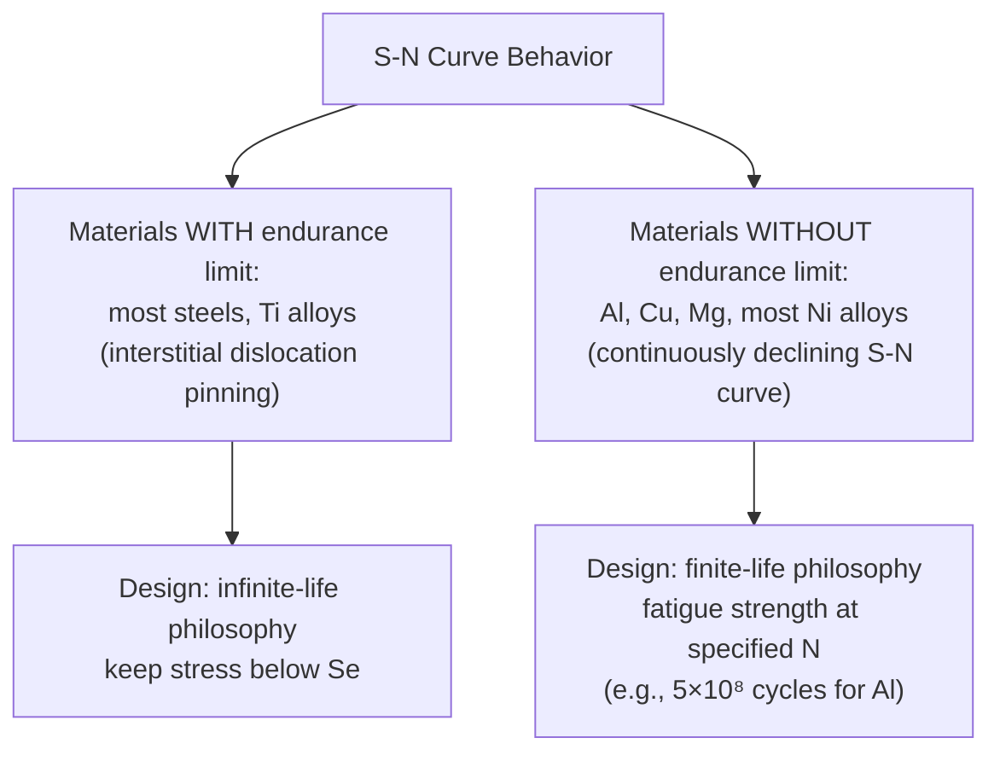
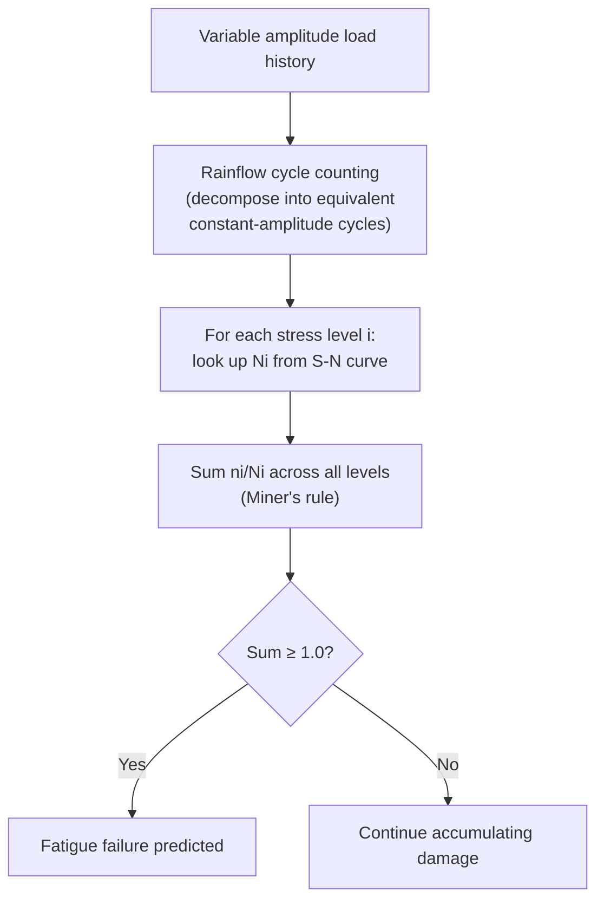
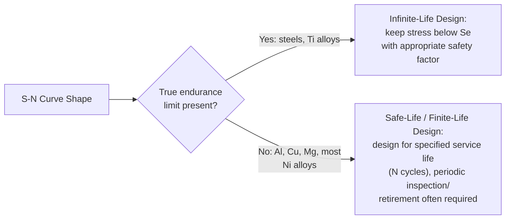

## S N Curves and the Endurance Limit

### Overview

The S-N curve (Stress versus Number of cycles to failure) is the foundational engineering tool for high-cycle, stress-controlled fatigue design. It plots the applied cyclic stress amplitude or stress range against the logarithm of the number of cycles to failure, established through systematic testing of nominally identical specimens across a range of stress levels. The **endurance limit** (or fatigue limit), where it exists, represents a stress amplitude below which a material can theoretically withstand an infinite number of load cycles without fatigue failure — a property of enormous practical design significance, particularly for rotating machinery and other components subjected to very large numbers of load cycles over their service life.

**Key Points**

- Governing standard: ASTM E466 (constant-amplitude axial fatigue testing), ASTM E468 (presentation of S-N data), ISO 1099.
- S-N curves are conventionally plotted with stress (S) on the linear or log y-axis and cycles to failure (N) on the log x-axis (semi-log or log-log format).
- Not all materials exhibit a true endurance limit; this distinction has profound implications for design philosophy (infinite-life vs. finite-life/damage-tolerant approaches).

---

### The S-N Testing Method

#### Specimen and Loading

Standard S-N testing (ASTM E466) uses smooth, polished, axially-loaded (or rotating-bending, per the classic R.R. Moore configuration) cylindrical specimens under fully-reversed or defined mean-stress cyclic loading. The rotating-bending machine remains historically significant and widely used for its simplicity: a specimen rotates while a fixed bending moment is applied, so any given point on the specimen surface experiences a fully-reversed sinusoidal stress cycle once per revolution.

**SVG Diagram: R.R. Moore Rotating-Bending Fatigue Test (svg_diagram)**

<svg xmlns="http://www.w3.org/2000/svg" viewBox="0 0 640 300" font-family="Arial, sans-serif">
<text x="320" y="24" text-anchor="middle" font-size="16" font-weight="bold">R.R. Moore Rotating-Bending Test (svg_diagram)</text>
<rect x="80" y="140" width="40" height="40" fill="none" stroke="black" stroke-width="2" />
<rect x="520" y="140" width="40" height="40" fill="none" stroke="black" stroke-width="2" />
<text x="70" y="200" font-size="11">Bearing</text>
<text x="510" y="200" font-size="11">Bearing</text>
<path d="M 120 160 Q 200 130 260 155 Q 320 175 380 155 Q 440 130 520 160" fill="none" stroke="black" stroke-width="4" />
<text x="250" y="120" font-size="11">Reduced-section gauge length (hourglass profile)</text>
<line x1="150" y1="90" x2="150" y2="230" stroke="red" stroke-width="1.5" stroke-dasharray="3,2" />
<text x="155" y="95" font-size="11" fill="red">Applied bending load (via weights)</text>
<line x1="490" y1="90" x2="490" y2="230" stroke="red" stroke-width="1.5" stroke-dasharray="3,2" />
<circle cx="300" cy="160" r="8" fill="black" />
<path d="M 300 152 A 8 8 0 1 1 292 160" fill="none" stroke="black" stroke-width="1.5" marker-end="url(#arrow)" />
<text x="315" y="163" font-size="11">Rotation (motor-driven)</text>
</svg>

#### Test Procedure

1. A statistically significant number of specimens (typically 12-24, though fewer are used for preliminary screening) are tested across a range of stress amplitudes.
2. Each specimen is cycled at a fixed stress amplitude until failure (fracture) or run-out (a predetermined maximum number of cycles, commonly $10^6$-$10^7$, at which the test is discontinued without failure).
3. The stress amplitude and corresponding cycle count at failure are recorded for each specimen and plotted.
4. A curve is fitted to the resulting data, typically using a log-linear or log-log Basquin-type relationship in the finite-life region.

**Key Points**

- Because fatigue life at a given stress level shows substantial inherent statistical scatter (often spanning an order of magnitude or more in $N_f$ at a fixed stress, due to microstructural variability in crack initiation), S-N data is fundamentally probabilistic; a single S-N curve typically represents a median (50% probability of failure) trend, and full design use requires statistical treatment (P-S-N curves at various survival probabilities).
- The staircase (up-and-down) method is a specialized statistical testing protocol specifically for efficiently determining the endurance limit and its standard deviation with a limited number of specimens, by adjusting the stress level of each subsequent specimen based on whether the previous specimen survived or failed at a fixed cycle count.

---

### The Basquin Relation

The finite-life region of the S-N curve (excluding the very-low-cycle, high-plastic-strain region where strain-based approaches are more appropriate) is well described by the **Basquin equation**:

$$\frac{\Delta\sigma}{2} = \sigma_a = \sigma_f'(2N_f)^b$$

where $\sigma_a$ is the stress amplitude, $\sigma_f'$ is the fatigue strength coefficient (approximately equal to the true fracture stress in monotonic tension for many metals), $2N_f$ is the number of load reversals to failure (one cycle = two reversals), and $b$ is the fatigue strength exponent (typically -0.05 to -0.12 for most engineering metals).

On a log-log plot, this relationship appears as a straight line:

$$\log \sigma_a = \log \sigma_f' + b\log(2N_f)$$

**SVG Diagram: Basquin S-N Relationship on Log-Log Axes (svg_diagram)**

<svg xmlns="http://www.w3.org/2000/svg" viewBox="0 0 620 380" font-family="Arial, sans-serif">
<text x="310" y="24" text-anchor="middle" font-size="16" font-weight="bold">S-N Curve: Basquin Relation (svg_diagram)</text>
<line x1="80" y1="330" x2="580" y2="330" stroke="black" stroke-width="2" />
<line x1="80" y1="330" x2="80" y2="50" stroke="black" stroke-width="2" />
<text x="500" y="355" font-size="13">log(N) — cycles to failure</text>
<text x="30" y="60" font-size="13">log(σa)</text>
<path d="M 110 90 L 500 260" fill="none" stroke="blue" stroke-width="2.5" />
<text x="150" y="130" font-size="12" fill="blue">Basquin: σa = σf'(2Nf)^b</text>
<line x1="500" y1="260" x2="580" y2="260" fill="none" stroke="blue" stroke-width="2.5" stroke-dasharray="5,3" />
<text x="510" y="250" font-size="11">Flattens: endurance limit (steel-like)</text>
<line x1="500" y1="260" x2="500" y2="330" stroke="gray" stroke-width="1" stroke-dasharray="3,2" />
<text x="440" y="345" font-size="11">~10⁶-10⁷ cycles</text>
<line x1="80" y1="260" x2="500" y2="260" stroke="red" stroke-width="1" stroke-dasharray="3,2" />
<text x="90" y="255" font-size="11" fill="red">Se (endurance limit)</text>
</svg>

**Key Points**

- The Basquin exponent $b$ correlates empirically with material ductility/hardening behavior: harder, higher-strength, lower-ductility materials tend toward the more negative (steeper) end of the typical range.
- The Basquin relation is generally applied only in the high-cycle, predominantly-elastic strain regime; at very low cycle counts (large plastic strains), the relation loses accuracy and the strain-life (Coffin-Manson) approach is preferred.

---

### The Endurance Limit Concept

#### Materials That Exhibit a True Endurance Limit

Many ferrous alloys (plain carbon and low-alloy steels) and titanium alloys exhibit a distinct "knee" in the S-N curve: below a certain stress amplitude, the curve becomes essentially horizontal, and specimens survive indefinitely (conventionally verified to $10^7$ or $10^8$ cycles as a practical "infinite life" criterion). This behavior is generally attributed to **dynamic strain aging / interstitial pinning of dislocations** — in BCC iron-based alloys, interstitial carbon and nitrogen atoms diffuse to and pin dislocations, effectively locking the microstructure against the cyclic microplasticity needed to nucleate a fatigue crack once stress amplitude drops below the pinning-resistance threshold.

**Typical Endurance Limit Correlations for Steel**

$$S_e' \approx 0.5\, S_{ut} \quad \text{(for } S_{ut} < 1400\text{ MPa, unmodified/idealized rotating-bending specimen)}$$

**[Inference]** This approximately 0.5 ratio is a widely used design rule-of-thumb derived from historical rotating-bending test databases on wrought steels; it is understood to saturate or become unreliable at very high ultimate strengths (above roughly 1400 MPa / 200 ksi), where the endurance limit tends to plateau or even decrease relative to this simple proportionality, reflecting increased sensitivity to surface and inclusion defects in high-strength, lower-ductility steels.

#### Materials Without a True Endurance Limit

Most non-ferrous alloys — notably aluminum, copper, magnesium, and most nickel-based alloys — do **not** exhibit a true, sharply-defined endurance limit. Their S-N curves continue to decline gradually (though at a decreasing rate) even beyond $10^7$-$10^8$ cycles, without ever becoming perfectly horizontal. For these materials, design practice instead uses a **fatigue strength at a specified number of cycles** (commonly the fatigue strength at $5\times10^8$ or $10^9$ cycles for aluminum alloys) rather than a true infinite-life endurance limit.

---

### Modification Factors for the Endurance Limit (Marin Equation)

The idealized laboratory endurance limit ($S_e'$), measured on a small, polished, notch-free specimen under fully-reversed rotating-bending load in a benign environment, must be corrected for real-world component conditions using the **Marin equation**:

$$S_e = k_a k_b k_c k_d k_e k_f S_e'$$

| Factor | Symbol | Accounts For |
| --- | --- | --- |
| Surface finish factor | $k_a$ | Rougher surfaces (as-forged, machined, hot-rolled) provide more crack initiation sites than the mirror-polished laboratory specimen |
| Size factor | $k_b$ | Larger cross-sections have greater surface area/volume exposed to peak stress, statistically increasing the probability of encountering a critical flaw |
| Load factor | $k_c$ | Accounts for differences between rotating-bending, axial, and torsional loading modes |
| Temperature factor | $k_d$ | Elevated temperature generally reduces fatigue strength; some materials show anomalous behavior at intermediate temperatures |
| Reliability factor | $k_e$ | Adjusts the median endurance limit downward to achieve a specified statistical survival probability, based on the known standard deviation of fatigue data |
| Miscellaneous-effects factor | $k_f$ | Residual stress, corrosion, plating, fretting, and other application-specific effects not captured by the other factors |

**Example**

A steel shaft with $S_{ut} = 900$ MPa is to operate in fully-reversed bending. The idealized endurance limit is estimated as $S_e' = 0.5 \times 900 = 450$ MPa. Applying typical correction factors for a machined surface finish ($k_a \approx 0.75$), a moderate shaft diameter ($k_b \approx 0.85$), rotating-bending load mode ($k_c = 1.0$), room temperature ($k_d = 1.0$), and 99% reliability ($k_e \approx 0.81$):

$$S_e = 0.75 \times 0.85 \times 1.0 \times 1.0 \times 0.81 \times 450 \approx 232\ \text{MPa}$$

This corrected value (roughly half the idealized laboratory endurance limit) illustrates why naive use of textbook $0.5\,S_{ut}$ ratios without applying appropriate correction factors is a common and significant source of unconservative fatigue design error.

**[Inference]** The specific numerical values of Marin-type correction factors are empirically derived and vary somewhat between different design handbooks and standards; practicing engineers should consult the specific correction curves/tables appropriate to their governing design code rather than treating the illustrative values above as universal constants.

---

### Effect of Mean Stress

Real components frequently experience cyclic loading superimposed on a non-zero mean stress, rather than the fully-reversed ($R = -1$) condition of standard laboratory S-N testing. Since tensile mean stress reduces fatigue life (and compressive mean stress can improve it), several empirical mean-stress correction models are used to construct a **constant-life diagram** relating alternating stress ($\sigma_a$), mean stress ($\sigma_m$), the endurance limit ($S_e$), and the ultimate/yield strength:

$$\text{Goodman: } \frac{\sigma_a}{S_e} + \frac{\sigma_m}{S_{ut}} = 1$$

$$\text{Gerber: } \frac{\sigma_a}{S_e} + \left(\frac{\sigma_m}{S_{ut}}\right)^2 = 1$$

$$\text{Soderberg: } \frac{\sigma_a}{S_e} + \frac{\sigma_m}{S_y} = 1$$

**SVG Diagram: Constant-Life (Haigh) Diagram (svg_diagram)**

<svg xmlns="http://www.w3.org/2000/svg" viewBox="0 0 600 380" font-family="Arial, sans-serif">
<text x="300" y="24" text-anchor="middle" font-size="16" font-weight="bold">Haigh Diagram: Mean Stress Effect (svg_diagram)</text>
<line x1="70" y1="320" x2="560" y2="320" stroke="black" stroke-width="2" />
<line x1="70" y1="320" x2="70" y2="50" stroke="black" stroke-width="2" />
<text x="500" y="345" font-size="13">Mean Stress σm</text>
<text x="20" y="60" font-size="13">Alternating σa</text>
<line x1="70" y1="90" x2="530" y2="320" stroke="red" stroke-width="2" />
<text x="380" y="240" font-size="11" fill="red">Goodman (linear)</text>
<path d="M 70 90 Q 300 100 500 320" fill="none" stroke="green" stroke-width="2" />
<text x="300" y="150" font-size="11" fill="green">Gerber (parabolic)</text>
<line x1="70" y1="90" x2="350" y2="320" stroke="blue" stroke-width="2" />
<text x="180" y="220" font-size="11" fill="blue">Soderberg (conservative)</text>
<text x="75" y="85" font-size="11">Se</text>
<text x="345" y="335" font-size="11">Sy</text>
<text x="525" y="335" font-size="11">Sut</text>
<text x="150" y="290" font-size="10">Safe region (below curve)</text>
</svg>

**Key Points**

- Soderberg is the most conservative (using yield strength as the limiting mean-stress intercept), Gerber the least conservative (often fits ductile metal experimental data best for tensile mean stress but is non-conservative for compressive mean stress and can be unsafe if misapplied), and Goodman occupies an intermediate, widely-used position, valued for its mathematical simplicity (a straight line) and generally adequate conservatism for design purposes.
- Compressive mean stress is generally beneficial to fatigue life; most design mean-stress diagrams are only strictly valid for tensile (positive) mean stress, and some practitioners simply cap the diagram at $\sigma_m = 0$ (ignoring potential benefit) for conservative design.

---

### Notch Effects and the Fatigue Notch Factor

Geometric stress concentrations (fillets, holes, grooves) reduce fatigue strength, but typically by less than the theoretical elastic stress concentration factor ($K_t$) would predict, because of **notch sensitivity** — the material's actual ability to redistribute stress via localized microplasticity near the notch root. This is captured by the **fatigue notch factor**:

$$K_f = 1 + q(K_t - 1)$$

where $q$ is the notch sensitivity index (0 for no sensitivity, 1 for full theoretical sensitivity, $K_f = K_t$). Notch sensitivity generally increases with material strength/hardness and decreases with larger notch root radius, reflecting the reduced local plasticity available in higher-strength materials to blunt the effective stress concentration.

---

### Cumulative Damage and Variable Amplitude Loading

Real service loading is rarely constant-amplitude. The **Palmgren-Miner linear damage rule** is the standard (though approximate) method for combining fatigue damage from a variable-amplitude load spectrum, using the S-N curve as its foundation:

$$\sum_{i} \frac{n_i}{N_i} = D$$

where $n_i$ is the number of cycles applied at stress level $i$, $N_i$ is the S-N-curve life at that stress level, and failure is predicted when the cumulative damage sum $D$ reaches 1.0 (though experimentally, failure has been observed across a range from roughly 0.3 to 3.0 depending on load sequence effects, making Miner's rule a useful engineering approximation rather than an exact physical law).

**[Inference]** Load sequence effects (e.g., an occasional high-tensile overload inducing beneficial compressive residual stress and crack growth retardation, versus a compressive overload having little such benefit) are well documented to cause Miner's rule to deviate from actual observed life in either direction; more sophisticated nonlinear damage accumulation models exist in the literature, though linear Miner's rule remains the dominant approach in general design practice due to its simplicity and adequate accuracy for many applications.

---

### Design Philosophy Implications

This fundamental distinction drives materially different design and maintenance philosophies: aircraft aluminum structure, lacking a true endurance limit, requires either a defined, conservative service life limit or a damage-tolerant (fracture mechanics-based, fail-safe/inspection-based) approach, whereas a steel shaft designed to operate below its corrected endurance limit can, in principle, be designed for genuinely unlimited service life under constant-amplitude conditions.

---

**Next Steps / Related Topics**

- Fatigue Failure Mechanisms and Fracture Surface Analysis
- Strain-Life (Coffin-Manson) Approach for Low-Cycle Fatigue
- Fatigue Crack Growth and Paris' Law (ASTM E647)
- Marin Equation and Surface/Size Correction Factors in Detail
- Notch Sensitivity and the Fatigue Notch Factor
- Rainflow Cycle Counting for Variable-Amplitude Loading
- Palmgren-Miner Cumulative Damage Rule and Its Limitations
- Very-High-Cycle Fatigue and Subsurface Initiation Mechanisms
- Statistical Treatment of Fatigue Data (P-S-N Curves, Staircase Method)
- Shot Peening and Surface Treatments for Endurance Limit Improvement