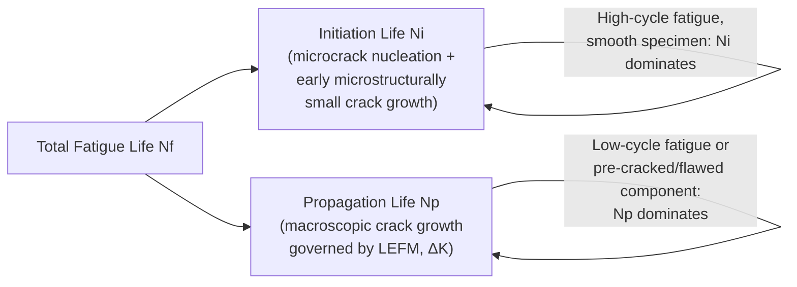
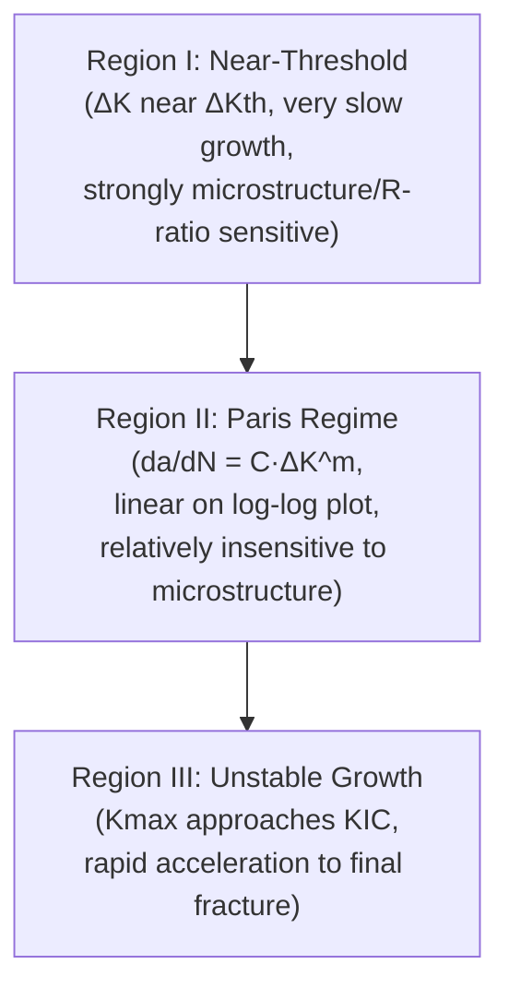
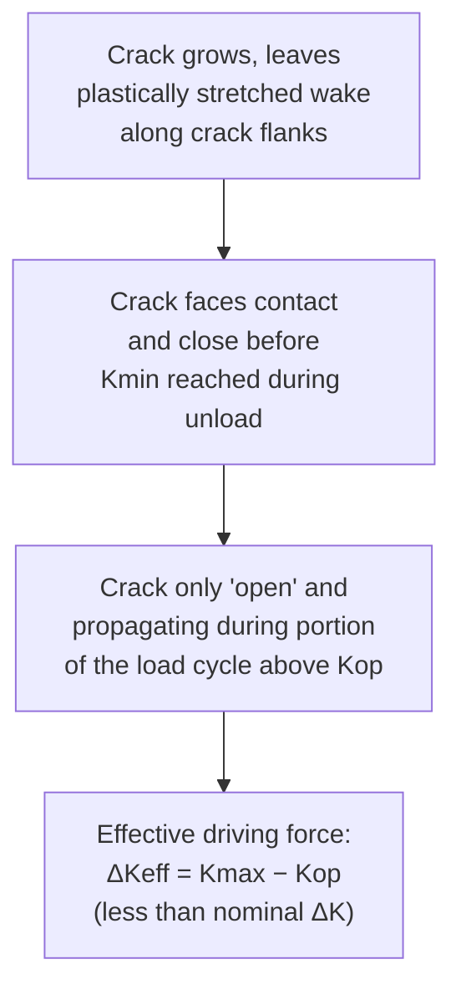
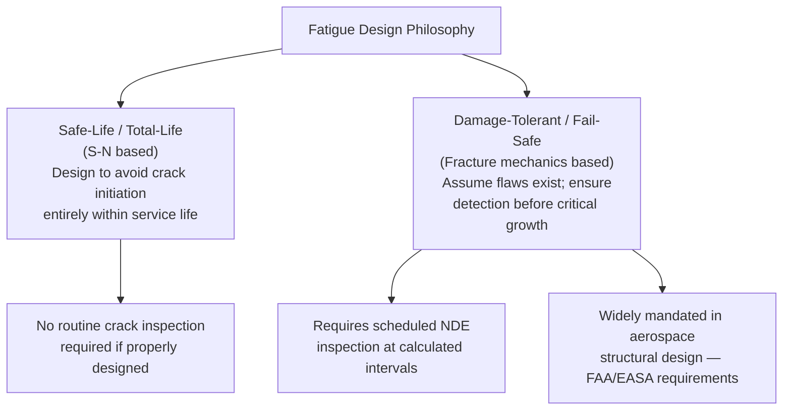

## Crack Initiation and Propagation

### Overview

Crack initiation and propagation describes the sequential, mechanistically distinct phases by which a fatigue crack forms and grows under cyclic loading, and — critically — the engineering framework (linear elastic fracture mechanics applied to fatigue) used to quantitatively predict the rate of crack growth once a crack exists. While the S-N approach treats fatigue life as a single lumped quantity, the crack initiation/propagation framework explicitly separates life into an **initiation life** ($N_i$) and a **propagation life** ($N_p$), enabling damage-tolerant design philosophies that account for the presence of pre-existing flaws or that permit safe operation with detectable cracks.

**Key Points**

- Total fatigue life: $N_f = N_i + N_p$, with the relative proportion strongly dependent on stress level, component geometry, and material.
- Governing standard for crack growth rate testing: ASTM E647; governing law: Paris' Law (and its extensions).
- The initiation/propagation split underlies two competing (and often combined) design philosophies: safe-life (design to avoid initiation) and damage-tolerant/fail-safe (design to tolerate propagating cracks between inspections).

---

### The Initiation-Propagation Life Split

The relative split depends heavily on context:

- **Smooth, defect-free components under high-cycle fatigue**: Initiation life often constitutes 80-95%+ of total life, since nucleating a crack from an initially flaw-free surface under nominally elastic bulk stress requires many cycles of localized microplasticity.
- **Components with pre-existing flaws** (welds, castings, forging defects, in-service damage): Initiation life may be negligible or near-zero — a crack-like defect effectively already exists, and total life is essentially all propagation life.
- **Low-cycle fatigue**: Gross plasticity readily nucleates cracks at multiple sites early in life; propagation dominates the cycle count.

---

### Crack Initiation Mechanisms

#### Microstructurally Small Crack Growth

Crack initiation is not a single instantaneous event but itself comprises sub-stages, often described using the concept of **microstructurally small cracks (MSC)**:

1. **Stage 0**: Cyclic microplasticity accumulates at a stress/strain concentrator (persistent slip band, inclusion, surface defect) without yet forming a discrete crack.
2. **Stage I (microcrack nucleation and early growth)**: A crack forms and initially grows along the crystallographic slip plane of maximum shear stress, typically confined within a single grain or a few grains.
3. **Transition to Stage II**: As the crack grows past the first few grain boundaries, it reorients to grow perpendicular to the maximum principal (tensile) stress, and continuum (LEFM-based) crack growth mechanics begins to apply with reasonable accuracy.

**Key Points**

- Microstructurally small cracks often exhibit anomalous growth behavior relative to what standard LEFM (Paris' Law) would predict — sometimes growing faster than expected at low nominal $\Delta K$ (because a single, favorably-oriented grain offers little resistance), and sometimes decelerating or arresting entirely at microstructural barriers such as grain boundaries, which act as effective "walls" against slip transmission.
- This anomalous small-crack behavior is a well-documented departure from long-crack LEFM similitude and is a major source of non-conservatism if long-crack Paris data is naively applied to predict short-crack growth rates near the fatigue limit; specialized small-crack growth models (e.g., based on the Hobson-Navarro-de los Rios or Hall-Petch-type barrier concepts) have been developed to address this in the technical literature.

---

### The Fatigue Crack Growth Rate Curve and Paris' Law

#### Fracture Mechanics Framework for Fatigue

Once a crack is large enough for continuum LEFM to apply (typically a few grain diameters or more), crack growth per cycle can be correlated with the **stress intensity factor range**:

$$\Delta K = K_{max} - K_{min} = Y\Delta\sigma\sqrt{\pi a}$$

where $\Delta\sigma$ is the applied stress range and $Y$ is the geometry factor. The fundamental empirical relationship, established by Paris and Erdogan (1963), is that the crack growth rate per cycle, $da/dN$, correlates strongly and consistently with $\Delta K$ across widely varying specimen geometries and loading configurations — this is the **similitude principle** underlying essentially all fatigue crack growth analysis.

#### Paris' Law

In the mid-growth-rate region, $da/dN$ versus $\Delta K$ follows a power-law relationship on a log-log plot:

$$\frac{da}{dN} = C(\Delta K)^m$$

where $C$ and $m$ are material constants determined experimentally (typically $m \approx 2$-4 for metals, though the range extends well beyond this for some material classes).

#### The Full da/dN vs. ΔK Curve — Three Regions

**SVG Diagram: Fatigue Crack Growth Rate Curve (svg_diagram)**

<svg xmlns="http://www.w3.org/2000/svg" viewBox="0 0 640 400" font-family="Arial, sans-serif">
<text x="320" y="24" text-anchor="middle" font-size="16" font-weight="bold">da/dN vs. ΔK Curve (Three Regions) (svg_diagram)</text>
<line x1="80" y1="350" x2="580" y2="350" stroke="black" stroke-width="2" />
<line x1="80" y1="350" x2="80" y2="50" stroke="black" stroke-width="2" />
<text x="500" y="375" font-size="13">log(ΔK)</text>
<text x="20" y="60" font-size="13">log(da/dN)</text>
<path d="M 150 340 C 180 320, 200 260, 230 220" fill="none" stroke="blue" stroke-width="2.5" />
<path d="M 230 220 L 420 130" fill="none" stroke="blue" stroke-width="2.5" />
<path d="M 420 130 C 460 105, 490 80, 510 60" fill="none" stroke="blue" stroke-width="2.5" />
<line x1="150" y1="350" x2="150" y2="340" stroke="red" stroke-width="1.5" stroke-dasharray="3,2" />
<text x="100" y="335" font-size="11" fill="red">ΔKth (threshold)</text>
<line x1="510" y1="350" x2="510" y2="60" stroke="gray" stroke-width="1" stroke-dasharray="3,2" />
<text x="515" y="345" font-size="11" fill="gray">Kmax → KIC</text>
<text x="150" y="290" font-size="12">Region I:</text>
<text x="150" y="304" font-size="10">threshold, near- threshold behavior, microstructure- sensitive</text>
<text x="270" y="170" font-size="12">Region II:</text>
<text x="270" y="184" font-size="10">Paris regime, da/dN = C(ΔK)^m, power-law linear on log-log</text>
<text x="430" y="100" font-size="12">Region III:</text>
<text x="430" y="114" font-size="10">unstable, rapid growth as Kmax→KIC</text>
</svg>

| Region | Characteristics | Governing Influences |
| --- | --- | --- |
| I (Near-threshold) | Very low growth rates (often <$10^{-10}$ m/cycle); strong sensitivity to microstructure, R-ratio, and environment; crack closure effects are most significant here | Grain size, microstructure, crack closure, environment |
| II (Paris/power-law) | Linear on log-log plot; relatively insensitive to microstructure; the primary region used for damage-tolerant life prediction | Elastic modulus, general alloy class; relatively microstructure-insensitive |
| III (Unstable/fast fracture) | Rapid acceleration as $K_{max} \to K_{IC}$; static/monotonic fracture mechanisms increasingly contribute | Fracture toughness $K_{IC}$, microstructure controlling static fracture resistance |

**Key Points**

- The **fatigue crack growth threshold**, $\Delta K_{th}$, is the stress intensity factor range below which crack growth is negligible (analogously to the endurance limit in S-N testing, though $\Delta K_{th}$ is generally more strongly R-ratio dependent).
- Region II Paris behavior is remarkably consistent across different specimen geometries and loading configurations for a given material/environment/R-ratio combination — this geometry-independence is the practical foundation that makes fracture-mechanics-based fatigue life prediction possible.

---

### Extensions to Paris' Law

#### Forman Equation (Accounting for R-Ratio and Fracture Toughness)

$$\frac{da}{dN} = \frac{C(\Delta K)^m}{(1-R)K_{IC} - \Delta K}$$

The Forman equation explicitly incorporates the stress ratio $R = K_{min}/K_{max}$ and captures the accelerating Region III behavior as $K_{max}$ approaches $K_{IC}$, which the basic Paris equation does not address.

#### NASGRO / Generalized Sigmoidal Equations

Widely used in aerospace damage-tolerance analysis, these more comprehensive equations (implemented in tools such as NASGRO and AFGROW) incorporate threshold behavior, R-ratio effects, and the approach to fracture toughness in a single closed-form expression, typically of the general sigmoidal form:

$$\frac{da}{dN} = C\left[\left(\frac{1-f}{1-R}\right)\Delta K\right]^m \frac{\left(1 - \frac{\Delta K_{th}}{\Delta K}\right)^p}{\left(1 - \frac{K_{max}}{K_{crit}}\right)^q}$$

where $f$ is a crack-closure function and $p$, $q$ are curve-fitting exponents controlling the sharpness of the threshold and critical-toughness knee regions respectively.

---

### Crack Closure

**Plasticity-induced crack closure**, identified by Elber (1970), is one of the most significant phenomena explaining apparent anomalies in fatigue crack growth behavior, particularly R-ratio effects. As a fatigue crack grows, it leaves behind a wake of residual plastically-stretched material along its flanks. This plastic wake causes the crack faces to contact and close before the applied load reaches zero (or even before $K_{min}$ during unloading), meaning the crack is only truly "open" and able to propagate during a portion of the loading cycle.

$$\Delta K_{eff} = K_{max} - K_{op}$$

where $K_{op}$ is the stress intensity at which the crack fully opens (generally $K_{op} > K_{min}$ for positive $R$-ratios). Since only the effective (open-crack) portion of the loading cycle contributes to crack advance, using $\Delta K_{eff}$ rather than the nominal applied $\Delta K$ substantially improves growth-rate correlation, particularly explaining why crack growth rate increases with increasing $R$-ratio at a fixed nominal $\Delta K$ (higher $R$-ratio means $K_{min}$ is higher, keeping the crack open for more of the cycle, closer to $\Delta K_{eff} \approx \Delta K$).

**Key Points**

- Other closure mechanisms exist beyond plasticity-induced closure: **oxide-induced closure** (corrosion product wedging crack faces apart, particularly significant in near-threshold, low-$\Delta K$ growth), **roughness-induced closure** (crack face mismatch from a tortuous, mixed-mode crack path causing premature contact), and **fluid-induced closure** (viscous fluid trapped in the crack wedge).
- Crack closure is a primary (though not exclusive) explanation for the **overload retardation effect**: a single tensile overload cycle applied during otherwise constant-amplitude loading creates an enlarged plastic zone and residual compressive stress ahead of the crack tip, temporarily slowing (retarding) or even arresting subsequent crack growth — a phenomenon of major practical significance for variable-amplitude/spectrum fatigue life prediction (and the physical basis for several retardation models used in software such as AFGROW, e.g., the Wheeler and Willenborg models).

---

### Threshold Behavior and Its Practical Significance

$$\Delta K_{th} \approx A(1-R)^\gamma \quad \text{(empirical form, various models)}$$

The threshold $\Delta K_{th}$ generally decreases as the R-ratio increases (less closure effect at higher $R$), asymptotically approaching an "intrinsic" threshold value at high $R$-ratio where closure effects are largely eliminated. Determining $\Delta K_{th}$ (per ASTM E647, typically using a load-shedding test procedure to approach threshold from higher $\Delta K$) is critical for establishing safe design stresses for components containing small, non-propagating flaws — a key input to damage-tolerant fatigue design and inspection interval determination.

---

### Fatigue Life Prediction by Integration of Paris' Law

For damage-tolerant design, the propagation life from an initial (often assumed or NDE-detectable) crack size $a_i$ to a critical (final fracture) crack size $a_c$ is obtained by integrating the crack growth law:

$$N_p = \int_{a_i}^{a_c} \frac{da}{C(\Delta K)^m}$$

For the simplified case of a constant geometry factor $Y$ and $m \neq 2$:

$$N_p = \frac{a_i^{1-m/2} - a_c^{1-m/2}}{C(Y\Delta\sigma\sqrt{\pi})^m (m/2 - 1)}$$

**Example**

Consider a component with an initial detectable flaw of $a_i = 1$ mm, a critical crack size $a_c = 15$ mm (determined from $K_{IC}$ and applied stress), a constant stress range $\Delta\sigma = 150$ MPa, geometry factor $Y = 1.0$, and material constants $C = 5\times10^{-12}$ (m/cycle, MPa√m units) and $m = 3$. The propagation life is estimated by numerically or analytically integrating the Paris relationship over this crack growth range — in practice, this integral is dominated by the early portion of crack growth for typical Paris exponents ($m > 2$), meaning most of the propagation life is actually consumed while the crack is still relatively small, and the final stages of rapid growth toward $a_c$ contribute comparatively little additional life. This integration forms the basis of inspection interval determination in damage-tolerant design: the calculated propagation life (with an appropriate safety factor, often a fraction such as one-half of the calculated life) sets the maximum allowable interval between scheduled inspections, ensuring a crack cannot grow from below the non-destructive inspection detection threshold to critical size between two inspections.

---

### Total Life vs. Damage-Tolerant Design Philosophies

**[Inference]** The choice between safe-life and damage-tolerant philosophies is generally industry- and application-specific: aerospace primary structure has predominantly moved toward mandatory damage-tolerant design and inspection programs (following historical safe-life failures such as the Comet aircraft), while many other industries (e.g., certain rotating machinery, consumer products) continue to rely primarily on safe-life/infinite-life S-N design where practical inspection access or economic considerations make damage tolerance less attractive.

---

**Next Steps / Related Topics**

- Fatigue Failure Mechanisms and Fracture Surface Analysis
- S-N Curves and the Endurance Limit
- Fatigue Crack Growth Testing (ASTM E647) and Threshold Determination
- Crack Closure Mechanisms: Plasticity, Oxide, and Roughness-Induced
- Retardation Models for Variable-Amplitude Loading (Wheeler, Willenborg)
- Damage-Tolerant Design and Inspection Interval Determination
- Small/Short Crack Growth Behavior and LEFM Similitude Limitations
- Fracture Toughness Testing and Its Role in Region III Growth
- NASGRO and AFGROW Software for Crack Growth Life Prediction
- Environmentally Assisted Fatigue Crack Growth