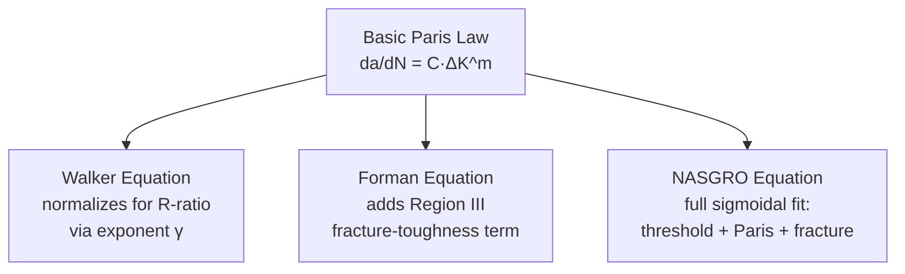

## Paris Law and Fatigue Crack Growth


### Overview

Paris' Law is the foundational empirical relationship in fracture-mechanics-based fatigue analysis, correlating the rate of fatigue crack growth per loading cycle with the applied stress intensity factor range. Formulated by Paul Paris and Fazil Erdogan in 1963, it established that crack propagation could be treated as a materials-science problem governed by a single crack-tip driving-force parameter — a conceptual breakthrough that transformed fatigue from an empirical, whole-life curve-fitting exercise (S-N approach) into a mechanistic, geometry-transferable predictive framework, and remains the central working tool of damage-tolerant design across aerospace, pressure vessel, offshore, and civil infrastructure engineering.

**Key Points**

- Governing standard: ASTM E647 (Standard Test Method for Measurement of Fatigue Crack Growth Rates).
- Core relationship: $da/dN = C(\Delta K)^m$, valid primarily in the mid-range (Region II, "Paris regime") of the crack growth curve.
- The law's foundational assumption — the similitude principle — is that $\Delta K$ alone (independent of specimen geometry or absolute crack/specimen size) governs crack growth rate for a given material, environment, and R-ratio.

---

### Historical and Conceptual Basis

#### The Similitude Principle

Before Paris and Erdogan's work, fatigue crack growth was treated largely empirically, with growth rate curves specific to each tested geometry. The key conceptual advance was recognizing that the stress intensity factor $K$ — already established in Griffith/Irwin LEFM as governing the crack-tip stress and strain fields under monotonic loading — should similarly govern the crack-tip conditions (and hence the increment of damage per cycle) under cyclic loading, regardless of the specific combination of applied stress and crack length that produced that $\Delta K$ value.

$$\Delta K = K_{max} - K_{min} = Y(a/W)\,\Delta\sigma\sqrt{\pi a}$$

This similitude means that two very different components — a small laboratory compact-tension specimen and a large pressure vessel nozzle — will exhibit the *same* local crack growth rate $da/dN$ if they experience the same $\Delta K$, enabling laboratory-generated $da/dN$ vs. $\Delta K$ data to be applied directly to structural life prediction via the appropriate geometry factor $Y$.

**[Inference]** The similitude assumption is well-validated for long (macroscopic) cracks under predominantly linear-elastic, small-scale-yielding conditions; it is known to break down for microstructurally small cracks (see crack initiation/propagation literature) and can require correction for significant crack closure, large-scale plasticity, or strongly variable-amplitude loading histories, though it remains a highly serviceable engineering approximation across the great majority of practical fatigue crack growth applications.

---

### The Paris Equation

$$\frac{da}{dN} = C(\Delta K)^m$$

- $a$: crack length
- $N$: number of load cycles
- $\Delta K$: stress intensity factor range (units typically MPa√m or ksi√in)
- $C$: material/environment/R-ratio-dependent scaling constant (units depend on $m$; dimensionally awkward, since $C$ absorbs the units needed to balance the equation)
- $m$: the Paris exponent (slope of the log-log line), typically 2-4 for most structural metals, though it can range more broadly for polymers, ceramics, and composites

On a log-log plot of $da/dN$ versus $\Delta K$, the equation appears as a straight line over the Region II portion of the crack growth curve:

$$\log\left(\frac{da}{dN}\right) = \log C + m \log(\Delta K)$$

**SVG Diagram: Paris Law Log-Log Fit (svg_diagram)**

<svg xmlns="http://www.w3.org/2000/svg" viewBox="0 0 620 380" font-family="Arial, sans-serif">
<text x="310" y="24" text-anchor="middle" font-size="16" font-weight="bold">Paris' Law: Log-Log Linear Fit (svg_diagram)</text>
<line x1="80" y1="330" x2="580" y2="330" stroke="black" stroke-width="2" />
<line x1="80" y1="330" x2="80" y2="50" stroke="black" stroke-width="2" />
<text x="500" y="355" font-size="13">log(ΔK)</text>
<text x="30" y="60" font-size="13">log(da/dN)</text>
<line x1="150" y1="290" x2="480" y2="100" stroke="blue" stroke-width="2.5" />
<circle cx="180" cy="270" r="4" fill="blue" />
<circle cx="230" cy="240" r="4" fill="blue" />
<circle cx="290" cy="200" r="4" fill="blue" />
<circle cx="350" cy="165" r="4" fill="blue" />
<circle cx="410" cy="130" r="4" fill="blue" />
<text x="200" y="150" font-size="12">slope = m</text>
<line x1="230" y1="240" x2="290" y2="240" stroke="gray" stroke-width="1" stroke-dasharray="2,2" />
<line x1="290" y1="240" x2="290" y2="200" stroke="gray" stroke-width="1" stroke-dasharray="2,2" />
<text x="240" y="255" font-size="10" fill="gray">Δlog(ΔK)</text>
<text x="296" y="220" font-size="10" fill="gray">Δlog(da/dN)</text>
<text x="150" y="315" font-size="11">intercept: log(C)<br />at ΔK = 1</text>
</svg>

**Key Points**

- $C$ and $m$ are typically strongly correlated in practice (a numerical/statistical artifact of the fitting procedure combined with real physical trends) — materials with a lower $m$ tend to require a correspondingly higher $C$ to fit the same data range, so the two constants should always be reported and used together, never mixed between different data sets.
- Because the relationship is exponential in $\Delta K$, small increases in stress range produce disproportionately large increases in crack growth rate — a critical practical consequence for structures subjected to occasional overload cycles or stress concentration.

---

### Determining C and m: Test Procedure (ASTM E647)

1. A fatigue-pre-cracked, standard specimen (C(T) or M(T) most common) is instrumented with a crack-length measurement method — typically a **compliance-based clip gauge** (crack length inferred from elastic compliance) or a **DC/AC potential drop** technique (crack length inferred from electrical resistance change across the crack plane).
2. The specimen is cycled at constant or systematically varying load amplitude, and crack length versus cycle count ($a$ vs. $N$) data is recorded continuously or at regular intervals.
3. The $a$-$N$ data is numerically differentiated (using a secant or incremental polynomial method per E647) to obtain $da/dN$ at each crack length.
4. The corresponding $\Delta K$ is computed at each point using the specimen's standard compliance/stress-intensity function.
5. $da/dN$ versus $\Delta K$ is plotted on log-log axes; a straight-line regression through the Region II data yields $C$ (the anti-log of the intercept) and $m$ (the slope).

#### Load-Shedding vs. Constant-Amplitude Testing

- **Constant $K_{max}$ or constant-amplitude testing**: straightforward, generates mid-to-high $\Delta K$ (Region II/III) data efficiently but is inefficient for reaching very low $\Delta K$ (near-threshold, Region I) since crack growth becomes extremely slow.
- **Load-shedding (K-decreasing) testing**: load amplitude is progressively and gradually reduced as the crack grows (following a normalized K-gradient, typically negative, to avoid excessive crack-tip plastic-history/retardation artifacts), allowing efficient approach to the near-threshold regime and determination of $\Delta K_{th}$ within a single test.

```mermaid
flowchart TD
    A[Fatigue pre-crack C(T)/M(T) specimen] --> B[Mount crack-length<br/>monitoring: compliance or<br/>potential-drop method]
    B --> C{Test objective?}
    C -->|"Mid-to-high ΔK<br/>(Region II/III)"| D["Constant-amplitude or<br/>constant-Kmax testing"]
    C -->|"Near-threshold<br/>(Region I, ΔKth)"| E["Load-shedding<br/>(K-decreasing) testing"]
    D --> F[Record a vs. N data]
    E --> F
    F --> G[Numerically differentiate<br/>to obtain da/dN]
    G --> H[Compute ΔK at each point<br/>via geometry function]
    H --> I[Fit log(da/dN) vs. log(ΔK)<br/>→ extract C and m]
```

---

### Influence of Stress Ratio (R)

$$R = \frac{K_{min}}{K_{max}} = \frac{\sigma_{min}}{\sigma_{max}}$$

At a fixed $\Delta K$, crack growth rate generally **increases** with increasing $R$-ratio, an effect most pronounced in Regions I and III and comparatively modest (though still present) in Region II for many materials. This is primarily attributed to **crack closure**: at higher $R$ (higher $K_{min}$), the crack spends a larger fraction of the loading cycle in the open state, so the nominal $\Delta K$ more closely equals the effective, crack-tip-active driving force $\Delta K_{eff}$.

$$\Delta K_{eff} = K_{max} - K_{op} \leq \Delta K$$

Because closure effects diminish (or saturate) at high $R$-ratio, the near-threshold $\Delta K_{th}$ decreases as $R$ increases, converging toward an "intrinsic" (closure-free) threshold value at sufficiently high $R$ (commonly $R \geq 0.7$-0.8 for many metals).

**Key Points**

- ASTM E647 requires reporting the $R$-ratio alongside any $C$, $m$, and $\Delta K_{th}$ values, since these constants are not transferable between significantly different $R$-ratios without an appropriate correction model (e.g., Walker or Forman equations, see below).
- Negative $R$-ratios (compression-tension cycling) are typically handled by convention as $\Delta K = K_{max} - 0$ (i.e., the compressive portion of the cycle is often assumed not to contribute to crack-tip driving force, since a fully closed crack cannot sustain a stress-intensity singularity in compression) — though this convention and its accuracy is material- and geometry-dependent.

---

### Extensions and Corrections to Basic Paris' Law

#### Walker Equation (R-Ratio Normalization)

$$\frac{da}{dN} = C\left[(1-R)^{1-\gamma}\Delta K\right]^m$$

where $\gamma$ is an empirical material constant (0 ≤ γ ≤ 1) capturing the material's sensitivity to $R$-ratio; $\gamma = 1$ recovers the basic $R$-independent Paris equation, while lower $\gamma$ values indicate stronger $R$-ratio sensitivity.

#### Forman Equation (Region III Behavior Included)

$$\frac{da}{dN} = \frac{C(\Delta K)^m}{(1-R)K_C - \Delta K}$$

Captures the accelerating growth rate as $K_{max}$ approaches the material's fracture toughness $K_C$ (or $K_{IC}$), which the basic Paris law — valid only in the linear Region II — does not represent.

#### NASGRO Equation (Full Sigmoidal Curve, Threshold to Fracture)

$$\frac{da}{dN} = C\left[\left(\frac{1-f}{1-R}\right)\Delta K\right]^m \frac{(1-\Delta K_{th}/\Delta K)^p}{(1-K_{max}/K_{crit})^q}$$

Widely implemented in aerospace and pressure-vessel damage-tolerance codes (NASGRO, AFGROW), this single closed-form expression spans all three growth regions (threshold, Paris, and fast fracture), with $f$ a semi-empirical crack-opening function (Newman's closure model) and $p$, $q$ controlling the sharpness of the threshold and toughness "knees" respectively.



---

### Integrating Paris' Law for Life Prediction

For a component with an assumed or NDE-detected initial flaw $a_0$, growing to a critical size $a_c$ under a constant-amplitude stress range $\Delta \sigma$, the number of cycles to reach $a_c$ is:

$$N = \int_{a_0}^{a_c} \frac{da}{C\left[Y(a)\,\Delta\sigma\sqrt{\pi a}\right]^m}$$

For the simplified case of a geometry-independent $Y$ (constant) and $m \neq 2$, this integrates in closed form:

$$N = \frac{a_0^{(1-m/2)} - a_c^{(1-m/2)}}{C\left(Y\Delta\sigma\sqrt{\pi}\right)^m\left(\frac{m}{2}-1\right)}$$

For variable-geometry-factor cases (most real components, where $Y$ depends on $a/W$), or for variable-amplitude loading, the integral is generally evaluated numerically (incrementally stepping $\Delta a$ and recalculating $\Delta K$, $Y$, and $da/dN$ at each step) — the standard approach implemented in fracture mechanics life-prediction software.

**Example**

A pressure vessel nozzle contains a surface crack detected by ultrasonic inspection at $a_0 = 2$ mm depth. The critical crack depth (based on the material's $K_{IC}$ and the applied stress) is calculated as $a_c = 12$ mm. Using representative Paris constants for the vessel steel ($C = 3\times10^{-12}$, $m = 3.2$, MPa√m/SI units), a constant operating stress range $\Delta\sigma = 100$ MPa, and a surface-crack geometry factor $Y \approx 1.12$ (accounting for the free-surface correction), numerical integration of the Paris equation from $a_0$ to $a_c$ yields the predicted number of pressurization cycles to failure. Because $m > 2$, the integral is dominated by the slower growth occurring at smaller crack sizes; the crack spends the great majority of its calculated propagation life growing from 2 mm to perhaps 8-9 mm, with the final few millimeters of growth to $a_c$ consuming comparatively few cycles. This asymmetry is the physical basis for setting inspection intervals conservatively shorter than the full calculated propagation life — typically at a defined fraction (e.g., one-half) of the predicted cycles to reach $a_c$, ensuring at least one additional inspection opportunity occurs while the crack is still well below critical size.

---

### Effect of Microstructure and Environment on C and m

| Influence | Typical Effect on Paris Behavior |
| --- | --- |
| Grain size | Coarser grain size generally raises $\Delta K_{th}$ (Region I) via increased roughness-induced closure, but has comparatively minor effect on Region II Paris slope for many metals |
| Yield strength / heat treatment | Higher-strength tempers often show reduced fracture toughness (affecting Region III) with comparatively modest change to mid-range Region II growth rate; effects are alloy-specific |
| Aggressive/corrosive environment | Can dramatically increase growth rate (superimposed corrosion-fatigue mechanism) and eliminate or lower the apparent threshold, particularly at low cyclic frequency (more time per cycle for environmental interaction) |
| Elevated temperature | Generally increases growth rate and can introduce time-dependent (creep-fatigue) crack growth contributions superimposed on the cycle-dependent Paris mechanism |
| Loading frequency | Primarily significant in aggressive/elevated-temperature environments (time-dependent mechanisms); comparatively minor effect in inert environments at room temperature for most metals |

**[Inference]** Because Paris constants are sensitive to R-ratio, environment, frequency, and (to a lesser degree) microstructure, published handbook values for $C$ and $m$ should be treated as representative rather than universal for a given nominal alloy designation; critical structural integrity assessments typically require material- and condition-specific testing per ASTM E647 rather than reliance on generic literature values, particularly when the governing environment or loading frequency differs materially from the source data's test conditions.

---

### Relationship to Broader Fatigue Life Prediction

```mermaid
flowchart LR
    A[S-N / Stress-Life Approach] -.total life, empirical.-> D[Fatigue Life Assessment]
    B[Strain-Life / Coffin-Manson] -.crack initiation<br/>dominant, LCF.-> D
    C["Paris' Law / da-dN<br/>Fracture Mechanics"] -.crack propagation,<br/>damage-tolerant.-> D
    D --> E[Combined Approach:<br/>initiation life (S-N/strain-life)<br/>+ propagation life (Paris integration)<br/>= total predicted life]
```

Paris' Law is most powerful not in isolation but as one component of a combined life-prediction framework: initiation life is estimated via S-N or strain-life methods, and propagation life (from an assumed initial crack size, whether a true microstructural defect or a conservative NDE-detection-limit surrogate) is estimated via Paris-law integration — together giving a total life estimate that captures both the empirical scatter-dominated initiation phase and the mechanistically well-understood propagation phase.

---

**Next Steps / Related Topics**

- Crack Initiation and Propagation Mechanisms
- S-N Curves and the Endurance Limit
- Fatigue Crack Growth Testing per ASTM E647
- Crack Closure: Plasticity, Oxide, and Roughness-Induced Mechanisms
- Walker, Forman, and NASGRO Equation Applications
- Damage-Tolerant Design and Inspection Interval Determination
- Fracture Toughness Testing and Region III Growth Behavior
- Variable-Amplitude Loading and Retardation Modeling
- Corrosion Fatigue and Environmental Effects on da/dN
- Numerical Integration Methods for Crack Growth Life Prediction