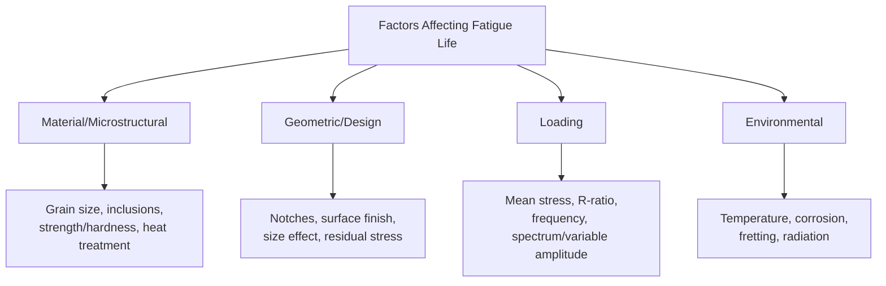
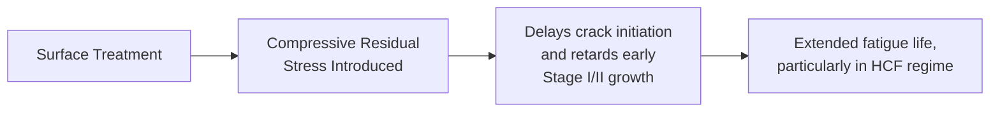
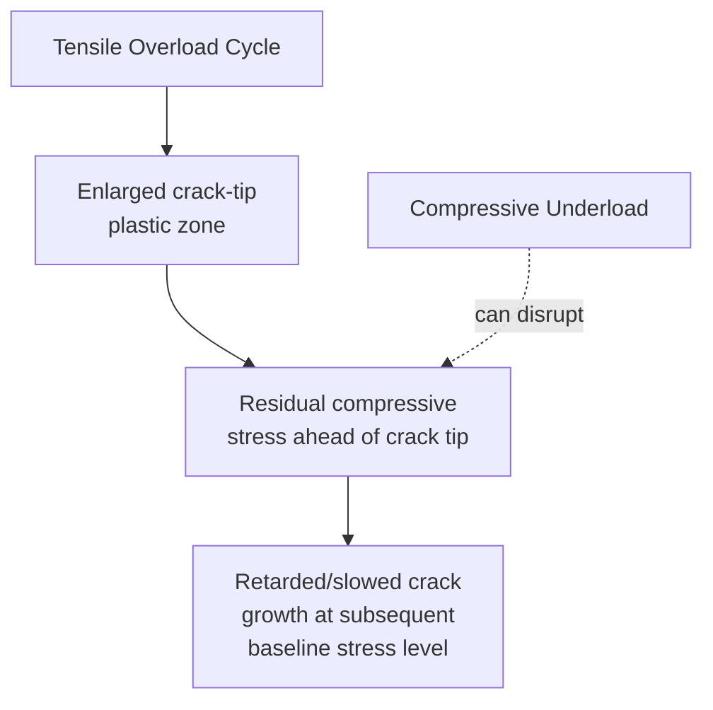
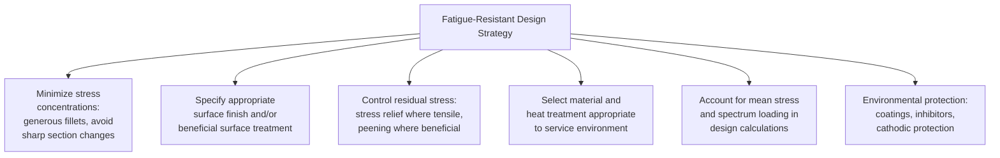

## Factors Affecting Fatigue Life

### Overview

Fatigue life is governed by a wide array of interacting material, geometric, loading, and environmental variables, making it one of the most sensitive and difficult-to-predict mechanical properties in engineering practice. Unlike static strength, which is comparatively well-characterized by a small number of test values, fatigue performance of a real component can vary by an order of magnitude or more depending on factors that have negligible influence on monotonic tensile behavior — surface finish, residual stress state, minor geometric discontinuities, and environmental exposure chief among them. Understanding and controlling these factors is central to both fatigue-resistant design and root-cause failure analysis.

**Key Points**

- Factors affecting fatigue life are conventionally grouped into four categories: material/microstructural, geometric/design, loading, and environmental.
- Many factors interact non-additively — e.g., the combined effect of surface roughness and corrosive environment is often worse than either factor alone would predict.
- These factors are formally captured in fatigue design practice through the Marin equation modification factors (surface, size, load, temperature, reliability) and through explicit fracture-mechanics treatment of geometric stress concentrations and closure effects.

---

### Classification of Influencing Factors

---

### Material and Microstructural Factors

#### Strength, Hardness, and Ductility

Fatigue strength generally correlates positively with static tensile strength for a given alloy class (the basis of empirical rules such as $S_e' \approx 0.5\,S_{ut}$ for steels), but this relationship is not unconditional:

- At very high strength/hardness levels, fatigue strength gains diminish or reverse, because higher-strength microstructures are typically more notch-sensitive and more susceptible to fatigue crack initiation at small defects (inclusions, surface imperfections) that would be relatively benign in a lower-strength, more ductile material.
- Ductility affects the material's ability to blunt stress concentrations via local plasticity, directly influencing notch sensitivity ($q$ in the fatigue notch factor relationship $K_f = 1 + q(K_t-1)$).

#### Grain Size

Finer grain size generally improves fatigue resistance through multiple mechanisms: increased resistance to persistent-slip-band-induced crack initiation, and (via the Hall-Petch-type relationship) increased resistance to microstructurally small crack growth across grain boundaries, since more boundaries per unit crack advance provide more barriers to slip transmission.

$$\Delta K_{th} \propto d^{1/2} \quad \text{(qualitative trend; coarser grain generally raises near-threshold resistance via roughness-induced closure, a partially competing effect)}$$

**[Inference]** The net effect of grain size on total fatigue life is genuinely two-sided in the literature: finer grain size tends to improve crack initiation resistance and short-crack growth resistance, while coarser grain size can sometimes improve near-threshold long-crack growth resistance via enhanced roughness-induced closure — meaning the optimal grain size for fatigue performance is not universally "as fine as possible" and can be alloy- and application-specific.

#### Non-Metallic Inclusions

Inclusions (oxides, sulfides, nitrides) act as internal stress concentrators and are a dominant crack initiation source in high-strength, clean-but-not-perfectly-clean steels, particularly in the high-cycle and very-high-cycle regimes where surface initiation is suppressed by good surface treatment. Inclusion size, morphology (elongated/stringer inclusions from hot-working are generally worse than globular ones), and distribution are controlled through steelmaking practice (vacuum degassing, calcium treatment for inclusion shape control, and increasingly stringent cleanliness specifications for bearing- and spring-grade steels).

#### Crystal Structure and Alloy System

As discussed in the endurance-limit context, BCC ferrous alloys and titanium generally exhibit a true fatigue limit (attributed to interstitial dislocation pinning), while FCC alloys (aluminum, copper, most nickel-based superalloys) generally do not, requiring finite-life design at a specified cycle count rather than true infinite-life design.

---

### Geometric and Design Factors

#### Stress Concentration (Notches)

Geometric discontinuities — fillets, holes, threads, keyways, grooves, section changes — are overwhelmingly the most common practical fatigue crack initiation site in engineering components, far more so than material defects in well-manufactured parts. The theoretical elastic stress concentration factor $K_t$ (from charts, handbooks, or finite element analysis) overestimates the actual fatigue-life reduction because of notch sensitivity:

$$K_f = 1 + q(K_t - 1)$$

**SVG Diagram: Notch Sensitivity vs. Notch Radius and Strength (svg_diagram)**

<svg xmlns="http://www.w3.org/2000/svg" viewBox="0 0 620 340" font-family="Arial, sans-serif">
<text x="310" y="24" text-anchor="middle" font-size="16" font-weight="bold">Notch Sensitivity Trends (svg_diagram)</text>
<line x1="80" y1="290" x2="560" y2="290" stroke="black" stroke-width="2" />
<line x1="80" y1="290" x2="80" y2="50" stroke="black" stroke-width="2" />
<text x="480" y="315" font-size="13">Notch root radius</text>
<text x="30" y="60" font-size="13">q (0 to 1)</text>
<path d="M 100 260 C 200 150, 350 90, 540 70" fill="none" stroke="red" stroke-width="2.5" />
<text x="380" y="90" font-size="11" fill="red">High-strength / hard material</text>
<path d="M 100 280 C 250 250, 400 180, 540 130" fill="none" stroke="blue" stroke-width="2.5" />
<text x="330" y="200" font-size="11" fill="blue">Lower-strength / ductile material</text>
<text x="90" y="270" font-size="10">q → 0 (sharp notch, low sensitivity)</text>
<text x="480" y="65" font-size="10">q → 1 (blunt notch, full theoretical sensitivity)</text>
</svg>

| Influence | Effect on Notch Sensitivity ($q$) |
| --- | --- |
| Increasing material strength/hardness | Increases $q$ (higher-strength materials have less local plasticity available to blunt the stress concentration) |
| Increasing notch root radius | Increases $q$ (larger radius reduces the strain-gradient effect that "shelters" microstructural crack initiation at very sharp notches) |
| Decreasing grain size | Generally decreases $q$ slightly at a given notch radius (finer microstructure less sensitive to strain-gradient sheltering effects) |

#### Surface Finish and Surface Treatment

Surface roughness provides microscopic stress concentrators (machining marks, tool feed marks) that act as fatigue crack initiation sites; the Marin surface factor $k_a$ quantifies this effect, with rougher surfaces (as-forged, as-cast, hot-rolled) showing substantially reduced fatigue strength relative to polished laboratory specimens — sometimes by 50% or more for high-strength steels with rough surface conditions.

Beneficial surface treatments that improve fatigue life by introducing compressive residual surface stress and/or refining surface microstructure include:

- **Shot peening**: cold-working the surface with high-velocity media, inducing a compressive residual stress layer typically 0.1-0.5 mm deep.
- **Case hardening (carburizing, nitriding)**: creates a hard, compressively stressed surface layer while retaining a tough core.
- **Cold rolling of fillets/threads**: commonly applied to crankshaft fillets and threaded fasteners.
- **Laser shock peening**: produces deeper compressive residual stress layers than conventional shot peening, increasingly used in critical aerospace applications.

**Key Points**

- The beneficial effect of compressive residual stress can be lost (or reversed) if the component subsequently experiences overload, high-temperature exposure (thermal relaxation of residual stress), or additional machining/grinding that removes the compressively stressed layer.
- Decarburization during heat treatment (loss of carbon from the surface layer) can produce the opposite effect — a softer, weaker surface layer prone to early crack initiation — making process control during heat treatment fatigue-critical for hardened steel components.

#### Size Effect

Larger components generally exhibit lower fatigue strength than geometrically identical smaller specimens tested under nominally the same stress, captured by the Marin size factor $k_b$. Contributing mechanisms include:

- **Statistical effect**: A larger stressed volume (or surface area) has a higher probability of containing a critical-sized initiating defect, following weakest-link statistics.
- **Stress gradient effect**: In bending or torsion, larger sections have a shallower stress gradient near the surface, meaning a larger volume of material experiences near-peak stress compared to a smaller section with the same peak surface stress — increasing the probability of finding a critical flaw within the highly stressed region.

#### Residual Stress from Manufacturing

Beyond deliberate surface treatments, manufacturing processes intrinsically introduce residual stresses that can significantly help or harm fatigue performance: welding typically introduces tensile residual stress near the weld toe (a major contributor to the generally poor fatigue performance of as-welded joints relative to base metal), while processes like cold forming, quenching, and grinding can introduce either beneficial (compressive) or detrimental (tensile) residual stresses depending on process parameters.

---

### Loading Factors

#### Mean Stress and Stress Ratio

As discussed in the S-N and Paris' Law contexts, tensile mean stress (positive R-ratio) reduces fatigue life at a given alternating stress amplitude, while compressive mean stress generally improves it — captured in design by the Goodman, Gerber, or Soderberg constant-life relationships for S-N-based design, or by Walker/Forman R-ratio corrections for crack-growth-based design.

#### Loading Frequency

- In predominantly inert environments at moderate temperature, frequency has a comparatively minor direct effect on fatigue life for most metals in the Paris regime.
- In aggressive/corrosive environments or at elevated temperature (where time-dependent mechanisms — hydrogen diffusion, oxidation, creep — contribute), lower frequency generally reduces fatigue life, since more real time elapses per cycle, allowing greater environmental interaction or creep damage accumulation per cycle.

#### Variable-Amplitude and Spectrum Loading

Real service loading is rarely constant-amplitude; overloads, underloads, and complex load histories introduce sequence effects not captured by simple constant-amplitude S-N or Paris data alone:

- **Overload retardation**: A single tensile overload cycle creates an enlarged crack-tip plastic zone and residual compressive stress ahead of the crack, temporarily slowing subsequent crack growth at the (now lower) baseline stress level — captured in models such as Wheeler and Willenborg.
- **Underload effects**: A compressive underload following an overload can partially or fully negate the retardation benefit by disrupting the residual compressive stress field.
- **Cumulative damage (Miner's rule)**: The standard (though approximate) linear superposition method for combining damage from multiple stress levels in a spectrum, with known limitations related to load-sequence effects.

---

### Environmental Factors

#### Temperature

- **Elevated temperature**: Generally reduces fatigue strength and can introduce time-dependent creep-fatigue interaction (grain boundary cavitation superimposed on transgranular fatigue crack growth), particularly significant above roughly 0.3-0.5 $T_m$ (homologous temperature) depending on the alloy.
- **Low/cryogenic temperature**: Effects are alloy-specific; some materials show increased fatigue strength (higher yield strength, delayed initiation) but reduced fracture toughness (smaller final fast-fracture margin, and increased risk of low-temperature embrittlement/DBTT effects in susceptible BCC alloys).

#### Corrosive Environment (Corrosion Fatigue)

Aggressive environments synergistically combine with cyclic stress to reduce fatigue life below what either mechanism would produce alone, eliminating the true fatigue endurance limit even in materials (like steel) that exhibit one in benign/inert environments, and generally showing pronounced frequency-dependence (lower frequency = greater life reduction, more time for environmental interaction per cycle).

#### Fretting

Small-amplitude relative motion at contacting surfaces (bolted joints, press-fits, splines) under cyclic bulk stress produces severe, highly localized fatigue life reduction (often a factor of 2-10) via combined mechanical wear damage and highly concentrated stress at the contact edge — a distinct and often underappreciated environmental/contact factor in joint and fastener design.

#### Neutron/Radiation Exposure

In nuclear applications, neutron irradiation can alter fatigue behavior through radiation-induced hardening (raising yield strength but reducing ductility and increasing DBTT), and through irradiation-assisted stress corrosion cracking mechanisms in susceptible alloy-environment combinations (e.g., irradiated austenitic stainless steel in reactor coolant environments).

---

### Interaction Effects

Several of the most damaging fatigue scenarios in practice arise from the *combination* of factors rather than any single factor alone:

| Combined Factors | Resulting Effect |
| --- | --- |
| Rough surface + corrosive environment | Corrosion pits nucleate preferentially at surface roughness features, compounding crack initiation acceleration beyond either factor's individual contribution |
| Weld residual tensile stress + stress concentration at weld toe | The classic and dominant fatigue-critical condition in welded structures — geometric discontinuity and unfavorable residual stress combine at the same location |
| High mean stress + elevated temperature | Creep-fatigue interaction becomes significant, with grain boundary cavitation contributing alongside conventional transgranular fatigue crack growth |
| Fretting + corrosive environment (fretting corrosion) | Wear debris oxidizes and can act as an abrasive third body, further accelerating both mechanical damage and crack initiation |

**[Inference]** Because these interaction effects are frequently non-additive and highly configuration-specific, component-level or full-scale fatigue testing under representative combined conditions is generally considered the most reliable validation approach for fatigue-critical designs where multiple adverse factors coincide, rather than relying solely on superposition of individually-determined correction factors.

---

### Practical Design Implications

**Example**

A gear shaft failure investigation identifies fatigue cracking initiating at a keyway corner rather than at the more heavily loaded gear tooth root. Analysis reveals the keyway was machined with a sharp corner (small fillet radius, high $K_t$) rather than the specified generous radius, and the shaft had not received the specified post-machining shot-peening treatment on that feature due to a masking error during processing. This combination — an unintended stress concentration increase (higher effective $K_f$ than designed) plus the absence of the intended beneficial compressive residual stress — illustrates how a single manufacturing deviation can compound multiple factors simultaneously, converting a component designed for a specific target fatigue life into one that fails far earlier than predicted, despite the base material meeting all specified static mechanical properties.

---

**Next Steps / Related Topics**

- S-N Curves and the Endurance Limit
- Crack Initiation and Propagation Mechanisms
- Paris Law and Fatigue Crack Growth
- Notch Sensitivity and the Fatigue Notch Factor in Detail
- Shot Peening, Nitriding, and Surface Treatment Processes
- Residual Stress Measurement Techniques (X-ray Diffraction, Hole-Drilling)
- Corrosion Fatigue and Environmentally Assisted Cracking
- Fretting Fatigue in Bolted and Press-Fit Joints
- Weld Fatigue Design and Residual Stress Management
- Cumulative Damage and Variable-Amplitude Spectrum Loading