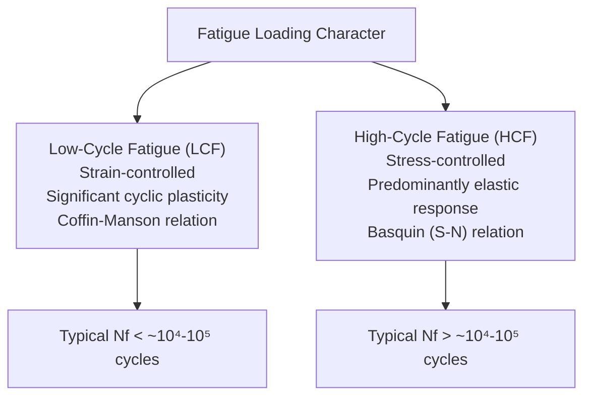
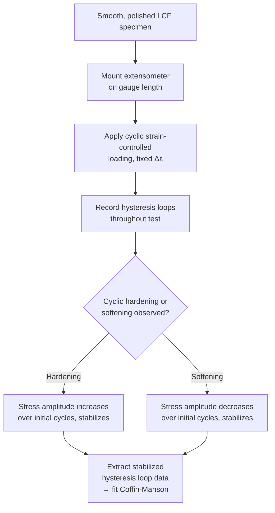
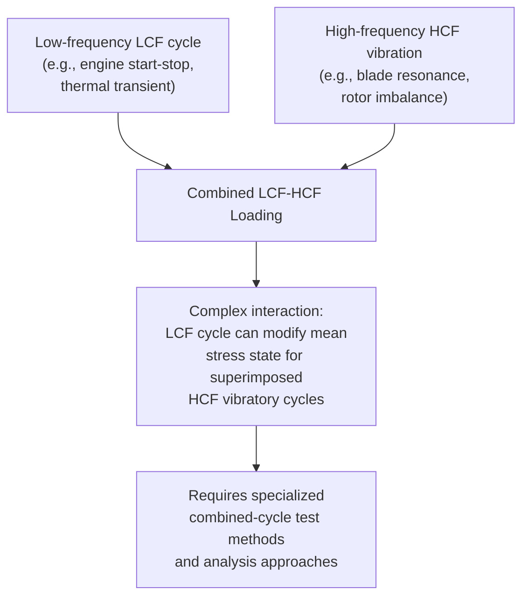
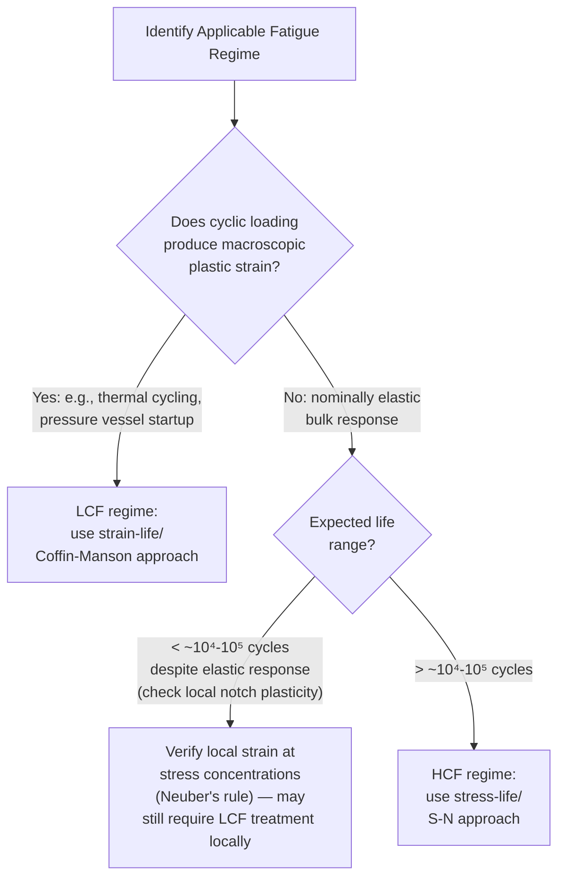

## Low Cycle versus High Cycle Fatigue

### Overview

Low-Cycle Fatigue (LCF) and High-Cycle Fatigue (HCF) represent two distinct fatigue regimes, distinguished not merely by an arbitrary cycle-count boundary but by fundamentally different governing deformation mechanisms, appropriate analytical frameworks, and dominant life-controlling phases. LCF is characterized by macroscopic cyclic plastic strain at each cycle, analyzed using strain-based methods (Coffin-Manson relation), while HCF involves predominantly elastic, stress-controlled cyclic loading, analyzed using the stress-based S-N (Basquin) approach. Correctly identifying which regime governs a given design problem is a foundational step in fatigue analysis, since applying the wrong framework can produce badly non-conservative or overly conservative life predictions.

**Key Points**

- Conventional (though not absolute) boundary: LCF is typically associated with failure below approximately $10^4$-$10^5$ cycles; HCF extends from roughly $10^4$-$10^5$ cycles into the $10^6$-$10^8+$ cycle range.
- The more fundamental distinguishing criterion is not cycle count itself but whether cyclic loading is **strain-controlled with significant plasticity** (LCF) or **stress-controlled with predominantly elastic response** (HCF).
- Governing standards: ASTM E606 (strain-controlled fatigue testing, LCF), ASTM E466 (constant-amplitude axial fatigue testing, HCF).

---

### Fundamental Distinction: Strain-Controlled vs. Stress-Controlled

The physical distinction arises from where the applied loading falls relative to the material's cyclic yield strength. When applied strain or stress is large enough to produce macroscopic plastic strain each cycle (e.g., thermal cycling causing large strain excursions, or start-stop transients in pressure vessels), the material undergoes LCF. When applied stress remains below (or only marginally exceeds) the cyclic yield strength, producing only localized microplasticity at slip bands and defects rather than bulk plastic strain, the material undergoes HCF.

**SVG Diagram: Hysteresis Loops — LCF vs. HCF (svg_diagram)**

<svg xmlns="http://www.w3.org/2000/svg" viewBox="0 0 640 340" font-family="Arial, sans-serif">
<text x="320" y="24" text-anchor="middle" font-size="16" font-weight="bold">Cyclic Hysteresis Loops: LCF vs. HCF (svg_diagram)</text>
<line x1="100" y1="180" x2="280" y2="180" stroke="black" stroke-width="1" />
<line x1="190" y1="90" x2="190" y2="270" stroke="black" stroke-width="1" />
<path d="M 120 220 C 160 130, 220 130, 260 140 C 220 230, 160 230, 120 220" fill="rgba(255,0,0,0.15)" stroke="red" stroke-width="2.5" />
<text x="130" y="290" font-size="13" font-weight="bold">LCF: wide, open loop</text>
<text x="120" y="305" font-size="11">(large plastic strain per cycle)</text>
<text x="70" y="90" font-size="11">σ</text>
<text x="285" y="185" font-size="11">ε</text>
<line x1="400" y1="180" x2="580" y2="180" stroke="black" stroke-width="1" />
<line x1="490" y1="120" x2="490" y2="240" stroke="black" stroke-width="1" />
<path d="M 470 195 C 480 165, 500 165, 510 170 C 500 205, 480 205, 470 195" fill="rgba(0,0,255,0.15)" stroke="blue" stroke-width="2" />
<text x="420" y="290" font-size="13" font-weight="bold">HCF: thin, near-closed loop</text>
<text x="420" y="305" font-size="11">(mostly elastic, little plasticity)</text>
</svg>

**Key Points**

- The width of the stress-strain hysteresis loop directly visualizes the plastic strain range per cycle; LCF loops are wide and "open" (large enclosed area, representing significant energy dissipation per cycle), while HCF loops are thin, nearly closed lines approaching pure elastic behavior.
- The area enclosed by the hysteresis loop represents the plastic strain energy dissipated per cycle, which correlates with cumulative fatigue damage in some energy-based damage models — an alternative to strain- or stress-range-based criteria.

---

### Low-Cycle Fatigue (LCF)

#### The Coffin-Manson Relation

LCF life is governed by the plastic strain amplitude via the empirically-derived Coffin-Manson relation (developed independently by Coffin and Manson in the mid-1950s):

$$\frac{\Delta\varepsilon_p}{2} = \varepsilon_f'(2N_f)^c$$

where $\varepsilon_f'$ is the fatigue ductility coefficient (approximately equal to the true fracture strain in monotonic tension for many metals) and $c$ is the fatigue ductility exponent (typically -0.5 to -0.7 for most engineering metals).

#### Total Strain-Life Approach

Since real LCF loading typically produces both elastic and plastic strain components, the total strain-life equation combines the Basquin (elastic) and Coffin-Manson (plastic) relations:

$$\frac{\Delta\varepsilon}{2} = \frac{\Delta\varepsilon_e}{2} + \frac{\Delta\varepsilon_p}{2} = \frac{\sigma_f'}{E}(2N_f)^b + \varepsilon_f'(2N_f)^c$$

**SVG Diagram: Total Strain-Life Curve (Elastic + Plastic Components) (svg_diagram)**

<svg xmlns="http://www.w3.org/2000/svg" viewBox="0 0 620 380" font-family="Arial, sans-serif">
<text x="310" y="24" text-anchor="middle" font-size="16" font-weight="bold">Total Strain-Life Curve (svg_diagram)</text>
<line x1="80" y1="330" x2="580" y2="330" stroke="black" stroke-width="2" />
<line x1="80" y1="330" x2="80" y2="50" stroke="black" stroke-width="2" />
<text x="500" y="355" font-size="13">log(2Nf) — reversals to failure</text>
<text x="20" y="60" font-size="13">log(Δε/2)</text>
<path d="M 130 90 L 530 300" fill="none" stroke="red" stroke-width="2" />
<text x="150" y="150" font-size="11" fill="red">Plastic strain line (Coffin-Manson, slope c)</text>
<path d="M 130 260 L 530 130" fill="none" stroke="blue" stroke-width="2" />
<text x="380" y="150" font-size="11" fill="blue">Elastic strain line (Basquin, slope b)</text>
<path d="M 130 88 C 250 150, 350 175, 430 190 C 480 197, 510 200, 530 205" fill="none" stroke="black" stroke-width="3" />
<text x="200" y="220" font-size="12" font-weight="bold">Total strain-life curve (sum of elastic + plastic)</text>
<line x1="350" y1="330" x2="350" y2="176" stroke="gray" stroke-width="1" stroke-dasharray="3,2" />
<text x="355" y="200" font-size="11" fill="gray">Transition life (Nt): elastic = plastic contribution</text>
</svg>

**Key Points**

- At low cycles to failure (LCF regime), the plastic strain term dominates the total strain range; at high cycles to failure (HCF regime), the elastic strain term dominates — the two lines cross at the **transition fatigue life** ($N_t$), a useful reference point distinguishing which regime governs a given design condition.
- The transition life varies significantly by material: high-strength, low-ductility materials have a low transition life (HCF/elastic behavior dominates over most of the practical life range), while lower-strength, more ductile materials have a higher transition life (plastic/LCF behavior extends to higher cycle counts).

#### LCF Testing (ASTM E606)

LCF specimens are tested under **strain control** (rather than load control, as in HCF/S-N testing) because, at strain amplitudes producing significant plasticity, controlling load would allow uncontrolled strain accumulation (ratcheting) as the material cyclically softens or hardens. A closed-loop servo-hydraulic testing machine with an extensometer mounted on the specimen gauge length provides the feedback signal for strain control.

**Cyclic Hardening and Softening**

A material's response to cyclic strain often differs from its monotonic tensile behavior — a phenomenon of central importance to LCF analysis:

- **Cyclic hardening**: Stress amplitude increases over the first several to hundreds of cycles before stabilizing; typically occurs in initially soft/annealed materials as dislocation density increases and a stable dislocation substructure develops.
- **Cyclic softening**: Stress amplitude decreases over initial cycling before stabilizing; typically occurs in initially hard/cold-worked or precipitation-hardened materials as the pre-existing dislocation substructure rearranges toward a lower-energy configuration, or as precipitates coarsen/dissolve under cyclic strain.

A simple empirical criterion (Manson): materials with a monotonic strain-hardening exponent $n_{monotonic} > 0.2$ tend to cyclically harden, while those with $n_{monotonic} < 0.2$ tend to cyclically soften — though this rule is approximate.

The **cyclic stress-strain curve** (constructed by connecting the tips of stabilized hysteresis loops from tests at multiple strain amplitudes) is generally distinct from the monotonic tensile stress-strain curve, and is the appropriate curve to use for any stress-strain analysis of a component subjected to significant cyclic loading (e.g., neuber/notch strain analysis).

---

### High-Cycle Fatigue (HCF)

#### The Basquin Relation and S-N Approach

HCF is governed by nominally elastic, stress-controlled loading, described by the Basquin relation:

$$\sigma_a = \sigma_f'(2N_f)^b$$

and analyzed via the S-N curve methodology, including the endurance limit concept for materials that exhibit one (see S-N Curves and the Endurance Limit).

**Key Points**

- In smooth, defect-free HCF specimens, the majority of total life (often 80-95%+) is consumed in crack initiation, since nucleating a crack from nominally elastic bulk loading requires many cycles of highly localized microplastic damage accumulation at persistent slip bands or defects.
- HCF testing is conventionally load-controlled (rather than strain-controlled), since the elastic response means load and strain amplitude are essentially proportional and interchangeable for testing purposes.

#### High-Frequency HCF and Very-High-Cycle Fatigue (VHCF)

At the far end of the HCF spectrum, beyond approximately $10^7$-$10^8$ cycles, many materials once assumed to have a true, unconditional endurance limit have been shown (using specialized ultrasonic resonance testing capable of achieving very high cycle counts in reasonable test durations) to continue accumulating damage, often failing via subsurface initiation at internal inclusions rather than the classical surface-initiated mechanism — producing the characteristic "fish-eye" fracture feature. This has led to refined design philosophy for components genuinely requiring $10^9$+ cycle life (e.g., automotive valve springs, high-speed rotating machinery), where a conservative finite-life or probabilistic design approach may be preferred over assuming a strict, unconditional infinite-life endurance limit.

---

### Comparative Summary

| Characteristic | Low-Cycle Fatigue (LCF) | High-Cycle Fatigue (HCF) |
| --- | --- | --- |
| Typical life range | $< 10^4$-$10^5$ cycles | $10^4$-$10^5$ to $10^8+$ cycles |
| Dominant strain type | Significant plastic strain each cycle | Predominantly elastic strain |
| Governing relation | Coffin-Manson (strain-life) | Basquin (stress-life) |
| Test control mode | Strain-controlled | Load/stress-controlled |
| Dominant life fraction | Propagation (initiation is rapid due to gross plasticity) | Initiation (often 80-95%+ of total life in smooth specimens) |
| Typical causes | Thermal cycling, start-stop transients, pressure vessel cyclic pressurization, seismic loading | Rotating machinery, vibration, engine/turbine blade vibratory stress, most steady-state cyclic service loads |
| Governing test standard | ASTM E606 | ASTM E466 |

---

### Combined LCF-HCF Loading: Fretting and Superimposed Vibration

Many real components experience **combined LCF-HCF loading** — a superposition of a low-frequency, high-amplitude LCF cycle (e.g., a start-stop engine cycle) with a high-frequency, low-amplitude HCF vibration superimposed on top (e.g., blade vibratory response during that same engine cycle). This combined loading is of particular concern in gas turbine engine design, where high-cycle vibratory fatigue superimposed on the low-cycle thermal/mechanical startup-shutdown cycle has historically been a major driver of turbine blade and disk failures.

**[Inference]** Combined LCF-HCF analysis is generally recognized as more complex than either regime treated in isolation, since the underlying LCF cycle can alter the local mean stress state (and hence the effective HCF fatigue limit at that location) throughout the LCF cycle; specialized combined-cycle testing and life-prediction methodologies (particularly well-developed in the gas turbine engine industry) exist to address this interaction, though the specific analytical approach varies by industry and application.

---

### Practical Identification: Which Regime Governs?

**Example**

A pressure vessel nozzle experiences bulk nominal stresses well within the elastic range for its design pressurization cycles, suggesting an HCF/S-N analysis might apply based on bulk stress alone. However, local stress concentration at a weld toe or geometric discontinuity can produce local strains well into the plastic range even when nominal/far-field stress remains elastic. Applying **Neuber's rule** (relating the elastic stress concentration factor to actual local elastic-plastic stress and strain via the cyclic stress-strain curve) reveals that the local notch-root material is actually experiencing significant plastic strain each pressurization cycle — meaning the locally-controlling fatigue mechanism is genuinely LCF (governed by the Coffin-Manson relation applied to the local strain amplitude) even though the bulk/nominal loading condition and the low number of pressurization cycles per year might superficially suggest an HCF framework. This is a common and important distinction in pressure vessel, piping, and notched-component fatigue design: the appropriate LCF/HCF classification should be based on the local (notch-root) strain state, not the nominal/far-field stress state.

---

**Next Steps / Related Topics**

- S-N Curves and the Endurance Limit
- Crack Initiation and Propagation Mechanisms
- Paris Law and Fatigue Crack Growth
- Cyclic Stress-Strain Behavior and Neuber's Rule
- Thermomechanical Fatigue and Creep-Fatigue Interaction
- Very-High-Cycle Fatigue and Subsurface Initiation
- Combined LCF-HCF Loading in Gas Turbine Design
- Factors Affecting Fatigue Life
- Fatigue Failure Mechanisms and Fracture Surface Analysis
- Strain-Controlled Fatigue Testing (ASTM E606) Procedures