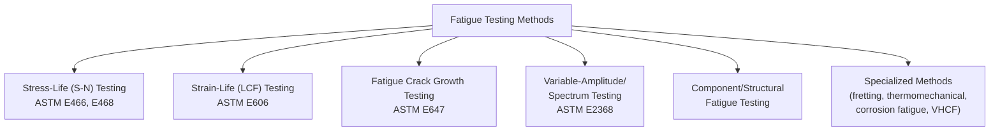
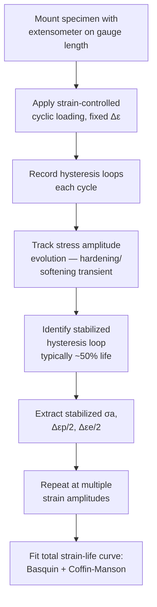
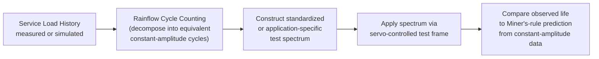
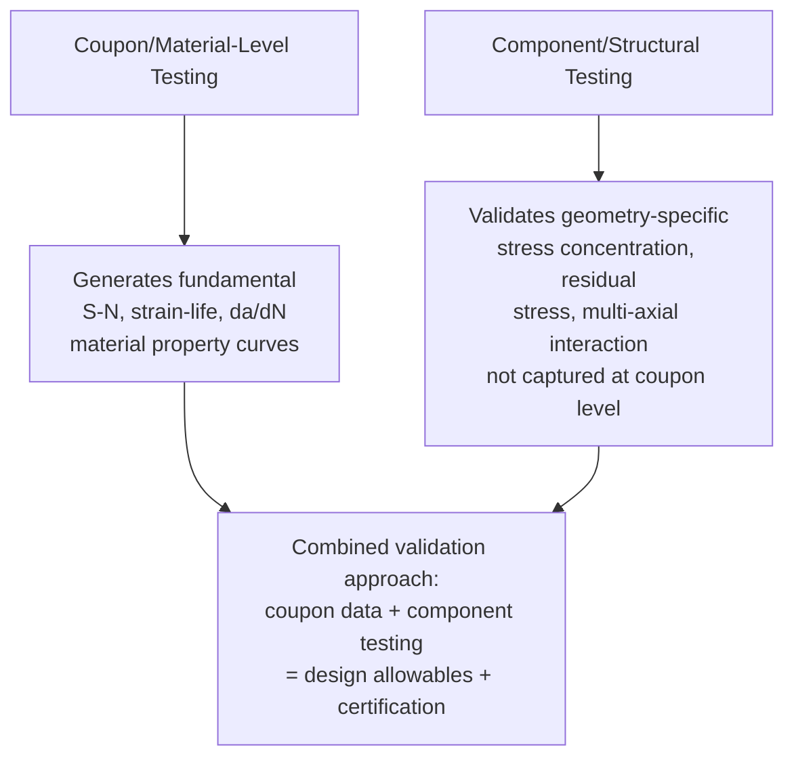
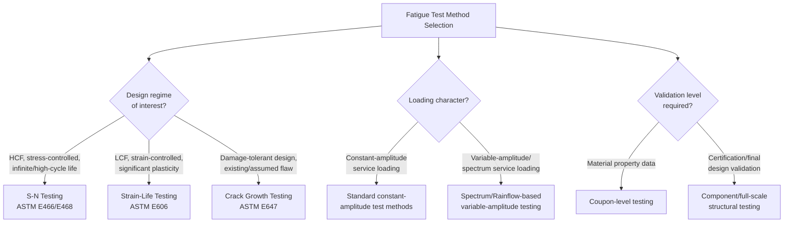

## Fatigue Testing Methods

### Overview

Fatigue testing methods encompass the full range of standardized experimental techniques used to characterize a material's or component's response to cyclic loading — from simple smooth-specimen stress-life testing to sophisticated strain-controlled, fracture-mechanics-based, and full-scale component testing. The choice of test method depends on the fatigue regime of interest (LCF vs. HCF), the design philosophy being supported (safe-life vs. damage-tolerant), and whether the goal is generating fundamental material property data or validating a specific component or structure.

**Key Points**

- Major standardized categories: constant-amplitude stress-life (S-N) testing, strain-controlled LCF testing, fatigue crack growth rate testing, and component/structural fatigue testing.
- Governing standards: ASTM E466 (axial S-N), ASTM E606 (strain-controlled LCF), ASTM E647 (crack growth rate), ASTM E739 (statistical S-N data analysis), ASTM E2368 (variable amplitude testing guidance).
- Instrumented and computer-controlled servo-hydraulic and servo-electric test systems have largely superseded older mechanical resonance and rotating-bending machines for research-grade testing, though rotating-bending machines remain in use for economical, high-throughput screening.

---

### Test Method Classification

---

### Stress-Life (S-N) Testing

#### Rotating-Bending Testing (R.R. Moore Configuration)

The classic, historically dominant method for HCF characterization: a smooth, polished, hourglass-profile cylindrical specimen rotates while a fixed bending moment is applied via dead-weight loading, subjecting every point on the specimen surface to a fully-reversed ($R = -1$) sinusoidal stress cycle once per revolution. Test speed is typically 1,000-10,000+ rpm, allowing rapid accumulation of high cycle counts (e.g., $10^7$ cycles in roughly 17-170 hours at these speeds).

**Key Points**

- Rotating-bending inherently produces only fully-reversed ($R=-1$) loading; testing at other mean stress levels requires axial or four-point bending configurations instead.
- Simplicity and low cost make rotating-bending machines attractive for large-sample-size statistical fatigue-limit determination (staircase method) despite being largely superseded by servo-hydraulic systems for advanced research applications.

#### Axial Fatigue Testing (ASTM E466)

Uniaxial tension-compression or tension-tension loading applied via a servo-hydraulic or servo-electric test frame, allowing precise control of mean stress, stress ratio ($R$), and waveform (sinusoidal, triangular, trapezoidal), and permitting testing of non-cylindrical geometries (flat, notched, or component-representative specimens) not achievable with rotating-bending.

**SVG Diagram: Servo-Hydraulic Axial Fatigue Test Setup (svg_diagram)**

<svg xmlns="http://www.w3.org/2000/svg" viewBox="0 0 600 400" font-family="Arial, sans-serif">
<text x="300" y="24" text-anchor="middle" font-size="16" font-weight="bold">Servo-Hydraulic Axial Fatigue Test (svg_diagram)</text>
<rect x="220" y="50" width="160" height="30" fill="lightgray" stroke="black" stroke-width="2" />
<text x="240" y="70" font-size="11">Load frame crosshead</text>
<line x1="300" y1="80" x2="300" y2="140" stroke="black" stroke-width="3" />
<rect x="270" y="140" width="60" height="25" fill="none" stroke="black" stroke-width="2" />
<text x="335" y="157" font-size="10">Upper grip</text>
<path d="M 285 165 L 280 220 L 320 220 L 315 165" fill="none" stroke="black" stroke-width="2" />
<text x="335" y="195" font-size="10">Gauge section</text>
<rect x="270" y="220" width="60" height="25" fill="none" stroke="black" stroke-width="2" />
<text x="335" y="237" font-size="10">Lower grip</text>
<rect x="220" y="245" width="20" height="15" fill="black" />
<text x="245" y="257" font-size="10">Load cell</text>
<rect x="200" y="280" width="200" height="40" fill="lightgray" stroke="black" stroke-width="2" />
<text x="230" y="303" font-size="11">Hydraulic actuator</text>
<rect x="230" y="180" width="16" height="24" fill="none" stroke="red" stroke-width="1.5" />
<text x="150" y="195" font-size="10" fill="red">Extensometer (strain feedback)</text>
<line x1="230" y1="192" x2="200" y2="192" stroke="red" stroke-width="1" />
</svg>

#### Statistical Test Design (Staircase Method)

For efficient determination of the median fatigue limit and its standard deviation with limited specimens, the staircase (up-and-down) method tests specimens sequentially at a fixed cycle count, incrementing or decrementing the stress level for the next specimen based on whether the previous specimen survived (run-out) or failed. Statistical analysis of the resulting pattern (per ASTM E729 or Dixon-Mood analysis) yields both the mean fatigue limit and an estimate of its scatter.

---

### Strain-Controlled (LCF) Testing (ASTM E606)

For components experiencing significant cyclic plasticity, strain-controlled testing is required rather than load control, since load-controlled testing at strain amplitudes producing plasticity would risk uncontrolled ratcheting as the material cyclically hardens or softens.

#### Procedure

1. A smooth, buttonhead or threaded cylindrical specimen is instrumented with an extensometer (clip-on or contacting, mounted directly on the gauge length) providing real-time strain feedback to the servo-controller.
2. The specimen is cycled at a fixed total strain amplitude (typically triangular or sinusoidal waveform) at a strain rate low enough to avoid significant strain-rate/viscoplastic effects unless such effects are specifically of interest.
3. Load (stress) response is recorded continuously throughout the test, producing a full stress-strain hysteresis loop history.
4. Cyclic hardening/softening behavior is tracked until the hysteresis loop stabilizes (typically within the first 20-50% of life for most metals), and the stabilized loop provides the data point (stabilized stress amplitude, plastic and elastic strain amplitude) for that test's contribution to the strain-life curve.
5. Testing at multiple strain amplitudes (typically 6-12 specimens spanning a range of strain amplitudes) allows fitting of the full Coffin-Manson/Basquin total strain-life curve.

**Key Points**

- Failure definition in strain-controlled LCF testing is typically based on a specified percentage load drop (commonly 50% of the stabilized peak tensile load) rather than complete specimen separation, since a fully-developed macroscopic crack causes progressive load-carrying-capacity loss well before final separation under strain control.
- Buckling is a practical concern in fully-reversed (compression-going) LCF testing of slender specimens; anti-buckling guides or fixtures are required per ASTM E606 for specimens below a specified slenderness ratio.

---

### Fatigue Crack Growth Rate Testing (ASTM E647)

As detailed in the Paris' Law framework, crack growth rate testing quantifies $da/dN$ as a function of $\Delta K$ using pre-cracked fracture mechanics specimens (typically C(T) or M(T)), with crack length monitored via compliance or electrical potential drop methods.

#### Crack Length Measurement Techniques

| Method | Principle | Advantages/Limitations |
| --- | --- | --- |
| Compliance (clip gauge) | Elastic compliance increases predictably with crack length; back-calculated via specimen-specific compliance function | Well-established, works for most standard geometries; requires periodic small unloading for accurate compliance measurement in some configurations |
| DC potential drop | Electrical resistance across the crack plane increases as crack grows (reduced conducting cross-section); calibrated via reference equations or finite element calibration | Continuous, non-contact (relative to the crack plane) measurement; requires stable current source and careful probe placement; sensitive to temperature drift |
| AC potential drop | Similar principle to DC, exploiting skin-effect current concentration near the crack tip for improved sensitivity to very short cracks | More complex instrumentation; useful for short/small crack growth studies |
| Optical/traveling microscope | Direct visual measurement on specimen surface | Simple, provides ground-truth calibration for other methods but limited to surface observation and cannot be automated as easily |

#### Test Modes: Constant-Amplitude, K-Increasing, K-Decreasing (Load Shedding)

- **Constant-amplitude (constant $\Delta P$)**: efficient for generating mid-to-high $\Delta K$ (Region II/III) data.
- **K-decreasing (load-shedding)**: load amplitude progressively reduced following a normalized exponential K-gradient as the crack grows, allowing efficient approach to the near-threshold ($\Delta K_{th}$) regime within a single test, while avoiding excessive plastic-history/retardation artifacts from too-rapid load reduction.

---

### Variable-Amplitude and Spectrum Fatigue Testing

Constant-amplitude testing, while foundational for generating basic material property curves (S-N, strain-life, da/dN), does not directly replicate the complex load histories most real components experience in service. Variable-amplitude testing addresses this gap:

#### Standardized Load Spectra

Several standardized, representative load-time histories have been developed for specific industries to enable comparable variable-amplitude testing and life-prediction validation across laboratories and organizations:

- **FALSTAFF** (Fighter Aircraft Loading STAndard For Fatigue evaluation): representative fighter aircraft wing root loading spectrum.
- **TWIST**: transport aircraft wing loading spectrum.
- **WASH** (Wind turbine blade spectrum) and similar standardized spectra for other industries (offshore structures, automotive, etc.).

#### Rainflow Cycle Counting

To translate an irregular, variable-amplitude load history into a set of discrete constant-amplitude cycles suitable for damage summation (Miner's rule) or spectrum test programming, **rainflow counting** is the standard algorithm: it identifies closed hysteresis loops within the load-time history by pairing reversal points based on a specific rule set (analogous to rain flowing down a pagoda-roof-like plot of the load history rotated 90°), correctly capturing the interaction between large and superimposed small cycles that simpler counting methods (level-crossing, peak counting) fail to capture accurately.

---

### Component and Full-Scale Structural Fatigue Testing

Beyond material-property-level (coupon) testing, fatigue-critical structures frequently require testing at the sub-component, component, or full-scale assembly level, since specimen-level test data cannot fully capture geometry-specific stress concentration, residual stress, multi-axial loading, or assembly-interaction effects present in the real structure.

#### Examples of Component-Level Testing

- **Full-scale aircraft wing/fuselage fatigue testing**: applying a representative flight-by-flight load spectrum to an entire structural article, often continuing well beyond the design service life (e.g., 2-3 lifetimes) to validate the damage-tolerant design and establish inspection intervals.
- **Automotive chassis/suspension component testing**: multi-axial servo-hydraulic rigs applying combined road-load spectra (vertical, lateral, longitudinal, braking, and steering loads simultaneously) to full suspension assemblies or vehicle bodies-in-white.
- **Weld joint fatigue testing**: standardized weld detail specimens (per IIW, Eurocode 3, or AWS fatigue design curves) tested to establish S-N design curves for specific weld classifications used in bridge, offshore, and structural steel design.
- **Turbine blade/disk spin-pit testing**: rotating component testing under combined centrifugal and vibratory loading to validate combined LCF-HCF life prediction for gas turbine hardware.

**Key Points**

- Full-scale structural fatigue testing is frequently a mandatory certification requirement in aerospace (e.g., FAA/EASA structural certification for transport aircraft), providing direct validation that cannot be achieved through analysis or coupon testing alone.
- Component testing is generally far more expensive and time-consuming than coupon testing, so design practice typically uses coupon-level material data combined with analytical stress/life prediction for the majority of design iteration, reserving full-scale component testing for final validation of the converged design.

---

### Specialized Test Configurations

| Method | Application |
| --- | --- |
| Fretting fatigue rig | Applies controlled contact pressure and small-amplitude oscillatory relative motion superimposed on cyclic bulk stress, replicating bolted-joint or dovetail-joint fretting conditions |
| Thermomechanical fatigue (TMF) rig | Combines controlled cyclic mechanical strain with simultaneous, often out-of-phase, cyclic temperature variation (via induction heating and forced-air/liquid cooling), replicating turbine blade or exhaust component thermal-mechanical service cycles |
| Corrosion fatigue testing | Standard S-N or crack growth specimens tested within an environmental chamber or immersion cell replicating the target service environment (chloride solution, sour gas, etc.), often at controlled temperature and electrochemical potential |
| Ultrasonic (resonance) fatigue testing | Uses piezoelectric transducers to excite specimens at their natural resonant frequency (typically 20 kHz), enabling very-high-cycle fatigue (VHCF) testing to $10^9$-$10^{10}$ cycles within practical test durations (days rather than years) |
| Multiaxial fatigue testing | Combined axial-torsion (or biaxial) servo-hydraulic rigs applying simultaneous, potentially out-of-phase, normal and shear stress/strain to replicate complex multiaxial service stress states, requiring specialized multiaxial damage criteria (e.g., critical plane approaches) for analysis |

**[Inference]** Ultrasonic VHCF testing at 20 kHz produces strain rates orders of magnitude higher than conventional servo-hydraulic testing (typically 1-50 Hz); while generally accepted as a valid and efficient method for accessing the VHCF regime, some researchers have noted potential frequency-dependent effects (particularly in environments or materials sensitive to strain rate or requiring time for environmental interaction) that warrant care when directly comparing ultrasonic VHCF data to conventional-frequency fatigue data, especially for corrosion-fatigue-sensitive materials.

---

### Data Analysis and Statistical Treatment

**Key Points**

- ASTM E739 provides standard practice for statistical analysis of linear or linearized S-N and strain-life data, including confidence bounds and prediction intervals for design curve development.
- Design fatigue curves (as opposed to mean/median test-data curves) typically incorporate a margin derived from the statistical scatter of the underlying test population, often expressed as a specified lower-bound percentile (e.g., a curve representing 99% survival probability with 95% confidence) or as a simple deterministic scatter-factor reduction applied to the mean curve — the specific approach varies by governing design code and industry.

---

### Practical Test Method Selection

---

**Next Steps / Related Topics**

- S-N Curves and the Endurance Limit
- Low-Cycle versus High-Cycle Fatigue
- Paris Law and Fatigue Crack Growth
- Rainflow Cycle Counting and Cumulative Damage Analysis
- Multiaxial Fatigue and Critical Plane Approaches
- Thermomechanical Fatigue Testing and Creep-Fatigue Interaction
- Very-High-Cycle Fatigue and Ultrasonic Resonance Testing
- Statistical Analysis of Fatigue Data (ASTM E739)
- Full-Scale Structural Fatigue Certification Testing
- Fretting Fatigue Test Rig Design and Interpretation