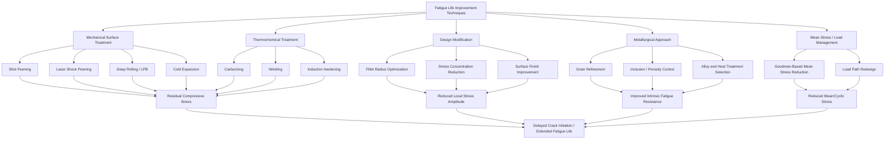

## Fatigue Life Improvement Techniques

### Overview and Governing Principle

Fatigue failure initiates predominantly at surfaces, stress concentrations, and material discontinuities, where local stress amplitudes exceed the material's fatigue limit or where crack nucleation sites (persistent slip bands, inclusions, porosity) are most active. Fatigue life improvement techniques are grounded in one or more of the following mechanisms:

1. **Reducing stress concentration** (geometric design changes)
2. **Introducing beneficial residual compressive stresses** at the surface
3. **Improving surface finish/microstructure** to eliminate crack initiation sites
4. **Reducing mean stress or stress amplitude** experienced by the component
5. **Selecting or engineering materials/microstructures** with higher inherent fatigue resistance

The Basquin equation governing the stress-life (S-N) relationship provides the theoretical basis for why these interventions work:

$$\sigma_a = \sigma_f' (2N_f)^b$$

where $\sigma_a$ is stress amplitude, $\sigma_f'$ is the fatigue strength coefficient, $N_f$ is cycles to failure, and $b$ is the fatigue strength exponent. Techniques that reduce effective $\sigma_a$ at the critical location, or increase the effective $\sigma_f'$ of the surface layer, directly extend $N_f$.

### Mechanical Surface Treatments

#### Shot Peening

Shot peening bombards the component surface with high-velocity spherical media (steel, glass, or ceramic shot), producing localized plastic deformation that leaves a layer of **residual compressive stress** at and below the surface, typically 0.1–0.5 mm deep depending on shot size, velocity, and coverage.

**Mechanism**: Since fatigue cracks nucleate under tensile stress and residual compressive stress must first be overcome by the applied tensile load before net tension develops at the surface, shot peening effectively raises the threshold stress amplitude required for crack initiation.

**Key process parameters:**

- **Almen intensity**: measured via Almen strip deflection, quantifies the peening intensity (units: Almen A, C, or N scale)
- **Coverage**: percentage of surface area impacted, typically specified at 100% or 200% coverage
- **Shot material and size**: cast steel shot (S-series), conditioned cut wire, or ceramic media

**Typical applications**: Gears, springs, crankshafts, connecting rods, turbine blades, and welded joints.

[Unverified] Reported fatigue life improvements from shot peening vary widely by alloy, geometry, and loading condition in the literature, ranging from modest gains to several-fold increases in high-stress-concentration components; specific magnitudes should be verified against component-specific qualification testing rather than treated as universal constants.

#### Laser Shock Peening (LSP)

LSP uses high-energy pulsed laser irradiation (typically with an ablative coating and confining water layer) to generate shockwaves that induce plastic deformation and residual compressive stress, similar in intent to shot peening but capable of producing:

- **Deeper compressive layers** (often 1.0–1.5 mm, several times deeper than conventional shot peening)
- **Higher magnitude residual stresses**
- **Precise, localized treatment** of specific critical zones (e.g., blade root fillets in gas turbines) without affecting adjacent geometry

**Process characteristics**: Requires precision laser systems (typically Nd:glass or Nd:YAG), an ablative overlay (black tape or paint) to protect the surface from thermal effects, and a transparent overlay (commonly a flowing water layer) to confine the plasma expansion and maximize shockwave pressure into the material.

#### Deep Rolling / Low Plasticity Burnishing (LPB)

Deep rolling applies a hardened roller or ball under controlled force to plastically deform the surface, producing residual compressive stresses similar to shot peening but with:

- **Smoother resultant surface finish** (peening tends to roughen the surface; rolling burnishes it)
- **Greater achievable depth of compressive layer** in many cases
- **Better control and repeatability** of the induced stress profile via controlled force/feed parameters

Commonly applied to fillets, threads, and cylindrical features such as crankshaft journals and axles.

#### Cold Expansion (Hole Cold Working)

For fastener holes in aerospace structures (a common fatigue-critical stress concentration site), cold expansion involves pulling an oversized mandrel through a drilled hole, plastically expanding the hole diameter and leaving a ring of residual compressive hoop stress around the hole boundary.

This technique specifically targets fatigue cracking originating at rivet and bolt holes, a dominant failure mode in aircraft fuselage and wing structures.

### Thermochemical Surface Treatments

#### Carburizing and Nitriding

Both processes introduce interstitial atoms (carbon or nitrogen, respectively) into the surface layer via diffusion at elevated temperature, producing:

- **Increased surface hardness** through solid-solution strengthening and/or precipitation of hard phases (carbides, nitrides)
- **Residual compressive stress** from the volumetric expansion mismatch between the transformed surface layer and the unaffected core (particularly pronounced after quenching in carburizing)

**Carburizing**: Diffuses carbon into low-carbon steel surfaces (typically 850–950°C in a carburizing atmosphere), followed by quenching to form high-carbon martensite at the surface.

**Nitriding**: Diffuses nitrogen at lower temperatures (typically 500–550°C, below the transformation temperature), avoiding quench distortion while forming hard nitride compounds (e.g., $\text{Fe}_4\text{N}$, $\text{Fe}_2\text{N}$, or alloy nitrides such as $\text{AlN}$, $\text{CrN}$ in nitriding steels).

**Comparison:**

| Attribute | Carburizing | Nitriding |
| --- | --- | --- |
| Process temperature | High (~900°C) | Low (~500°C) |
| Distortion risk | Higher (requires quench) | Lower (no quench needed) |
| Case depth | Typically deeper | Typically shallower |
| Surface hardness | High (post-quench martensite) | Very high (nitride compounds) |
| Core properties | Largely retained if properly quenched | Unaffected |

#### Induction and Flame Hardening

Localized surface heating (via induction coil or flame) followed by rapid quenching transforms only the surface layer to martensite, leaving a softer, tougher core. The volumetric expansion associated with martensitic transformation at the surface induces residual compressive stress, analogous in effect to carburizing but without compositional change.

### Design-Based Improvements

#### Stress Concentration Reduction

Since fatigue crack initiation is highly sensitive to local stress concentration factor $K_t$, geometric redesign is often the most cost-effective fatigue improvement approach:

- **Generous fillet radii** at shaft shoulders, keyways, and section transitions
- **Elimination of sharp re-entrant corners** in favor of smooth blended transitions
- **Avoiding abrupt cross-sectional changes**; using gradual tapers instead
- **Relief grooves** to redistribute stress away from critical features
- **Optimized hole edge treatment** (chamfering, countersink design) to reduce local $K_t$ at fastener holes

The relationship between theoretical stress concentration $K_t$ and the fatigue notch factor $K_f$ is governed by the notch sensitivity $q$:

$$K_f = 1 + q(K_t - 1)$$

Design improvements that reduce $K_t$ directly reduce the effective local stress amplitude driving fatigue crack initiation.

#### Surface Finish Improvement

Machining marks, scratches, and surface roughness act as micro-notches that locally concentrate stress and provide crack nucleation sites. Improving surface finish (via polishing, fine grinding, or superfinishing) raises the fatigue limit, particularly for high-strength, high-hardness materials that are more notch-sensitive than lower-strength materials.

Surface finish factor $k_a$ (used in modified Goodman/endurance limit calculations) quantifies this effect empirically as a multiplier on the base endurance limit:

$$S_e = k_a \, k_b \, k_c \, k_d \, k_e \, S_e'$$

where $k_a$ specifically accounts for surface condition (ground, machined, hot-rolled, as-forged), and higher-strength steels show proportionally greater sensitivity to poor surface finish.

### Metallurgical and Microstructural Approaches

#### Grain Refinement

Finer grain size generally improves fatigue resistance by:

- Increasing the number of grain boundaries that impede persistent slip band propagation
- Distributing plastic strain more homogeneously, reducing local strain concentration
- Following a Hall-Petch-type relationship where finer grains correlate with higher yield strength, which is often (though not universally) correlated with improved fatigue strength

#### Minimizing Inclusions and Porosity

Non-metallic inclusions (sulfides, oxides) and casting/welding porosity act as internal stress concentrators and preferred crack nucleation sites, particularly critical in high-cycle fatigue regimes where surface treatments dominate but internal defects can still govern failure if large enough.

**Mitigation approaches:**

- Vacuum degassing and clean steel practices (VAR, ESR remelting) to reduce inclusion content
- Hot isostatic pressing (HIP) to close internal porosity in castings and additively manufactured parts
- Powder metallurgy process control to minimize porosity and inclusion content

#### Alloy Selection and Heat Treatment Optimization

Selecting alloys and heat treatment conditions that optimize the balance between strength and ductility/toughness affects fatigue resistance, since excessively high hardness (without corresponding toughness) can increase notch sensitivity and reduce fatigue crack growth resistance, even as it raises the nominal fatigue strength.

### Mean Stress Reduction and Load Management

Since fatigue life is strongly influenced by mean stress (per the Goodman, Gerber, or Soderberg relations), reducing tensile mean stress through design or operational changes extends life:

$$\frac{\sigma_a}{S_e} + \frac{\sigma_m}{S_{ut}} = 1 \quad \text{(modified Goodman criterion)}$$

**Practical approaches:**

- Pre-stressing components to shift the mean stress into a more favorable (compressive) regime
- Load path redesign to reduce peak operational stress amplitudes
- Vibration damping or isolation to reduce cyclic stress amplitude in service

### Weld Improvement Techniques

Welded joints are common fatigue-critical locations due to inherent stress concentrations at the weld toe, residual tensile stresses from welding thermal cycles, and potential porosity/inclusion defects. Specific techniques include:

- **Toe grinding**: Removes the sharp weld toe notch and any embedded slag intrusions, reducing local $K_t$
- **TIG dressing**: Remelts the weld toe region to produce a smoother profile and refine the local microstructure
- **Hammer peening / needle peening**: Mechanically works the weld toe to introduce compressive residual stress
- **Ultrasonic impact treatment (UIT)**: A more controlled, higher-frequency variant of peening specifically developed for weld toe fatigue improvement, combining plastic deformation with residual stress introduction

### Comparative Summary of Technique Categories

**Key Points**

- Most surface-based techniques (peening, rolling, carburizing, nitriding, induction hardening) work primarily by introducing residual compressive stress, which must be overcome before net surface tension develops.
- Design-based techniques (fillets, stress concentration reduction, surface finish) work by reducing the local stress amplitude at the critical location rather than modifying material state.
- Combining techniques (e.g., shot peening after carburizing, or fillet optimization combined with cold expansion) is common practice in fatigue-critical component design, since the mechanisms are largely additive when applied at compatible depths.
- The effectiveness of any technique is component- and loading-condition-specific; behavior may vary with geometry, material, environment (corrosion fatigue is influenced differently than pure mechanical fatigue), and loading spectrum, so qualification testing on the actual component is standard practice in critical applications (aerospace, automotive, power generation).

**Related Topics**

- S-N curves and the Basquin/Coffin-Manson relationships
- Residual stress measurement techniques (X-ray diffraction, hole-drilling method)
- Fatigue crack initiation vs. propagation (Paris law, fracture mechanics approach to fatigue)
- Notch sensitivity and the fatigue notch factor $K_f$
- Corrosion fatigue and environmentally assisted cracking
- Fretting fatigue at contact interfaces
- Fatigue of additively manufactured metals and the role of HIP post-processing
- Goodman, Gerber, and Soderberg mean stress correction models