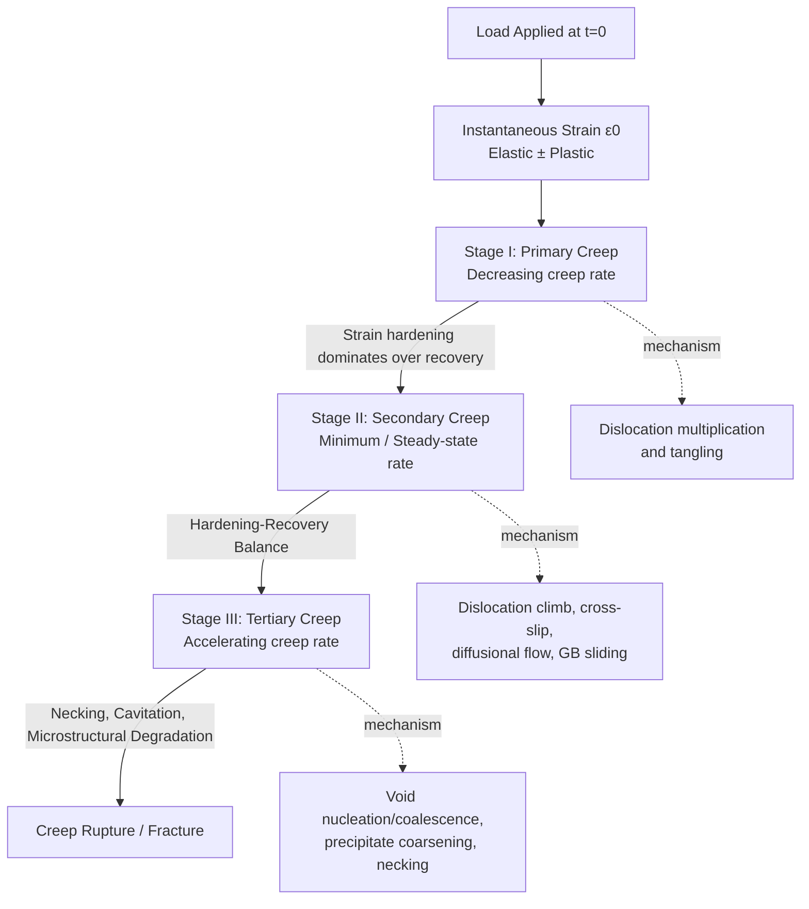

## Stages of the Creep Curve

### Definition

Creep is the time-dependent, permanent (plastic) deformation of a material subjected to a constant stress (or load) at a temperature typically above about $0.4T_m$, where $T_m$ is the absolute melting temperature. The creep curve is a plot of strain (or strain rate) versus time obtained from a constant-load or constant-stress uniaxial tensile test conducted at constant elevated temperature. The shape of this curve reveals three (sometimes four, including instantaneous strain) distinct regions, each governed by different microstructural mechanisms.

### The Complete Creep Curve

A typical engineering creep curve is a plot of strain, $\varepsilon$, against time, $t$, and consists of the following regions in sequence:

1. Instantaneous (elastic/plastic) strain upon loading
2. Primary (Stage I) creep
3. Secondary (Stage II) creep
4. Tertiary (Stage III) creep, ending in rupture

**SVG Diagram: Creep Curve (svg_diagram)**

<svg xmlns="http://www.w3.org/2000/svg" viewBox="0 0 780 480" font-family="Arial, sans-serif">
<text x="390" y="25" font-size="18" font-weight="bold" text-anchor="middle">Strain vs. Time — Stages of the Creep Curve (svg_diagram)</text>

<line x1="80" y1="420" x2="740" y2="420" stroke="black" stroke-width="2" />
<line x1="80" y1="420" x2="80" y2="60" stroke="black" stroke-width="2" />
<text x="410" y="460" font-size="15" text-anchor="middle">Time, t</text>
<text x="30" y="240" font-size="15" text-anchor="middle" transform="rotate(-90 30 240)">Strain, ε</text>

<line x1="80" y1="420" x2="80" y2="360" stroke="black" stroke-width="2" stroke-dasharray="4,3" />
<text x="88" y="395" font-size="12">ε₀ (instantaneous)</text>

<path d="M 80 360 C 140 300, 190 275, 240 265 C 300 258, 350 255, 460 235 C 560 218, 620 190, 660 130 C 685 95, 700 70, 715 55" fill="none" stroke="`#c0392b`" stroke-width="3.5" />

<circle cx="715" cy="55" r="6" fill="#c0392b" />
<text x="690" y="45" font-size="12" font-weight="bold">Rupture</text>

<line x1="240" y1="60" x2="240" y2="420" stroke="gray" stroke-width="1" stroke-dasharray="5,4" />
<line x1="460" y1="60" x2="460" y2="420" stroke="gray" stroke-width="1" stroke-dasharray="5,4" />

<text x="160" y="90" font-size="14" font-weight="bold" text-anchor="middle">Stage I</text>

<text x="160" y="108" font-size="12" text-anchor="middle">Primary</text>

<text x="160" y="124" font-size="11" text-anchor="middle">(decreasing rate)</text>

<text x="350" y="90" font-size="14" font-weight="bold" text-anchor="middle">Stage II</text>

<text x="350" y="108" font-size="12" text-anchor="middle">Secondary</text>

<text x="350" y="124" font-size="11" text-anchor="middle">(steady-state, min rate)</text>

<text x="580" y="90" font-size="14" font-weight="bold" text-anchor="middle">Stage III</text>

<text x="580" y="108" font-size="12" text-anchor="middle">Tertiary</text>

<text x="580" y="124" font-size="11" text-anchor="middle">(accelerating rate)</text>

<line x1="300" y1="260" x2="400" y2="245" stroke="#2980b9" stroke-width="1.5" />
<text x="330" y="280" font-size="11" fill="#2980b9">slope = ε̇ₛ (min. creep rate)</text>

<text x="80" y="440" font-size="12" text-anchor="middle">0</text>

</svg>

### Instantaneous Strain (ε₀)

Upon initial application of load, the specimen undergoes an instantaneous strain, $\varepsilon_0$, that occurs essentially at $t = 0$, before any time-dependent creep mechanism begins.

- **Key Points**
  - This strain is predominantly elastic if the applied stress is below the yield strength at the test temperature.
  - If the stress exceeds the yield strength at temperature, an instantaneous plastic component is also present.
  - $\varepsilon_0$ is not part of "creep" strain itself, but it is included in the total strain axis of the curve and is used as the reference origin for measuring subsequent creep strain.
  - Its magnitude depends on the applied stress and the instantaneous elastic modulus $E(T)$ at the test temperature: $\varepsilon_0 \approx \sigma / E(T)$ for the elastic case.

### Stage I: Primary Creep

Primary creep begins immediately after the instantaneous strain and is characterized by a creep rate ($\dot{\varepsilon} = d\varepsilon/dt$) that is initially high but continuously decreases with time.

- **Key Points**
  - **Mechanism**: The decreasing rate is attributed to strain hardening (work hardening) of the material — dislocation density increases and dislocations begin to interact, tangle, and form substructures (e.g., low-angle sub-boundaries) that impede further dislocation motion.
  - **Competing processes**: Strain hardening dominates over the recovery processes (dislocation climb, annihilation) occurring simultaneously at the test temperature, so the net effect is a decelerating creep rate.
  - The strain in this region is often modeled empirically by Andrade's law or a logarithmic/power-law relation:

    $$\varepsilon_p = \varepsilon_0 + \beta t^{1/3}$$

    or more generally

    $$\varepsilon_p = \varepsilon_0 + K t^{n}$$

    where $n < 1$ (commonly $n \approx 1/3$ for Andrade creep), and $\beta$, $K$ are material/temperature/stress-dependent constants. [Unverified: exact exponent values are material- and regime-specific and determined experimentally.]
  - Primary creep is sometimes subdivided into:
    - **Logarithmic creep**: dominant at lower temperatures, where $\varepsilon \propto \ln t$; associated with rapid exhaustion of easy glide sources.
    - **Andrade (transient) creep**: $t^{1/3}$ dependence, more common at higher temperatures.
  - Duration is typically short relative to secondary creep but can constitute a significant design consideration for components with tight dimensional tolerances (e.g., turbine blade tip clearance).

### Stage II: Secondary (Steady-State) Creep

Secondary creep is the region where the creep rate reaches a roughly constant minimum value, often called the **minimum creep rate** ($\dot{\varepsilon}_s$ or $\dot{\varepsilon}_{min}$), and the strain-time curve is approximately linear.

- **Key Points**
  - **Mechanism**: A dynamic balance (steady state) is established between strain hardening (which tends to reduce the creep rate) and thermally activated recovery processes (dislocation climb, cross-slip, sub-grain boundary migration/annihilation) which continuously restore the material's ability to deform. This balance is why this stage is also termed the **balanced stage**.
  - This is the **most technologically important stage** for engineering design because:
    - It represents the longest duration of the creep life for most engineering alloys under service conditions.
    - The minimum creep rate $\dot{\varepsilon}_s$ is used directly in life-prediction and component design calculations.
  - The minimum/steady-state creep rate depends on stress and temperature according to the **power-law (Norton) creep equation**:

    $$\dot{\varepsilon}_s = A \sigma^n \exp\left(-\dfrac{Q_c}{RT}\right)$$

    where:
    - $A$ = material constant
    - $\sigma$ = applied stress
    - $n$ = stress exponent (typically 3–8 for power-law dislocation creep; $n \approx 1$ for diffusional creep, e.g., Nabarro–Herring or Coble creep)
    - $Q_c$ = activation energy for creep (often close to the activation energy for self-diffusion)
    - $R$ = universal gas constant
    - $T$ = absolute temperature
  - Dominant deformation mechanisms in this stage (mechanism depends on stress/temperature regime, often visualized on a **deformation mechanism map**):
    - **Dislocation glide-climb creep** (power-law creep): dominant at intermediate-to-high stress.
    - **Nabarro–Herring creep**: lattice (bulk) vacancy diffusion, dominant at high temperature and low stress; $\dot{\varepsilon} \propto 1/d^2$ ($d$ = grain size).
    - **Coble creep**: grain-boundary vacancy diffusion, dominant at lower temperature (within the creep regime) and small grain size; $\dot{\varepsilon} \propto 1/d^3$.
    - **Grain boundary sliding**: contributes especially in fine-grained materials and superplastic deformation.
  - Because $\dot{\varepsilon}_s$ is often the smallest (minimum) rate on the whole curve, it is frequently referred to as the **minimum creep rate** rather than strictly "steady-state," since true mechanical steady state (zero curvature) is an idealization; slight curvature is common in real data. [Inference: real engineering alloys rarely show a perfectly linear Stage II; the "steady-state" label is a convenient approximation.]

### Stage III: Tertiary Creep

Tertiary creep is characterized by a rapidly accelerating creep rate that leads to final rupture of the specimen.

- **Key Points**
  - **Mechanism(s)**: The accelerating strain rate results from processes that effectively reduce the load-bearing cross-sectional area or degrade the material's resistance to deformation, including:
    - **Necking** (geometric instability), especially significant in constant-load (rather than constant-stress) tests, where true stress rises as cross-sectional area decreases.
    - **Internal cavitation and microvoid formation/coalescence**, particularly at grain boundaries (grain boundary sliding promotes wedge cracks and cavities, especially at triple points).
    - **Microstructural degradation**: coarsening of precipitates (e.g., loss of coherency or Ostwald ripening of strengthening precipitates), recrystallization, or overaging, which reduces creep resistance.
    - **Formation and growth of internal cracks**, which further reduce effective load-bearing area and can coalesce to cause final fracture.
  - Tertiary creep culminates in **creep rupture** (creep failure), and the total time to this point is the **rupture life** or **time to rupture**, $t_r$, a key design parameter reported in creep-rupture (stress-rupture) testing.
  - In constant-stress tests (where stress is continuously adjusted to compensate for the reducing cross-section), tertiary creep is delayed and sometimes minimized, isolating it from a purely geometric (necking) contribution and better revealing true material-based tertiary mechanisms (cavitation, microstructural degradation).
  - The onset of Stage III is sometimes associated with the point of **minimum creep rate**, i.e., Stage II ends and Stage III begins precisely where $\dot{\varepsilon}$ starts to rise again after passing through its minimum.

### Influence of Stress and Temperature on Curve Shape

- **Key Points**
  - Increasing applied stress or temperature:
    - Increases the instantaneous strain $\varepsilon_0$.
    - Increases the minimum creep rate $\dot{\varepsilon}_s$.
    - Decreases the time to rupture $t_r$.
    - Generally shortens Stage I and Stage II, with Stage III becoming proportionally more prominent.
  - At very low stress/temperature, Stage II (secondary) can dominate almost the entire life, and Stage III may be very brief or nearly absent before fracture.
  - At very high stress/temperature (approaching short-term tensile behavior), the distinct three-stage character can blur, and the curve resembles rapid necking-dominated tensile failure.

**Mermaid Diagram: Relationship Between Creep Stages and Governing Mechanisms**

### Example

Consider a Ni-based superalloy turbine blade tested under a creep-rupture test at constant stress $\sigma = 200\ \text{MPa}$ and constant temperature $T = 950^\circ\text{C}$:

- At $t = 0$: instantaneous elastic strain $\varepsilon_0 \approx 0.2\%$ occurs immediately upon loading.
- **0–50 h (Stage I)**: creep rate decreases from a high initial value as $\gamma'$-precipitate-strengthened dislocation networks form and strain hardening dominates.
- **50–800 h (Stage II)**: a near-constant minimum creep rate $\dot{\varepsilon}_s \approx 1 \times 10^{-8}\ \text{s}^{-1}$ is observed as dislocation climb around $\gamma'$ precipitates balances hardening.
- **800–1000 h (Stage III)**: creep rate accelerates rapidly as $\gamma'$ precipitates coarsen (rafting) and grain boundary cavitation initiates, culminating in rupture at $t_r \approx 1000$ h.

[Inference: specific numerical values above are illustrative and representative of typical superalloy creep-test orders of magnitude, not measured data from a specific certified test.]

### Engineering Significance

- **Key Points**
  - **Design against creep**: Components (e.g., turbine blades, boiler tubes, pressure vessels) operating at elevated temperature for extended service life are designed using the minimum creep rate and/or time-to-rupture data, often via the **Larson–Miller parameter** to extrapolate long-term behavior from shorter-term accelerated tests:

    $$LMP = T(C + \log t_r)$$

    where $C$ is a material constant (often $\approx 20$ for many alloys), $T$ is absolute temperature, and $t_r$ is rupture time.
  - **Creep testing standards**: Creep and creep-rupture testing follow standards such as ASTM E139, which specify constant-load or constant-stress test procedures for generating these curves.
  - Allowable design stresses are typically set to limit creep strain to a small percentage (e.g., 1% strain in 100,000 hours) rather than allowing the material to reach Stage III.

### Next Steps

- **Related Topics**
  - Creep Mechanisms: Dislocation Climb, Nabarro–Herring, and Coble Creep
  - Deformation Mechanism Maps (Ashby Maps)
  - Larson–Miller Parameter and Creep-Rupture Data Extrapolation
  - Creep Testing Methods (ASTM E139) and Stress-Rupture Testing
  - Grain Boundary Sliding and Cavitation
  - Monkman–Grant Relationship (linking minimum creep rate to rupture life)
  - Superalloys and High-Temperature Creep Resistance (γ′ Precipitation Strengthening)
  - Creep-Fatigue Interaction
  - Norton's Power Law and Stress Exponent Determination