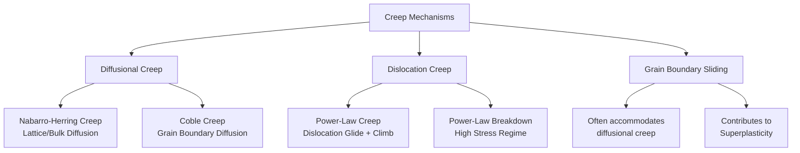

## Creep Mechanisms: Diffusional and Dislocation

### Overview

Creep deformation at elevated temperature ($T > 0.4T_m$) proceeds through several competing microscopic mechanisms, broadly classified into **diffusional creep** (mass transport via vacancy/atom diffusion, negligible dislocation motion) and **dislocation creep** (dislocation glide combined with thermally activated climb). The operative mechanism at any given stress and temperature is determined by which process produces the highest strain rate for the applied conditions, and is commonly represented on a **deformation mechanism map** (Ashby map) with normalized stress ($\sigma/G$) on one axis and homologous temperature ($T/T_m$) on the other.

### Classification of Creep Mechanisms

**Mermaid Diagram: Taxonomy of Creep Mechanisms**

### Diffusional Creep

Diffusional creep is the deformation of a polycrystalline material by the stress-directed flow of vacancies (equivalently, atoms) through the crystal, without significant dislocation glide. It dominates at **low stress** and **high homologous temperature**, and is strongly grain-size dependent.

#### Underlying Physics

- **Key Points**
  - Under an applied tensile stress $\sigma$, grain boundaries oriented perpendicular to the stress axis act as vacancy **sources** (they are under local tension, lowering the energy to create a vacancy there), while boundaries parallel to the stress axis act as vacancy **sinks**.
  - Vacancies flow from tensile (perpendicular) boundaries to compressive (parallel) boundaries; equivalently, atoms flow in the opposite direction, causing the grain to elongate in the stress direction.
  - This process requires **no dislocation activity** — it is essentially controlled diffusion, so the resulting creep rate is directly derivable from Fick's law-based flux equations.

#### Nabarro–Herring (N-H) Creep

Nabarro–Herring creep is diffusional creep in which vacancy transport occurs through the **bulk lattice (volume diffusion)**.

- **Key Points**
  - Dominant at **high temperature** (close to $T_m$) and **very low stress**, where lattice diffusivity is high enough to be the fastest transport path.
  - The steady-state strain rate is given by:

    $$\dot{\varepsilon}_{NH} = \dfrac{D_L \sigma \Omega}{d^2 k T}$$

    where:
    - $D_L$ = lattice (volume) self-diffusion coefficient
    - $\sigma$ = applied stress
    - $\Omega$ = atomic volume
    - $d$ = grain diameter
    - $k$ = Boltzmann constant
    - $T$ = absolute temperature
  - **Grain size dependence**: $\dot{\varepsilon}_{NH} \propto 1/d^2$ — strain rate is strongly reduced by larger grain size, since diffusion distances scale with grain diameter.
  - **Stress dependence**: linear (stress exponent $n = 1$), distinguishing it from power-law dislocation creep.
  - Because $D_L = D_0 \exp(-Q_L/RT)$, N-H creep has an activation energy $Q_L$ essentially equal to the activation energy for **lattice self-diffusion**.

#### Coble Creep

Coble creep is diffusional creep in which vacancy transport occurs preferentially along **grain boundaries (grain boundary diffusion)** rather than through the bulk lattice.

- **Key Points**
  - Dominant at **lower temperatures** than N-H creep (though still within the elevated-temperature creep regime) and in **fine-grained materials**, because grain boundary diffusion has a lower activation energy than lattice diffusion and becomes relatively faster as $T$ decreases.
  - Strain rate:

    $$\dot{\varepsilon}_{Coble} = \dfrac{\delta D_{gb} \sigma \Omega}{d^3 k T}$$

    where $\delta$ is the effective grain boundary width and $D_{gb}$ is the grain boundary diffusion coefficient.
  - **Grain size dependence**: $\dot{\varepsilon}_{Coble} \propto 1/d^3$ — even more sensitive to grain size than N-H creep, because both the diffusion path length and the boundary area available for diffusion scale with $d$.
  - **Stress dependence**: linear ($n = 1$), same as N-H creep.
  - Activation energy $Q_{gb}$ is typically **lower** than the lattice self-diffusion activation energy ($Q_{gb} \approx 0.5$–$0.6\, Q_L$, [Inference: exact ratio is material-dependent]), which is why Coble creep can dominate at lower homologous temperatures where lattice diffusion is too sluggish.

#### Comparison: Nabarro-Herring vs. Coble Creep

| Feature | Nabarro–Herring | Coble |
| --- | --- | --- |
| Diffusion path | Through grain (lattice/bulk) | Along grain boundaries |
| Grain size dependence | $\propto 1/d^2$ | $\propto 1/d^3$ |
| Stress exponent, $n$ | 1 | 1 |
| Dominant temperature regime | Higher $T/T_m$ | Lower $T/T_m$ (within creep regime) |
| Activation energy | $Q_L$ (lattice self-diffusion) | $Q_{gb}$ (grain boundary diffusion, lower) |
| Grain size sensitivity | High | Very high |

### Dislocation (Power-Law) Creep

Dislocation creep is the dominant mechanism at **intermediate-to-high stress** and moderate-to-high homologous temperature, and involves the combined action of dislocation **glide** and thermally activated **climb**.

#### Mechanism

- **Key Points**
  - Dislocations glide on their slip planes until they encounter obstacles (precipitates, forest dislocations, solute atoms), where they become pinned or piled up.
  - At elevated temperature, dislocations can **climb** out of their slip plane by absorbing or emitting vacancies, allowing them to bypass obstacles and continue gliding on a new plane.
  - This **glide-climb sequence** repeats, allowing continuous, time-dependent plastic strain even though the instantaneous stress may be below what is needed for pure athermal (obstacle-bypassing) glide.
  - Because climb requires vacancy diffusion to/from the dislocation core, the rate-controlling step is typically **self-diffusion**, and this mechanism is often termed **climb-controlled creep**.

#### Norton's Power-Law Equation

$$\dot{\varepsilon}_s = A \left(\dfrac{\sigma}{G}\right)^n \dfrac{D_L G b}{kT}$$

or in simplified engineering form:

$$\dot{\varepsilon}_s = A' \sigma^n \exp\left(-\dfrac{Q_c}{RT}\right)$$

- **Key Points**
  - $n$ (stress exponent) is typically in the range **3–8** for pure metals and solid-solution/precipitate-strengthened alloys undergoing dislocation creep, in contrast to $n=1$ for diffusional creep.
  - $Q_c$ (activation energy for creep) is generally close to the activation energy for **lattice self-diffusion**, confirming that vacancy diffusion to dislocation cores (climb) is rate-controlling.
  - Unlike diffusional creep, power-law dislocation creep shows **little to no grain-size dependence**, since deformation occurs through the bulk grain interior via dislocation motion rather than boundary-mediated diffusion.
  - $G$ = shear modulus, $b$ = Burgers vector magnitude — both used to normalize stress and diffusion terms for cross-material comparison.

#### Power-Law Breakdown

- **Key Points**
  - At sufficiently high stress (typically $\sigma/G > 10^{-3}$, [Unverified: threshold is material-dependent]), the simple power-law relation with constant $n$ no longer fits experimental data — the apparent stress exponent increases sharply, a phenomenon called **power-law breakdown**.
  - This is often modeled using a **hyperbolic-sine (sinh) law**:

    $$\dot{\varepsilon}_s = A \left[\sinh(\alpha \sigma)\right]^n \exp\left(-\dfrac{Q_c}{RT}\right)$$

    which asymptotically reduces to power-law behavior at low stress and exponential behavior at high stress.
  - Physically, breakdown corresponds to the transition where dislocation glide (rather than climb) becomes rate-limiting, or where obstacle-bypassing mechanisms approach athermal yielding.

### Deformation Mechanism Maps

A deformation mechanism map plots normalized shear stress ($\tau/G$) versus homologous temperature ($T/T_m$), with fields delineating the regime in which each mechanism produces the dominant (fastest) strain rate, often overlaid with iso-strain-rate contours.

**SVG Diagram: Schematic Deformation Mechanism Map (svg_diagram)**

<svg xmlns="http://www.w3.org/2000/svg" viewBox="0 0 760 500" font-family="Arial, sans-serif">
<text x="380" y="25" font-size="18" font-weight="bold" text-anchor="middle">Deformation Mechanism Map — Schematic (svg_diagram)</text>

<line x1="90" y1="440" x2="700" y2="440" stroke="black" stroke-width="2" />
<line x1="90" y1="440" x2="90" y2="60" stroke="black" stroke-width="2" />
<text x="395" y="475" font-size="15" text-anchor="middle">Homologous Temperature, T / Tm</text>
<text x="35" y="250" font-size="15" text-anchor="middle" transform="rotate(-90 35 250)">Normalized Stress, σ / G</text>

<text x="90" y="455" font-size="12" text-anchor="middle">0</text>

<text x="700" y="455" font-size="12" text-anchor="middle">1.0</text>

<rect x="90" y="60" width="610" height="60" fill="#f5cba7" opacity="0.6" />
<text x="395" y="95" font-size="13" text-anchor="middle" font-weight="bold">Dislocation Glide (Plastic Flow)</text>

<path d="M 90 120 L 700 120 L 700 300 L 250 300 L 90 220 Z" fill="#aed6f1" opacity="0.6" />
<text x="480" y="200" font-size="13" text-anchor="middle" font-weight="bold">Dislocation (Power-Law) Creep</text>
<text x="480" y="218" font-size="11" text-anchor="middle">n ≈ 3–8, grain-size independent</text>

<path d="M 90 220 L 250 300 L 90 340 Z" fill="#a9dfbf" opacity="0.7" />
<text x="150" y="270" font-size="11" text-anchor="middle" font-weight="bold">Coble</text>

<path d="M 250 300 L 700 300 L 700 400 L 250 400 Z" fill="#d7bde2" opacity="0.6" />
<text x="480" y="350" font-size="13" text-anchor="middle" font-weight="bold">Nabarro–Herring Creep</text>
<text x="480" y="368" font-size="11" text-anchor="middle">n = 1, ∝ 1/d²</text>

<rect x="90" y="400" width="610" height="40" fill="#eaeded" opacity="0.8" />
<text x="395" y="424" font-size="12" text-anchor="middle">Elastic Regime (negligible creep)</text>

<path d="M 150 130 C 300 250, 450 320, 650 390" fill="none" stroke="#333" stroke-width="1" stroke-dasharray="3,3" />
<text x="580" y="400" font-size="10" fill="#333">ε̇ = const. contour</text>
</svg>

### Grain Boundary Sliding (GBS)

Grain boundary sliding is the relative displacement of adjacent grains along their common boundary, contributing to overall strain, especially in fine-grained materials.

- **Key Points**
  - GBS rarely acts alone; it must be **accommodated** by another mechanism (diffusional flow at grain boundaries/triple points, or limited dislocation motion) to maintain grain boundary continuity and avoid void formation.
  - It contributes significantly to **superplastic deformation** in fine-grained alloys under specific temperature/strain-rate windows, where extremely large tensile elongations (hundreds of percent) can be achieved.
  - Unaccommodated GBS at triple points is a key contributor to **cavitation and tertiary creep damage** (see Stages of the Creep Curve, Stage III).

### Identifying the Active Mechanism Experimentally

- **Key Points**
  - **Stress exponent, $n$**: determined from the slope of $\log \dot{\varepsilon}_s$ vs. $\log \sigma$ plots at constant $T$.
    - $n \approx 1$ → diffusional creep (N-H or Coble)
    - $n \approx 3$–8 → dislocation (power-law) creep
    - $n$ increasing sharply → power-law breakdown
  - **Activation energy, $Q_c$**: determined from Arrhenius plots ($\ln \dot{\varepsilon}_s$ vs. $1/T$) at constant $\sigma$; comparison with known $Q_L$ (lattice) or $Q_{gb}$ (grain boundary) diffusion activation energies identifies the rate-controlling diffusion path.
  - **Grain size sensitivity**: systematically varying grain size (e.g., via heat treatment) and observing $\dot{\varepsilon}_s \propto 1/d^p$ distinguishes N-H ($p=2$), Coble ($p=3$), or dislocation creep (grain-size independent, $p \approx 0$).

### Example

For a coarse-grained austenitic stainless steel component operating at $T = 650^\circ\text{C}$ ($T/T_m \approx 0.5$) under a moderate applied stress ($\sigma/G \approx 10^{-4}$):

- A deformation mechanism map for this alloy would likely place the operating point within the **dislocation (power-law) creep** field, since intermediate stress and moderate-to-high temperature favor climb-controlled dislocation motion over diffusional flow (which requires either very fine grain size or very low stress to dominate).
- If the same component were re-designed with a much finer grain size (e.g., via grain-boundary-strengthened processing) and operated at lower stress, the dominant mechanism could shift toward **Coble creep**, since finer grains dramatically increase $\dot{\varepsilon}_{Coble} \propto 1/d^3$ relative to power-law creep (which is grain-size independent).

[Inference: exact field boundaries and dominant mechanism depend on the specific alloy's diffusion coefficients, grain size, and stress/temperature values; deformation mechanism maps are alloy-specific and must be constructed or referenced from experimental data for quantitative design use.]

### Engineering Implications

- **Key Points**
  - **Grain size control** is a key creep-resistance design lever: coarse-grained or single-crystal microstructures (e.g., directionally solidified or single-crystal turbine blades) suppress diffusional creep and grain boundary sliding by eliminating or minimizing grain boundaries.
  - **Solid-solution and precipitation strengthening** raise the stress needed for dislocation glide, effectively increasing the threshold stress for dislocation creep and shifting the map's dislocation-creep boundary to higher $\sigma/G$.
  - **Dispersion strengthening** (e.g., oxide-dispersion-strengthened, ODS alloys) pins dislocations and grain boundaries simultaneously, suppressing both dislocation climb and diffusional/GBS mechanisms.

### Next Steps

- **Related Topics**
  - Stages of the Creep Curve
  - Deformation Mechanism Maps (Ashby Maps) — Construction and Use
  - Larson–Miller Parameter and Time-Temperature Extrapolation
  - Superplasticity and Fine-Grained Deformation
  - Creep-Resistant Alloy Design (Single-Crystal Superalloys, ODS Alloys)
  - Monkman–Grant Relationship
  - Diffusion in Solids: Fick's Laws, Self-Diffusion, and Grain Boundary Diffusion
  - Creep Cavitation and Grain Boundary Damage