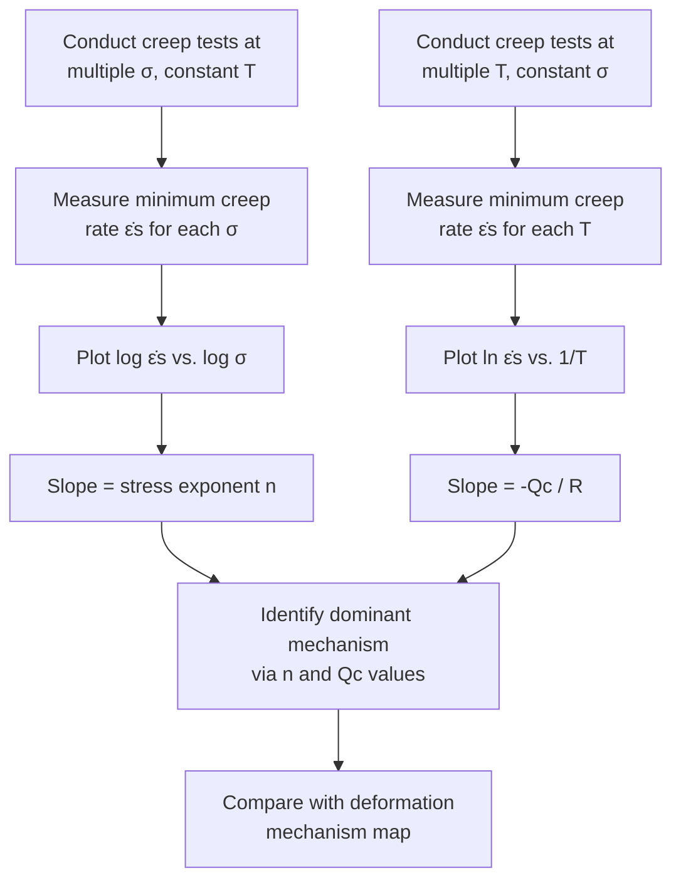

## Stress and Temperature Dependence of Creep

### Overview

The steady-state (minimum) creep rate, $\dot{\varepsilon}_s$, is not a material constant — it varies strongly and predictably with applied stress $\sigma$ and absolute temperature $T$. Quantifying this dependence is central to creep life prediction, alloy design, and extrapolation of short-term test data to long-term service conditions. The combined stress-temperature dependence is most commonly expressed through the **power-law creep equation**, with temperature entering via an **Arrhenius (activation energy) term**.

### The General Creep Rate Equation

$$\dot{\varepsilon}_s = A \sigma^n \exp\left(-\dfrac{Q_c}{RT}\right)$$

- **Key Points**
  - $A$ = material/structure-dependent constant (depends on microstructure, grain size for diffusional regimes, etc.)
  - $\sigma$ = applied (engineering or true) stress
  - $n$ = **stress exponent**, describing sensitivity of creep rate to stress
  - $Q_c$ = **activation energy for creep**, describing sensitivity of creep rate to temperature
  - $R$ = universal gas constant ($8.314\ \text{J/mol·K}$)
  - $T$ = absolute temperature (K)
  - This equation is often called the **Norton–Bailey** or simply **Norton's law** when temperature is held constant ($\dot{\varepsilon}_s = A'\sigma^n$), and the **Arrhenius/Dorn equation** when stress is held constant ($\dot{\varepsilon}_s = A''\exp(-Q_c/RT)$).

### Stress Dependence

#### The Stress Exponent, n

The stress exponent $n$ is obtained from the slope of a $\log \dot{\varepsilon}_s$ vs. $\log \sigma$ plot at constant temperature:

$$n = \left(\dfrac{\partial \ln \dot{\varepsilon}_s}{\partial \ln \sigma}\right)_T$$

- **Key Points**
  - **$n \approx 1$**: Diffusional creep (Nabarro–Herring or Coble) — strain rate is linearly proportional to stress, consistent with a Newtonian-viscous flow mechanism controlled by vacancy diffusion.
  - **$n \approx 3$–8**: Dislocation (power-law) creep — the dominant mechanism in most structural metals and alloys at engineering stress/temperature combinations; climb-controlled dislocation motion.
  - **$n \approx 2$**: Sometimes associated with grain boundary sliding as a significant contributing mechanism.
  - **$n$ increasing sharply (often >8, up to 20+)**: **Power-law breakdown** at high stress, where the simple power-law description fails and glide (rather than climb) becomes rate-controlling.
  - $n$ is not universal — it is alloy- and microstructure-specific, and can itself vary with the stress and temperature regime for a single material (different mechanisms dominate in different regimes, per the deformation mechanism map).

#### Power-Law Breakdown and the Sinh Law

At high stress (typically $\sigma/G \gtrsim 10^{-3}$, [Unverified: exact threshold is material-dependent]), a hyperbolic-sine formulation better captures the transition:

$$\dot{\varepsilon}_s = A[\sinh(\alpha \sigma)]^n \exp\left(-\dfrac{Q_c}{RT}\right)$$

- **Key Points**
  - $\alpha$ = an empirical stress-scaling constant.
  - At low $\alpha\sigma$: $\sinh(\alpha\sigma) \approx \alpha\sigma$, recovering simple power-law behavior.
  - At high $\alpha\sigma$: $\sinh(\alpha\sigma) \approx \tfrac{1}{2}e^{\alpha\sigma}$, giving quasi-exponential stress dependence, matching observed high-stress creep acceleration.

### Temperature Dependence

#### The Activation Energy for Creep, Qc

The activation energy is obtained from the slope of a $\ln \dot{\varepsilon}_s$ vs. $1/T$ (Arrhenius) plot at constant stress:

$$Q_c = -R\left(\dfrac{\partial \ln \dot{\varepsilon}_s}{\partial (1/T)}\right)_\sigma$$

- **Key Points**
  - For **dislocation (power-law) creep**, $Q_c$ is typically close to the activation energy for **lattice self-diffusion**, $Q_L$, confirming that vacancy diffusion to/from dislocation cores (climb) is the rate-controlling step.
  - For **Nabarro–Herring creep**, $Q_c \approx Q_L$ (lattice diffusion) as well, since it is bulk-diffusion controlled.
  - For **Coble creep**, $Q_c \approx Q_{gb}$ (grain boundary diffusion activation energy), which is generally **lower** than $Q_L$ — typically on the order of $0.5$–$0.6\,Q_L$. [Inference: precise ratio varies by material system.]
  - In alloys with precipitate strengthening, an **effective (apparent) activation energy** can differ from pure self-diffusion values due to additional contributions from precipitate coarsening kinetics or solute drag effects. [Unverified: magnitude is highly alloy-specific.]
  - Because $Q_c$ appears in an exponential term, creep rate is **extremely sensitive** to small changes in absolute temperature — a modest increase in service temperature can reduce component life by orders of magnitude.

#### Homologous Temperature and Regime Transitions

- **Key Points**
  - Creep becomes technologically significant above approximately $T \approx 0.4\,T_m$ (homologous temperature), where $T_m$ is the absolute melting point of the material.
  - As $T/T_m$ increases:
    - Diffusion coefficients increase exponentially, raising both diffusional and dislocation creep rates.
    - The dominant mechanism can shift (e.g., from Coble creep at lower $T/T_m$ toward Nabarro–Herring creep at higher $T/T_m$, per deformation mechanism maps), because grain boundary diffusion typically has a lower activation energy and grows relatively less important as bulk diffusion "catches up" at high temperature.

### Combined Stress-Temperature Behavior: Graphical Representation

**SVG Diagram: Log Creep Rate vs. Log Stress at Multiple Temperatures (svg_diagram)**

<svg xmlns="http://www.w3.org/2000/svg" viewBox="0 0 760 480" font-family="Arial, sans-serif">
<text x="380" y="25" font-size="18" font-weight="bold" text-anchor="middle">Stress Dependence of Creep Rate at Multiple Temperatures (svg_diagram)</text>

<line x1="90" y1="420" x2="700" y2="420" stroke="black" stroke-width="2" />
<line x1="90" y1="420" x2="90" y2="60" stroke="black" stroke-width="2" />
<text x="395" y="455" font-size="15" text-anchor="middle">log (Stress, σ)</text>
<text x="35" y="250" font-size="15" text-anchor="middle" transform="rotate(-90 35 250)">log (Min. Creep Rate, ε̇s)</text>

<line x1="130" y1="380" x2="640" y2="130" stroke="#2980b9" stroke-width="3" />
<text x="645" y="128" font-size="13" fill="#2980b9" font-weight="bold">T3 (highest)</text>
<line x1="130" y1="340" x2="600" y2="180" stroke="#27ae60" stroke-width="3" />
<text x="605" y="178" font-size="13" fill="#27ae60" font-weight="bold">T2</text>
<line x1="130" y1="300" x2="560" y2="230" stroke="#c0392b" stroke-width="3" />
<text x="565" y="228" font-size="13" fill="#c0392b" font-weight="bold">T1 (lowest)</text>

<text x="220" y="360" font-size="12" font-style="italic">slope = n (stress exponent)</text>

<line x1="200" y1="355" x2="200" y2="330" stroke="black" stroke-width="1" />

<line x1="200" y1="330" x2="230" y2="330" stroke="black" stroke-width="1" />

</svg>

**Mermaid Diagram: Determining n and Qc from Creep Data**

### Effect on the Full Creep Curve

- **Key Points**
  - **Increasing stress (constant T)**:
    - Increases instantaneous strain $\varepsilon_0$.
    - Increases minimum creep rate $\dot{\varepsilon}_s$ (per the power-law relation).
    - Decreases rupture time $t_r$.
    - Shortens Stage I and Stage II, making Stage III proportionally more prominent.
  - **Increasing temperature (constant $\sigma$)**:
    - Similarly increases $\varepsilon_0$, $\dot{\varepsilon}_s$, and decreases $t_r$ — but through the exponential Arrhenius term rather than the power-law stress term.
    - Can shift the dominant mechanism (e.g., toward diffusional creep) if temperature increases significantly while stress remains low.
  - These trends are the basis for accelerated creep testing, where tests are run at higher stress/temperature than service conditions to obtain data in a practical timeframe, then extrapolated back to service conditions using parametric methods.

### Extrapolation Methods: Larson–Miller Parameter

Because service life (often decades) cannot be tested directly in a laboratory timeframe, engineers use time-temperature parameters to extrapolate short-term high-temperature/high-stress data to long-term service conditions.

$$LMP = T(C + \log_{10} t_r)$$

- **Key Points**
  - $T$ = absolute temperature (K or °R depending on convention)
  - $t_r$ = rupture time (hours)
  - $C$ = material constant, often approximated as $\approx 20$ for many engineering alloys [Unverified: value is alloy- and dataset-specific and should be determined experimentally via regression]
  - A master curve of stress vs. $LMP$, generated from a range of short-term high-temperature/high-stress tests, can be used to predict $t_r$ for a lower stress/temperature combination corresponding to actual service conditions, exploiting the fact that different $(T, t_r)$ combinations yielding the same $LMP$ correspond to comparable creep damage states.
  - This method assumes that the same underlying mechanism (and thus the same $Q_c$/$n$ regime) operates across the extrapolated range — a critical caveat, since extrapolating across a mechanism transition (e.g., from dislocation creep into diffusional creep territory) can produce significant errors. [Inference: extrapolation reliability degrades if test conditions and service conditions fall into different mechanism-map regimes.]

### Example

A Cr-Mo steel is creep-tested at $600^\circ\text{C}$ under two stress levels:

- At $\sigma_1 = 150\ \text{MPa}$: $\dot{\varepsilon}_{s,1} = 2 \times 10^{-7}\ \text{s}^{-1}$
- At $\sigma_2 = 200\ \text{MPa}$: $\dot{\varepsilon}_{s,2} = 1.2 \times 10^{-6}\ \text{s}^{-1}$

Using $\dot{\varepsilon}_s = A\sigma^n$:

$$n = \dfrac{\ln(\dot{\varepsilon}_{s,2}/\dot{\varepsilon}_{s,1})}{\ln(\sigma_2/\sigma_1)} = \dfrac{\ln(1.2\times10^{-6}/2\times10^{-7})}{\ln(200/150)} = \dfrac{\ln(6)}{\ln(1.333)} \approx \dfrac{1.792}{0.2877} \approx 6.2$$

This stress exponent ($n \approx 6.2$) falls within the typical range for **dislocation (power-law) creep** ($n \approx 3$–8), indicating that climb-controlled dislocation motion is the dominant mechanism under these test conditions rather than diffusional creep. [Inference: numerical values are illustrative for demonstrating the calculation method, not measured data from a specific certified test program.]

### Engineering Implications

- **Key Points**
  - Because $\dot{\varepsilon}_s$ depends on $\sigma^n$ with $n$ often $\geq 5$, modest stress reductions (e.g., 10%) in component design can produce large creep-life improvements — this underlies the strong emphasis on minimizing operating stresses in creep-limited design (e.g., turbine blade root fillet design, thick-wall pressure vessel design).
  - Because $\dot{\varepsilon}_s$ depends exponentially on $1/T$, tight control of service temperature (e.g., turbine cooling design, thermal barrier coatings) has an outsized effect on component life compared to comparable percentage changes in stress.
  - Alloy designers manipulate $A$, $n$, and $Q_c$ through microstructural control — grain size, precipitate strengthening, solid-solution strengthening — to shift the entire creep-rate curve to lower rates at a given $(\sigma, T)$.

### Next Steps

- **Related Topics**
  - Stages of the Creep Curve
  - Creep Mechanisms: Diffusional and Dislocation
  - Larson–Miller Parameter and Time-Temperature Extrapolation Methods
  - Deformation Mechanism Maps (Ashby Maps)
  - Monkman–Grant Relationship (Rupture Life vs. Minimum Creep Rate)
  - Creep-Resistant Alloy Design (Solid-Solution, Precipitation, Dispersion Strengthening)
  - Accelerated Creep Testing and Data Extrapolation Methods
  - Arrhenius Behavior in Diffusion-Controlled Processes