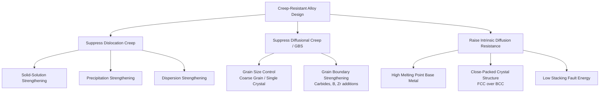

## Creep Resistant Alloy Design

### Overview

Creep-resistant alloy design aims to minimize steady-state creep rate $\dot{\varepsilon}_s$ and maximize rupture life $t_r$ at a given service stress and temperature by microstructurally suppressing the mechanisms — dislocation glide/climb, diffusional flow, and grain boundary sliding — responsible for time-dependent deformation. Design strategies act on the constants in the governing creep equation:

$$\dot{\varepsilon}_s = A \sigma^n \exp\left(-\dfrac{Q_c}{RT}\right)$$

by increasing the effective activation energy $Q_c$, reducing the pre-exponential structure factor $A$, or raising the threshold stress required to activate dislocation motion.

### Design Strategy Taxonomy

**Mermaid Diagram: Creep-Resistant Alloy Design Strategies**

### Solid-Solution Strengthening

- **Key Points**
  - Substitutional or interstitial solute atoms with a size or modulus mismatch relative to the solvent lattice create local strain fields that interact with dislocations, impeding both glide and climb.
  - **Solute drag effect**: solutes that segregate to and migrate with dislocations (Cottrell atmospheres) reduce dislocation velocity, directly lowering the dislocation-creep pre-exponential factor $A$.
  - Large-atomic-radius, slow-diffusing solutes (e.g., **W, Mo, Re, Ta** in Ni-based superalloys) are particularly effective because their own sluggish diffusivity limits solute rearrangement and also reduces the self-diffusion coefficient that controls climb.
  - **Example**: Addition of Mo and W to Ni-based alloys increases the lattice friction stress and raises the effective activation energy for creep by slowing the vacancy diffusion that controls dislocation climb.

### Precipitation Strengthening

Precipitation (age) hardening is the dominant creep-resistance mechanism in high-performance superalloys, where coherent or semi-coherent second-phase particles act as strong, stable obstacles to dislocation motion.

- **Key Points**
  - **Mechanism**: Dislocations must either shear through precipitates (requiring extra energy to create new precipitate/matrix interface, if coherent) or bypass them via **Orowan looping**, both of which raise the stress needed for continued glide and slow climb-assisted bypass.
  - **γ′ (gamma-prime) precipitates** ($\text{Ni}_3(\text{Al,Ti})$) in Ni-based superalloys are the archetypal example:
    - Coherent, ordered $L1_2$ structure with low lattice mismatch to the γ matrix, giving excellent thermal stability.
    - Volume fractions can reach 60–70% in advanced single-crystal superalloys, essentially embedding the γ matrix as a minority constituent.
  - **Precipitate stability is critical**: at service temperature, precipitates must resist **coarsening (Ostwald ripening)**, governed by the LSW (Lifshitz-Slyozov-Wagner) theory, where average precipitate radius grows as $\bar{r}^3 - \bar{r}_0^3 \propto t$. Coarsening reduces the precipitate/matrix interfacial area and weakens the obstacle density, degrading creep resistance over long exposure times — this is a key contributor to **Stage III (tertiary) creep** in service-aged superalloys.
  - **Rafting**: under combined high temperature and directional (uniaxial) stress, γ′ precipitates in single-crystal superalloys can coalesce into elongated plates ("rafts") aligned perpendicular or parallel to the stress axis depending on the sign of lattice misfit, which can further alter (often improve, in the perpendicular-to-stress orientation) creep resistance in the secondary/tertiary regime. [Inference: whether rafting improves or degrades creep resistance depends on misfit sign and loading direction, and is alloy/orientation specific.]

### Dispersion Strengthening

Dispersion-strengthened alloys use thermodynamically stable, incoherent second-phase particles (typically oxides) that do not dissolve or coarsen significantly even near the melting point.

- **Key Points**
  - **Oxide Dispersion Strengthened (ODS) alloys** (e.g., yttria ($\text{Y}_2\text{O}_3$)-dispersed Fe- or Ni-base alloys) incorporate fine, stable oxide particles via powder metallurgy (mechanical alloying) routes rather than precipitation from solid solution.
  - Because oxide dispersoids are essentially insoluble in the matrix and highly thermally stable, they resist coarsening far better than intermetallic precipitates like γ′, extending creep resistance to **higher homologous temperatures** than precipitation-strengthened alloys can typically sustain.
  - Dispersoids also **pin grain boundaries** (Zener pinning), which additionally suppresses grain growth and grain boundary sliding contributions to creep.
  - Trade-off: ODS alloys are typically more difficult and costly to process (mechanical alloying, hot consolidation) compared to conventional cast/wrought precipitation-strengthened alloys. [Unverified: relative cost varies significantly by application and production scale.]

### Grain Size and Grain Boundary Engineering

Because diffusional creep (Nabarro-Herring $\propto 1/d^2$, Coble $\propto 1/d^3$) and grain boundary sliding both scale strongly with grain boundary area, controlling grain structure is a primary creep-resistance lever, especially at low stress/high temperature.

- **Key Points**
  - **Coarse-grain processing**: increasing grain size directly suppresses diffusional and GBS contributions, since both scale inversely with grain diameter.
  - **Directional solidification (DS)**: columnar grains are grown parallel to the primary stress axis (e.g., turbine blade radial direction), eliminating transverse grain boundaries that would otherwise be susceptible to boundary sliding and normal-stress cavitation.
  - **Single-crystal (SX) casting**: eliminates grain boundaries entirely, removing diffusional creep along boundaries and grain boundary sliding as contributing mechanisms altogether — the most creep-resistant class of superalloy microstructure, used in the highest-temperature turbine blade stages.
  - **Grain boundary strengthening additions** (for polycrystalline alloys where boundaries must be retained): trace additions of **B, Zr, Hf, C** segregate to grain boundaries, forming boundary carbides/borides that pin boundaries against sliding and migration, and can reduce grain boundary diffusivity.
  - **MC/M23C6 carbides** at grain boundaries in Ni-superalloys and steels serve a dual role: pinning grain boundaries against sliding while also acting as minor dispersion-strengthening obstacles.

### Base Metal and Crystal Structure Selection

- **Key Points**
  - **High melting point base metals** intrinsically resist creep because diffusion coefficients (and thus creep rates, at a given absolute service temperature) scale with homologous temperature $T/T_m$ — a higher $T_m$ pushes the onset of significant creep to a higher absolute service temperature. This underlies the progression from Fe-base → Ni-base → Co-base → refractory-metal-base (Mo, Nb, W) alloys for increasingly demanding high-temperature applications.
  - **Crystal structure**: FCC metals (e.g., Ni, austenitic Fe) generally offer better high-temperature creep resistance than BCC metals at comparable homologous temperatures, in part due to more numerous close-packed slip systems distributing strain more uniformly and different self-diffusion characteristics. [Inference: this is a generalized trend; specific comparative creep performance depends on the full alloy system, not crystal structure alone.]
  - **Stacking fault energy (SFE)**: low-SFE alloys promote wider dislocation dissociation into partials, which suppresses cross-slip and climb-assisted recovery, generally increasing creep resistance by slowing the recovery process that otherwise balances strain hardening in Stage II creep.

### Comparative Summary of Strengthening Approaches

| Strategy | Primary Mechanism Suppressed | Thermal Stability | Typical Application |
| --- | --- | --- | --- |
| Solid-solution strengthening | Dislocation glide/climb | Good (no coarsening) but limited magnitude | Stainless/heat-resistant steels, superalloy matrix |
| Precipitation strengthening (γ′) | Dislocation glide/climb (Orowan/shearing) | Limited by coarsening at very high T | Ni-base superalloys (turbine blades, discs) |
| Dispersion strengthening (ODS) | Dislocation glide/climb | Excellent (minimal coarsening) | Ultra-high-temperature Fe/Ni ODS alloys |
| Coarse grain / DS / SX processing | Diffusional creep, GBS | N/A (structural, not phase-based) | Turbine blades (DS, SX) |
| Grain boundary segregants (B, Zr, C) | Grain boundary sliding, GB diffusion | Good | Polycrystalline superalloys, creep-resistant steels |

### Example

Designing a Ni-based superalloy for a first-stage turbine blade operating at $\sim 1000^\circ\text{C}$:

- **Base**: Ni chosen for its high $T_m$ (~1453°C) and stable FCC (γ) matrix.
- **Solid-solution strengthening**: additions of Co, Cr, W, Mo, Re raise lattice friction stress and slow self-diffusion.
- **Precipitation strengthening**: Al and Ti additions form coherent γ′ ($\text{Ni}_3(\text{Al,Ti})$) at high volume fraction (up to ~60–70%), providing the primary creep-resistance mechanism via Orowan bypass and shearing resistance.
- **Grain boundary elimination**: the blade is cast as a **single crystal**, removing grain boundaries entirely to suppress diffusional creep and GBS, which would otherwise dominate at this high homologous temperature ($T/T_m \approx 0.7$–0.75) and relatively low in-service stress.
- **Result**: this combination allows service stresses and temperatures that would rapidly rupture a simple solid-solution Ni-Cr alloy, extending usable creep life to tens of thousands of hours. [Inference: specific life figures depend on exact alloy composition, casting quality, and service stress profile; illustrative only.]

### Trade-offs and Design Constraints

- **Key Points**
  - Precipitation and solid-solution strengthening additions that improve creep resistance often reduce **room-temperature ductility/toughness** or promote formation of embrittling **topologically close-packed (TCP) phases** (e.g., σ, μ phases) if refractory element content (W, Mo, Re) is too high — alloy design requires balancing creep strength against phase stability (often assessed via PHACOMP or CALPHAD-based methods). [Unverified: specific TCP-phase risk thresholds are alloy-composition-dependent and typically determined via thermodynamic modeling or empirical calibration.]
  - Single-crystal and directionally solidified processing significantly increase **manufacturing cost and complexity** compared to conventional equiaxed casting, restricting their use to the highest-value, highest-temperature components.
  - ODS alloy processing (mechanical alloying) limits achievable component geometries and can complicate joining/welding compared to conventional wrought or cast alloys. [Unverified: processing limitations vary by specific ODS alloy system and consolidation route.]
  - Creep-resistance improvements must be balanced against **fatigue resistance**, since microstructures optimized for pure creep resistance (e.g., very coarse grain, single crystal) can behave differently under cyclic/thermomechanical fatigue loading — this trade-off is addressed under creep-fatigue interaction design.

### Next Steps

- **Related Topics**
  - Stages of the Creep Curve
  - Creep Mechanisms: Diffusional and Dislocation
  - Stress and Temperature Dependence of Creep
  - Ni-Based Superalloys: Composition and Microstructure
  - Directional Solidification and Single-Crystal Casting
  - Precipitate Coarsening Kinetics (Ostwald Ripening, LSW Theory)
  - Topologically Close-Packed (TCP) Phase Formation and Alloy Stability
  - Creep-Fatigue Interaction
  - Oxide Dispersion Strengthened (ODS) Alloy Processing