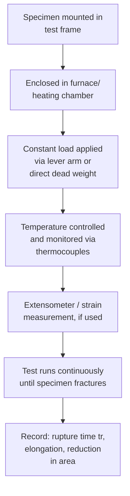

## Stress Rupture Testing

### Definition

Stress rupture testing (also called creep-rupture testing) is a mechanical test in which a specimen is subjected to a constant load (or, in constant-stress variants, a continuously adjusted load) at a constant elevated temperature until fracture occurs. Unlike a standard creep test, which primarily emphasizes strain-time behavior (particularly the minimum/secondary creep rate), stress rupture testing places primary emphasis on the **time to fracture (rupture life, $t_r$)** and the **strain at fracture**, characterizing the full creep curve through tertiary creep to failure.

### Distinction: Creep Testing vs. Stress Rupture Testing

- **Key Points**
  - **Creep testing**: focuses on generating a full, precisely measured strain-time curve, typically to determine the minimum (secondary) creep rate $\dot{\varepsilon}_s$; tests are often stopped before fracture once steady-state behavior is well characterized, and typically use more precise, continuous strain measurement (extensometry).
  - **Stress rupture testing**: focuses on time-to-fracture and often uses simpler, less continuous strain measurement (or none beyond initial/final gauge length); tests are always run to failure.
  - In practice, the two are closely related and often conducted using the same testing apparatus and specimen geometry, with stress rupture tests emphasizing simpler instrumentation and a larger number of specimens/conditions to build a statistically robust rupture-life dataset.
  - Both governing standards (e.g., **ASTM E139**) cover creep, creep-rupture, and stress-rupture testing of metallic materials under a unified test methodology.

### Test Apparatus and Specimen

**Mermaid Diagram: Stress Rupture Test Setup Schematic**

- **Key Points**
  - **Specimen**: typically a cylindrical or flat dogbone tensile specimen with a reduced gauge section, similar to standard tensile test specimens but designed for extended-duration high-temperature exposure.
  - **Loading system**: most commonly a **lever-arm dead-weight system**, which applies a constant load via mechanical advantage; some advanced systems use servo-controlled actuators to maintain either constant load or true constant stress (compensating for cross-sectional area reduction as the specimen necks/elongates).
  - **Furnace**: a split-tube or clamshell furnace surrounds the gauge section, maintaining temperature uniformity (typically within tight tolerances, e.g., ±2–3°C over the gauge length per ASTM E139 requirements) throughout the test duration, which can range from hours to many thousands of hours.
  - **Temperature monitoring**: multiple thermocouples are attached along the gauge length to verify axial temperature uniformity and detect furnace malfunctions during long-duration tests.
  - **Strain measurement**: ranges from simple pre/post-test gauge length measurement (basic stress-rupture tests) to continuous high-temperature extensometry (for tests intended to also yield detailed creep-curve data).

### Constant-Load vs. Constant-Stress Testing

- **Key Points**
  - **Constant-load tests**: the applied force $F$ is held fixed throughout the test. As the specimen elongates and its cross-sectional area decreases (particularly during necking in tertiary creep), the **true stress increases** even though the nominal (engineering) stress based on original area remains defined as constant. This means constant-load tests tend to show an **earlier and more pronounced tertiary creep stage**, partly as a geometric artifact of increasing true stress rather than purely a material-based damage mechanism.
  - **Constant-stress tests**: the applied load is continuously reduced (via specialized cam-profiled lever arms or servo-controlled systems) to compensate for the reducing cross-sectional area, maintaining true stress constant throughout the test. This isolates the **material's intrinsic tertiary creep behavior** (cavitation, microstructural degradation) from the geometric necking contribution, providing cleaner mechanistic data.
  - Most industrial and standard-practice stress rupture tests use **constant load** (simpler, less costly apparatus) since design engineers are often primarily interested in a straightforward, conservative rupture-life value under a given nominal stress, which constant-load testing directly provides.

### Recorded Test Outputs

- **Key Points**
  - **Rupture time, $t_r$**: primary output — the total elapsed time from load application to fracture, at the specified constant stress and temperature.
  - **Elongation at rupture**: total strain (often expressed as % elongation) measured post-test, indicating overall ductility retained during creep exposure.
  - **Reduction in area (RA)**: percentage decrease in cross-sectional area at the fracture location, another ductility indicator.
  - **Minimum creep rate, $\dot{\varepsilon}_s$** (if continuous strain data is recorded): used in conjunction with $t_r$ via the **Monkman–Grant relationship**.
  - **Fracture appearance**: qualitative assessment of fracture surface (transgranular vs. intergranular), providing mechanistic insight into whether cavitation/grain boundary damage or more localized necking-driven failure dominated.

### The Stress Rupture Curve

Results from a series of tests at constant temperature but varying stress are typically plotted as $\log \sigma$ vs. $\log t_r$, producing a **stress rupture curve** (or stress-rupture diagram).

**SVG Diagram: Stress Rupture Curve at Multiple Temperatures (svg_diagram)**

<svg xmlns="http://www.w3.org/2000/svg" viewBox="0 0 760 480" font-family="Arial, sans-serif">
<text x="380" y="25" font-size="18" font-weight="bold" text-anchor="middle">Stress Rupture Curves at Multiple Temperatures (svg_diagram)</text>

<line x1="90" y1="420" x2="700" y2="420" stroke="black" stroke-width="2" />
<line x1="90" y1="420" x2="90" y2="60" stroke="black" stroke-width="2" />
<text x="395" y="455" font-size="15" text-anchor="middle">log (Rupture Time, tr)</text>
<text x="35" y="250" font-size="15" text-anchor="middle" transform="rotate(-90 35 250)">log (Stress, σ)</text>

<path d="M 130 100 C 250 130, 350 160, 450 190 C 520 215, 600 260, 660 320" fill="none" stroke="#c0392b" stroke-width="3" />
<text x="140" y="90" font-size="12" fill="#c0392b" font-weight="bold">T1 (lowest)</text>
<path d="M 130 160 C 250 195, 350 230, 450 265 C 520 290, 600 330, 660 380" fill="none" stroke="#27ae60" stroke-width="3" />
<text x="140" y="150" font-size="12" fill="#27ae60" font-weight="bold">T2</text>
<path d="M 130 220 C 250 255, 350 290, 450 320 C 520 345, 600 375, 660 405" fill="none" stroke="#2980b9" stroke-width="3" />
<text x="140" y="210" font-size="12" fill="#2980b9" font-weight="bold">T3 (highest)</text>

<circle cx="450" cy="190" r="5" fill="black" />
<text x="460" y="185" font-size="10">slope change: mechanism shift</text>
</svg>

- **Key Points**
  - Within a single mechanism regime, the curve often approximates a straight line on log-log axes, consistent with the power-law relationship between stress and rupture time.
  - A **change in slope** along a stress-rupture curve indicates a transition in the dominant deformation/fracture mechanism (e.g., from transgranular, dislocation-creep-controlled failure at higher stress to intergranular, cavitation-controlled failure at lower stress and longer time) — this is an important diagnostic feature, as extrapolation across such a transition using a single fitted line would be invalid.
  - Data from multiple temperatures are frequently combined using a time-temperature parameter (most commonly the **Larson–Miller parameter**) to construct a single master curve for extrapolation purposes.

### Relationship to Design Allowable Stresses

- **Key Points**
  - Stress rupture data underpins **allowable stress tables** in high-temperature design codes (e.g., ASME Boiler and Pressure Vessel Code), where the design stress at a given temperature is typically set as a fraction (with a specified safety margin) of the stress that produces rupture in a specified design life (e.g., 100,000 hours) at that temperature, often expressed as the stress for a given percentage probability of rupture within that time.
  - Rather than relying on a single test, **statistical scatter bands** are constructed from multiple heats/lots of material to establish minimum-expected (lower-bound, e.g., 95% confidence or minus-3-sigma) rupture strength curves for conservative design use. [Inference: exact statistical treatment (confidence level, minimum sample size) varies by governing design code and material specification.]

### Example

A Ni-based superalloy is stress-rupture tested at $T = 900^\circ\text{C}$ under several stress levels, with results:

| $\sigma$ (MPa) | $t_r$ (h) | Elongation (%) |
| --- | --- | --- |
| 350 | 45 | 12 |
| 300 | 220 | 9 |
| 250 | 1,100 | 6 |
| 200 | 6,800 | 4 |

- Plotting $\log \sigma$ vs. $\log t_r$ shows an approximately linear trend across this range, suggesting a consistent dominant mechanism (dislocation power-law creep with associated cavitation-driven tertiary failure) across the tested stress range.
- The declining elongation-at-rupture with decreasing stress (and correspondingly increasing rupture time) is consistent with a shift toward more **intergranular, cavitation-dominated fracture** at lower stress/longer exposure, since longer exposure at the same temperature allows more time for grain boundary cavity nucleation and growth, typically producing lower ductility than the more rapid, higher-stress tests.

[Inference: numerical values above are illustrative and representative of typical superalloy stress-rupture test result magnitudes and trends, not measured data from a specific certified test program.]

### Practical and Industrial Applications

- **Key Points**
  - Stress rupture testing is the primary qualification method for materials used in **gas turbine components** (blades, discs, combustor liners), **power generation boiler/steam piping**, **nuclear reactor pressure boundary components**, and other elevated-temperature structural applications with multi-decade design lives.
  - Test programs typically span a matrix of temperatures and stresses, often requiring thousands of specimen-hours across many simultaneous long-duration tests to build statistically robust design allowable curves.
  - Behavior described in this section reflects standard testing methodology (per widely used standards such as ASTM E139); actual test parameters, acceptance criteria, and data treatment for a specific material/application should follow the governing design code or material specification.

### Next Steps

- **Related Topics**
  - Stages of the Creep Curve
  - The Larson–Miller Parameter
  - Stress and Temperature Dependence of Creep
  - Monkman–Grant Relationship
  - Creep Testing Standards (ASTM E139)
  - Creep-Resistant Alloy Design
  - Fracture Mode in Creep: Transgranular vs. Intergranular
  - Allowable Stress Design in High-Temperature Codes (ASME B&PV Code)