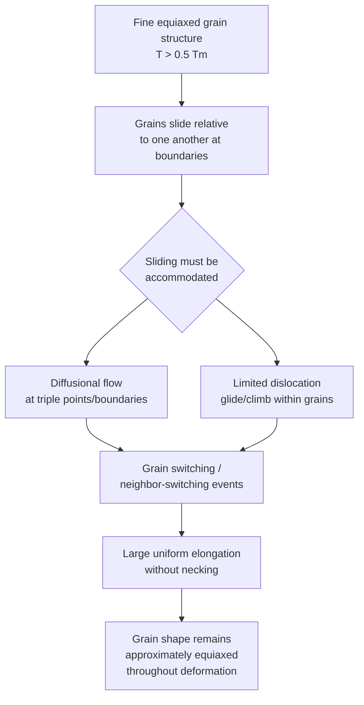

## Superplasticity

### Definition

Superplasticity is the capacity of certain polycrystalline materials to undergo extremely large uniform tensile elongation — often several hundred to over a thousand percent — without necking or fracture, when deformed under specific conditions of temperature, strain rate, and microstructure. It is characterized by exceptionally high strain-rate sensitivity, and its dominant deformation mechanism is grain boundary sliding accommodated by diffusional or limited dislocation processes, placing it conceptually adjacent to diffusional and dislocation creep mechanisms.

### Requirements for Superplastic Behavior

- **Key Points**
  - **Very fine, equiaxed grain size**: typically less than $10\ \mu\text{m}$, and often in the $1$–$5\ \mu\text{m}$ range, since grain boundary sliding (the dominant mechanism) scales strongly with grain boundary area/density.
  - **High homologous temperature**: typically $T > 0.5\,T_m$, to enable sufficient diffusional accommodation of grain boundary sliding.
  - **Stable grain structure during deformation**: grains must resist significant growth/coarsening during the extended high-temperature exposure of superplastic forming; this is usually achieved via a fine, thermally stable second-phase dispersion that pins grain boundaries (Zener pinning).
  - **Equiaxed grain morphology**: elongated or textured grains are less effective, since sliding is facilitated by roughly equant grains that can rearrange relative to one another.
  - **Appropriate strain rate range**: superplastic behavior is typically observed only within a narrow, relatively low strain-rate window (often $10^{-4}$ to $10^{-1}\ \text{s}^{-1}$, [Unverified: exact optimal range is alloy-specific]), since at higher strain rates grain boundary sliding cannot be adequately accommodated and conventional necking/fracture dominates instead.

### Mechanism: Grain Boundary Sliding and Accommodation

**Mermaid Diagram: Superplastic Deformation Mechanism**

- **Key Points**
  - Pure grain boundary sliding alone would produce voids and incompatibilities at triple junctions; sliding must therefore be **accommodated** by short-range diffusional transport or limited dislocation activity at grain boundary ledges and triple points to maintain continuity.
  - A key structural signature of superplastic flow is that **grains remain roughly equiaxed** throughout the deformation (unlike conventional dislocation-glide-dominated plasticity, where grains elongate substantially in the strain direction) — deformation proceeds largely through grains switching neighbors and sliding past one another (**neighbor-switching/grain-switching events**) rather than through individual grain shape change.
  - This mechanism is conceptually related to, but distinct from, Coble creep: while Coble creep is diffusion-dominated flow through boundaries at low stress, superplasticity involves a coupled combination of grain boundary sliding plus accommodation over a broader (often higher) strain-rate range, producing much larger achievable strains due to the absence of the necking instability that limits conventional tensile ductility.

### Strain Rate Sensitivity and the m-Value

The defining mechanical signature of superplasticity is a high **strain rate sensitivity exponent, $m$**, defined by:

$$\sigma = K \dot{\varepsilon}^m$$

- **Key Points**
  - $m$ is obtained from the slope of $\log \sigma$ vs. $\log \dot{\varepsilon}$ (analogous in form to strain-rate sensitivity in Newtonian viscous flow, where $m=1$).
  - **Conventional metals** at room temperature: $m$ is typically very low ($\approx 0.1$–0.2), meaning flow stress is only weakly dependent on strain rate — this is precisely why conventional metals **neck**: once a local region strains slightly faster (thins slightly), it cannot harden its flow resistance enough (via rate sensitivity) to resist further localized thinning, so strain concentrates there until fracture.
  - **Superplastic materials**: $m$ is high, often in the range $0.3$–0.9 (commonly cited around $m \approx 0.5$ or higher for well-optimized superplastic alloys), meaning that a locally faster-straining (thinning) region experiences a disproportionately higher local flow stress, which suppresses further localized strain there and redistributes deformation to adjacent regions — this **necking-suppression effect** is the fundamental reason superplastic materials can sustain such large uniform elongations before failure.
  - The relationship between $m$ and necking resistance can be understood qualitatively: high $m$ acts similarly to strain-rate hardening, analogous to how strain hardening ($n$ in $\sigma = K\varepsilon^n$) delays necking in conventional room-temperature tensile tests (per the Considère criterion), except here the stabilizing effect comes from rate sensitivity rather than strain hardening.
  - A typical $\log\sigma$–$\log\dot{\varepsilon}$ (or equivalently $m$ vs. $\dot{\varepsilon}$) curve for superplastic alloys is sigmoidal, with three regions:
    - **Region I** (low $\dot{\varepsilon}$): lower $m$, often attributed to threshold-stress effects or diffusional creep mechanisms becoming significant.
    - **Region II** (intermediate $\dot{\varepsilon}$): the **superplastic regime**, where $m$ reaches its maximum value — this is the optimal forming window.
    - **Region III** (high $\dot{\varepsilon}$): $m$ decreases again as conventional dislocation (power-law) creep/glide mechanisms take over and grain boundary sliding accommodation cannot keep pace.

**SVG Diagram: Strain Rate Sensitivity (m) vs. Strain Rate — Superplastic Regions (svg_diagram)**

<svg xmlns="http://www.w3.org/2000/svg" viewBox="0 0 760 460" font-family="Arial, sans-serif">
<text x="380" y="25" font-size="18" font-weight="bold" text-anchor="middle">Strain Rate Sensitivity (m) vs. log(Strain Rate) (svg_diagram)</text>

<line x1="90" y1="400" x2="700" y2="400" stroke="black" stroke-width="2" />
<line x1="90" y1="400" x2="90" y2="60" stroke="black" stroke-width="2" />
<text x="395" y="435" font-size="15" text-anchor="middle">log (Strain Rate, ε̇)</text>
<text x="35" y="230" font-size="15" text-anchor="middle" transform="rotate(-90 35 230)">m (strain rate sensitivity)</text>

<path d="M 130 340 C 220 320, 260 280, 320 180 C 370 110, 430 100, 480 105 C 540 115, 610 220, 680 340" fill="none" stroke="`#8e44ad`" stroke-width="3.5" />

<line x1="280" y1="60" x2="280" y2="400" stroke="gray" stroke-width="1" stroke-dasharray="5,4" />
<line x1="560" y1="60" x2="560" y2="400" stroke="gray" stroke-width="1" stroke-dasharray="5,4" />

<text x="190" y="90" font-size="13" font-weight="bold" text-anchor="middle">Region I</text>

<text x="190" y="108" font-size="11" text-anchor="middle">low m</text>

<text x="420" y="90" font-size="13" font-weight="bold" text-anchor="middle">Region II</text>

<text x="420" y="108" font-size="12" text-anchor="middle">Superplastic regime</text>

<text x="420" y="124" font-size="11" text-anchor="middle">(max m, optimal forming)</text>

<text x="630" y="90" font-size="13" font-weight="bold" text-anchor="middle">Region III</text>

<text x="630" y="108" font-size="11" text-anchor="middle">low m</text>

<text x="630" y="122" font-size="10" text-anchor="middle">dislocation creep</text>

</svg>

### Types of Superplasticity

- **Key Points**
  - **Fine-structure (microstructural) superplasticity**: the conventional form described above, relying on fine, stable, equiaxed grain size and appropriate temperature/strain-rate combination; this is the most widely exploited industrial form.
  - **Internal-stress (transformation) superplasticity**: large strains achieved through repeated thermal cycling across a phase transformation temperature under an applied stress, where internal transformation strains/stresses are biased by the applied load to produce net macroscopic strain, without necessarily requiring an ultra-fine grain size. [Inference: this is a recognized but less industrially exploited category compared to fine-structure superplasticity.]

### Superplastic Forming (SPF) — Industrial Application

- **Key Points**
  - Superplastic forming exploits the very low flow stresses and large achievable strains to form complex, deep, or intricate sheet-metal shapes in a single operation using gas pressure (typically inert gas, e.g., argon) to blow a sheet into or against a die, analogous to blow-molding of polymers/glass.
  - **Common alloys**: fine-grained **Ti-6Al-4V**, certain **Al alloys** (e.g., Al-Li alloys, some 5xxx/7xxx series with specific thermomechanical processing), and some **Zn-Al eutectoid alloys**, all processed to achieve the required fine, stable grain size.
  - **SPF/DB (Superplastic Forming/Diffusion Bonding)**: a combined process, particularly used in aerospace, where superplastic forming and solid-state diffusion bonding are performed in the same thermal cycle to create complex, lightweight, integrally stiffened sheet-metal structures (e.g., sandwich panels) in a single manufacturing step.
  - **Advantages**: enables forming of complex geometries in a single step with minimal springback, reduced part count (fewer joints/fasteners), and good dimensional accuracy, particularly valuable for aerospace titanium components.
  - **Limitations**: forming cycle times are typically much longer than conventional stamping (minutes to hours per part, due to the need for slow, controlled strain rates within the superplastic regime), and the material typically requires specific, often costly, fine-grain processing prior to forming. [Unverified: exact cycle times and cost premiums are highly process- and part-specific.]

### Relationship to Creep Mechanisms

- **Key Points**
  - Superplasticity sits conceptually alongside diffusional creep (Nabarro–Herring, Coble) and grain boundary sliding as topics under creep and time-dependent deformation, since it operates via essentially the same class of thermally activated, diffusion-accommodated grain boundary mechanisms, but is exploited deliberately (via controlled fine grain size) to maximize ductility rather than being an unwanted degradation mode.
  - Conversely, **unaccommodated** grain boundary sliding in conventional (non-superplastic, coarser-grained) creep is a primary contributor to **cavitation and tertiary creep damage** — the same underlying sliding mechanism is either beneficial (superplasticity, when well accommodated in fine, stable microstructures) or damaging (creep cavitation, when accommodation is inadequate in coarser or less stable microstructures), depending on how well the accommodating diffusional/dislocation processes can keep pace with the sliding rate.

### Example

A fine-grained Ti-6Al-4V sheet (grain size $\approx 5$–$10\ \mu\text{m}$) is superplastically formed into a complex dome-shaped aerospace panel at $T \approx 900^\circ\text{C}$ using argon gas pressure, at a controlled strain rate within the optimal Region II window (e.g., $\dot{\varepsilon} \approx 10^{-4}$–$10^{-3}\ \text{s}^{-1}$).

- The alloy exhibits $m \approx 0.5$ or higher in this regime, allowing the sheet to thin relatively uniformly as it is blown into the die, achieving elongations that would be impossible via conventional room-temperature stamping (which would neck and fracture at only tens of percent elongation).
- Because the alloy's equiaxed, fine grain structure resists significant grain growth during the (relatively slow) forming cycle, the material retains its superplastic capability throughout the process rather than reverting to conventional lower-$m$ behavior partway through forming.

[Inference: specific numerical values are illustrative and consistent with typical reported superplastic Ti-6Al-4V forming parameters, not measured data from a certified process specification.]

### Next Steps

- **Related Topics**
  - Creep Mechanisms: Diffusional and Dislocation
  - Grain Boundary Sliding and Creep Cavitation
  - Stages of the Creep Curve
  - Strain Rate Sensitivity and the Considère Criterion (Necking Instability)
  - Superplastic Forming and Diffusion Bonding (SPF/DB) Processes
  - Grain Refinement and Thermal Stability (Zener Pinning)
  - Ti-6Al-4V Processing and Microstructure Control