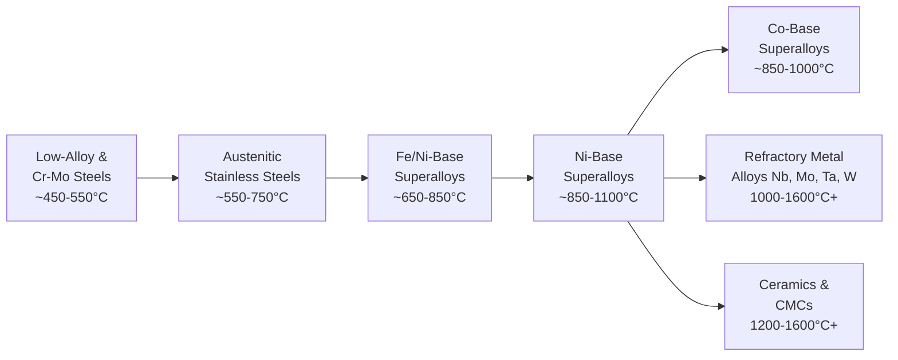

## High Temperature Materials for Creep Resistance

### Overview

Selecting materials for creep-resistant, high-temperature service requires balancing intrinsic base-material properties (melting point, crystal structure, self-diffusion resistance) against achievable microstructural strengthening (solid-solution, precipitation, dispersion strengthening, grain boundary engineering). Different material classes — steels, Ni-based superalloys, Co-based superalloys, refractory metals, intermetallics, and ceramics — occupy distinct temperature/stress capability envelopes, and material selection is driven by the required combination of operating temperature, stress, environment (oxidation/corrosion), and design life.

### Material Class Overview

**Mermaid Diagram: High-Temperature Material Classes by Increasing Temperature Capability**

### Low-Alloy and Cr-Mo Steels

- **Key Points**
  - **Typical service range**: up to approximately $450$–$550^\circ\text{C}$, beyond which creep rates become excessive for long-life structural applications.
  - **Strengthening approach**: solid-solution strengthening (Cr, Mo) combined with fine carbide dispersions ($M_{23}C_6$, $M_7C_3$, $M_2C$) that provide moderate precipitation/dispersion strengthening and pin dislocations and boundaries.
  - **Common applications**: power plant boiler tubes, steam piping, pressure vessels (e.g., 2.25Cr-1Mo, 9Cr-1Mo, and modified 9Cr-1Mo-V-Nb "P91"-type steels).
  - **Key limitation**: carbide coarsening and tempering/overaging effects during prolonged high-temperature service progressively reduce creep strength, requiring careful alloy design (e.g., V, Nb micro-additions in modified 9Cr steels to form finer, more stable MX-type carbonitrides) to extend usable service temperature and life.

### Austenitic Stainless Steels

- **Key Points**
  - **Typical service range**: approximately $550$–$750^\circ\text{C}$, higher than ferritic/martensitic Cr-Mo steels due to the more creep-resistant FCC austenitic matrix.
  - **Strengthening approach**: solid-solution strengthening (Cr, Ni, Mo) plus, in more advanced grades, controlled precipitation of stable carbides/intermetallics (e.g., NbC, TiC, or Laves phases in advanced heat-resistant grades).
  - **Common applications**: superheater/reheater tubing in advanced power plants, high-temperature process piping, some gas turbine casing components.
  - **Key limitation**: higher cost than ferritic steels; long-term thermal exposure can promote sensitization (Cr-carbide precipitation at grain boundaries) or embrittling intermetallic phase formation (e.g., sigma phase) if composition/exposure conditions are unfavorable. [Unverified: susceptibility is grade- and exposure-specific.]

### Nickel-Based Superalloys

- **Key Points**
  - **Typical service range**: approximately $650$–$1100^\circ\text{C}$ (with the upper end achievable only in advanced single-crystal alloys, often combined with thermal barrier coatings and internal cooling in the highest-temperature applications), representing the dominant material class for the most demanding gas turbine hot-section components.
  - **Strengthening approach**: combination of solid-solution strengthening (Co, Cr, Mo, W, Re, Ta) and precipitation strengthening via coherent **γ′ ($\text{Ni}_3(\text{Al,Ti})$)** precipitates, often reaching 60–70% volume fraction in advanced alloys; grain boundary strengtheners (B, Zr, C, carbides) in polycrystalline grades; grain-boundary-elimination via directional solidification (DS) or single-crystal (SX) casting in the highest-performance grades.
  - **Microstructural classes**:
    - **Polycrystalline (equiaxed) superalloys**: cast or wrought, used for discs, less demanding blade stages, and structural components; rely on grain boundary strengthening additions.
    - **Directionally solidified (DS) superalloys**: columnar grains aligned with the primary stress axis, eliminating transverse grain boundaries.
    - **Single-crystal (SX) superalloys**: no grain boundaries at all, enabling removal of grain-boundary-strengthening elements (which can lower incipient melting point) and pushing usable temperature capability to the highest levels among Ni-base alloys.
  - **Common applications**: turbine blades, vanes, discs, combustor components in gas turbines and jet engines.
  - **Key limitation**: high cost (particularly for Re-, Ru-containing advanced single-crystal alloys), susceptibility to embrittling topologically close-packed (TCP) phase formation if refractory element content is not carefully balanced, and complex/expensive processing (vacuum induction melting, investment casting, directional solidification).

### Cobalt-Based Superalloys

- **Key Points**
  - **Typical service range**: broadly overlapping with Ni-based superalloys (approximately $850$–$1000^\circ\text{C}$), with particular strength in applications requiring superior **thermal fatigue resistance, hot corrosion resistance, and weldability** compared to Ni-based alloys.
  - **Strengthening approach**: primarily solid-solution strengthening (W, Mo) and **carbide precipitation** (MC, $M_{23}C_6$) rather than a coherent intermetallic phase analogous to γ′ — Co-base alloys generally lack an equivalent strong coherent precipitate, so achievable strengthening magnitude is often somewhat lower than in optimized Ni-base γ′ alloys at comparable temperature, though Co-base alloys can offer advantages in specific application niches (e.g., superior thermal fatigue and hot corrosion resistance). [Inference: relative overall creep strength ranking depends heavily on the specific comparison alloys and conditions.]
  - **Common applications**: combustor liners, vanes/nozzles (static components experiencing high thermal cycling), and applications prioritizing corrosion/oxidation resistance and weld repairability over maximum creep strength.

### Refractory Metal Alloys

- **Key Points**
  - **Base metals**: Nb (Columbium), Mo, Ta, W — all possessing very high melting points ($T_m$ ranging from approximately 2470°C for Nb to 3410°C for W), giving intrinsically high homologous-temperature margins for elevated-temperature use.
  - **Strengthening approach**: solid-solution strengthening and carbide/oxide dispersion strengthening (e.g., Mo-based TZM alloy strengthened with Ti, Zr carbides).
  - **Typical service range**: capable of structural use well above 1000°C, in some cases up to 1600°C or higher in non-oxidizing or protected environments.
  - **Key limitation**: **severe oxidation susceptibility** at high temperature in air/oxidizing atmospheres — refractory metals generally require protective coatings (e.g., silicide coatings) or non-oxidizing/vacuum/inert service environments, which significantly restricts their direct application compared to superalloys in ordinary combustion-gas-exposed turbine environments. Also generally exhibit a ductile-to-brittle transition temperature (DBTT) that can complicate low-temperature handling/fabrication.
  - **Common applications**: rocket nozzle components, specialized aerospace/defense applications, some nuclear and vacuum-furnace components where oxidizing exposure is limited or coatings/environment can be controlled.

### Intermetallics

- **Key Points**
  - **Examples**: titanium aluminides (e.g., $\text{Ti}_3\text{Al}$, TiAl-based "gamma" alloys), nickel aluminides ($\text{Ni}_3\text{Al}$-based alloys).
  - **Advantages**: attractive combination of relatively low density (particularly TiAl, roughly half the density of Ni-based superalloys) with good high-temperature strength retention, offering potential weight savings in rotating turbine components.
  - **Key limitation**: generally **poor room-temperature ductility and fracture toughness** compared to conventional superalloys, which has historically limited widespread adoption despite attractive high-temperature specific-strength properties; processing (casting, machining) is also generally more challenging. [Unverified: specific ductility/toughness figures are alloy- and processing-route-dependent; ongoing alloy development continues to address these limitations.]
  - **Applications**: selected low-pressure turbine blades in some advanced commercial jet engines (TiAl), where the weight-saving benefit outweighs the ductility trade-off for that specific, lower-stress application.

### Ceramics and Ceramic Matrix Composites (CMCs)

- **Key Points**
  - **Examples**: SiC, $\text{Si}_3\text{N}_4$, and SiC-fiber-reinforced SiC-matrix composites (SiC/SiC CMCs).
  - **Advantages**: capable of structural use at the highest temperatures among engineering materials (often 1200–1600°C+), with much lower density than metallic superalloys, offering potential for reduced cooling air requirements and weight savings in gas turbine hot sections.
  - **Key limitation**: inherently **brittle** (monolithic ceramics have very low fracture toughness and poor damage tolerance); CMCs substantially improve toughness and damage tolerance over monolithic ceramics via fiber reinforcement and engineered fiber/matrix interfaces but still generally exhibit different failure characteristics compared to metallic alloys, requiring different design philosophies (e.g., probabilistic/Weibull-statistics-based design rather than traditional deterministic yield-based design). [Unverified: relative toughness/design margin compared to metals is application- and CMC-system-specific.]
  - **Applications**: increasingly used for gas turbine combustor liners and select turbine hot-section components in advanced engines, where their high-temperature capability and low density offer efficiency benefits.

### Comparative Summary Table

| Material Class | Approx. Max Service Temp | Primary Strengthening | Key Advantage | Key Limitation |
| --- | --- | --- | --- | --- |
| Cr-Mo Steels | ~450–550°C | Solid-solution + carbides | Low cost | Limited temperature capability |
| Austenitic Stainless Steels | ~550–750°C | Solid-solution + carbides | Good corrosion resistance | Moderate creep strength |
| Ni-Based Superalloys | ~650–1100°C | γ′ precipitation + solid-solution | Best overall creep strength | High cost, TCP phase risk |
| Co-Based Superalloys | ~850–1000°C | Carbides + solid-solution | Thermal fatigue/corrosion resistance | Lower peak strength than Ni-base |
| Refractory Metal Alloys | 1000–1600°C+ | Solid-solution + dispersion | Very high $T_m$ | Severe oxidation susceptibility |
| Intermetallics (TiAl) | ~700–900°C | Ordered intermetallic structure | Low density | Poor ductility/toughness |
| Ceramics / CMCs | 1200–1600°C+ | Covalent bonding, fiber reinforcement | Highest temperature capability, low density | Brittleness, design complexity |

### Selection Criteria Beyond Peak Temperature Capability

- **Key Points**
  - **Specific creep strength** (strength normalized by density) is critical for rotating/weight-sensitive components (e.g., turbine blades), favoring lower-density options (TiAl, CMCs) where their ductility/toughness limitations can be accommodated by design.
  - **Environmental resistance** (oxidation, hot corrosion, especially in combustion-gas or marine environments) often governs material choice as much as raw creep strength — this is why refractory metals, despite excellent intrinsic high-temperature creep resistance, are rarely used uncoated in oxidizing combustion environments.
  - **Fabricability and repairability**: casting/forging feasibility, weldability, and repair capability affect total lifecycle cost and are particularly favorable for Co-based superalloys relative to Ni-based alloys in some applications.
  - **Thermal fatigue resistance**: components experiencing significant thermal cycling (e.g., combustor liners, vanes) require good resistance to thermomechanical fatigue in addition to pure creep resistance, influencing material class selection (e.g., favoring Co-base alloys in some static, thermally-cycled components).
  - **Cost and criticality of alloying elements** (e.g., Re, Ru, Ta in advanced single-crystal Ni superalloys) is an increasingly significant factor given supply constraints on strategic elements. [Unverified: specific cost/availability constraints evolve over time and are not stable, verifiable facts for a technical reference.]

### Next Steps

- **Related Topics**
  - Creep-Resistant Alloy Design
  - Stages of the Creep Curve
  - Creep Mechanisms: Diffusional and Dislocation
  - Ni-Based Superalloys: Composition and Microstructure
  - Directional Solidification and Single-Crystal Casting
  - Thermal Barrier Coatings (TBCs)
  - Ceramic Matrix Composites (CMCs) for Turbine Applications
  - Topologically Close-Packed (TCP) Phase Formation and Alloy Stability
  - Oxidation and Hot Corrosion Resistance at Elevated Temperature