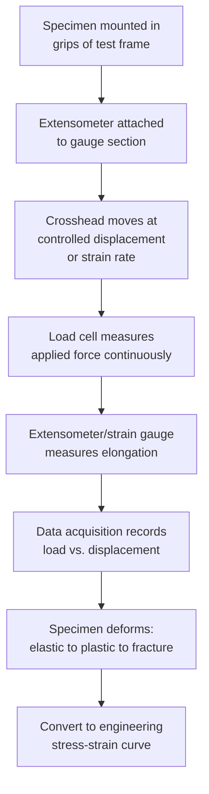

## Tensile Testing

### Definition

Tensile testing is a destructive mechanical test in which a specimen is subjected to a uniaxial, controlled tension (elongation) until fracture, while load and displacement (or strain) are continuously recorded. It is the most widely used mechanical test for characterizing a material's strength, ductility, and elastic properties, forming the basis of engineering stress-strain analysis and providing key design and quality-control parameters.

### Test Apparatus and Specimen

**Mermaid Diagram: Tensile Test Setup**

- **Key Points**
  - **Specimen geometry**: typically a standardized "dogbone" shape with a reduced parallel gauge section (round or flat/rectangular cross-section) and larger-diameter grip ends, designed to ensure fracture occurs within the gauge length rather than at the grips.
  - **Governing standards**: **ASTM E8/E8M** (metallic materials, US practice) and **ISO 6892-1** (international) specify standardized specimen dimensions, testing speeds, and procedures.
  - **Load frame**: universal testing machine (UTM), either hydraulically or electromechanically (screw-driven) actuated, applying controlled crosshead displacement or strain rate.
  - **Load cell**: measures applied force with high precision throughout the test.
  - **Extensometer**: a clip-on or non-contact (e.g., video/laser) device measuring elongation over a defined gauge length with high resolution, essential for accurately capturing the elastic modulus and precise yield point.
  - **Strain rate control**: test standards specify controlled strain rates (or crosshead speeds) since mechanical properties, particularly yield strength, can exhibit measurable strain-rate sensitivity.

### The Engineering Stress-Strain Curve

Raw load-displacement data is converted to engineering stress and engineering strain using the specimen's original (undeformed) dimensions:

$$\sigma_{eng} = \dfrac{F}{A_0} \qquad \varepsilon_{eng} = \dfrac{\Delta L}{L_0} = \dfrac{L - L_0}{L_0}$$

where $F$ = applied force, $A_0$ = original cross-sectional area, $L_0$ = original gauge length, $L$ = instantaneous gauge length.

**SVG Diagram: Engineering Stress-Strain Curve (svg_diagram)**

<svg xmlns="http://www.w3.org/2000/svg" viewBox="0 0 780 500" font-family="Arial, sans-serif">
<text x="390" y="25" font-size="18" font-weight="bold" text-anchor="middle">Engineering Stress-Strain Curve — Ductile Metal (svg_diagram)</text>

<line x1="90" y1="440" x2="720" y2="440" stroke="black" stroke-width="2" />
<line x1="90" y1="440" x2="90" y2="60" stroke="black" stroke-width="2" />
<text x="405" y="475" font-size="15" text-anchor="middle">Engineering Strain, ε</text>
<text x="35" y="250" font-size="15" text-anchor="middle" transform="rotate(-90 35 250)">Engineering Stress, σ</text>

<line x1="90" y1="440" x2="180" y2="220" stroke="#2980b9" stroke-width="3" />

<circle cx="180" cy="220" r="5" fill="#c0392b" />
<text x="188" y="215" font-size="12" font-weight="bold">Yield Point (σy)</text>

<path d="M 180 220 C 280 175, 400 150, 480 138" fill="none" stroke="#2980b9" stroke-width="3" />

<circle cx="480" cy="138" r="5" fill="#27ae60" />
<text x="440" y="120" font-size="12" font-weight="bold">UTS (σuts)</text>

<path d="M 480 138 C 560 165, 620 220, 660 300" fill="none" stroke="#2980b9" stroke-width="3" />

<circle cx="660" cy="300" r="5" fill="black" />
<text x="615" y="320" font-size="12" font-weight="bold">Fracture</text>

<line x1="130" y1="440" x2="220" y2="225" stroke="gray" stroke-width="1" stroke-dasharray="4,3" />
<text x="100" y="430" font-size="10">0.2% offset</text>

<text x="130" y="330" font-size="11" fill="`#2980b9`">Elastic</text>

<text x="300" y="200" font-size="11" fill="`#2980b9`">Uniform Plastic (Strain Hardening)</text>

<text x="560" y="250" font-size="11" fill="`#2980b9`">Necking</text>

</svg>

### Key Regions and Extracted Properties

#### Elastic Region and Elastic Modulus

- **Key Points**
  - Initial linear-elastic portion of the curve, where stress is proportional to strain per **Hooke's Law**: $\sigma = E\varepsilon$.
  - The slope of this linear region is the **Young's modulus (elastic modulus), $E$**, a fundamental material property reflecting interatomic bonding stiffness, essentially independent of microstructure (grain size, heat treatment) for a given base material/composition.
  - Deformation in this region is fully **recoverable** upon unloading.

#### Yield Strength

- **Key Points**
  - Marks the transition from elastic to plastic (permanent) deformation.
  - For materials with a distinct, sharp yield point (e.g., low-carbon steels, showing upper and lower yield points and yield-point elongation/Lüders banding), the **yield strength** is read directly from this discontinuity.
  - For materials without a sharp yield point (most non-ferrous alloys, many steels), yield strength is conventionally determined by the **0.2% offset method**: a line parallel to the elastic slope is drawn from $\varepsilon = 0.002$, and its intersection with the stress-strain curve defines the **offset (proof) yield strength**.
  - Yield strength is a primary design parameter for avoiding permanent (plastic) deformation in service.

#### Ultimate Tensile Strength (UTS)

- **Key Points**
  - The maximum engineering stress reached on the curve, $\sigma_{UTS} = F_{max}/A_0$.
  - Beyond the yield point, the material undergoes **strain hardening** (work hardening), where increasing stress is needed to continue plastic deformation as dislocation density increases and dislocations interact/tangle.
  - The UTS marks the onset of **necking** — the point at which uniform elongation ends and deformation localizes, per the **Considère criterion** (necking begins when the rate of strain hardening can no longer keep pace with the reduction in load-bearing area, i.e., $d\sigma/d\varepsilon = \sigma$).

#### Necking and Fracture

- **Key Points**
  - After UTS, engineering stress **decreases** even though the material continues to strain-harden, because the cross-sectional area is decreasing faster (locally, within the neck) than the true flow stress is increasing — this is purely a geometric artifact of using original area $A_0$ in the engineering stress definition.
  - Deformation localizes into a visible **neck**, and fracture ultimately occurs within this necked region.
  - **Fracture strength** (engineering stress at fracture) is typically lower than UTS due to the reducing load-bearing area during necking.

### True Stress and True Strain

Because engineering stress/strain use the *original* dimensions, they do not accurately represent the actual (instantaneous) stress state, particularly once necking begins. **True stress** and **true strain** correct for this:

$$\sigma_{true} = \dfrac{F}{A_i} \qquad \varepsilon_{true} = \ln\left(\dfrac{L}{L_0}\right)$$

Before necking (uniform deformation, assuming constant volume), true stress and strain can be related to engineering values by:

$$\sigma_{true} = \sigma_{eng}(1+\varepsilon_{eng}) \qquad \varepsilon_{true} = \ln(1+\varepsilon_{eng})$$

- **Key Points**
  - These conversion relations are valid **only up to the onset of necking**; after necking begins, the deformation is no longer uniform along the gauge length, so true stress/strain must be computed directly from local (necked) area/length measurements rather than via the simple conversion formulas.
  - True stress continues to **increase monotonically** throughout the test (including through necking) as the material continues to strain-harden, in contrast to engineering stress, which decreases after UTS.
  - True stress-strain data is used to fit **constitutive flow-stress models** (e.g., the Hollomon equation, $\sigma_{true} = K\varepsilon_{true}^n$, where $K$ is the strength coefficient and $n$ is the **strain-hardening exponent**), essential for finite element simulation of forming processes.

### Ductility Measures

- **Key Points**
  - **Percent elongation**: $\%EL = \dfrac{L_f - L_0}{L_0} \times 100$, where $L_f$ is the final gauge length measured after fracture (specimen pieces fitted back together). Highly dependent on the original gauge length used (shorter gauge lengths yield higher apparent %EL due to the localized contribution of necking strain), so standard specifies fixed gauge length-to-diameter ratios for comparability.
  - **Percent reduction in area**: $\%RA = \dfrac{A_0 - A_f}{A_0} \times 100$, where $A_f$ is the final (minimum, necked) cross-sectional area at the fracture location. Less sensitive to gauge length than %EL, and often considered a more robust ductility indicator, particularly for comparing materials with different necking behavior.
  - **Resilience**: the elastic strain energy absorbed up to yielding, given by the area under the elastic portion of the curve: $U_r = \sigma_y^2/(2E)$ (modulus of resilience).
  - **Toughness**: total energy absorbed up to fracture, represented by the total area under the entire engineering stress-strain curve (units of energy per unit volume); a material with both high strength and high ductility exhibits high tensile toughness.

### Comparative Stress-Strain Behavior by Material Type

**SVG Diagram: Comparative Stress-Strain Curves — Brittle vs. Ductile vs. Elastomeric (svg_diagram)**

<svg xmlns="http://www.w3.org/2000/svg" viewBox="0 0 760 460" font-family="Arial, sans-serif">
<text x="380" y="25" font-size="18" font-weight="bold" text-anchor="middle">Comparative Stress-Strain Behavior (svg_diagram)</text>
<line x1="90" y1="400" x2="700" y2="400" stroke="black" stroke-width="2" />
<line x1="90" y1="400" x2="90" y2="60" stroke="black" stroke-width="2" />
<text x="395" y="435" font-size="15" text-anchor="middle">Strain, ε</text>
<text x="35" y="230" font-size="15" text-anchor="middle" transform="rotate(-90 35 230)">Stress, σ</text>

<line x1="90" y1="400" x2="220" y2="90" stroke="#c0392b" stroke-width="3" />
<circle cx="220" cy="90" r="5" fill="#c0392b" />
<text x="150" y="80" font-size="12" fill="#c0392b" font-weight="bold">Brittle (e.g., ceramic)</text>

<path d="M 90 400 L 150 250 C 250 200, 400 150, 470 140 C 540 170, 600 250, 630 330" fill="none" stroke="`#2980b9`" stroke-width="3" />

<circle cx="630" cy="330" r="5" fill="`#2980b9`" />

<text x="440" y="120" font-size="12" fill="`#2980b9`" font-weight="bold">Ductile Metal</text>

<path d="M 90 400 C 300 395, 500 370, 600 300 C 640 270, 660 200, 670 150" fill="none" stroke="`#27ae60`" stroke-width="3" />

<circle cx="670" cy="150" r="5" fill="`#27ae60`" />

<text x="560" y="330" font-size="12" fill="`#27ae60`" font-weight="bold">Elastomer</text>

</svg>

- **Key Points**
  - **Brittle materials** (ceramics, some cast irons): fracture occurs shortly after or even at the elastic limit, with little to no plastic deformation; fracture stress can show significant scatter due to flaw-population-controlled failure (often analyzed via Weibull statistics rather than a deterministic single value).
  - **Ductile metals**: exhibit the classic elastic-yield-hardening-necking-fracture sequence described above.
  - **Elastomers**: characteristically low initial modulus, highly nonlinear (often J-shaped, stiffening) response, and very large recoverable (elastic) strains before fracture — governed by entropic elasticity rather than interatomic bond stretching.

### Strain Rate and Temperature Effects

- **Key Points**
  - Most metals show some degree of **strain-rate sensitivity**: yield and ultimate strength generally increase with increasing strain rate, while ductility can decrease, particularly pronounced in BCC metals and at low temperatures.
  - Testing at **elevated temperature** generally reduces yield/ultimate strength and can increase ductility, though behavior is alloy- and temperature-regime-specific (e.g., dynamic strain aging can cause anomalous serrated flow and reduced ductility in specific intermediate-temperature ranges for some alloys). [Unverified: specific serrated-flow/dynamic-strain-aging temperature windows are alloy-composition-dependent.]
  - Standard tensile testing (per ASTM E8/ISO 6892-1) is typically conducted at room temperature and quasi-static strain rates; elevated-temperature tensile testing follows related standards (e.g., ASTM E21) with additional furnace/temperature-control requirements analogous to creep/stress-rupture testing apparatus.

### Example

A low-carbon steel tensile specimen ($A_0 = 100\ \text{mm}^2$, $L_0 = 50\ \text{mm}$) is tested per ASTM E8, yielding:

- Elastic modulus $E \approx 200\ \text{GPa}$ (typical for steel).
- Upper yield point at $F_y = 25{,}000\ \text{N}$, giving $\sigma_y = 25{,}000/100 = 250\ \text{MPa}$.
- Maximum load $F_{max} = 40{,}000\ \text{N}$, giving $\sigma_{UTS} = 400\ \text{MPa}$.
- Final gauge length after fracture $L_f = 65\ \text{mm}$, giving $\%EL = (65-50)/50 \times 100 = 30\%$.
- Final fracture area $A_f = 55\ \text{mm}^2$, giving $\%RA = (100-55)/100 \times 100 = 45\%$.

The relatively large gap between yield strength (250 MPa) and UTS (400 MPa), combined with substantial %EL (30%) and %RA (45%), is consistent with a highly ductile material exhibiting significant strain-hardening capacity before failure — typical behavior for annealed low-carbon steel. [Inference: numerical values are illustrative and representative of typical low-carbon steel tensile properties, not measured data from a specific certified test.]

### Engineering Significance

- **Key Points**
  - Tensile properties (yield strength, UTS, elastic modulus, %EL, %RA) are foundational inputs to virtually all structural design codes and material specifications, and are the most commonly reported "basic" mechanical properties for metals and many other engineering materials.
  - Yield strength (often with an applied safety factor) is typically the governing design criterion for components where any permanent deformation is unacceptable, while UTS and ductility measures inform assessments of overload/fracture margin and formability.
  - Tensile testing is also the basis for establishing constitutive stress-strain models used in finite element analysis (FEA) of structural and forming simulations.

### Next Steps

- **Related Topics**
  - Hardness Testing
  - Impact Testing (Charpy/Izod)
  - Fracture Toughness Testing
  - Fatigue Testing
  - True Stress-True Strain and Flow Curve Modeling (Hollomon Equation)
  - Considère Criterion and Necking Instability
  - Strain-Rate Sensitivity and High-Temperature Tensile Testing (ASTM E21)
  - Weibull Statistics for Brittle Material Strength