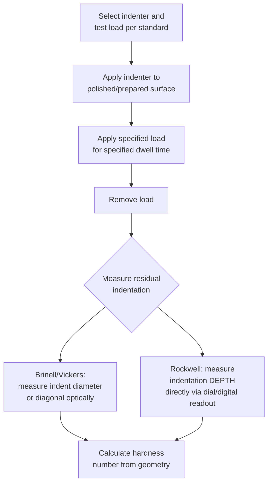

## Hardness Testing: Brinell, Rockwell, and Vickers

### Definition

Hardness testing measures a material's resistance to localized plastic deformation, typically via indentation with a standardized indenter under a controlled load. It is a fast, low-cost, largely non-destructive (or minimally destructive) mechanical test widely used for quality control, material comparison, and — through empirical correlations — estimation of other mechanical properties such as tensile strength. The three most widely used indentation hardness methods are **Brinell**, **Rockwell**, and **Vickers**, each differing in indenter geometry, load application, and the property actually measured (indentation diameter, depth, or diagonal length).

### General Principle

**Mermaid Diagram: General Indentation Hardness Testing Procedure**

- **Key Points**
  - All three methods share the same underlying principle: a harder indenter is pressed into the test surface under a known load, and the resulting size (Brinell, Vickers) or depth (Rockwell) of the residual indentation is used to calculate a hardness number.
  - Governing standards: **ASTM E10** (Brinell), **ASTM E18** (Rockwell), **ASTM E92/E384** (Vickers, macro/micro), with corresponding ISO equivalents (ISO 6506, 6508, 6507).
  - Surface preparation requirements (smoothness, cleanliness, minimum thickness relative to indentation size) vary by method and are specified in the respective standards to avoid measurement artifacts.

### Brinell Hardness Test (HB)

- **Key Points**
  - **Indenter**: a hardened steel or tungsten carbide **sphere**, most commonly $10\ \text{mm}$ in diameter (smaller diameters used for thinner specimens).
  - **Load**: typically large (500–3000 kgf), applied for a specified dwell time (commonly 10–15 seconds), chosen based on material and indenter diameter per the standard.
  - **Measurement**: the diameter $d$ of the resulting circular indentation is measured optically (typically averaging two perpendicular diameter measurements), and the Brinell Hardness Number (BHN or HB) is calculated as:

    $$HB = \dfrac{2F}{\pi D\left(D - \sqrt{D^2 - d^2}\right)}$$

    where $F$ = applied load (kgf), $D$ = indenter ball diameter (mm), $d$ = measured indentation diameter (mm).
  - **Advantages**: the large indentation averages over a relatively large surface area, making it well-suited for **heterogeneous or coarse-grained materials** (e.g., castings, forgings with coarse microstructure) where a small, localized test might be unrepresentative.
  - **Limitations**: the large indentation size makes it **unsuitable for thin specimens** or small/finished parts (indentation may be too large relative to specimen size, or leave an unacceptable surface mark); relatively low throughput due to the need for optical measurement of indentation diameter after each test.
  - **Applications**: castings, forgings, and other components with coarse or heterogeneous microstructure, particularly common in foundry and heavy-industry quality control.

### Rockwell Hardness Test (HR)

- **Key Points**
  - **Indenter**: either a **spherical hardened steel/carbide ball** (various diameters, e.g., 1/16", 1/8") for softer materials, or a **conical diamond indenter (Brale indenter)** with a rounded tip for harder materials.
  - **Method — depth-based, differential loading**: unlike Brinell/Vickers, Rockwell hardness is based on the **depth of indentation**, not its lateral size, measured differentially between a minor (preliminary) load and a major (total) load:
    1. A **minor load** (typically 10 kgf) is applied first, establishing a reference (zero) position and seating the indenter to eliminate surface effects.
    2. A **major load** (e.g., 60, 100, or 150 kgf, depending on scale) is then applied and subsequently removed, leaving only the minor load reapplied.
    3. The **permanent increase in indentation depth** (due to the major load, after elastic recovery) relative to the minor-load reference position is measured and converted to a Rockwell hardness number via a defined formula specific to the scale.
  - **Multiple scales**: Rockwell uses numerous **scales** (e.g., HRA, HRB, HRC, HRF, and others), each defined by a specific combination of indenter type and load, selected based on expected material hardness/type. The most common in engineering practice:
    - **HRB**: 1/16" ball indenter, 100 kgf major load — used for softer materials (annealed steels, aluminum, brass).
    - **HRC**: diamond (Brale) cone indenter, 150 kgf major load — used for harder materials (hardened/tempered steels).
  - **Advantages**: **fast, direct readout** (no optical measurement required — hardness is read directly from a dial or digital display), making it the most widely used method for high-throughput production/QC testing; minimal operator skill/interpretation required compared to optical methods.
  - **Limitations**: hardness values from **different scales are not directly comparable** without conversion tables/charts (which are themselves empirical and material-class-specific, per ASTM E140); more sensitive to surface preparation and local microstructural inhomogeneity than Brinell (smaller indentation, less averaging) but generally shallower/smaller than Brinell, and typically deeper/larger than microhardness (Vickers/Knoop) methods, so it sits at an intermediate scale.
  - **Applications**: the most common hardness test in general industrial quality control, heat-treatment verification (e.g., confirming case hardness after carburizing/quenching), and incoming-material inspection, due to its speed and simplicity.

### Vickers Hardness Test (HV)

- **Key Points**
  - **Indenter**: a **square-based pyramidal diamond indenter** with a specified face angle ($136°$ between opposite faces).
  - **Load range**: highly versatile — can be used across a very wide load range, from **macro-hardness** loads (1–100 kgf, sometimes denoted HV followed by the load) down to **micro-hardness** loads (1 gf to 1 kgf, i.e., **Vickers microhardness**), making it applicable to both bulk materials and very small features/thin coatings/individual microstructural phases.
  - **Measurement**: after load removal, the two diagonals of the square indentation are measured optically (typically averaged), and Vickers hardness is calculated as:

    $$HV = \dfrac{1.8544\,F}{d^2}$$

    where $F$ = applied load (kgf) and $d$ = mean diagonal length (mm) (the constant $1.8544$ derives from the indenter geometry and the definition of $HV$ as load divided by indentation surface area).
  - **Advantages**: the **same indenter geometry is used across the entire load range**, producing geometrically similar indentations regardless of load, which gives Vickers hardness excellent consistency across a very wide hardness range (soft to very hard materials) without needing to switch indenter type/scale as Rockwell does — often considered the most **universally applicable and precise** of the three methods for research and detailed characterization.
  - **Microhardness capability**: at very low loads, Vickers (along with the related **Knoop** method, which uses an elongated rhombic indenter better suited to thin sections/coatings) enables hardness mapping of **individual microstructural constituents** (specific phases, grains, heat-affected zones, coatings, case-hardened layers), a capability Brinell and standard Rockwell cannot match due to their larger indentation sizes.
  - **Limitations**: requires **more careful surface preparation** (polished surface) and **optical measurement** (more operator time/skill and slower throughput than Rockwell), and microhardness testing in particular requires careful attention to indentation spacing/edge effects per the governing standard.
  - **Applications**: research and development, detailed microstructural/phase-level hardness mapping, thin coatings and surface-treated layers (case depth profiling, weld heat-affected zone characterization), and general-purpose hardness testing across a very broad hardness range within a single consistent method.

### Comparative Summary

| Feature | Brinell (HB) | Rockwell (HR) | Vickers (HV) |
| --- | --- | --- | --- |
| Indenter | Steel/carbide ball (typ. 10 mm) | Steel ball or diamond cone (Brale) | Diamond pyramid (136°) |
| Measured quantity | Indentation diameter | Indentation depth (differential) | Indentation diagonal |
| Load range | High (500–3000 kgf) | Moderate, scale-dependent (varies) | Very wide (1 gf–100+ kgf) |
| Readout | Optical measurement + calculation | Direct dial/digital readout | Optical measurement + calculation |
| Throughput | Low-moderate | High (fast, direct reading) | Low-moderate (micro: slower) |
| Best suited for | Coarse/heterogeneous microstructure, castings | High-volume QC, general industrial use | Microstructural mapping, coatings, broad hardness range |
| Indentation size | Large | Small-moderate | Small (adjustable via load) |

### Correlation with Tensile Strength

- **Key Points**
  - For many steels, an approximate empirical correlation exists between Brinell hardness and ultimate tensile strength: $\sigma_{UTS}(\text{MPa}) \approx 3.45 \times HB$ (or in imperial units, $\sigma_{UTS}(\text{psi}) \approx 500 \times HB$), a widely cited approximation for carbon and low-alloy steels. [Unverified: this correlation is empirical, alloy-class-specific, and should not be treated as a universal, precisely accurate conversion — significant deviations occur for other alloy systems, heavily cold-worked material, or non-steel materials.]
  - Hardness-strength correlations are convenient for rapid field/production estimates but are **not a substitute** for direct tensile testing in critical design applications, since the correlation's accuracy depends on microstructure, alloy composition, and prior processing history matching the conditions under which the correlation was empirically established.

### Conversion Between Hardness Scales

- **Key Points**
  - Because Brinell, Rockwell, and Vickers measure fundamentally different geometric quantities (diameter, depth, diagonal) under different loads/indenters, **there is no exact theoretical conversion** between scales; published conversion tables (e.g., per **ASTM E140**) are empirically derived, material-class-specific (often calibrated primarily for steels), and carry inherent uncertainty when applied to other alloy systems.
  - Direct testing using the specified method/scale is always preferred over converted values when precise hardness data is required for critical specifications or acceptance criteria.

### Example

A batch of quenched-and-tempered alloy steel gears requires hardness verification per a specification calling for HRC 55–60:

- **Rockwell C (HRC)** is selected as the appropriate method because the material is hard (post-heat-treatment), and HRC's diamond cone indenter with 150 kgf major load is specifically suited to this hardness range, while providing fast, direct-reading results suitable for high-volume production inspection.
- If a research investigation instead needed to characterize hardness variation **across the case-hardened layer thickness** (from the hardened case near the surface to the softer core), **Vickers microhardness** testing would be the appropriate choice, since a series of closely spaced, small indentations at progressively increasing depth can resolve the hardness gradient with much finer spatial resolution than either Brinell or standard Rockwell testing could achieve.

### Engineering Significance

- **Key Points**
  - Hardness testing is often used as a **rapid, non-destructive (or minimally destructive) surrogate** for verifying heat treatment response, weld quality, and material consistency in production environments, where full tensile testing of every part/lot would be impractical.
  - Method selection depends on the required **throughput, specimen size/geometry, expected hardness range, and spatial resolution** needed — Rockwell for fast general QC, Brinell for coarse/heterogeneous bulk materials, and Vickers for precise, wide-range, or spatially resolved (microstructural) hardness characterization.
  - Hardness specifications are commonly embedded directly in material and heat-treatment standards (e.g., specifying a minimum/maximum HRC range for a hardened gear or bearing component) as a primary acceptance criterion.

### Next Steps

- **Related Topics**
  - Tensile Testing
  - Impact Testing (Charpy/Izod)
  - Fracture Toughness Testing
  - Case Hardening and Case Depth Measurement
  - Knoop Microhardness Testing
  - Hardness-Strength Correlations (ASTM E140)
  - Heat Treatment Verification and Quality Control Methods