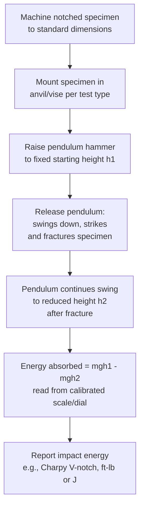

## Impact Testing: Charpy and Izod

### Definition

Impact testing measures a material's resistance to fracture under a rapid, high strain-rate applied load, typically by fracturing a notched specimen with a swinging pendulum and quantifying the energy absorbed during fracture. It provides a practical measure of **notch toughness** — the ability of a material to resist brittle fracture in the presence of a stress concentration (notch) under dynamic loading — and is particularly valuable for assessing **ductile-to-brittle transition behavior** in body-centered cubic (BCC) metals, a phenomenon not well captured by standard quasi-static tensile testing. The two standard pendulum impact test configurations are the **Charpy** and **Izod** tests.

### General Principle: Pendulum Impact Testing

**Mermaid Diagram: Pendulum Impact Test Procedure**

- **Key Points**
  - Both tests use a **calibrated pendulum** of known mass, released from a fixed height, that strikes and fractures a notched specimen in a single blow.
  - The **energy absorbed by the specimen during fracture** is calculated from the difference between the pendulum's initial potential energy (release height $h_1$) and its energy after fracture (swing height $h_2$): $E_{absorbed} = mg(h_1 - h_2)$, typically read directly from a calibrated dial or digital encoder on modern machines.
  - Governing standards: **ASTM E23** (Charpy and Izod, metallic materials), with corresponding **ISO 148-1** internationally.
  - The **notch** is a critical, precisely machined feature (standard geometries specified by the governing standard) that introduces a triaxial stress concentration, promoting brittle-type fracture initiation and making the test sensitive to a material's true notch toughness rather than simple bulk ductility.

### Charpy Impact Test

- **Key Points**
  - **Specimen orientation**: a standard rectangular bar (commonly $10 \times 10 \times 55\ \text{mm}$ for full-size specimens per ASTM E23), with a machined notch (most commonly a **V-notch**, 45° included angle, specified root radius; also available as U-notch or keyhole-notch geometries for specific applications) located at the mid-length, positioned **horizontally** and supported at both ends as a **simply supported beam**.
  - **Impact configuration**: the pendulum strikes the specimen directly **opposite the notch**, so the notch is on the tension side of the bending specimen at the moment of impact, promoting crack initiation at the notch root.
  - **Reported result**: **Charpy V-Notch (CVN) impact energy**, typically reported in joules (J) or foot-pounds (ft-lb), is the most widely used and reported impact toughness metric in structural steel specifications and pressure vessel/pipeline codes.
  - **Testing across temperature**: Charpy testing is very commonly performed across a **range of temperatures** (using a controlled bath or chamber to condition the specimen before rapid transfer and testing) to characterize the **ductile-to-brittle transition temperature (DBTT)**, a critical design parameter for structures operating in cold environments (see below).

### Izod Impact Test

- **Key Points**
  - **Specimen orientation**: the specimen is mounted **vertically**, clamped as a **cantilever** at one end (fixed in a vise-like holder), with the notch facing the pendulum and positioned just above the clamping point.
  - **Impact configuration**: the pendulum strikes the **free (upper) end** of the cantilevered specimen, above the notch, causing fracture at the notch location under cantilever bending.
  - **Applications**: more commonly used for **polymers and plastics** in current practice (per ASTM D256 for plastics specifically), though it remains a valid, standardized method for metals as well (per ASTM E23); for metals, Charpy testing has become the dominant/preferred method in most modern structural and pressure-vessel specifications.
  - **Reported result**: Izod impact energy, also in joules or foot-pounds, though generally not as widely tabulated/standardized for metals as CVN values.

### Charpy vs. Izod: Key Differences

| Feature | Charpy | Izod |
| --- | --- | --- |
| Specimen mounting | Horizontal, simply supported (both ends) | Vertical, cantilevered (one end clamped) |
| Impact location | Opposite the notch (notch on tension side) | Above the notch, at free end |
| Primary use (metals) | Dominant standard for structural steel, pressure vessels, pipelines | Less common for metals; more common historically |
| Primary use (polymers) | Used, but Izod more common | Dominant standard for plastics (ASTM D256) |
| Governing standard (metals) | ASTM E23 | ASTM E23 |

### Ductile-to-Brittle Transition Temperature (DBTT)

The DBTT phenomenon, most pronounced in **BCC metals** (notably ferritic/low-carbon steels) and largely absent in **FCC metals** (e.g., austenitic stainless steels, aluminum, copper, most FCC alloys), is one of the most important applications of Charpy impact testing.

**SVG Diagram: Charpy Impact Energy vs. Temperature — DBTT Curve (svg_diagram)**

<svg xmlns="http://www.w3.org/2000/svg" viewBox="0 0 760 460" font-family="Arial, sans-serif">
<text x="380" y="25" font-size="18" font-weight="bold" text-anchor="middle">Charpy Impact Energy vs. Temperature (svg_diagram)</text>

<line x1="90" y1="400" x2="700" y2="400" stroke="black" stroke-width="2" />
<line x1="90" y1="400" x2="90" y2="60" stroke="black" stroke-width="2" />
<text x="395" y="435" font-size="15" text-anchor="middle">Temperature, T</text>
<text x="35" y="230" font-size="15" text-anchor="middle" transform="rotate(-90 35 230)">Impact Energy, CVN</text>

<path d="M 130 370 C 250 365, 320 340, 380 260 C 440 170, 520 110, 650 100" fill="none" stroke="`#c0392b`" stroke-width="3.5" />

<text x="500" y="90" font-size="12" fill="`#c0392b`" font-weight="bold">BCC Steel (ferritic)</text>

<path d="M 130 130 L 650 115" fill="none" stroke="#2980b9" stroke-width="3.5" />
<text x="500" y="155" font-size="12" fill="#2980b9" font-weight="bold">FCC Metal (e.g., austenitic SS)</text>

<line x1="380" y1="60" x2="380" y2="400" stroke="gray" stroke-width="1" stroke-dasharray="5,4" />
<text x="380" y="420" font-size="12" text-anchor="middle" font-weight="bold">DBTT region</text>

<text x="180" y="390" font-size="11">Lower shelf (brittle)</text>

<text x="560" y="140" font-size="11">Upper shelf (ductile)</text>

</svg>

- **Key Points**
  - Below the transition, BCC metals exhibit a **low, flat "lower shelf" energy**, with fracture occurring in a **brittle, cleavage** mode.
  - Above the transition, BCC metals exhibit a **high, flat "upper shelf" energy**, with fracture occurring in a **ductile, microvoid coalescence (dimpled)** mode.
  - The transition itself is typically a **sigmoidal (S-shaped) curve** over an intermediate temperature range, where fracture mode is mixed (part cleavage, part ductile tearing).
  - **DBTT is not a single, uniquely defined temperature** — it is commonly defined by several different criteria depending on the application/specification, including:
    - Temperature at a specified **energy level** (e.g., $T_{27J}$, the temperature at which CVN energy equals 27 J, common in structural steel/pipeline specifications).
    - Temperature at **50% of the upper-shelf energy**.
    - Temperature at **50% shear fracture appearance** (from visual/fractographic assessment of the fracture surface, per ASTM E23 fracture appearance guidelines).
  - **FCC metals** (most notably austenitic stainless steels, Al alloys, Cu alloys) generally do **not exhibit a pronounced DBTT** and maintain relatively high impact toughness even at cryogenic temperatures — this is a primary reason austenitic stainless steels are used for low-temperature/cryogenic service applications rather than ferritic steels.

### Factors Affecting Impact Toughness and DBTT

- **Key Points**
  - **Grain size**: finer grain size generally **lowers the DBTT** (improves low-temperature toughness) while also increasing yield strength — one of the few strengthening mechanisms that improves both strength and toughness simultaneously, per the Hall-Petch relationship's beneficial interaction with fracture mechanics.
  - **Strain rate**: impact loading represents a much higher strain rate than standard tensile testing; increasing strain rate generally **raises the DBTT** (shifts the transition to higher temperature) for BCC metals, meaning a material that appears ductile in a slow tensile test may still behave in a brittle manner under rapid/impact loading at the same temperature.
  - **Notch acuity/triaxial stress state**: sharper notches (higher stress concentration, greater constraint/triaxiality) also tend to raise the apparent DBTT, which is why standardized notch geometry is critical for comparable results between labs/specifications.
  - **Alloying and microstructure**: interstitial content (particularly carbon and nitrogen in steels), inclusion content/morphology, and phases such as coarse carbides or temper embrittlement products can significantly raise DBTT and reduce upper-shelf energy. [Unverified: exact quantitative sensitivity is alloy-composition- and processing-specific.]
  - **Irradiation embrittlement**: in nuclear reactor pressure vessel steels, neutron irradiation over service life progressively raises the DBTT — a critical, actively monitored degradation mechanism in nuclear plant life extension assessments, tracked via surveillance Charpy specimen programs.

### Interpreting Fracture Surfaces

- **Key Points**
  - **Cleavage fracture** (brittle, lower-shelf): bright, faceted, crystalline appearance, corresponding to fracture along specific crystallographic planes with minimal plastic deformation.
  - **Ductile (microvoid coalescence) fracture** (upper-shelf): dull, fibrous appearance, corresponding to void nucleation, growth, and coalescence around inclusions/second-phase particles.
  - **Percent shear fracture appearance**: a standard visual/quantitative assessment (per ASTM E23) of the proportion of the fracture surface exhibiting ductile (shear) vs. brittle (cleavage) character, used as one method for defining the transition temperature.

### Example

A structural steel is Charpy V-notch tested at multiple temperatures per ASTM E23, producing the following representative results:

| Test Temperature | CVN Energy (J) | Fracture Appearance |
| --- | --- | --- |
| −40°C | 15 | Fully cleavage (brittle) |
| −20°C | 35 | Mixed |
| 0°C | 85 | Mostly ductile |
| +20°C | 120 | Fully ductile (upper shelf) |

- If the applicable specification requires a minimum CVN energy of 27 J at the lowest anticipated service temperature (a common structural steel/pipeline acceptance criterion), this material would **fail** the requirement at −40°C (15 J, well below 27 J) but **pass** at 0°C and above.
- This directly illustrates why service temperature relative to a material's DBTT is a critical design consideration — the same material can be a perfectly safe, tough structural choice in a warm climate/application but an unacceptably brittle choice in a cold-climate application without appropriate alloy/microstructure selection (e.g., finer grain size, lower interstitial content, or alternative alloy selection to shift the DBTT below the minimum service temperature).

[Inference: numerical values are illustrative and representative of typical structural steel DBTT transition behavior, not measured data from a specific certified test program.]

### Engineering Significance

- **Key Points**
  - Charpy impact testing (particularly CVN) is a **mandatory qualification requirement** in numerous structural, pressure vessel, and pipeline codes (e.g., ASME Boiler and Pressure Vessel Code, API pipeline standards) for materials intended for service at or below specified minimum design temperatures, precisely because standard room-temperature tensile properties do not reveal DBTT behavior.
  - The infamous **Liberty ship failures** of World War II (brittle fracture of welded ship hulls in cold North Atlantic waters) are a canonical historical case illustrating the practical importance of understanding DBTT in structural steel design — this incident significantly influenced the development of modern fracture-toughness-based material qualification requirements. [Inference: this is a widely cited historical case in materials engineering education; specific causal attribution involves multiple contributing factors beyond DBTT alone, including weld quality and stress concentration design.]
  - While Charpy impact energy is a useful, standardized, relatively low-cost qualification metric, it is an **empirical, comparative** measure rather than a directly usable fracture mechanics design parameter; for quantitative fracture-critical design, dedicated **fracture toughness testing** ($K_{IC}$, $J_{IC}$, CTOD) is used, though correlations between CVN energy and fracture toughness parameters exist and are used for screening/estimation purposes.

### Next Steps

- **Related Topics**
  - Tensile Testing
  - Hardness Testing: Brinell, Rockwell, and Vickers
  - Fracture Toughness Testing ($K_{IC}$, CTOD, J-Integral)
  - Ductile-to-Brittle Transition Temperature and Fracture Mechanisms
  - Hall-Petch Relationship and Grain Size Strengthening
  - Irradiation Embrittlement in Nuclear Reactor Steels
  - Fractography: Cleavage vs. Microvoid Coalescence