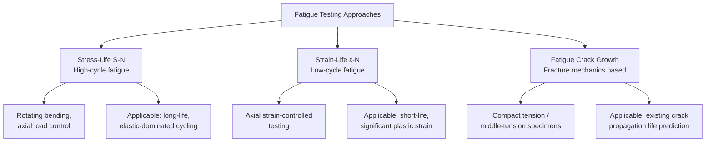

## Fatigue Testing Procedures

### Definition

Fatigue testing evaluates a material's resistance to failure under **cyclic (repeated) loading**, where stresses well below the material's static tensile or yield strength can nonetheless produce progressive damage accumulation, crack initiation, and eventual fracture after a sufficient number of load cycles. Fatigue accounts for a large proportion of in-service mechanical failures, making standardized fatigue testing a critical component of material qualification and component design for any application subjected to repeated or fluctuating loads.

### Fundamental Cyclic Loading Parameters

**SVG Diagram: Cyclic Stress Waveform and Key Parameters (svg_diagram)**

<svg xmlns="http://www.w3.org/2000/svg" viewBox="0 0 760 420" font-family="Arial, sans-serif">
<text x="380" y="25" font-size="18" font-weight="bold" text-anchor="middle">Cyclic Stress Waveform and Key Parameters (svg_diagram)</text>

<line x1="80" y1="220" x2="720" y2="220" stroke="black" stroke-width="1" stroke-dasharray="3,3" />
<line x1="80" y1="360" x2="720" y2="60" stroke="none" />
<line x1="80" y1="380" x2="80" y2="60" stroke="black" stroke-width="2" />
<text x="400" y="405" font-size="14" text-anchor="middle">Time, t</text>
<text x="30" y="220" font-size="14" text-anchor="middle" transform="rotate(-90 30 220)">Stress, σ</text>

<path d="M 80 220 C 110 120, 140 120, 170 220 S 230 320, 260 220 S 320 120, 350 220 S 410 320, 440 220 S 500 120, 530 220 S 590 320, 620 220 S 680 120, 700 220" fill="none" stroke="`#2980b9`" stroke-width="2.5" />

<line x1="80" y1="120" x2="720" y2="120" stroke="#c0392b" stroke-width="1" stroke-dasharray="4,3" />
<text x="30" y="118" font-size="12" fill="#c0392b">σmax</text>
<line x1="80" y1="320" x2="720" y2="320" stroke="#27ae60" stroke-width="1" stroke-dasharray="4,3" />
<text x="30" y="325" font-size="12" fill="#27ae60">σmin</text>

<line x1="80" y1="220" x2="720" y2="220" stroke="#8e44ad" stroke-width="1" />
<text x="650" y="215" font-size="12" fill="#8e44ad">σm (mean)</text>

<line x1="740" y1="120" x2="740" y2="220" stroke="black" stroke-width="1" />
<text x="748" y="175" font-size="12">σa</text>

<line x1="170" y1="380" x2="170" y2="390" stroke="black" stroke-width="1" />
<line x1="350" y1="380" x2="350" y2="390" stroke="black" stroke-width="1" />
<text x="260" y="405" font-size="11" text-anchor="middle">1 cycle</text>
</svg>

$$\sigma_{max}, \sigma_{min} \quad \sigma_m = \dfrac{\sigma_{max}+\sigma_{min}}{2} \quad \sigma_a = \dfrac{\sigma_{max}-\sigma_{min}}{2} \quad \Delta\sigma = \sigma_{max}-\sigma_{min} \quad R = \dfrac{\sigma_{min}}{\sigma_{max}}$$

- **Key Points**
  - **Mean stress, $\sigma_m$**: the average of maximum and minimum stress in the cycle.
  - **Stress amplitude, $\sigma_a$**: half the total stress range.
  - **Stress range, $\Delta\sigma$**: the total difference between maximum and minimum stress.
  - **Stress (load) ratio, $R$**: the ratio of minimum to maximum stress, a key parameter characterizing loading type:
    - $R = -1$: **fully reversed** loading ($\sigma_m = 0$), the most common baseline test condition.
    - $R = 0$: **zero-to-tension** (pulsating) loading ($\sigma_{min}=0$).
    - $0 < R < 1$: tension-tension loading with a positive mean stress.
    - $R < -1$ or other combinations: various tension-compression conditions with different mean stress levels.
  - Waveform shape (sinusoidal, triangular, square) and cyclic **frequency** are also specified/controlled, and can influence results, particularly at very high frequencies or in environments where time-dependent effects (corrosion, creep interaction) matter.

### Fatigue Testing Approaches

**Mermaid Diagram: Fatigue Testing Approach Overview**

### Stress-Life (S-N) Testing

The S-N (Wöhler) approach relates applied cyclic **stress amplitude** to the **number of cycles to failure**, and is the classical, most widely used fatigue testing method, particularly suited to **high-cycle fatigue (HCF)** where stresses remain largely within the elastic range.

- **Key Points**
  - **Governing standard**: **ASTM E466** (axial fatigue testing of metallic materials), with rotating-beam testing per **ASTM E466**-related and historical **R.R. Moore rotating-beam** test configurations also widely referenced.
  - **Test types**:
    - **Rotating bending (R.R. Moore) test**: a cylindrical specimen is rotated while subjected to a constant bending moment, producing fully reversed ($R=-1$) stress at the outer fiber with each rotation — a classic, mechanically simple method for generating baseline fully-reversed S-N data.
    - **Axial (uniaxial) fatigue testing**: a servo-hydraulic or electrodynamic testing machine applies controlled cyclic axial load or stress directly, allowing testing at any specified $R$ ratio, not just fully reversed conditions.
  - **Procedure**: multiple identical specimens are each tested at a specific stress amplitude until failure (or until a defined "runout" cycle count, e.g., $10^7$ cycles, is reached without failure), with the resulting stress amplitude vs. cycles-to-failure ($N_f$) data plotted (typically $\sigma_a$ vs. $\log N_f$) to construct the **S-N curve**.
  - **Fatigue limit (endurance limit)**: for many ferrous alloys (particularly steels), the S-N curve exhibits a distinct **plateau** at long life, below which the material can theoretically endure an essentially infinite number of cycles without failure — this stress level is the **fatigue (endurance) limit**, $\sigma_e$.
  - **Non-ferrous alloys** (most aluminum, magnesium, copper alloys) typically **do not exhibit a true fatigue limit**; instead, the S-N curve continues to decline gradually even at very long life, so a **fatigue strength at a specified life** (e.g., fatigue strength at $10^7$ or $5\times10^8$ cycles) is reported instead, since there is no natural plateau to define an "infinite life" stress.

**SVG Diagram: S-N Curve — Ferrous vs. Non-Ferrous Behavior (svg_diagram)**

<svg xmlns="http://www.w3.org/2000/svg" viewBox="0 0 760 460" font-family="Arial, sans-serif">
<text x="380" y="25" font-size="18" font-weight="bold" text-anchor="middle">S-N Curve — Fatigue Limit vs. No Fatigue Limit (svg_diagram)</text>
<line x1="90" y1="400" x2="700" y2="400" stroke="black" stroke-width="2" />
<line x1="90" y1="400" x2="90" y2="60" stroke="black" stroke-width="2" />
<text x="395" y="435" font-size="15" text-anchor="middle">log (Cycles to Failure, N)</text>
<text x="35" y="230" font-size="15" text-anchor="middle" transform="rotate(-90 35 230)">Stress Amplitude, σa</text>

<path d="M 130 100 C 250 180, 350 260, 420 300 C 500 320, 600 325, 680 326" fill="none" stroke="`#2980b9`" stroke-width="3" />

<line x1="420" y1="300" x2="680" y2="300" stroke="`#2980b9`" stroke-width="1.5" stroke-dasharray="4,3" />

<text x="500" y="290" font-size="12" fill="`#2980b9`" font-weight="bold">Steel (fatigue limit, σe)</text>

<path d="M 130 130 C 250 220, 400 290, 550 340 C 620 360, 660 370, 690 378" fill="none" stroke="`#c0392b`" stroke-width="3" />

<text x="480" y="380" font-size="12" fill="`#c0392b`" font-weight="bold">Al Alloy (no true fatigue limit)</text>

<circle cx="420" cy="300" r="5" fill="#2980b9" />
<text x="430" y="315" font-size="10">Runout (10⁷ cycles)</text>
</svg>

### Strain-Life (ε-N) Testing

The strain-life approach relates applied cyclic **strain amplitude** to cycles to failure, and is the preferred method for **low-cycle fatigue (LCF)**, where significant plastic strain occurs each cycle (typically failure life below approximately $10^4$–$10^5$ cycles).

- **Key Points**
  - **Governing standard**: **ASTM E606** (strain-controlled fatigue testing).
  - **Test control**: unlike S-N testing (stress-controlled), strain-life testing uses **axial strain control**, since under conditions of significant plastic deformation, stress amplitude alone becomes a less physically meaningful controlling variable (material response softens/hardens cyclically, so a fixed stress amplitude does not correspond to a fixed, repeatable strain response).
  - **Hysteresis loops**: each cycle traces a closed stress-strain **hysteresis loop**; the area enclosed represents plastic strain energy dissipated per cycle, a quantity directly related to fatigue damage accumulation in the LCF regime.
  - **Cyclic hardening/softening**: many materials exhibit progressive **cyclic hardening or softening** (change in stress response at a given strain amplitude) over the initial cycles of a strain-controlled test before typically stabilizing — this transient behavior is itself characterized and reported as part of strain-life material characterization.
  - **Coffin-Manson relationship**: LCF life is commonly described by the empirical Coffin-Manson equation relating plastic strain amplitude to cycles to failure:

    $$\dfrac{\Delta\varepsilon_p}{2} = \varepsilon_f'(2N_f)^c$$

    where $\varepsilon_f'$ = fatigue ductility coefficient, $c$ = fatigue ductility exponent (typically $-0.5$ to $-0.7$ for many metals [Unverified: exact value is alloy-specific]), and $2N_f$ = reversals to failure. Combined with the elastic (Basquin) component, the total strain-life relationship (Coffin-Manson-Basquin) is used to model fatigue life across both LCF and HCF regimes.

### Fatigue Crack Growth (Fracture Mechanics) Testing

Rather than characterizing total life to failure from a smooth or mildly notched specimen, fatigue crack growth testing directly measures the **rate of propagation of an existing crack** under cyclic loading, using linear elastic fracture mechanics (LEFM) principles.

- **Key Points**
  - **Governing standard**: **ASTM E647** (fatigue crack growth rate testing).
  - **Specimen types**: commonly **compact tension (CT)** or **middle-tension (MT)** specimens, containing a machined starter notch from which a fatigue precrack is grown under controlled conditions before formal test data collection begins.
  - **Measured quantity**: crack length $a$ is monitored as a function of cycle count $N$ (via optical, compliance, or electrical potential drop methods), and the **crack growth rate**, $da/dN$, is plotted against the **stress intensity factor range**, $\Delta K = K_{max}-K_{min}$, on log-log axes.
  - **Paris Law**: the resulting curve typically exhibits a linear (log-log) intermediate region described by the Paris Law:

    $$\dfrac{da}{dN} = C(\Delta K)^m$$

    where $C$ and $m$ are material constants determined by regression fit to the test data.
  - **Three-region behavior**: the full $da/dN$ vs. $\Delta K$ curve is sigmoidal, comprising:
    - **Region I**: near-threshold behavior, where crack growth rate drops sharply toward zero below a **threshold stress intensity range, $\Delta K_{th}$**, below which cracks are considered effectively non-propagating.
    - **Region II**: the linear Paris-law regime, representing stable crack growth across most of the practical fatigue life.
    - **Region III**: rapid, unstable crack growth as $K_{max}$ approaches the material's fracture toughness $K_{IC}$, leading to final fracture.
  - Fatigue crack growth data is essential for **damage-tolerant design** and **fitness-for-service** assessments, allowing prediction of remaining life for components with known or postulated initial flaws (e.g., aircraft structures, pressure vessels operating under a damage-tolerant philosophy).

### Specimen Preparation and Test Control Considerations

- **Key Points**
  - **Surface finish** is critical: fatigue cracks (especially in HCF) very commonly initiate at surface irregularities, machining marks, or stress concentrations, so specimen surface preparation (polishing, controlled machining) must be carefully specified and consistently applied to obtain repeatable, comparable results.
  - **Statistical scatter**: fatigue life exhibits **inherently large scatter** (often spanning an order of magnitude or more in cycles-to-failure at a given stress amplitude) due to sensitivity to microstructural inhomogeneities (inclusions, porosity) and surface condition, requiring multiple specimens per condition and statistical treatment (e.g., staircase method for fatigue limit determination, probability-of-failure S-N curves) rather than single-specimen characterization.
  - **Environmental control**: fatigue testing in corrosive environments (**corrosion fatigue**) or at elevated temperature (with potential creep-fatigue interaction) requires specialized environmental chambers/fixtures and generally produces significantly reduced fatigue life/fatigue limit compared to benign room-temperature air testing. [Inference: general trend well-established in fatigue literature; exact life reduction magnitude is environment- and alloy-specific.]

### Example

A steel component is being qualified using rotating-beam S-N testing (fully reversed, $R=-1$) per a protocol analogous to ASTM E466:

- Multiple specimens are tested at descending stress amplitudes, producing failures at $\sigma_a = 400\ \text{MPa}$ ($N_f \approx 5{,}000$ cycles), $\sigma_a = 300\ \text{MPa}$ ($N_f \approx 80{,}000$ cycles), and $\sigma_a = 220\ \text{MPa}$ ($N_f \approx 2{,}000{,}000$ cycles).
- At $\sigma_a = 180\ \text{MPa}$, several specimens run out at $10^7$ cycles without failure, suggesting this stress amplitude is at or below the material's **fatigue limit**.
- Because the material shows a clear plateau (runout behavior) rather than continued gradual decline, this is consistent with **ferrous (steel) fatigue behavior**, allowing the engineer to specify $\sigma_a \approx 180\ \text{MPa}$ (typically with an added safety factor) as a design stress amplitude for theoretically infinite-life service, a design approach not available for alloys (e.g., most aluminum alloys) that lack a true fatigue limit and instead require life to be specified at a defined, finite target cycle count.

[Inference: numerical values are illustrative and representative of typical steel HCF S-N trends, not measured data from a specific certified test program.]

### Engineering Significance

- **Key Points**
  - Fatigue testing underlies both **safe-life design** (S-N or strain-life based, sizing components so expected service stresses remain below levels producing failure within the design life, often with substantial safety factors due to fatigue's inherent scatter) and **damage-tolerant design** (fatigue crack growth based, assuming flaws may exist and are periodically inspected, with life defined by crack growth from an assumed initial flaw size to critical size).
  - The choice between S-N, strain-life, and crack-growth testing approaches depends on the expected loading regime (HCF vs. LCF), whether components are expected to be flaw-free or may contain manufacturing/service-induced defects, and the governing industry design philosophy (e.g., aerospace structures commonly use damage-tolerant approaches; many general mechanical components use safe-life S-N approaches).
  - Fatigue data from these standardized tests feeds directly into component design codes, inspection interval determination, and structural health monitoring programs across aerospace, automotive, power generation, and civil/structural engineering applications.

### Next Steps

- **Related Topics**
  - Tensile Testing
  - Fracture Toughness Testing
  - Impact Testing: Charpy and Izod
  - Paris Law and Fatigue Crack Growth Modeling
  - Coffin-Manson Relationship and Low-Cycle Fatigue
  - Fatigue Limit, Staircase Method, and Statistical Treatment of Fatigue Data
  - Damage-Tolerant vs. Safe-Life Design Philosophy
  - Corrosion Fatigue and Creep-Fatigue Interaction