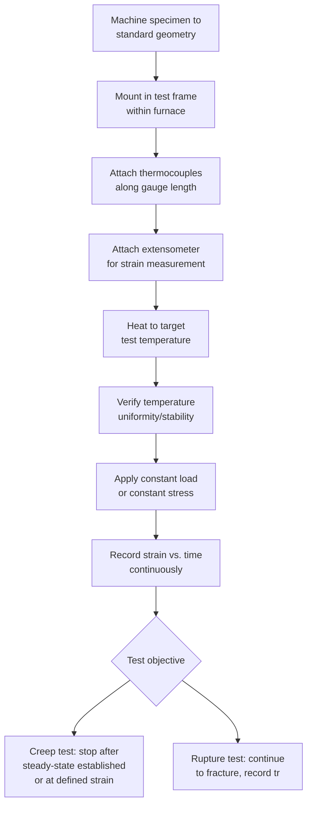

## Creep Testing Procedures

### Definition

Creep testing procedures encompass the standardized experimental methods used to characterize the time-dependent deformation behavior of materials under sustained load at elevated temperature. This includes both **conventional (long-duration) creep and creep-rupture testing**, which directly measures behavior over practical laboratory timescales, and **accelerated testing methods** designed to more rapidly assess creep resistance for screening, quality control, or extrapolation purposes. These procedures generate the data underlying design allowable stresses, alloy qualification, and remaining-life assessment for elevated-temperature components.

### Standard Creep and Creep-Rupture Testing (ASTM E139)

**Mermaid Diagram: Standard Creep Test Procedure**

- **Key Points**
  - **Governing standard**: **ASTM E139** (Standard Test Methods for Conducting Creep, Creep-Rupture, and Stress-Rupture Tests of Metallic Materials), covering the full range of conventional constant-load/constant-stress elevated-temperature testing; international equivalent standards (e.g., ISO 204) cover similar scope.
  - **Specimen geometry**: cylindrical or flat dogbone tensile specimens with a defined gauge length, broadly similar to tensile specimens but designed for extended high-temperature exposure and compatible with high-temperature extensometry.
  - **Temperature control**: precise, stable furnace temperature control is critical, with strict axial and radial temperature uniformity tolerances specified (commonly within a few degrees Celsius over the gauge length) and continuous monitoring via multiple thermocouples throughout the test duration, which can range from hundreds to tens of thousands of hours.
  - **Loading system**: most commonly a **lever-arm dead-weight system** for simple constant-load application; more sophisticated servo-controlled systems can maintain true constant stress by compensating load for the reducing cross-sectional area as the specimen elongates.
  - **Strain measurement**: continuous high-temperature extensometry (mechanical, optical, or laser-based) is used for tests intended to yield detailed creep-curve data (particularly minimum creep rate); simpler pre/post-test gauge length measurement may suffice for tests focused purely on rupture time.
  - **Test duration considerations**: because meaningful creep and rupture data at service-relevant stress/temperature can require extremely long test durations (thousands to tens of thousands of hours), test programs are typically planned using a **matrix of temperatures and stresses**, often including some deliberately accelerated (higher stress/temperature) conditions to enable practical test durations while still capturing a range suitable for extrapolation methods (e.g., the Larson–Miller parameter).

### Distinguishing Test Objectives

- **Key Points**
  - **Pure creep tests**: emphasis on precise strain-time measurement to establish the primary and secondary (minimum) creep rate; often terminated once steady-state behavior is well-characterized, without necessarily running to fracture, since the primary output (minimum creep rate) can typically be established well before rupture.
  - **Creep-rupture / stress-rupture tests**: run to complete fracture, with primary emphasis on **time to rupture ($t_r$)**, along with elongation and reduction-in-area at fracture as secondary ductility indicators; may use simpler strain instrumentation since the detailed shape of the creep curve is secondary to the rupture-time result.
  - In practice, many test programs record continuous strain data and run specimens to fracture, yielding both detailed creep-curve information (instantaneous strain, primary/secondary/tertiary stages, minimum creep rate) and the rupture life in a single test — this combined approach maximizes the value of each costly, long-duration test.

### Constant-Load vs. Constant-Stress Test Configuration

- **Key Points**
  - **Constant-load testing**: the simplest and most common configuration; applied force is held fixed, so true stress increases as the specimen's cross-section reduces during necking/elongation, generally producing an earlier and more pronounced apparent tertiary creep stage (partly a geometric artifact).
  - **Constant-stress testing**: achieved via specialized cam-profiled lever arms or servo-controlled load systems that continuously reduce applied load in proportion to the reducing cross-sectional area, maintaining true stress constant throughout the test; isolates the material's intrinsic tertiary creep behavior (cavitation, microstructural degradation) from geometric necking effects, providing cleaner data for mechanistic studies, though it is less commonly used than constant-load testing for routine industrial qualification due to greater apparatus complexity/cost.

### Accelerated and Screening Test Methods

Because full-duration creep testing at service-relevant conditions is often impractically slow for early-stage alloy screening or rapid quality assessment, several accelerated approaches are used.

- **Key Points**
  - **Elevated stress/temperature testing with parametric extrapolation**: the most common accelerated approach — running a family of tests at higher-than-service stress and/or temperature to obtain rupture data within a practical timeframe, then using time-temperature parameters (most notably the **Larson–Miller parameter**) to extrapolate to lower-stress, lower-temperature service conditions. This remains fundamentally an ASTM E139-type test, simply conducted across an accelerated condition matrix rather than at service conditions directly.
  - **Impression/indentation creep testing**: an emerging, minimally destructive technique using a sustained indentation load (often with specialized indenters) at elevated temperature to infer creep parameters from indentation depth-time behavior, useful for **in-situ or field assessment** of components where removing a full-size specimen is impractical (e.g., remaining-life assessment of in-service power plant piping). [Unverified: this method's correlation to conventional uniaxial creep parameters is still an active area of standardization and validation, and results should be interpreted with appropriate caution relative to full uniaxial test data.]
  - **Small punch creep testing**: uses a small disc specimen deformed by a punch under constant load at temperature, enabling creep characterization from very small material volumes (e.g., extracted from in-service components or limited archival material) — valuable for remaining-life assessment programs where large standard specimens cannot be obtained. Standardization efforts (e.g., under ASTM and European CEN frameworks) aim to correlate small punch results to conventional uniaxial creep-rupture data. [Unverified: correlation accuracy and standardization maturity continue to develop; results are generally treated as a screening/supplementary tool rather than a full replacement for standard uniaxial testing in critical applications.]

### Data Reduction and Reporting

**SVG Diagram: Typical Creep Test Data Products (svg_diagram)**

<svg xmlns="http://www.w3.org/2000/svg" viewBox="0 0 760 420" font-family="Arial, sans-serif">
<text x="380" y="25" font-size="18" font-weight="bold" text-anchor="middle">Creep Test Output: Strain-Time Curve with Key Parameters (svg_diagram)</text>
<line x1="80" y1="380" x2="700" y2="380" stroke="black" stroke-width="2" />
<line x1="80" y1="380" x2="80" y2="60" stroke="black" stroke-width="2" />
<text x="390" y="410" font-size="14" text-anchor="middle">Time, t</text>
<text x="30" y="220" font-size="14" text-anchor="middle" transform="rotate(-90 30 220)">Strain, ε</text>

<path d="M 80 340 C 140 280, 190 255, 230 245 C 300 235, 380 230, 480 210 C 560 190, 610 160, 640 100" fill="none" stroke="`#c0392b`" stroke-width="3" />

<circle cx="640" cy="100" r="5" fill="#c0392b" />
<text x="600" y="90" font-size="12" font-weight="bold">Rupture (tr)</text>

<line x1="280" y1="240" x2="400" y2="222" stroke="#2980b9" stroke-width="1.5" />
<text x="290" y="260" font-size="11" fill="#2980b9">min. creep rate ε̇s</text>

<rect x="450" y="280" width="230" height="90" fill="#f5eef8" stroke="#8e44ad" stroke-width="1" />
<text x="460" y="298" font-size="11" font-weight="bold" fill="#8e44ad">Reported Outputs:</text>
<text x="460" y="314" font-size="10">- ε0 (instantaneous strain)</text>
<text x="460" y="328" font-size="10">- ε̇s (min. creep rate)</text>
<text x="460" y="342" font-size="10">- tr (rupture time)</text>
<text x="460" y="356" font-size="10">- %EL, %RA at rupture</text>
</svg>

- **Key Points**
  - Standard reported outputs from a full creep/creep-rupture test typically include: instantaneous strain ($\varepsilon_0$), minimum (secondary) creep rate ($\dot{\varepsilon}_s$), time to specified strain thresholds (e.g., time to 0.5% or 1% strain, often used as a practical design/inspection criterion), rupture time ($t_r$), and post-test elongation/reduction-in-area.
  - Data from multiple tests across a stress/temperature matrix are compiled into **stress-rupture curves** ($\log\sigma$ vs. $\log t_r$) and, using the power-law creep equation, into determinations of the **stress exponent ($n$)** and **activation energy for creep ($Q_c$)**.
  - Results are frequently further processed into **Larson–Miller master curves** to support extrapolated design-life predictions beyond the directly tested duration range.

### Quality Assurance and Test Validity Considerations

- **Key Points**
  - **Temperature control tolerance** is one of the most critical sources of test error, given creep's exponential (Arrhenius) temperature sensitivity — even small, undetected temperature excursions during a long-duration test can significantly distort results; standards specify strict tolerances and require documented temperature monitoring throughout the test.
  - **Alignment**: bending or off-axis loading (from misaligned grips/pull-rods) introduces unwanted stress components and can cause premature or non-representative failure; standard practice includes verification of specimen/loading-train alignment before starting extended tests.
  - **Specimen machining quality**: surface finish and machining-induced residual stress/damage can influence crack initiation and rupture behavior, particularly in the tertiary (cavitation-sensitive) regime, so specimen preparation follows controlled procedures analogous to those used for tensile/fatigue specimens.
  - **Interrupted tests**: for very long-duration tests, planned interruptions (e.g., for load train inspection or power outages) must be carefully managed and documented, as unplanned temperature/load excursions during an interruption can invalidate or complicate interpretation of the resulting data.

### Example

A power-generation steel supplier conducts a creep-rupture qualification program for a new Cr-Mo-V steel per ASTM E139:

- **Test matrix**: specimens are tested at three temperatures (550°C, 600°C, 650°C) and, at each temperature, four stress levels chosen to span rupture times from approximately 100 hours to over 10,000 hours — balancing practical laboratory duration against the need for sufficient long-term data to support reliable extrapolation.
- **Instrumentation**: continuous extensometry is used on a subset of specimens at each condition to additionally extract minimum creep rate data, while the remaining specimens use simpler pre/post-test measurement focused purely on rupture time and ductility.
- **Output**: the resulting stress-rupture data, combined with the derived stress exponent and activation energy (confirming a consistent dislocation-creep mechanism across the tested range), is used to construct a Larson–Miller master curve, from which the alloy's allowable design stress for a target 100,000-hour service life at the intended operating temperature (e.g., 565°C) is extrapolated and submitted for code-case qualification.

[Inference: this example describes a representative, standard-practice test program structure; specific test matrices, durations, and qualification requirements vary by governing code and application.]

### Engineering Significance

- **Key Points**
  - Standardized creep testing procedures (principally ASTM E139) provide the foundational experimental basis for essentially all elevated-temperature design allowable stress data used in power generation, petrochemical, and aerospace structural design codes.
  - The substantial time and cost of full-duration creep testing motivates continued development and validation of accelerated and small-specimen methods (small punch, impression creep) particularly for **remaining-life assessment** of long-service in-plant components, where extracting large conventional specimens may be impractical or would compromise the component's continued service.
  - Rigorous temperature control and instrumentation practices are essential given creep's strong, exponential temperature sensitivity — testing procedure quality directly affects the reliability of downstream design allowable stresses and extrapolated life predictions.

### Next Steps

- **Related Topics**
  - Stages of the Creep Curve
  - Stress Rupture Testing
  - The Larson–Miller Parameter
  - Stress and Temperature Dependence of Creep
  - Tensile Testing
  - Small Punch and Impression Creep Testing Methods
  - Remaining-Life Assessment of In-Service High-Temperature Components