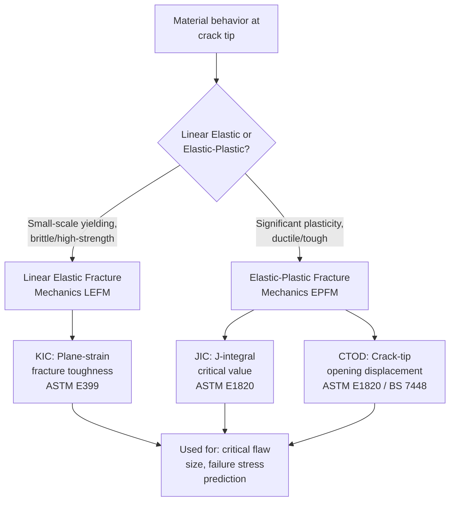

## Fracture Toughness Testing Standards

### Definition

Fracture toughness testing quantifies a material's resistance to crack propagation in the presence of a pre-existing flaw, providing quantitative fracture mechanics parameters used in damage-tolerant design, structural integrity assessment, and fitness-for-service evaluation. Unlike impact testing (which provides a comparative, empirical toughness metric), fracture toughness testing produces parameters — $K_{IC}$, $J_{IC}$, and CTOD — that can be used directly in engineering fracture mechanics calculations to predict critical flaw sizes and failure loads.

### Fracture Mechanics Regimes and Applicable Parameters

**Mermaid Diagram: Fracture Toughness Parameter Selection**

### Plane-Strain Fracture Toughness (KIC) — ASTM E399

- **Key Points**
  - **Applicability**: valid within **Linear Elastic Fracture Mechanics (LEFM)**, appropriate for materials that behave in a predominantly brittle or high-strength/low-toughness manner, where the plastic zone at the crack tip is small relative to specimen dimensions (**small-scale yielding** condition).
  - **Specimen types**: commonly **compact tension (CT)** or **single-edge notch bend (SENB/three-point bend)** specimens, each containing a machined notch from which a sharp **fatigue precrack** is grown under controlled cyclic loading (per requirements shared conceptually with ASTM E647) before formal $K_{IC}$ testing.
  - **Test procedure**: the precracked specimen is loaded monotonically (in the bend or tension configuration) while load and crack-mouth-opening displacement (CMOD, via a clip gauge) are recorded, generating a load-displacement curve used to determine a candidate fracture toughness value, $K_Q$.
  - **Validity requirements**: $K_{IC}$ is only a valid, size-independent material property if the specimen satisfies strict **size requirements** relative to the plastic zone size, specifically:

    $$B, a, (W-a) \geq 2.5\left(\dfrac{K_Q}{\sigma_{ys}}\right)^2$$

    where $B$ = specimen thickness, $a$ = crack length, $W$ = specimen width, and $\sigma_{ys}$ = material yield strength. If this criterion is not met, the specimen is too small/thin (or the material too tough) to maintain plane-strain, small-scale-yielding conditions, and $K_Q$ is reported as invalid for $K_{IC}$ (it may still be reportable as $K_c$, a size-dependent apparent toughness).
  - **Key limitation**: for tough, ductile materials, the required specimen size to achieve a valid $K_{IC}$ result per the criterion above can become impractically large (sometimes requiring specimens of many centimeters or more in critical dimension) — this practical limitation was the primary motivation for developing the elastic-plastic fracture mechanics (EPFM) methods below.

### J-Integral Fracture Toughness (JIC) and CTOD — ASTM E1820

For materials exhibiting significant plasticity at the crack tip (most structural steels, many engineering alloys at typical service temperatures), **Elastic-Plastic Fracture Mechanics (EPFM)** parameters — the J-integral and Crack Tip Opening Displacement (CTOD) — provide valid, more practically obtainable toughness measures.

#### J-Integral (JIC)

- **Key Points**
  - The **J-integral** is a path-independent energy-based parameter characterizing the intensity of the crack-tip stress/strain field under elastic-plastic conditions, reducing to the elastic strain energy release rate $G$ in the linear elastic limit (connecting EPFM back to LEFM theory).
  - **Governing standard**: **ASTM E1820** (Standard Test Method for Measurement of Fracture Toughness), which unified J-integral and CTOD testing procedures into a single comprehensive standard.
  - **Test procedure**: typically uses the same CT or SENB specimen types as $K_{IC}$ testing (with fatigue precracking), but analysis accounts for the plastic contribution to crack-tip driving force via the load-displacement (or load-CMOD) curve area, combined with specimen geometry factors.
  - **Resistance curve (J-R curve)**: for ductile materials exhibiting stable crack growth before final fracture, testing often produces a full **J-R curve** ($J$ vs. crack extension $\Delta a$), from which $J_{IC}$ (the J value at a small, defined amount of stable crack extension, per standard offset-line construction) is determined, along with the tearing modulus characterizing the material's resistance to continued stable crack growth.
  - **Multi-specimen and single-specimen (unloading compliance) methods**: $J$-R curves can be generated either by testing multiple specimens to different amounts of crack extension (multi-specimen method) or, more commonly in modern practice, by a **single-specimen elastic unloading compliance technique**, where periodic small unloadings during a single continuous test allow real-time crack length estimation from the specimen's changing compliance.
  - **Conversion to KJC**: a $J_{IC}$ value can be converted to an equivalent (elastic-plastic-derived) $K_{JC}$ value using the standard elastic relationship $K = \sqrt{EJ/(1-\nu^2)}$ (plane strain), enabling comparison with LEFM-based $K_{IC}$ results or use in $K$-based fracture assessment procedures even for materials too tough to generate a valid direct $K_{IC}$.

#### Crack Tip Opening Displacement (CTOD)

- **Key Points**
  - CTOD directly measures the **physical displacement/opening at the tip of a sharp crack** under load, providing an alternative, more physically direct EPFM parameter, particularly historically favored in certain industries (notably offshore/pipeline structural steel qualification, following early development in the UK).
  - **Governing standards**: covered within **ASTM E1820** (alongside J-integral) in current US practice, and historically/parallelly by **BS 7448** (British Standard) in UK/European practice, reflecting CTOD's origins and particularly strong adoption in structural steel and welded joint qualification.
  - **Applications**: especially prominent in **weld and heat-affected zone (HAZ) toughness qualification** for offshore structures, pipelines, and pressure vessels, where CTOD testing of weld metal and HAZ locations is a standard structural integrity qualification requirement.
  - CTOD and J-integral are theoretically related (approximately proportional under certain conditions) and are often reported together or convertibly within the same ASTM E1820 test program.

### Specimen Preparation: Fatigue Precracking

- **Key Points**
  - All valid fracture toughness tests (KIC, JIC, CTOD) require a **sharp fatigue precrack**, grown from a machined starter notch under carefully controlled cyclic loading (low $\Delta K$, per requirements analogous to but more stringent than routine ASTM E647 fatigue crack growth testing) prior to the fracture toughness test itself.
  - Precracking parameters (maximum stress intensity during precracking relative to the final test's expected toughness, crack length uniformity across the specimen thickness) are tightly controlled because an improperly grown precrack (too blunt, too curved, or grown at excessive $\Delta K$ leaving a residual plastic zone) can produce non-conservative (artificially high) toughness results.
  - Precracking is typically the most time-consuming step of fracture toughness specimen preparation, often requiring careful monitoring of crack length via visual, compliance, or potential-drop methods to ensure the crack front remains sufficiently straight and within specified curvature tolerances.

### Comparative Summary

| Parameter | Standard | Fracture Mechanics Regime | Best Suited For | Key Output |
| --- | --- | --- | --- | --- |
| $K_{IC}$ | ASTM E399 | LEFM (small-scale yielding) | Brittle/high-strength, low-toughness materials | Single valid toughness value (MPa√m) |
| $J_{IC}$ | ASTM E1820 | EPFM | Ductile materials, significant plasticity | J-R curve, $J_{IC}$ (kJ/m²), tearing modulus |
| CTOD | ASTM E1820 / BS 7448 | EPFM | Weld/HAZ qualification, structural steel | Critical CTOD (mm), often at specific events (onset of stable tearing, max load, etc.) |

### Test Temperature and Transition Behavior

- **Key Points**
  - Fracture toughness, particularly in ferritic steels, is **strongly temperature-dependent**, mirroring the ductile-to-brittle transition behavior seen in Charpy impact testing (though the quantitative transition temperature/shape from fracture toughness testing is not numerically identical to the Charpy transition, despite qualitative correlation).
  - Testing is frequently conducted across a **range of temperatures** to characterize the full transition from lower-shelf (predominantly cleavage, low, scattered $K_{IC}$/$K_{JC}$ values, often requiring statistical/probabilistic treatment per methods such as the **Master Curve approach**, ASTM E1921) through the transition region to upper-shelf (ductile, EPFM-governed $J_{IC}$/CTOD) behavior.
  - The **Master Curve method (ASTM E1921)** provides a standardized statistical framework specifically for characterizing the highly scattered transition-region fracture toughness of ferritic steels (notably applied in nuclear reactor pressure vessel integrity assessment), using a defined temperature-dependence shape and Weibull statistical treatment of scatter, calibrated from a relatively modest number of specimens.

### Example

A structural steel weld is being qualified for offshore platform service, requiring both Charpy impact and CTOD data at the minimum design temperature (−10°C):

- **Charpy testing** (ASTM E23) provides a rapid, low-cost screening indication of notch toughness at temperature, useful for initial material/weld procedure screening and specification compliance checks.
- **CTOD testing** (per ASTM E1820/BS 7448 methodology) is then performed on precracked specimens extracted from the weld metal and heat-affected zone, providing a **quantitative fracture mechanics parameter** directly usable in a structural **Engineering Critical Assessment (ECA)** — a fitness-for-service calculation determining the maximum tolerable flaw size in the actual welded structure at the design stress and temperature.
- The CTOD result, being a quantitative fracture mechanics parameter (unlike the purely comparative Charpy energy value), allows engineers to directly calculate whether flaws detected during in-service inspection (e.g., via ultrasonic or radiographic NDE) are acceptable or require repair, based on established fracture mechanics failure assessment diagrams (e.g., per BS 7910 or API 579 fitness-for-service methodology).

[Inference: this example describes a representative, standard-practice structural integrity qualification workflow; specific test temperatures, acceptance criteria, and governing codes vary by project/jurisdiction/application.]

### Engineering Significance

- **Key Points**
  - Fracture toughness parameters ($K_{IC}$, $J_{IC}$, CTOD) are the essential quantitative inputs for **damage-tolerant design and fitness-for-service assessment**, enabling calculation of critical flaw sizes, safe inspection intervals, and remaining structural life in the presence of known or postulated defects — a capability that empirical, comparative tests (Charpy, hardness) cannot directly provide.
  - Selection between LEFM ($K_{IC}$) and EPFM ($J_{IC}$/CTOD) testing approaches depends on the material's inherent ductility and the practical achievability of LEFM specimen size requirements; most modern structural steel and many engineering alloys at service temperature require EPFM methods due to impractical LEFM specimen size requirements.
  - Fracture toughness data, combined with fatigue crack growth data (ASTM E647) and nondestructive inspection capability, forms the technical basis of modern **fitness-for-service** and **structural integrity management** programs across aerospace, offshore, pipeline, pressure vessel, and nuclear industries.

### Next Steps

- **Related Topics**
  - Impact Testing: Charpy and Izod
  - Fatigue Testing Procedures
  - Tensile Testing
  - Linear Elastic vs. Elastic-Plastic Fracture Mechanics
  - Master Curve Method for Ferritic Steel Transition Toughness (ASTM E1921)
  - Fitness-for-Service Assessment (API 579, BS 7910)
  - Fatigue Crack Growth Testing (ASTM E647)
  - Ductile-to-Brittle Transition Temperature