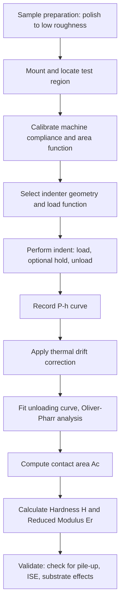

## Nanoindentation Techniques

### Overview

Nanoindentation is an instrumented indentation technique used to measure mechanical properties—primarily hardness and elastic modulus—at length scales ranging from tens of nanometers to a few micrometers. Unlike conventional (macro/micro) hardness testing, which relies on post-test optical measurement of the residual indent, nanoindentation continuously records applied load $P$ and indenter displacement $h$ throughout loading and unloading. This load-displacement ($P$-$h$) curve is analyzed to extract mechanical properties without needing to directly image the indent.

The technique is essential for characterizing thin films, coatings, small-volume samples, individual grains or phases within a microstructure, gradient materials, and biological or soft materials where conventional testing is impractical.

### Fundamental Principle

A hard indenter tip (typically diamond) with a well-characterized geometry is pressed into a sample surface under controlled load or displacement, then withdrawn. The resulting $P$-$h$ curve has three regimes:

- **Loading segment**: Combined elastic and plastic deformation occurs as the tip penetrates the surface.
- **Peak load hold (optional)**: Often used to allow creep or viscoelastic relaxation to occur, and to establish a stable starting point for unloading.
- **Unloading segment**: Primarily elastic recovery occurs, and the initial slope of this segment is used to compute stiffness.

**Key Points**

- Hardness in nanoindentation is defined as $H = P_{max}/A_c$, where $A_c$ is the projected contact area at peak load.
- Elastic modulus is extracted from the unloading stiffness $S = dP/dh$ at the onset of unload.
- Because $A_c$ cannot be measured optically at this scale, it must be inferred from the indenter geometry and the measured penetration depth.

### The Oliver-Pharr Method

The dominant analysis framework, developed by Oliver and Pharr (1992), extracts hardness and modulus from a single loading-unloading cycle.

**Step 1: Fit the unloading curve**

The upper portion (typically 25–50%) of the unloading curve is fit to a power-law relation:

$$P = \alpha (h - h_f)^m$$

where $h_f$ is the final (residual) depth after full unload and $\alpha$, $m$ are fitting constants.

**Step 2: Compute contact stiffness**

The stiffness at maximum load is the derivative of this fit evaluated at $h_{max}$:

$$S = \left(\frac{dP}{dh}\right)_{h=h_{max}}$$

**Step 3: Determine contact depth**

Because the surface deflects elastically around the indenter (sink-in for elastic-plastic materials, or pile-up for highly plastic materials), the contact depth $h_c$ is less than the total depth $h_{max}$:

$$h_c = h_{max} - \varepsilon \frac{P_{max}}{S}$$

where $\varepsilon$ is a geometric constant (0.75 for a Berkovich indenter, derived from conical/paraboloid punch solutions).

**Step 4: Compute contact area**

The projected contact area is obtained from an empirically calibrated **area function** $A_c = f(h_c)$, specific to the indenter's actual (non-ideal) tip geometry:

$$A_c = C_0 h_c^2 + C_1 h_c + C_2 h_c^{1/2} + C_3 h_c^{1/4} + \dots$$

For a perfect Berkovich tip, $C_0 = 24.5$; deviations account for tip rounding at small depths, and this calibration is typically performed against a fused silica standard of known modulus.

**Step 5: Compute reduced modulus and hardness**

$$E_r = \frac{\sqrt{\pi}}{2}\frac{S}{\sqrt{A_c}}$$

$$H = \frac{P_{max}}{A_c}$$

The reduced modulus $E_r$ accounts for the fact that both the indenter and the sample deform elastically:

$$\frac{1}{E_r} = \frac{1-\nu_s^2}{E_s} + \frac{1-\nu_i^2}{E_i}$$

Solving for the sample's Young's modulus $E_s$ requires knowing the sample's Poisson's ratio $\nu_s$ (usually assumed or estimated) and the indenter's known properties ($E_i \approx 1141$ GPa, $\nu_i \approx 0.07$ for diamond).

### Indenter Geometries

| Geometry | Description | Typical Use |
| --- | --- | --- |
| Berkovich | Three-sided pyramid, self-similar | Standard for $H$ and $E$ measurement |
| Cube corner | Sharper three-sided pyramid (higher stress) | Fracture toughness, thin films |
| Vickers | Four-sided pyramid | Cross-reference to conventional hardness |
| Spherical | Rounded tip, radius $R$ | Elastic-plastic transition studies, Hertzian contact |
| Conical | Cone with defined half-angle | Simplified axisymmetric analysis |

**[Inference]** Berkovich indenters are preferred over Vickers at the nanoscale because a three-sided pyramid can be ground to a sharper, more geometrically self-consistent point than a four-sided pyramid, reducing tip-rounding artifacts at shallow depths.

### Instrumentation

A nanoindentation system consists of:

- **Actuator**: Applies controlled force, commonly via electromagnetic (voice coil) or electrostatic (capacitive) mechanisms, with force resolution in the nanonewton range.
- **Displacement sensor**: Measures penetration depth with sub-nanometer resolution, typically capacitive or interferometric.
- **Indenter tip and holder**: Mounted on a compliant column; instrument compliance must be measured and subtracted from raw displacement data.
- **Vibration isolation and thermal enclosure**: Critical at this scale, since thermal drift (tip or sample expansion during the test) can exceed the magnitude of the measured displacements if uncontrolled.
- **Positioning stage**: Optical microscope or AFM-based positioning to target specific microstructural features (grains, precipitates, interfaces).

### Continuous Stiffness Measurement (CSM)

A widely used enhancement superimposes a small-amplitude, high-frequency oscillation on the primary loading signal. This allows $S$ (and thus $H$ and $E$) to be computed continuously as a function of depth during a single loading segment, rather than only at one point from an unload.

**Key Points**

- Produces full $H(h)$ and $E(h)$ depth profiles in one test.
- Useful for detecting the indentation size effect and for testing layered/graded materials.
- Requires dynamic modeling of the indenter-sample system as a damped harmonic oscillator to deconvolve stiffness from the measured phase and amplitude response.

### Corrections and Artifacts

**Thermal drift**: A drift-correction hold segment (typically at low load, near the end of the test) measures displacement rate due to thermal effects, which is then subtracted from the loading data.

**Pile-up and sink-in**: The Oliver-Pharr method assumes sink-in behavior (elastic deformation dominates surface topology around the contact). In materials with a low strain-hardening exponent and high $E/Y$ ratio, pile-up occurs instead, and the standard method underestimates contact area, leading to overestimated hardness. Corrections require imaging (AFM/SEM) or finite-element-based reference maps.

**Indentation size effect (ISE)**: Measured hardness increases as indentation depth decreases at the sub-micron scale, attributed to the increasing density of geometrically necessary dislocations (GNDs) required to accommodate the sharp indenter geometry. This is commonly modeled with the Nix-Gao relation:

$$H^2 = H_0^2 \left(1 + \frac{h^*}{h}\right)$$

where $H_0$ is the depth-independent (bulk) hardness and $h^*$ is a material-specific characteristic length.

**Substrate effects**: For thin film testing, if indentation depth exceeds roughly 10% of the film thickness, the measured properties are contaminated by the substrate response.

**Surface roughness**: Roughness comparable to or greater than the contact radius introduces significant scatter, particularly at shallow depths; surfaces are typically polished to sub-nanometer roughness for reliable testing.

**Machine compliance**: The measured displacement includes elastic deflection of the load frame itself; this compliance is calibrated out using indentation series on a reference material (typically fused silica) across a range of depths.

### Example Application

A nanoindentation array is performed across a cross-section of a multiphase steel (ferrite-martensite dual-phase microstructure) to map local mechanical heterogeneity:

- A grid of indents (e.g., 20 × 20, 2 µm spacing) is placed to sample individual phases without overlap of plastic zones.
- Each indent yields a local $H$ and $E_r$ value.
- Results are plotted as a spatial hardness map, correlated with EBSD phase maps to distinguish ferrite (softer, lower $H$) from martensite (harder, higher $H$).
- Statistical distributions (histograms) of $H$ per phase reveal local strengthening contributions not visible from bulk hardness testing.

### Load-Displacement Curve Schematic

<svg xmlns="http://www.w3.org/2000/svg" viewBox="0 0 500 380">
<text x="250" y="25" font-size="16" text-anchor="middle" font-family="sans-serif" font-weight="bold">Load-Displacement Curve (svg_diagram)</text>

<line x1="70" y1="320" x2="450" y2="320" stroke="black" stroke-width="1.5" />
<line x1="70" y1="320" x2="70" y2="50" stroke="black" stroke-width="1.5" />
<text x="260" y="355" font-size="14" text-anchor="middle" font-family="sans-serif">Displacement, h</text>
<text x="30" y="185" font-size="14" text-anchor="middle" font-family="sans-serif" transform="rotate(-90 30,185)">Load, P</text>

<path d="M 70,320 Q 200,300 320,80" fill="none" stroke="#1f77b4" stroke-width="2.5" />

<path d="M 320,80 Q 260,180 180,320" fill="none" stroke="#d62728" stroke-width="2.5" />

<circle cx="320" cy="80" r="4" fill="black" />
<text x="330" y="75" font-size="13" font-family="sans-serif">P_max, h_max</text>

<circle cx="180" cy="320" r="4" fill="black" />
<text x="150" y="340" font-size="13" font-family="sans-serif">h_f</text>

<line x1="320" y1="80" x2="320" y2="320" stroke="gray" stroke-dasharray="4,3" stroke-width="1" />
<text x="325" y="335" font-size="12" font-family="sans-serif">h_max</text>

<line x1="320" y1="80" x2="250" y2="320" stroke="#2ca02c" stroke-width="1.5" stroke-dasharray="6,3" />
<text x="240" y="150" font-size="13" font-family="sans-serif" fill="#2ca02c">S = dP/dh</text>

<line x1="350" y1="150" x2="380" y2="150" stroke="#1f77b4" stroke-width="2.5" />
<text x="385" y="154" font-size="12" font-family="sans-serif">Loading</text>
<line x1="350" y1="175" x2="380" y2="175" stroke="#d62728" stroke-width="2.5" />
<text x="385" y="179" font-size="12" font-family="sans-serif">Unloading</text>
</svg>

### Test Workflow

### Applications in Materials Science

- **Thin film and coating characterization**: Hardness/modulus of PVD/CVD coatings, diffusion barriers, and protective layers.
- **Grain-level and phase-level property mapping**: Correlating local mechanical response with microstructure (as in the dual-phase steel example above).
- **Fracture toughness estimation**: Using cube-corner indenters to induce controlled radial cracking, with crack length used in Anstis-type equations.
- **Creep and strain-rate sensitivity**: Constant load-hold segments reveal time-dependent displacement (indentation creep), relevant for solder alloys, polymers, and high-temperature materials.
- **MEMS and small-scale component testing**: Direct property measurement on functional micro-devices where bulk specimens cannot be extracted.
- **Biological and soft materials**: With appropriately modified analysis (e.g., Hertzian contact models) for low-modulus, viscoelastic samples.

**[Inference]** Because dislocation nucleation and multiplication mechanisms can differ at very small contact volumes, hardness values measured at shallow depths may not be directly transferable to bulk material design without accounting for the indentation size effect.

### Related Topics

- Berkovich vs. Cube-Corner Indenter Selection Criteria
- Continuous Stiffness Measurement (CSM) Signal Processing
- Pile-up/Sink-in Correction via Finite Element Analysis
- Indentation Size Effect and Strain Gradient Plasticity
- Nanoindentation-Based Fracture Toughness Measurement
- Thin-Film Substrate Effect Corrections
- AFM-Based Indentation and Imaging Integration
- Statistical Nanoindentation Mapping for Heterogeneous Microstructures