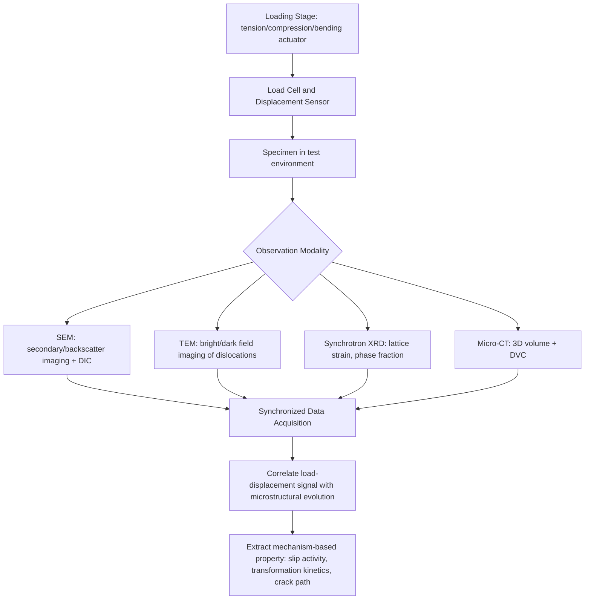

## In Situ and Non Standard Mechanical Testing

### Overview

In situ mechanical testing refers to the deformation of a specimen while simultaneously observing or measuring its microstructural response using a complementary characterization technique—such as electron microscopy, X-ray diffraction, or digital image correlation—during the test itself, rather than only before and after. Non-standard mechanical testing encompasses methods that deviate from conventional standardized geometries and loading conditions (e.g., ASTM/ISO tensile, compression, or hardness tests) to address small-volume specimens, extreme environments, novel loading paths, or coupled multi-physics conditions.

Together, these approaches bridge the gap between macroscopic mechanical response and the underlying micromechanisms (dislocation motion, phase transformation, crack nucleation, grain boundary sliding) that govern it.

### Motivation and Scope

**Key Points**

- Conventional ex situ testing (test to failure, then examine fracture surface or microstructure separately) only provides a final-state snapshot, losing information about the deformation pathway.
- In situ testing enables direct correlation between an applied load/displacement signal and real-time microstructural evolution.
- Non-standard testing is often necessitated by specimen constraints (thin films, MEMS devices, additively manufactured lattices, irradiated or radioactive materials) that cannot be shaped into standard dog-bone or compact-tension geometries.
- Both approaches are central to modern "mechanism-informed" alloy and materials design, where microstructure-property models require direct observational validation.

### In Situ Electron Microscopy Testing

**In situ SEM (Scanning Electron Microscopy) testing**

A miniaturized loading stage (tensile, compression, bending, or fatigue) is placed inside the SEM chamber, allowing surface strain localization, slip band formation, and crack initiation/propagation to be imaged in real time under secondary or backscattered electron contrast.

- Typically combined with **Digital Image Correlation (DIC)** using a speckle pattern applied to the sample surface, enabling full-field strain mapping.
- Often paired with **EBSD (Electron Backscatter Diffraction)** performed at interrupted load steps to track grain-level lattice rotation and strain partitioning between phases.

**In situ TEM (Transmission Electron Microscopy) testing**

Specialized holders (piezo-actuated or MEMS-based) apply nanoscale loads to electron-transparent lamellae or nanowires while the electron beam images dislocation motion, twin nucleation, or phase transformation directly at atomic-to-nanometer resolution.

- Enables direct observation of dislocation-obstacle interactions, dislocation nucleation from free surfaces, and grain boundary-mediated plasticity.
- Sample preparation (typically via focused ion beam, FIB) introduces surface damage and size effects that must be considered when interpreting results.

**[Inference]** Because in situ TEM specimens are necessarily very thin (electron-transparent, generally under ~200 nm), the mechanical response observed may be influenced by surface-to-volume ratio effects and free-surface dislocation escape, and may not be fully representative of bulk behavior.

### In Situ X-Ray and Neutron Diffraction Testing

**Synchrotron X-ray diffraction (XRD) under load**

A load frame is mounted on a synchrotron beamline, allowing diffraction patterns to be collected while the specimen is under stress. Peak shifts, broadening, and intensity changes are used to extract:

- **Lattice strain**: From Bragg peak position shifts, via $\varepsilon = \Delta d/d_0$, providing phase-specific and even grain-orientation-specific elastic strain.
- **Phase fraction evolution**: Useful for tracking strain-induced martensitic transformation (e.g., TRIP steels) or deformation twinning.
- **Dislocation density**: Via peak broadening analysis (Williamson-Hall or modified Warren-Averbach methods).

**In situ neutron diffraction**

Similar principle, but neutrons penetrate much deeper than X-rays, enabling bulk (rather than near-surface) strain and phase measurements—important for thick engineering components and residual stress mapping.

**Digital Volume Correlation (DVC) with X-ray Computed Tomography**

For 3D microstructures (e.g., additively manufactured lattices, foams, fiber composites), in situ loading inside a micro-CT scanner combined with DVC tracks internal 3D displacement fields, revealing subsurface void nucleation and crack paths not visible from the surface.

### Small-Scale Mechanical Testing (Non-Standard Geometries)

Conventional bulk test geometries are infeasible for many modern materials problems (individual grains, thin films, irradiated volumes, additively manufactured lattice struts). Small-scale techniques address this:

| Technique | Specimen | Typical Output |
| --- | --- | --- |
| Micropillar compression | FIB-milled cylindrical pillar (1-10 µm diameter) | Single-crystal yield strength, size-dependent strengthening |
| Micro-cantilever bending | FIB-milled beam | Fracture toughness, yield strength of local microstructure |
| Micro-tensile testing | Lithographically or FIB-fabricated dog-bone | Thin film / MEMS material tensile properties |
| Bulge testing | Thin film membrane pressurized from below | Thin film biaxial stress-strain response |
| Nanoindentation-based methods | Sharp/spherical indenter | Localized hardness, modulus (see prior topic) |

**Micropillar compression** is particularly significant for single-crystal plasticity studies: pillars are milled from a bulk grain of known crystallographic orientation, then compressed using a flat diamond punch (often within a nanoindentation platform operated in displacement-control). This isolates single-slip-system behavior and reveals a strong **specimen-size effect**, commonly described as "smaller is stronger," attributed to reduced dislocation source density and increased influence of dislocation starvation at small volumes.

**[Inference]** The pronounced size-dependent strengthening observed in micropillar compression is generally attributed to a transition from bulk-like forest-hardening behavior to a regime controlled by the nucleation and exhaustion of a limited number of dislocation sources, though the precise mechanism can vary by material and pillar diameter.

### Non-Standard Loading Conditions

Beyond geometry, non-standard testing also refers to loading paths and environments outside conventional monotonic uniaxial tension/compression:

- **Multiaxial and non-proportional loading**: Combined tension-torsion, biaxial testing (cruciform specimens), used to validate yield surface and anisotropic plasticity models.
- **High strain-rate testing**: Split-Hopkinson (Kolsky) bar apparatus, used for strain rates from $10^2$ to $10^4\ \text{s}^{-1}$, relevant to impact and ballistic applications.
- **Extreme temperature testing**: Cryogenic (liquid He/N₂-cooled) or high-temperature (induction or resistive-heated, up to 2000°C+) rigs, often combined with in situ imaging through specialized viewports.
- **Corrosive/electrochemical environments**: Slow strain rate testing (SSRT) under controlled electrochemical potential, used to evaluate environmentally assisted cracking (e.g., stress corrosion cracking, hydrogen embrittlement).
- **Irradiated material testing**: Miniaturized specimen techniques (small punch testing, shear punch testing) developed specifically because irradiated material volumes available from reactor surveillance capsules are too small and too radioactive for conventional specimen geometries.
- **Cyclic and fatigue testing under in situ imaging**: Interrupted or continuous fatigue loading inside SEM or synchrotron beamlines to directly observe short-crack initiation and closure behavior, which differs significantly from long-crack fatigue behavior assumed in standard fracture mechanics.

### Small Punch Testing (Example of Non-Standard Standardization)

Small punch testing (SPT) exemplifies a technique developed as "non-standard" that has since acquired its own standards (e.g., ASTM E3205) due to widespread adoption in the nuclear industry:

- A small disk specimen (typically 8-10 mm diameter, ~0.5 mm thick) is clamped and a hemispherical punch is driven through it at controlled displacement rate.
- The load-displacement curve is correlated (via empirical or analytical relationships) to conventional tensile properties (yield strength, ultimate strength) and estimated fracture toughness/ductile-to-brittle transition temperature.
- Enables property assessment from the small material volumes obtainable from reactor pressure vessel surveillance specimens or thin coatings, where standard tensile bars cannot be extracted.

### Instrumentation Architecture for In Situ Testing

### Data Correlation and Synchronization Challenges

**Key Points**

- Precise time-synchronization between the mechanical load frame's data acquisition system and the imaging/diffraction detector is essential; even small timing offsets can misattribute microstructural events to the wrong load state.
- Beam/electron damage to the specimen during prolonged in situ observation must be assessed and, where possible, decoupled from genuine mechanical response (particularly relevant for polymers, biological tissue, and radiation-sensitive materials).
- Vacuum environments (SEM/TEM) can alter mechanical behavior relative to ambient or humid conditions (e.g., changes in fracture behavior of hydrogen-charged or environmentally sensitive alloys).
- Miniaturized specimen behavior does not always scale simply to bulk behavior; extracting bulk-equivalent properties from small-scale or non-standard tests generally requires calibration against known bulk behavior or a validated analytical/finite-element model linking test geometry to material response.

### Example Application

**In situ SEM tensile testing of a dual-phase steel**, correlating strain partitioning with phase:

1. A flat dog-bone specimen with a DIC speckle pattern is mounted in a miniature tensile stage inside the SEM chamber.
2. The specimen is loaded incrementally; at each load step, imaging is paused and a high-resolution secondary electron image is captured.
3. DIC analysis of sequential images produces full-field strain maps, revealing that strain localizes preferentially in the softer ferrite phase while the martensite islands remain comparatively undeformed until later stages.
4. Correlating strain maps with an EBSD phase map (acquired prior to loading) allows quantification of strain partitioning ratio between phases as a function of global applied strain.
5. This directly validates (or refutes) crystal plasticity finite element (CPFE) model predictions of phase-level strain partitioning, closing the loop between simulation and experiment.

### Applications Summary

- **Alloy and microstructure design**: Direct validation of strengthening mechanism hypotheses (precipitation hardening, grain boundary strengthening, transformation-induced plasticity).
- **Additive manufacturing qualification**: In situ testing of as-built lattice structures and thin struts where machining conventional specimens is impossible without altering the relevant microstructure.
- **Nuclear materials qualification**: Small-volume, non-standard testing of irradiated materials where specimen size is dictated by radiological handling constraints, not testing convenience.
- **Failure analysis and fracture mechanism studies**: Real-time observation of crack initiation sites (inclusions, grain boundaries, twin boundaries) rather than inference from post-mortem fractography alone.
- **MEMS/NEMS device qualification**: Direct testing of functional micro/nano-scale structural elements under conditions representative of their in-service loading.

### Related Topics

- Micropillar Compression and Size-Dependent Plasticity
- In Situ SEM/TEM Testing Stage Design and DIC Speckle Patterning
- Synchrotron and Neutron Diffraction Strain Analysis Methods
- Split-Hopkinson (Kolsky) Bar High Strain-Rate Testing
- Small Punch Testing for Irradiated and Miniaturized Specimens
- Crystal Plasticity Finite Element (CPFE) Model Validation
- Environmentally Assisted Cracking and Slow Strain Rate Testing
- Digital Volume Correlation for 3D Microstructural Deformation