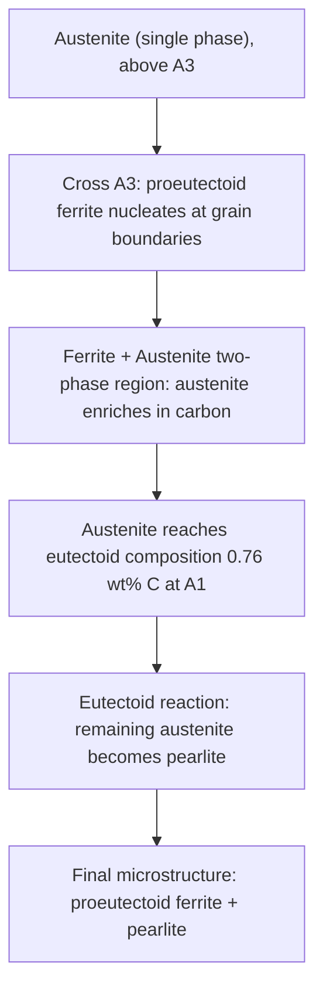

## The Iron Iron Carbide Diagram in Detail

### Overview

The iron-iron carbide (Fe-Fe₃C) diagram is a metastable phase diagram describing the equilibrium phases present in iron-carbon alloys as a function of composition (up to 6.67 wt% C, corresponding to pure cementite) and temperature. It is the foundational reference diagram for understanding steel and cast iron microstructures, heat treatment responses, and mechanical property development. The diagram is termed "metastable" because Fe₃C (cementite) is not the true thermodynamic equilibrium phase—graphite is—but cementite forms preferentially under most practical cooling conditions due to kinetic factors, making the Fe-Fe₃C diagram the practically relevant one for steel metallurgy.

### Allotropes of Iron

Pure iron undergoes several solid-state allotropic transformations that underlie the diagram's structure:

- **α-iron (ferrite)**: Body-centered cubic (BCC), stable from room temperature up to 912°C.
- **γ-iron (austenite)**: Face-centered cubic (FCC), stable from 912°C to 1394°C.
- **δ-iron (delta ferrite)**: BCC again, stable from 1394°C to the melting point at 1538°C.

**Key Points**

- The BCC→FCC→BCC sequence (α→γ→δ) arises because FCC packing becomes thermodynamically favored in an intermediate temperature window due to the relative vibrational entropy and electronic structure contributions to free energy.
- Carbon solubility differs dramatically between these structures: FCC austenite can dissolve far more interstitial carbon than BCC ferrite, because the FCC octahedral interstitial sites are larger.

### Key Phases

| Phase | Crystal Structure | Max Carbon Solubility | Notes |
| --- | --- | --- | --- |
| α-ferrite | BCC | 0.022 wt% at 727°C | Soft, ductile, magnetic below 770°C |
| γ-austenite | FCC | 2.11 wt% at 1148°C | Not stable at room temperature in plain carbon steel; nonmagnetic |
| δ-ferrite | BCC | 0.09 wt% at 1493°C | High-temperature phase, present in as-solidified structures |
| Cementite (Fe₃C) | Orthorhombic | 6.67 wt% (fixed stoichiometry) | Hard, brittle intermetallic compound |
| Liquid | — | Varies with temperature | Above liquidus |

### Invariant Reactions

The diagram contains three invariant (isothermal, fixed-composition) reactions, each occurring at a specific temperature and composition:

**1. Peritectic reaction** (1493°C, 0.09-0.53 wt% C region)

$$\delta\text{-ferrite (0.09 wt\% C)} + \text{Liquid (0.53 wt\% C)} \rightarrow \gamma\text{-austenite (0.17 wt\% C)}$$

This reaction is relevant mainly to low-carbon steels during solidification and is generally not directly significant to room-temperature microstructure in most engineering steels.

**2. Eutectic reaction** (1148°C, 4.30 wt% C)

$$\text{Liquid (4.30 wt\% C)} \rightarrow \gamma\text{-austenite (2.11 wt\% C)} + \text{Fe}_3\text{C (6.67 wt\% C)}$$

The product of this reaction is called **ledeburite**, the characteristic eutectic microstructure of cast irons. This reaction defines the boundary between steels (below 2.11 wt% C) and cast irons (above 2.11 wt% C).

**3. Eutectoid reaction** (727°C, 0.76-0.77 wt% C)

$$\gamma\text{-austenite (0.76 wt\% C)} \rightarrow \alpha\text{-ferrite (0.022 wt\% C)} + \text{Fe}_3\text{C (6.67 wt\% C)}$$

This is the single most important reaction for steel heat treatment, producing **pearlite**, the characteristic lamellar microstructure of slowly cooled steels. Nearly all conventional steel heat treatments (annealing, normalizing, quenching, tempering) are understood in reference to this transformation and its suppression/modification.

### Critical Temperature Lines

Steel metallurgists use specific letter designations for the critical temperature boundaries, essential for heat treatment specification:

- **A₁ (lower critical temperature)**: 727°C — the eutectoid temperature; below this, austenite cannot exist at equilibrium.
- **A₃**: The temperature line separating austenite from austenite+ferrite, varies with carbon content from 912°C (pure iron) down to 727°C (eutectoid composition).
- **Acm**: The temperature line separating austenite from austenite+cementite, for hypereutectoid steels (>0.76 wt% C), rising from 727°C up to 1148°C as carbon content increases.

**Key Points**

- These lines shift under continuous heating/cooling due to thermal lag, denoted with additional subscripts: **Ac** (chauffage/heating, e.g., $Ac_1$, $Ac_3$) for values on heating, and **Ar** (refroidissement/cooling, e.g., $Ar_1$, $Ar_3$) for values on cooling. Heating tends to raise the transformation temperature above the equilibrium value, while cooling depresses it below, due to the finite time required for diffusional nucleation and growth.
- Heat treatment specifications (e.g., "austenitize 50°C above $Ac_3$") reference these practical, rate-dependent temperatures rather than the idealized equilibrium diagram values.

### Compositional Classification

The diagram is divided into three regions based on carbon content:

**Hypoeutectoid steels** (< 0.76 wt% C)

- On slow cooling from austenite, **proeutectoid ferrite** nucleates first (typically at prior austenite grain boundaries) as the alloy crosses the $A_3$ line.
- Remaining austenite is enriched in carbon as ferrite forms (since ferrite holds almost no carbon), eventually reaching the eutectoid composition and transforming to pearlite at $A_1$.
- Final room-temperature microstructure: proeutectoid ferrite + pearlite, with the ferrite fraction increasing as carbon content decreases.

**Eutectoid steel** (≈ 0.76 wt% C)

- Austenite transforms directly and entirely to pearlite at $A_1$, with no proeutectoid phase.
- Microstructure: 100% pearlite (lamellar alternating ferrite/cementite).

**Hypereutectoid steels** (0.76-2.11 wt% C)

- On slow cooling, **proeutectoid cementite** forms first at prior austenite grain boundaries as the alloy crosses the Acm line.
- Remaining austenite is depleted in carbon (since cementite removes carbon preferentially) until it reaches eutectoid composition and transforms to pearlite at $A_1$.
- Final microstructure: proeutectoid cementite (often as a grain-boundary network) + pearlite. Excessive grain-boundary cementite networks are a common source of brittleness in hypereutectoid steels and are typically avoided through controlled cooling or normalizing practices.

### Lever Rule Application

Phase fractions at any point in a two-phase region are calculated using the lever rule. For example, for a hypoeutectoid steel of composition $C_0$ just above $A_1$ (in the ferrite + austenite field, immediately before eutectoid transformation), the fraction of proeutectoid ferrite is:

$$f_\alpha = \frac{C_\gamma - C_0}{C_\gamma - C_\alpha}$$

where $C_\gamma$ is the carbon content of austenite (0.76 wt% at $A_1$) and $C_\alpha$ is the carbon content of ferrite (0.022 wt%). The remaining fraction transforms to pearlite at $A_1$. This calculation is fundamental to predicting the ferrite-to-pearlite ratio in normalized or annealed steel and correlating it to expected hardness/strength.

### Microstructural Products Summary

| Microstructure | Composition Range | Formation | Characteristics |
| --- | --- | --- | --- |
| Pearlite | Eutectoid (0.76 wt% C locally) | $\gamma \rightarrow \alpha + \text{Fe}_3\text{C}$ at $A_1$ | Lamellar α/Fe₃C, moderate strength/ductility |
| Proeutectoid ferrite | Hypoeutectoid steels | Nucleates at grain boundaries above $A_1$ | Soft, ductile |
| Proeutectoid cementite | Hypereutectoid steels | Nucleates at grain boundaries above $A_1$ | Hard, brittle, network morphology of concern |
| Ledeburite | ≥2.11 wt% C (cast iron range) | Eutectic at 1148°C | Characteristic of cast irons, not typically seen in wrought steel |

### Phase Diagram Schematic

<svg xmlns="http://www.w3.org/2000/svg" viewBox="0 0 700 480">
<text x="350" y="25" font-size="16" text-anchor="middle" font-family="sans-serif" font-weight="bold">Fe-Fe3C Phase Diagram (svg_diagram)</text>

<line x1="80" y1="420" x2="650" y2="420" stroke="black" stroke-width="1.5" />
<line x1="80" y1="420" x2="80" y2="50" stroke="black" stroke-width="1.5" />
<text x="365" y="455" font-size="14" text-anchor="middle" font-family="sans-serif">Carbon Content (wt%)</text>
<text x="35" y="235" font-size="14" text-anchor="middle" font-family="sans-serif" transform="rotate(-90 35,235)">Temperature (deg C)</text>

<text x="80" y="435" font-size="11" text-anchor="middle" font-family="sans-serif">0</text>

<text x="270" y="435" font-size="11" text-anchor="middle" font-family="sans-serif">0.76</text>

<text x="380" y="435" font-size="11" text-anchor="middle" font-family="sans-serif">2.11</text>

<text x="500" y="435" font-size="11" text-anchor="middle" font-family="sans-serif">4.30</text>

<text x="640" y="435" font-size="11" text-anchor="middle" font-family="sans-serif">6.67</text>

<text x="65" y="410" font-size="11" text-anchor="end" font-family="sans-serif">727</text>

<text x="65" y="130" font-size="11" text-anchor="end" font-family="sans-serif">1148</text>

<text x="65" y="85" font-size="11" text-anchor="end" font-family="sans-serif">1538</text>

<line x1="80" y1="390" x2="640" y2="390" stroke="#d62728" stroke-width="2" />
<text x="655" y="394" font-size="12" font-family="sans-serif" fill="#d62728">A1 (727C)</text>

<line x1="270" y1="130" x2="640" y2="130" stroke="#9467bd" stroke-width="2" />
<text x="655" y="134" font-size="12" font-family="sans-serif" fill="#9467bd">Eutectic (1148C)</text>

<path d="M 80,300 Q 200,340 270,390" fill="none" stroke="#1f77b4" stroke-width="2" />
<text x="130" y="290" font-size="12" font-family="sans-serif" fill="#1f77b4">A3</text>

<path d="M 270,390 Q 330,280 380,130" fill="none" stroke="#2ca02c" stroke-width="2" />
<text x="345" y="250" font-size="12" font-family="sans-serif" fill="#2ca02c">Acm</text>

<path d="M 80,90 Q 250,120 380,130 Q 500,130 640,90" fill="none" stroke="black" stroke-width="1.5" />
<text x="500" y="80" font-size="12" font-family="sans-serif">Liquidus</text>

<circle cx="270" cy="390" r="4" fill="black" />
<text x="230" y="410" font-size="11" font-family="sans-serif">Eutectoid pt (0.76%)</text>

<text x="150" y="370" font-size="13" font-family="sans-serif" font-style="italic">alpha + gamma</text>

<text x="440" y="370" font-size="13" font-family="sans-serif" font-style="italic">gamma + Fe3C</text>

<text x="150" y="200" font-size="13" font-family="sans-serif" font-style="italic">gamma (austenite)</text>

<text x="100" y="410" font-size="12" font-family="sans-serif" font-style="italic">alpha (ferrite)</text>

</svg>

### Microstructural Evolution Sequence (Hypoeutectoid Steel)

### Practical Significance for Heat Treatment

**Key Points**

- **Annealing/Normalizing**: Austenitizing temperature is selected based on $A_3$ (hypoeutectoid) or $Ac_1$/slightly above (hypereutectoid, to avoid dissolving all cementite and coarsening austenite grains unnecessarily) using this diagram as the reference.
- **Hardening (quenching)**: Requires austenitizing above $A_3$/$Acm$ (with practical adjustment using $Ac_3$) to ensure a fully austenitic starting structure, so that rapid cooling can suppress the eutectoid reaction and produce martensite instead of pearlite.
- **Spheroidizing**: Prolonged holding near/just below $A_1$ is used to convert lamellar cementite into a spheroidal morphology, softening hypereutectoid steels for machining.
- The Fe-Fe₃C diagram describes only **equilibrium (or near-equilibrium, slow-cooling) conditions**. Non-equilibrium cooling (as in quenching) produces phases such as martensite and bainite that do not appear on this diagram at all and require Time-Temperature-Transformation (TTT) or Continuous-Cooling-Transformation (CCT) diagrams for prediction—this is a critical distinction students must internalize.

**[Inference]** Because the Fe-Fe₃C diagram assumes equilibrium phase formation, its direct predictive value diminishes as cooling rate increases; practitioners generally treat it as a map of the starting (austenitic) and slow-cooled reference states rather than a tool for predicting quenched or rapidly cooled microstructures.

### Related Topics

- Time-Temperature-Transformation (TTT) Diagrams and Isothermal Transformation
- Continuous-Cooling-Transformation (CCT) Diagrams
- Martensitic Transformation and Hardenability
- Pearlite Formation Kinetics and Interlamellar Spacing
- Spheroidization Heat Treatment
- Graphite vs. Cementite Stability (True Equilibrium Fe-C Diagram)
- Alloying Element Effects on Critical Temperatures (A1, A3, Acm shifts)
- Cast Iron Classification (Gray, White, Ductile, Malleable) via Fe-Fe3C Diagram