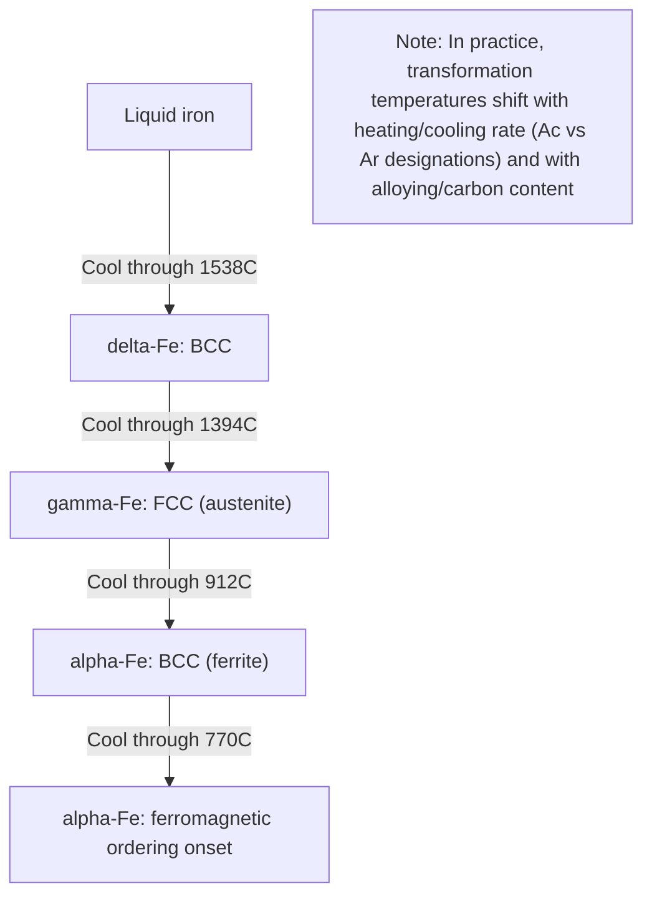

## Allotropy of Iron

### Overview

Allotropy refers to the ability of a pure element to exist in more than one crystal structure depending on temperature and pressure, with each structure (allotrope) representing a distinct thermodynamically stable arrangement of atoms. Iron is a classic and technologically critical example of allotropy: at atmospheric pressure, pure iron transitions through three distinct solid crystal structures between room temperature and its melting point. This behavior is the single most important structural fact underlying steel metallurgy, because it is the differing carbon solubility between iron's allotropes that makes heat treatment of steel possible at all.

### The Three Solid Allotropes at Atmospheric Pressure

**Key Points**

- **α-iron (alpha-ferrite)**: Body-centered cubic (BCC), stable from room temperature up to 912°C.
- **γ-iron (austenite)**: Face-centered cubic (FCC), stable from 912°C to 1394°C.
- **δ-iron (delta-ferrite)**: Body-centered cubic (BCC), stable from 1394°C up to the melting point at 1538°C.

The transformation sequence on heating pure iron is therefore:

$$\alpha\text{-Fe (BCC)} \xrightarrow{912°C} \gamma\text{-Fe (FCC)} \xrightarrow{1394°C} \delta\text{-Fe (BCC)} \xrightarrow{1538°C} \text{Liquid}$$

**[Inference]** The reappearance of a BCC structure at high temperature (δ-iron) after the intermediate FCC austenite phase is often described as anomalous relative to simple close-packing intuition, and is generally attributed to a shift in the relative free energy contributions of magnetic/electronic structure and vibrational entropy between the two structures as temperature increases.

### Crystal Structure Details

| Allotrope | Structure | Atoms/Unit Cell | Coordination Number | Packing Factor |
| --- | --- | --- | --- | --- |
| α-Fe (ferrite) | BCC | 2 | 8 | 0.68 |
| γ-Fe (austenite) | FCC | 4 | 12 | 0.74 |
| δ-Fe (delta ferrite) | BCC | 2 | 8 | 0.68 |

**Key Points**

- FCC austenite has a higher atomic packing factor (0.74, close-packed) than BCC ferrite (0.68), yet it is only stable in an intermediate temperature window rather than at low temperature—a reminder that packing efficiency alone does not determine thermodynamic stability; magnetic and vibrational entropy contributions matter significantly.
- α-ferrite and δ-ferrite have the *same* crystal structure (BCC) but exist in different temperature ranges and are conventionally given different Greek-letter names purely for historical/practical distinction; they are not distinguished by structure, only by the temperature regime and (in alloys) generally by composition.

### Thermodynamic Origin of the Transformations

The stability of each allotrope at a given temperature is governed by which structure minimizes Gibbs free energy $G = H - TS$ at that temperature.

- At low temperature, **α-Fe (BCC)** is favored. Below the Curie temperature (770°C), α-iron is **ferromagnetic**, and this magnetic ordering contributes a significant negative magnetic free energy term that stabilizes the BCC structure relative to FCC.
- As temperature rises past 912°C, the magnetic contribution diminishes (paramagnetic behavior already sets in above 770°C, but the full free energy balance shifts fully in favor of FCC only at 912°C), and **γ-Fe (FCC)**, which has higher vibrational entropy in this range, becomes favored.
- At still higher temperature (1394°C), the entropy balance shifts again and the structure reverts to BCC as **δ-Fe**, which persists until melting.

**[Inference]** The α→γ transformation temperature (912°C) is frequently cited as being closely linked to the loss of ferromagnetic ordering's stabilizing effect on the BCC lattice, though the transformation temperature (912°C) is distinct from the Curie temperature (770°C) itself, since paramagnetic BCC iron remains the stable phase over that intermediate 770–912°C range before FCC becomes favored.

### Significance for Carbon Solubility

The practical importance of iron's allotropy for steel metallurgy stems almost entirely from the difference in interstitial site geometry between BCC and FCC structures:

- **BCC (α, δ)**: The largest interstitial voids are irregular and small; maximum carbon solubility is very limited — approximately 0.022 wt% C in α-ferrite at 727°C, and about 0.09 wt% C in δ-ferrite at 1493°C (peritectic point).
- **FCC (γ)**: The octahedral interstitial sites are larger and more regular; maximum carbon solubility is far greater — up to 2.11 wt% C in austenite at 1148°C (eutectic point).

This solubility difference is the entire mechanistic basis for steel hardening: austenitizing a steel dissolves carbon into the FCC lattice at high solubility, and then rapid cooling (quenching) suppresses the diffusional transformation back to low-solubility BCC ferrite plus cementite, forcing carbon to remain trapped in a distorted, supersaturated body-centered tetragonal (BCT) structure—martensite.

**Key Points**

- Without the FCC-to-BCC allotropic transformation and its associated solubility change, there would be no mechanism for carbon supersaturation, and therefore no martensitic hardening response in steel.
- This is why nearly all conventional heat treatments (annealing, normalizing, quenching, tempering) reference the α↔γ transformation temperatures ($A_1$, $A_3$) as their controlling parameters.

### Effect of Alloying Elements

Alloying elements shift the stability temperature ranges of iron's allotropes and are classified accordingly:

**Austenite stabilizers** (expand the γ-field, lower $A_3$, raise $A_4$):

- Ni, Mn, C, N, Cu — these elements lower the α→γ transformation temperature and, at sufficient concentration, can stabilize austenite down to room temperature (e.g., austenitic stainless steels, Hadfield manganese steel).

**Ferrite stabilizers** (contract the γ-field, raise $A_3$, lower $A_4$):

- Cr, Si, Mo, W, V, Ti, Al — these elements raise the α→γ transformation temperature and, at sufficient concentration, can suppress the γ-field entirely, producing a fully ferritic structure at all temperatures (e.g., ferritic stainless steels).

**[Inference]** The classification of an element as an austenite or ferrite stabilizer is generally correlated with whether that element itself has a crystal structure and electronic configuration more compatible with FCC or BCC iron, though the practical effect in a given alloy also depends on interactions with other alloying additions present.

### High-Pressure Allotrope: ε-Iron

Under sufficiently high pressure (approximately 13 GPa at room temperature, with the required pressure decreasing somewhat at elevated temperature), α-iron (BCC) transforms to **ε-iron**, a hexagonal close-packed (HCP) structure. This transformation is of primary interest in geophysics (relevant to the pressure/temperature conditions of Earth's inner core, believed to consist largely of HCP or HCP-like iron) and in shock-loading/ballistic impact studies of steel, rather than in conventional atmospheric-pressure steel processing.

**[Inference]** Because ε-iron only forms under pressures well beyond those encountered in standard metalworking, casting, or heat treatment processes, it is generally treated as a specialized topic in high-pressure physics and planetary science rather than a standard consideration in conventional ferrous metallurgy.

### Allotropic Transformation Diagram

<svg xmlns="http://www.w3.org/2000/svg" viewBox="0 0 650 420">
<text x="325" y="25" font-size="16" text-anchor="middle" font-family="sans-serif" font-weight="bold">Allotropes of Iron vs Temperature (svg_diagram)</text>

<line x1="120" y1="380" x2="120" y2="60" stroke="black" stroke-width="1.5" />
<text x="60" y="220" font-size="14" text-anchor="middle" font-family="sans-serif" transform="rotate(-90 60,220)">Temperature (deg C)</text>

<line x1="115" y1="360" x2="125" y2="360" stroke="black" />
<text x="100" y="365" font-size="12" text-anchor="end" font-family="sans-serif">25 (RT)</text>
<line x1="115" y1="280" x2="125" y2="280" stroke="black" />
<text x="100" y="285" font-size="12" text-anchor="end" font-family="sans-serif">770 (Curie)</text>
<line x1="115" y1="240" x2="125" y2="240" stroke="black" />
<text x="100" y="245" font-size="12" text-anchor="end" font-family="sans-serif">912</text>
<line x1="115" y1="120" x2="125" y2="120" stroke="black" />
<text x="100" y="125" font-size="12" text-anchor="end" font-family="sans-serif">1394</text>
<line x1="115" y1="70" x2="125" y2="70" stroke="black" />
<text x="100" y="75" font-size="12" text-anchor="end" font-family="sans-serif">1538 (melt)</text>

<rect x="150" y="240" width="180" height="120" fill="#a6cee3" opacity="0.6" />
<text x="240" y="305" font-size="14" text-anchor="middle" font-family="sans-serif" font-weight="bold">alpha-Fe</text>
<text x="240" y="322" font-size="12" text-anchor="middle" font-family="sans-serif">BCC</text>
<rect x="150" y="120" width="180" height="120" fill="#b2df8a" opacity="0.6" />
<text x="240" y="175" font-size="14" text-anchor="middle" font-family="sans-serif" font-weight="bold">gamma-Fe</text>
<text x="240" y="192" font-size="12" text-anchor="middle" font-family="sans-serif">FCC (austenite)</text>
<rect x="150" y="70" width="180" height="50" fill="#fdbf6f" opacity="0.6" />
<text x="240" y="98" font-size="13" text-anchor="middle" font-family="sans-serif" font-weight="bold">delta-Fe (BCC)</text>
<rect x="150" y="45" width="180" height="20" fill="#fb9a99" opacity="0.6" />
<text x="240" y="60" font-size="12" text-anchor="middle" font-family="sans-serif">Liquid</text>

<line x1="150" y1="280" x2="330" y2="280" stroke="gray" stroke-dasharray="4,3" />
<text x="400" y="285" font-size="11" font-family="sans-serif" fill="gray">Curie pt: ferro to paramagnetic</text>

<text x="400" y="200" font-size="12" font-family="sans-serif">Max C solubility: 2.11 wt%</text>

<text x="400" y="330" font-size="12" font-family="sans-serif">Max C solubility: 0.022 wt%</text>

</svg>

### Heating/Cooling Sequence

### Practical Implications for Metallurgical Practice

**Key Points**

- **Hot working (forging, rolling)** is typically performed in the austenite (γ) range because FCC austenite is more ductile and has fewer independent slip systems constraints issues compared to BCC ferrite at the temperatures of interest, and because grain refinement via recrystallization is more readily controlled in this regime.
- **Normalizing and annealing** heat treatments are defined relative to the $A_3$/$A_1$ transformation temperatures, requiring the material to be heated into the austenite field before controlled cooling back through the transformation.
- **Grain size control**: Because each α↔γ transformation involves nucleation and growth, repeated thermal cycling through the transformation (as in normalizing) can be used deliberately to refine prior coarse grain structures (e.g., from casting or prior overheating).
- **Alloy design for stainless steels**: The classification of stainless steels into ferritic, austenitic, martensitic, and duplex families is fundamentally a direct consequence of how Cr, Ni, and other alloying elements manipulate the relative stability of iron's allotropes at room temperature.

### Related Topics

- The Iron-Iron Carbide (Fe-Fe3C) Phase Diagram
- Austenite and Ferrite Stabilizing Elements in Alloy Design
- Martensitic Transformation Mechanism (BCT Structure Formation)
- Stainless Steel Classification (Ferritic, Austenitic, Martensitic, Duplex)
- Magnetic Properties and the Curie Temperature in Ferrous Alloys
- Grain Refinement via Phase Transformation Cycling
- High-Pressure Iron Phases and Geophysical Relevance
- Hot Working Temperature Selection Based on Phase Stability