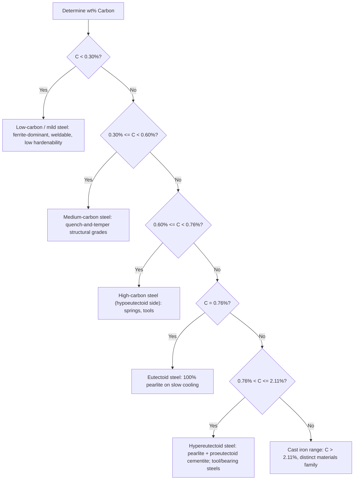

## Classification of Steels by Carbon Content

### Overview

Carbon content is the single most influential compositional variable in plain carbon and low-alloy steels, governing the phases present at room temperature, the achievable strength and hardness, ductility, weldability, and the response to heat treatment. Steels are conventionally classified into categories based on weight percent carbon, with boundaries defined largely by their position relative to the eutectoid point (0.76 wt% C) on the Fe-Fe₃C diagram. This classification underlies material selection across nearly all structural, tool, and machine component applications.

### Classification Categories

| Category | Carbon Range (wt%) | Typical Microstructure (slow-cooled) |
| --- | --- | --- |
| Low-carbon (mild) steel | 0.05-0.30 | Ferrite + small amount of pearlite |
| Medium-carbon steel | 0.30-0.60 | Ferrite + pearlite (increasing pearlite fraction) |
| High-carbon steel | 0.60-1.00 (up to ~1.4 in tool steels) | Mostly pearlite, approaching eutectoid; hypereutectoid above 0.76 |
| Eutectoid steel | ≈0.76 | 100% pearlite |
| Hypereutectoid steel | 0.76-2.11 | Pearlite + proeutectoid cementite |

**Key Points**

- These boundaries are conventions rather than sharp physical transitions except at the eutectoid point itself (0.76 wt% C), where the microstructure genuinely changes character (from ferrite+pearlite to pearlite+cementite).
- Cast irons begin above 2.11 wt% C, where the eutectic reaction becomes accessible and ledeburite can form; this is generally treated as a distinct materials family rather than a "steel" classification.

### Low-Carbon (Mild) Steel — 0.05 to 0.30 wt% C

**Key Points**

- The most widely produced steel category by tonnage; used for structural shapes, sheet, plate, wire, and general fabrication.
- Microstructure is predominantly proeutectoid ferrite with a relatively small fraction of pearlite, giving high ductility and toughness but comparatively low strength and hardness.
- Not significantly hardenable by conventional quenching, because the low carbon content limits the carbon supersaturation achievable in martensite; quenching produces only modest hardness increases.
- Excellent weldability, since low carbon content reduces the risk of heat-affected-zone (HAZ) martensite cracking.
- Common subcategories: low-carbon sheet steel (automotive body panels, wire), structural steel (ASTM A36-type), and carburizing/case-hardening grades (e.g., AISI 1018, 1020) where a low-carbon core provides toughness while a carburized surface layer provides wear resistance.

**Example**: AISI 1020 steel (approximately 0.20 wt% C) is commonly used for machine parts requiring good machinability and moderate strength, and is a standard substrate for carburizing treatments to produce a hard, wear-resistant surface over a tough core.

### Medium-Carbon Steel — 0.30 to 0.60 wt% C

**Key Points**

- Represents a balance between strength and ductility; the increased pearlite fraction raises strength and hardness relative to low-carbon steel while retaining reasonable toughness.
- Fully hardenable by quenching to martensite, making this range the primary composition band for quenched-and-tempered structural and machine components.
- Common applications: shafts, gears, axles, connecting rods, crankshafts, and other components requiring a combination of strength and toughness after heat treatment.
- Weldability decreases relative to low-carbon steel; preheat and controlled interpass temperature are often required to avoid HAZ cracking from martensite formation during weld cooling.

**Example**: AISI 4140 (a medium-carbon, chromium-molybdenum alloy steel, ~0.40 wt% C) is widely used for quenched-and-tempered shafts and high-strength fasteners, illustrating how medium-carbon content is frequently combined with alloying additions to improve hardenability without further raising carbon content (which would reduce toughness and weldability).

### High-Carbon Steel — 0.60 to 1.00+ wt% C

**Key Points**

- Provides high hardness and wear resistance after quenching and tempering, at the cost of reduced ductility and toughness compared to lower-carbon grades.
- Used for applications requiring a hard, wear-resistant edge or surface: springs, cutting tools, dies, and wear parts.
- Approaching (below 0.76 wt%) or exceeding (above 0.76 wt%) the eutectoid composition, the pearlite fraction becomes dominant even in the slow-cooled condition.
- Increasingly susceptible to quench cracking and distortion due to the larger volume expansion associated with martensite formation at higher carbon content; careful quench media selection and tempering practice are critical.

**Example**: AISI 1095 (~0.95 wt% C) is a classic high-carbon steel used for knife blades and springs, where high hardness and edge retention after heat treatment are prioritized over ductility.

### Eutectoid Steel — ≈0.76 wt% C

At the eutectoid composition, austenite transforms entirely to pearlite at $A_1$ (727°C) on slow cooling, with no proeutectoid phase forming. This composition represents the boundary point of the classification system and is of largely academic/reference significance, since commercial "eutectoid" steels are formulated near but not necessarily exactly at 0.76 wt% C.

### Hypereutectoid Steel — 0.76 to 2.11 wt% C

**Key Points**

- On slow cooling, proeutectoid cementite forms first at prior austenite grain boundaries (crossing the Acm line), followed by pearlite formation in the remaining austenite at $A_1$.
- A continuous grain-boundary cementite network, if allowed to form (e.g., from slow cooling from a high austenitizing temperature), creates a brittle, crack-prone microstructure; this is typically mitigated by normalizing or by controlled cooling practices that limit proeutectoid cementite morphology.
- Used primarily in tool steels, bearing steels, and high-wear applications where maximum hardness is the priority.
- Requires special heat treatment attention: austenitizing temperature is generally kept just above $Ac_1$ (rather than fully into the single-phase austenite field above Acm) to retain some undissolved fine cementite, which contributes to wear resistance and limits austenite grain growth.

**Example**: AISI 52100 bearing steel (~1.00 wt% C, with chromium addition) is a hypereutectoid steel, heat treated to produce fine, well-distributed spheroidized carbides in a martensitic matrix, optimized for rolling contact fatigue resistance.

### Effect of Carbon Content on Mechanical Properties (Slow-Cooled Condition)

**Key Points**

- **Hardness and tensile strength** increase approximately linearly with pearlite fraction (and thus carbon content) up to the eutectoid composition, since pearlite is harder and stronger than ferrite due to the load-bearing cementite lamellae and the fine ferrite/cementite interfacial spacing.
- **Ductility and toughness** (elongation, reduction in area, impact energy) decrease with increasing carbon content, as the increasing volume fraction of hard, brittle cementite (either within pearlite or as a proeutectoid phase) restricts plastic flow and provides crack initiation sites.
- Beyond the eutectoid point, further increases in carbon content (via proeutectoid cementite) continue to raise hardness only modestly while sharply reducing toughness, since continuous cementite networks are far more detrimental to toughness than the fine lamellar cementite within pearlite.

**[Inference]** The relationship between carbon content and hardness is often treated as approximately linear for design estimation purposes in the hypoeutectoid-to-eutectoid range, though the precise relationship depends on prior austenite grain size, cooling rate, and resulting pearlite interlamellar spacing, not carbon content alone.

### Property Trend Diagram

<svg xmlns="http://www.w3.org/2000/svg" viewBox="0 0 650 400">
<text x="325" y="25" font-size="16" text-anchor="middle" font-family="sans-serif" font-weight="bold">Property Trends vs Carbon Content (svg_diagram)</text>
<line x1="80" y1="350" x2="600" y2="350" stroke="black" stroke-width="1.5" />
<line x1="80" y1="350" x2="80" y2="60" stroke="black" stroke-width="1.5" />
<text x="340" y="380" font-size="14" text-anchor="middle" font-family="sans-serif">Carbon Content (wt%)</text>
<text x="35" y="200" font-size="14" text-anchor="middle" font-family="sans-serif" transform="rotate(-90 35,200)">Relative Property Value</text>

<text x="80" y="365" font-size="11" text-anchor="middle" font-family="sans-serif">0</text>

<text x="270" y="365" font-size="11" text-anchor="middle" font-family="sans-serif">0.76</text>

<text x="450" y="365" font-size="11" text-anchor="middle" font-family="sans-serif">1.4</text>

<path d="M 80,330 L 270,150 L 450,110" fill="none" stroke="#d62728" stroke-width="2.5" />
<text x="470" y="105" font-size="12" font-family="sans-serif" fill="#d62728">Hardness/Strength</text>

<path d="M 80,90 L 270,220 L 450,300" fill="none" stroke="#1f77b4" stroke-width="2.5" />
<text x="470" y="305" font-size="12" font-family="sans-serif" fill="#1f77b4">Ductility/Toughness</text>

<line x1="270" y1="350" x2="270" y2="60" stroke="gray" stroke-dasharray="4,3" />
<text x="275" y="70" font-size="11" font-family="sans-serif" fill="gray">Eutectoid pt</text>
</svg>

### Classification Decision Flow

### Weldability and Hardenability Considerations

**Key Points**

- **Weldability** generally decreases with increasing carbon content because higher carbon increases the propensity for hard, brittle martensite formation in the heat-affected zone (HAZ) upon the rapid cooling inherent to welding, raising the risk of hydrogen-assisted cold cracking.
- A widely used approximate indicator is **carbon equivalent (CE)**, which combines carbon content with other hardenability-affecting alloying elements to assess weldability risk, e.g., a common simplified form:

$$CE = C + \frac{Mn}{6} + \frac{(Cr + Mo + V)}{5} + \frac{(Ni + Cu)}{15}$$

- Steels with $CE$ above approximately 0.40-0.45 (depending on the specific formula and application context) generally require preheat and controlled cooling procedures during welding to avoid HAZ cracking.
- Hardenability (the depth and uniformity of martensite formation on quenching) is influenced by carbon content but is more directly controlled in practice by alloying additions (Mn, Cr, Mo, Ni) that shift the TTT curve to longer times, since carbon content primarily governs the *maximum achievable hardness* of martensite rather than the *depth* to which it forms.

### Related Topics

- The Iron-Iron Carbide (Fe-Fe3C) Phase Diagram
- Hardenability and the Jominy End-Quench Test
- Carbon Equivalent Formulas and Weldability Assessment
- Tool Steel Classification and Alloying Strategy
- Bearing Steel Metallurgy (e.g., AISI 52100)
- Quenching Media Selection and Distortion/Cracking Control
- Case Hardening and Carburizing of Low-Carbon Steels
- Spheroidized Carbide Microstructures in Hypereutectoid Steels