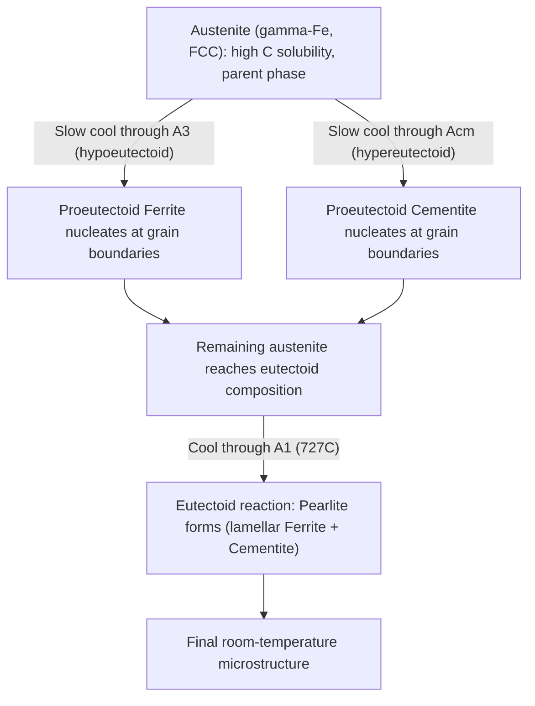

## Ferrite, Cementite, Pearlite, and Austenite

### Overview

Ferrite, cementite, austenite, and pearlite are the four fundamental microstructural constituents of the Fe-Fe₃C system that govern the properties of plain carbon and low-alloy steels. Ferrite and austenite are single-phase solid solutions of carbon in iron, cementite is a stoichiometric intermetallic compound, and pearlite is a two-phase microconstituent (a specific lamellar mixture of ferrite and cementite formed by a defined transformation reaction). Understanding the structure, formation, and properties of each is foundational to interpreting steel microstructures and predicting mechanical behavior.

### Ferrite (α-Fe)

**Structure and Composition**

- Body-centered cubic (BCC) interstitial solid solution of carbon in α-iron.
- Maximum carbon solubility is very limited: approximately 0.022 wt% C at 727°C, decreasing to near-zero at room temperature, because the BCC interstitial sites are small and geometrically irregular relative to the carbon atom size.
- Stable at room temperature and up to 912°C in pure iron (the $A_3$ temperature at zero carbon content).

**Properties**

- Soft and ductile: typical hardness around 80-100 HB, tensile strength around 275 MPa, with high ductility (elongation often 35-40%).
- Ferromagnetic below the Curie temperature (770°C).
- Provides the ductile, tough matrix phase in hypoeutectoid steel microstructures.

**Key Points**

- **Proeutectoid ferrite** refers specifically to ferrite that forms above the eutectoid temperature ($A_1$) in hypoeutectoid steels, nucleating preferentially at prior austenite grain boundaries as the steel cools through the $A_3$ line.
- Ferrite morphology can vary (grain-boundary allotriomorphs, Widmanstätten plates, massive/equiaxed grains) depending on cooling rate and alloy content, which affects the resulting toughness and strength of the ferrite-containing microstructure.

### Austenite (γ-Fe)

**Structure and Composition**

- Face-centered cubic (FCC) interstitial solid solution of carbon in γ-iron.
- Maximum carbon solubility is much higher than ferrite: up to 2.11 wt% C at 1148°C (the eutectic point), because the FCC octahedral interstitial sites are larger and more regular.
- Stable from 912°C to 1394°C in pure iron; the temperature range and stability field are strongly modified by alloying (see austenite-stabilizing elements).

**Properties**

- Nonmagnetic (paramagnetic) at all temperatures within its stability range.
- Relatively soft and ductile in its own right, though not typically present at room temperature in plain carbon steels except in austenitic stainless steels or via alloying/retained austenite in quenched steels.
- Serves as the parent phase from which nearly all other steel microstructures (ferrite, pearlite, bainite, martensite) form upon cooling or quenching.

**Key Points**

- Because austenite dissolves substantially more carbon than ferrite, the practice of **austenitizing** (heating a steel into the single-phase γ field) is the essential first step of nearly every hardening heat treatment: it homogenizes carbon in solution before rapid cooling traps that carbon in a supersaturated state (martensite) or forces it to precipitate as cementite during slower cooling.
- **Retained austenite** refers to austenite that fails to transform to martensite during quenching (common in higher-carbon and higher-alloy steels due to a depressed martensite finish temperature, $M_f$) and persists metastably at room temperature, generally regarded as a source of dimensional instability and reduced hardness if present in significant amounts.

### Cementite (Fe₃C, Iron Carbide)

**Structure and Composition**

- Orthorhombic crystal structure with a fixed stoichiometric composition of 6.67 wt% carbon (Fe₃C).
- Metastable compound: cementite decomposes into ferrite and graphite given sufficient time and temperature (e.g., in gray cast iron or during graphitization heat treatments), but forms preferentially under most practical steel cooling rates due to kinetic factors.

**Properties**

- Extremely hard (approximately 800-1100 HV/roughly 65-68 HRC equivalent) and brittle, with essentially negligible ductility.
- Non-magnetic above approximately 210°C (its own distinct magnetic transition, sometimes noted as relevant to Mössbauer spectroscopy studies of steel, though not typically significant to bulk engineering behavior).

**Key Points**

- **Proeutectoid cementite** forms above $A_1$ in hypereutectoid steels, nucleating at prior austenite grain boundaries as the steel cools through the Acm line; if allowed to form a continuous grain-boundary network, it significantly embrittles the steel.
- Cementite within pearlite exists as thin lamellae rather than a continuous network, which is far less detrimental to toughness because the load-bearing continuity is interrupted by the intervening soft ferrite.
- On tempering of martensite, cementite (or transition carbides, depending on tempering stage) precipitates in a fine, dispersed form, contributing to the "tempered martensite" microstructure's balance of strength and toughness.
- **Spheroidized cementite** (rounded, discrete particles rather than lamellae or networks) represents the softest, most machinable, and most ductile condition achievable for a given carbon content, produced by extended holding near the eutectoid temperature.

### Pearlite

**Formation and Structure**

Pearlite forms via the eutectoid reaction:

$$\gamma\text{-austenite (0.76 wt\% C)} \xrightarrow{727°C} \alpha\text{-ferrite (0.022 wt\% C)} + \text{Fe}_3\text{C (6.67 wt\% C)}$$

This is a diffusional, cooperative growth reaction: as austenite transforms, carbon partitions by diffusion between the growing ferrite (which rejects carbon) and cementite (which absorbs it), producing alternating lamellae of the two phases growing simultaneously from nucleation sites (typically prior austenite grain boundaries).

**Key Points**

- Pearlite is not a distinct phase but a **microconstituent**—a specific two-phase mixture with a characteristic lamellar morphology and a fixed overall composition (0.76 wt% C, matching the eutectoid point) regardless of the bulk steel's carbon content (the *fraction* of pearlite in the overall microstructure varies with bulk carbon content, but the pearlite itself always has the eutectoid composition).
- **Interlamellar spacing** (the repeat distance between adjacent ferrite/cementite lamellae) decreases with increasing undercooling below $A_1$ (i.e., faster cooling or lower isothermal transformation temperature), and finer interlamellar spacing produces higher strength and hardness via increased phase boundary area impeding dislocation motion (analogous to a Hall-Petch-type relationship).
- Two morphological classifications by fineness are common: **coarse pearlite** (formed at higher transformation temperatures, closer to $A_1$, with wider spacing, lower strength, higher ductility) and **fine pearlite** (formed at lower transformation temperatures, closer to the pearlite/bainite transition, with narrow spacing, higher strength, lower ductility).

**Properties**

- Hardness and strength intermediate between pure ferrite and pure cementite, with the specific values depending strongly on interlamellar spacing: typical fully pearlitic eutectoid steel hardness ranges from roughly 200-300 HB depending on transformation temperature.
- Moderate ductility, generally lower than ferrite but substantially higher than martensite of equivalent carbon content, because the ductile ferrite lamellae provide continuous, connected paths for plastic deformation.

### Relative Property Comparison

| Constituent | Type | Crystal Structure | Approx. Hardness | Ductility | Role |
| --- | --- | --- | --- | --- | --- |
| Ferrite | Phase (solid solution) | BCC | ~80-100 HB | High | Soft, ductile matrix |
| Austenite | Phase (solid solution) | FCC | Soft (varies) | High | High-temp parent phase; carbon reservoir |
| Cementite | Compound (fixed stoichiometry) | Orthorhombic | ~800-1100 HV | Negligible | Hard, brittle strengthening phase |
| Pearlite | Microconstituent (α + Fe₃C lamellae) | Mixed | ~200-300 HB | Moderate | Balanced strength/ductility |

### Lamellar Growth Mechanism Schematic

<svg xmlns="http://www.w3.org/2000/svg" viewBox="0 0 600 350">
<text x="300" y="25" font-size="16" text-anchor="middle" font-family="sans-serif" font-weight="bold">Pearlite Lamellar Growth (svg_diagram)</text>

<line x1="50" y1="300" x2="550" y2="300" stroke="black" stroke-width="2" />
<text x="300" y="320" font-size="12" text-anchor="middle" font-family="sans-serif">Prior Austenite Grain Boundary</text>

<g>
<rect x="150" y="150" width="15" height="150" fill="#dddddd" />
<rect x="165" y="150" width="8" height="150" fill="#333333" />
<rect x="173" y="150" width="15" height="150" fill="#dddddd" />
<rect x="188" y="150" width="8" height="150" fill="#333333" />
<rect x="196" y="150" width="15" height="150" fill="#dddddd" />
<rect x="211" y="150" width="8" height="150" fill="#333333" />
<rect x="219" y="150" width="15" height="150" fill="#dddddd" />
<rect x="234" y="150" width="8" height="150" fill="#333333" />
<rect x="242" y="150" width="15" height="150" fill="#dddddd" />
</g>

<rect x="300" y="150" width="15" height="15" fill="#dddddd" />
<text x="325" y="163" font-size="13" font-family="sans-serif">Ferrite (alpha)</text>
<rect x="300" y="175" width="15" height="15" fill="#333333" />
<text x="325" y="188" font-size="13" font-family="sans-serif">Cementite (Fe3C)</text>

<line x1="200" y1="130" x2="200" y2="80" stroke="#d62728" stroke-width="2" marker-end="url(#arrowhead)" />
<text x="200" y="70" font-size="12" text-anchor="middle" font-family="sans-serif" fill="#d62728">Growth direction into austenite</text>

<text x="400" y="230" font-size="12" font-family="sans-serif" font-style="italic">Carbon diffuses laterally</text>

<text x="400" y="248" font-size="12" font-family="sans-serif" font-style="italic">from ferrite to cementite</text>

</svg>

### Transformation Relationships

### Practical Significance

**Key Points**

- Nearly all conventional steel property-structure relationships trace back to the relative fractions and morphologies of these four constituents (plus non-equilibrium products like martensite and bainite covered separately).
- **Quantitative metallography** (point counting, lineal analysis) of ferrite/pearlite/cementite fractions and morphology under optical or electron microscopy remains a standard quality control and failure analysis tool for verifying that a steel has received the intended heat treatment.
- Distinguishing pearlite from bainite or tempered martensite under the microscope (all can appear as fine mixtures of ferrite and carbide) is a common practical challenge, generally resolved by examining lamellar regularity (pearlite) versus needle-like/acicular morphology (bainite) versus the tempered, less-oriented carbide dispersion within a plate-like matrix (tempered martensite).

**[Inference]** Because interlamellar spacing in pearlite is highly sensitive to transformation temperature, quantitative correlation between measured spacing and expected transformation conditions is often used as an indirect check on cooling rate or isothermal holding history in failure analysis, though this inference should be corroborated with other evidence (hardness, other microstructural features) rather than relied upon alone.

### Related Topics

- The Iron-Iron Carbide (Fe-Fe3C) Phase Diagram
- Interlamellar Spacing and Pearlite Strengthening Mechanisms
- Bainite Formation and Morphology
- Martensitic Transformation and Tempering Stages
- Spheroidizing Heat Treatment of Cementite
- Quantitative Metallography and Phase Fraction Analysis
- Retained Austenite: Causes and Consequences
- Austenite- and Ferrite-Stabilizing Alloying Elements