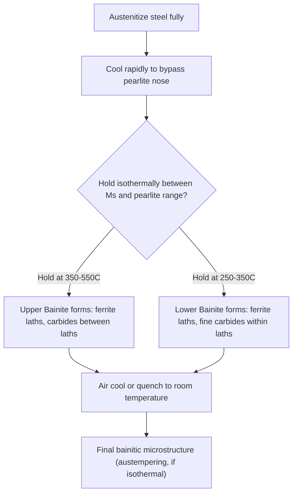

## Bainite Formation

### Overview

Bainite is a non-equilibrium microstructural constituent formed in steels by transformation of austenite at temperatures below the pearlite formation range but above the martensite start temperature ($M_s$). It represents an intermediate transformation mechanism combining aspects of both diffusional (pearlite-like) and diffusionless/shear (martensite-like) transformations, and does not appear on the equilibrium Fe-Fe₃C diagram at all—its formation and characteristics are described instead using Time-Temperature-Transformation (TTT) diagrams. Bainite is technologically important because it offers a distinctive combination of strength and toughness not readily achievable with pearlite or as-quenched martensite alone.

### Formation Conditions and Transformation Temperature Range

**Key Points**

- Bainite forms isothermally or during continuous cooling in the temperature range roughly between 250°C and 550°C for plain carbon and many low-alloy steels, positioned between the pearlite "nose" of the TTT diagram and the martensite start temperature $M_s$.
- The exact temperature range and kinetics depend strongly on alloy composition (carbon content and alloying elements such as Mn, Cr, Mo, Ni shift the TTT curve to longer times and can also affect the specific bainite morphology that forms).
- Bainite formation requires a cooling path that avoids the pearlite transformation "nose" on the TTT diagram (i.e., cooling rapidly enough to bypass pearlite formation) but then holding or slowly cooling through the bainite temperature range rather than quenching directly to below $M_s$.

**[Inference]** Because achieving bainite in practice typically requires either isothermal holding (austempering) or a carefully controlled continuous-cooling path, its formation is generally considered more process-sensitive than either pearlite (slow, near-equilibrium cooling) or martensite (rapid quench), and small variations in section thickness or quench severity can shift the resulting microstructure toward one of its neighbors on the TTT diagram.

### Transformation Mechanism

Bainite formation is often described as having mixed diffusional/displacive character, and the precise mechanism remains a subject of ongoing scientific discussion, but the generally accepted framework involves:

- **Displacive (shear-like) ferrite formation**: Bainitic ferrite forms via a shape-changing, diffusionless shear mechanism similar in character to martensite formation (no long-range diffusion of iron atoms), producing a characteristic surface relief effect on polished specimens, analogous to martensite.
- **Carbon partitioning**: Unlike martensite, where carbon remains trapped in the ferrite lattice, in bainite the carbon rejected from the newly formed, highly supersaturated bainitic ferrite is able to diffuse (given the elevated transformation temperature relative to martensite formation) either into the surrounding austenite (upper bainite) or precipitate as fine carbides within the ferrite itself (lower bainite).

**[Inference]** The mixed diffusional-displacive nature of bainite transformation has historically been a topic of active metallurgical research and some disagreement regarding the precise sequence and rate-controlling step, and different theoretical frameworks (e.g., diffusional growth theories versus displacive/shear-dominated theories) continue to be discussed in the literature; the description here reflects the generally accepted practical framework used for microstructural classification rather than a settled mechanistic consensus.

### Upper Bainite vs. Lower Bainite

| Characteristic | Upper Bainite | Lower Bainite |
| --- | --- | --- |
| Formation temperature | Higher (~350-550°C) | Lower (~250-350°C) |
| Carbide location | Between ferrite laths (in adjacent austenite/retained austenite) | Within the ferrite laths themselves, at ~55-60° to lath axis |
| Carbide type | Cementite (typically) | Fine cementite or transition carbides (e.g., epsilon-carbide), depending on alloy |
| Morphology | Coarser, feathery sheaves of ferrite laths | Finer, needle-like/acicular plates |
| Toughness | Generally lower than lower bainite at comparable strength | Generally higher than upper bainite at comparable strength |
| Carbon diffusion distance | Longer (into austenite between laths) | Shorter (short-range diffusion within ferrite) |

**Key Points**

- The upper/lower bainite distinction arises because carbon diffusivity decreases with decreasing transformation temperature: at higher temperatures (upper bainite), carbon can diffuse the longer distance from the ferrite into the adjacent austenite before carbides form there; at lower temperatures (lower bainite), carbon diffusivity is too low for this longer-range partitioning, so carbon instead precipitates as fine carbides directly within the supersaturated ferrite.
- Lower bainite's finer, more uniformly distributed carbide precipitation (analogous in effect to fine tempered martensite) generally provides a more favorable strength-toughness combination than upper bainite, making lower bainite the more commonly targeted microstructure in applications specifically designed to exploit bainitic transformation.

### Bainite Microstructure Schematic

<svg xmlns="http://www.w3.org/2000/svg" viewBox="0 0 650 400">
<text x="325" y="25" font-size="16" text-anchor="middle" font-family="sans-serif" font-weight="bold">Upper vs Lower Bainite Morphology (svg_diagram)</text>

<text x="160" y="60" font-size="14" text-anchor="middle" font-family="sans-serif" font-weight="bold">Upper Bainite</text>

<rect x="60" y="80" width="200" height="220" fill="none" stroke="black" stroke-width="1" />

<path d="M 70,100 L 130,300" stroke="#a6cee3" stroke-width="14" />
<path d="M 100,100 L 160,300" stroke="#a6cee3" stroke-width="14" />
<path d="M 130,100 L 190,300" stroke="#a6cee3" stroke-width="14" />
<path d="M 160,100 L 220,300" stroke="#a6cee3" stroke-width="14" />

<circle cx="115" cy="150" r="3" fill="#333" />
<circle cx="118" cy="180" r="3" fill="#333" />
<circle cx="112" cy="210" r="3" fill="#333" />
<circle cx="145" cy="160" r="3" fill="#333" />
<circle cx="148" cy="200" r="3" fill="#333" />
<circle cx="175" cy="150" r="3" fill="#333" />
<circle cx="178" cy="190" r="3" fill="#333" />
<circle cx="178" cy="230" r="3" fill="#333" />
<text x="160" y="330" font-size="11" text-anchor="middle" font-family="sans-serif">Carbides between laths</text>

<text x="480" y="60" font-size="14" text-anchor="middle" font-family="sans-serif" font-weight="bold">Lower Bainite</text>

<rect x="380" y="80" width="200" height="220" fill="none" stroke="black" stroke-width="1" />

<path d="M 390,100 L 450,300" stroke="`#b2df8a`" stroke-width="18" />

<path d="M 430,100 L 490,300" stroke="`#b2df8a`" stroke-width="18" />

<path d="M 470,100 L 530,300" stroke="`#b2df8a`" stroke-width="18" />

<line x1="405" y1="140" x2="415" y2="150" stroke="#333" stroke-width="2" />
<line x1="410" y1="170" x2="420" y2="180" stroke="#333" stroke-width="2" />
<line x1="415" y1="200" x2="425" y2="210" stroke="#333" stroke-width="2" />
<line x1="445" y1="140" x2="455" y2="150" stroke="#333" stroke-width="2" />
<line x1="450" y1="180" x2="460" y2="190" stroke="#333" stroke-width="2" />
<line x1="455" y1="220" x2="465" y2="230" stroke="#333" stroke-width="2" />
<text x="480" y="330" font-size="11" text-anchor="middle" font-family="sans-serif">Fine carbides within laths (~55-60 deg)</text>
</svg>

### Formation Sequence via TTT Diagram Logic

### Austempering: The Primary Industrial Process for Producing Bainite

**Key Points**

- **Austempering** is the standard heat treatment process specifically designed to produce a fully bainitic microstructure: the steel is austenitized, then rapidly quenched (typically in a salt bath) to a temperature within the bainite range and held isothermally until transformation is complete, followed by air cooling to room temperature.
- This process avoids the formation of martensite entirely (since the part never cools below $M_s$ before the isothermal hold) and produces a more uniform bainitic structure than can typically be achieved via continuous cooling.
- Compared to conventional quench-and-temper (martensite plus tempering) processing to a similar hardness level, austempered bainite often exhibits improved toughness and reduced distortion/cracking risk, since the isothermal hold minimizes the thermal gradients and associated residual stresses that develop during a conventional rapid quench through the martensite transformation range.
- Common applications include austempered ductile iron (ADI) and bainitic steel components such as springs, gears, and fasteners where the strength-toughness-distortion balance favors bainite over quenched-and-tempered martensite.

### Bainite vs. Pearlite vs. Martensite: Comparative Summary

| Feature | Pearlite | Bainite | Martensite |
| --- | --- | --- | --- |
| Transformation temperature | High (~550-727°C) | Intermediate (~250-550°C) | Low (below $M_s$, often <300°C, alloy-dependent) |
| Mechanism | Diffusional (cooperative growth) | Mixed diffusional/displacive | Diffusionless (shear) |
| Morphology | Lamellar (alternating α/Fe₃C plates) | Lath/plate ferrite with carbides | Lath or plate martensite (BCT) |
| Carbon partitioning | Full partitioning between phases | Partial (varies upper vs lower) | None (trapped in supersaturated lattice) |
| Typical hardness range | Low-moderate | Moderate-high | Highest (as-quenched) |
| Typical toughness at given hardness | Moderate | Often superior to tempered martensite at equivalent strength | Requires tempering to develop toughness |

**[Inference]** The often-cited advantage of bainite (particularly lower bainite) providing superior toughness compared to tempered martensite at a matched strength level is generally attributed to bainite's finer, more uniformly dispersed carbide morphology and the absence of the untempered martensite brittleness that must otherwise be addressed via a separate tempering step; the magnitude of this advantage is alloy- and processing-condition-dependent rather than universal.

### Practical and Industrial Significance

**Key Points**

- Bainitic steels are widely used in rail steel (pearlitic-bainitic or fully bainitic rail grades offer improved wear resistance and rolling contact fatigue performance), automotive components (TRIP and TRIP-assisted bainitic steels for crash-relevant structural parts), and springs/fasteners produced via austempering.
- **TRIP (Transformation-Induced Plasticity) steels** deliberately incorporate a bainitic transformation step (isothermal bainite hold) as part of a multi-phase processing route designed to stabilize retained austenite at room temperature, which then transforms to martensite during subsequent deformation, providing an additional strengthening/toughening mechanism during service.
- Distinguishing bainite from tempered martensite or fine pearlite under optical/electron microscopy can be challenging in practice; transmission electron microscopy (TEM) is often required to unambiguously identify the characteristic lath morphology and carbide distribution, particularly for lower bainite versus tempered lath martensite.

### Related Topics

- Time-Temperature-Transformation (TTT) and Continuous-Cooling-Transformation (CCT) Diagrams
- Austempering Process Design and Salt Bath Quenching
- Martensitic Transformation Mechanism and Ms/Mf Temperatures
- TRIP Steel Design and Retained Austenite Stabilization
- Austempered Ductile Iron (ADI) Metallurgy
- Rail Steel Microstructure and Rolling Contact Fatigue
- Tempered Martensite vs. Bainite Toughness Comparison
- Alloying Element Effects on TTT Curve Position (Hardenability)