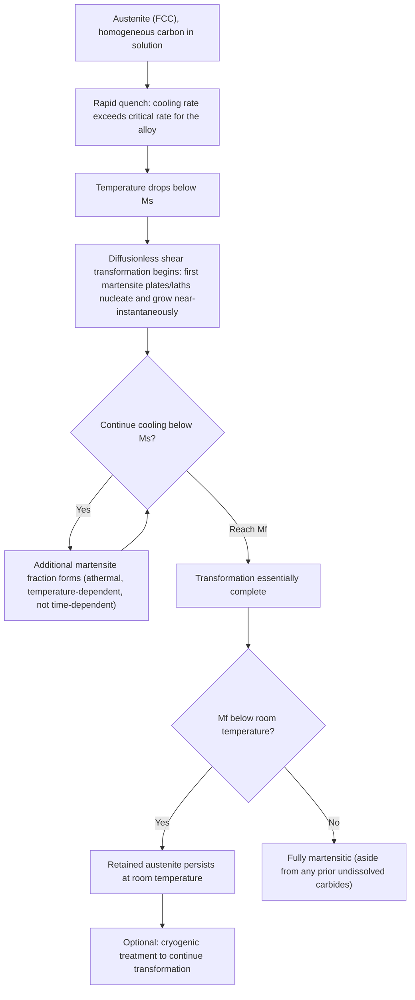

## Martensite Formation in Steel

### Overview

Martensite is the hard, metastable microstructural constituent formed when austenite is cooled rapidly enough to suppress diffusional transformation (to ferrite, pearlite, or bainite), forcing a diffusionless, shear-based (displacive) transformation instead. Carbon atoms that were in solid solution in the face-centered cubic (FCC) austenite lattice remain trapped in the resulting body-centered tetragonal (BCT) lattice, producing severe lattice distortion and very high hardness. Martensite formation is the fundamental basis of steel hardening and the starting point for essentially all quench-and-temper heat treatments.

### The Martensitic Transformation Mechanism

**Key Points**

- The transformation is **diffusionless**: unlike pearlite or bainite formation, no long-range atomic diffusion occurs. Iron atoms undergo a coordinated, shear-like shift ("military transformation," in contrast to the "civilian" diffusional transformations) that changes the crystal structure without changing composition.
- Because there is no diffusion, the martensite inherits the exact carbon content of the parent austenite at the instant of transformation—there is no opportunity for carbon to partition or escape.
- The transformation occurs essentially athermally in most steels: the fraction transformed depends primarily on how far the temperature has dropped below the martensite start temperature ($M_s$), not on time held at temperature (in contrast to the time-dependent diffusional transformations described by TTT diagrams).
- Transformation proceeds by extremely rapid (near sonic-velocity) growth of individual martensite plates or laths once nucleated; new plates continue to nucleate and grow as temperature decreases further, rather than existing plates growing larger with time.

**[Inference]** The athermal character of martensite formation is well established as the general rule for most steels, though certain steels (particularly some highly alloyed compositions) exhibit isothermal martensite formation kinetics as a secondary effect; this is generally treated as an exception rather than the standard behavior taught at an introductory level.

### Body-Centered Tetragonal (BCT) Structure

**Key Points**

- Martensite's crystal structure is a distorted version of the BCC ferrite structure, elongated along one axis (conventionally the c-axis) due to the carbon atoms occupying specific interstitial octahedral sites that are preferentially aligned along that axis.
- The degree of tetragonality, expressed as the axial ratio $c/a$, increases approximately linearly with carbon content:

$$\frac{c}{a} \approx 1 + 0.045 \times (\text{wt\% C})$$

- At very low carbon content (below approximately 0.2 wt%), the tetragonal distortion is slight and martensite is nearly indistinguishable from BCC ferrite structurally, though it retains the characteristic lath morphology and high dislocation density associated with the shear transformation.
- The lattice strain associated with this tetragonal distortion, combined with the very high density of dislocations (in lath martensite) or fine twins (in plate martensite) generated by the shear transformation mechanism, is the primary source of martensite's exceptional hardness.

### Martensite Start and Finish Temperatures ($M_s$, $M_f$)

**Key Points**

- $M_s$ (martensite start) is the temperature at which martensite formation begins upon cooling; $M_f$ (martensite finish) is the temperature at which transformation is considered essentially complete.
- Both temperatures decrease with increasing carbon content and with most alloying additions (Mn, Ni, Cr, Mo generally lower $M_s$; Co and Al are among the few elements that can raise it).
- An approximate empirical relationship (one of several proposed, this one attributed to Andrews) for $M_s$ in °C as a function of alloy content in wt%:

$$M_s (°C) \approx 539 - 423C - 30.4Mn - 17.7Ni - 12.1Cr - 7.5Mo$$

- In steels with sufficiently high carbon or alloy content, $M_f$ can fall below room temperature, meaning that quenching to room temperature leaves a fraction of **retained austenite** untransformed; this is a common and important practical consideration in high-carbon and highly alloyed steels (e.g., tool steels, bearing steels), often addressed by a supplementary **cryogenic (sub-zero) treatment** to continue the transformation below room temperature.

**[Inference]** Because multiple empirical $M_s$ formulas exist in the literature, each calibrated on somewhat different alloy datasets, predicted $M_s$ values from different formulas can diverge for a given composition; such formulas are generally used for approximate design guidance rather than as a substitute for direct dilatometric measurement in critical applications.

### Lath Martensite vs. Plate (Twinned) Martensite

| Characteristic | Lath Martensite | Plate (Twinned) Martensite |
| --- | --- | --- |
| Typical carbon range | Low carbon (< ~0.6 wt% C) | High carbon (> ~1.0 wt% C, and many high-Ni alloys) |
| Substructure | High density of dislocations | Fine internal twins |
| Morphology | Parallel laths grouped into packets within prior austenite grains | Lenticular (lens-shaped) plates, often non-parallel, first plate spans full grain |
| Retained austenite | Typically minimal | Often significant, retained between/around plates |
| Toughness | Generally higher | Generally lower, more brittle |

**Key Points**

- The transition between lath and plate morphology is gradual with increasing carbon content (roughly 0.6-1.0 wt% C is a mixed-morphology transition region), rather than a sharp boundary.
- Lath martensite's dislocation substructure (rather than twins) is generally considered the primary reason it exhibits comparatively better toughness than plate martensite at a given hardness, since dislocations can be more readily rearranged/annihilated during tempering than twin boundaries.
- Plate martensite's characteristic lenticular shape and internal twinning are associated with the higher transformation shear strain in high-carbon compositions, where twinning becomes an energetically favorable accommodation mechanism relative to slip.

### Volume Expansion and Internal Stresses

**Key Points**

- The martensitic transformation involves a volume increase relative to austenite (the BCT martensite structure is less densely packed than FCC austenite), typically on the order of 2-4% depending on carbon content.
- This volume expansion, combined with the fact that transformation typically occurs non-uniformly through a part's cross-section during quenching (surface transforms before core), generates substantial internal (residual) stresses.
- These transformation stresses, superimposed on thermal (quenching) stresses from differential cooling rates, are the principal cause of **quench cracking** and **quench distortion**, particularly in parts with sharp geometric features (keyways, holes, section thickness changes) that concentrate stress.
- Higher carbon content increases both the volume expansion and the achievable hardness/brittleness, which is why quench cracking risk rises sharply with carbon content and why quenching practice (media selection, section size limits, interrupted/martempering quenches) becomes increasingly critical for higher-carbon steels.

### Martensite Formation Sequence

### Lath vs Plate Martensite Schematic

<svg xmlns="http://www.w3.org/2000/svg" viewBox="0 0 650 380">
<text x="325" y="25" font-size="16" text-anchor="middle" font-family="sans-serif" font-weight="bold">Lath vs Plate Martensite (svg_diagram)</text>

<text x="160" y="55" font-size="14" text-anchor="middle" font-family="sans-serif" font-weight="bold">Lath Martensite (low C)</text>

<rect x="60" y="70" width="200" height="260" fill="none" stroke="black" stroke-width="1" />

<path d="M 70,80 L 100,320" stroke="`#f4a582`" stroke-width="12" />

<path d="M 95,80 L 125,320" stroke="`#92c5de`" stroke-width="12" />

<path d="M 120,80 L 150,320" stroke="`#f4a582`" stroke-width="12" />

<path d="M 145,80 L 175,320" stroke="`#92c5de`" stroke-width="12" />

<path d="M 170,80 L 200,320" stroke="`#f4a582`" stroke-width="12" />

<path d="M 195,80 L 225,320" stroke="`#92c5de`" stroke-width="12" />

<text x="160" y="350" font-size="11" text-anchor="middle" font-family="sans-serif">Parallel laths, packet structure</text>

<text x="480" y="55" font-size="14" text-anchor="middle" font-family="sans-serif" font-weight="bold">Plate Martensite (high C)</text>

<rect x="380" y="70" width="200" height="260" fill="none" stroke="black" stroke-width="1" />

<ellipse cx="480" cy="140" rx="90" ry="20" fill="`#c2a5cf`" transform="rotate(15 480 140)" />

<ellipse cx="460" cy="220" rx="60" ry="14" fill="`#a6dba0`" transform="rotate(-20 460 220)" />

<ellipse cx="510" cy="260" rx="50" ry="12" fill="`#c2a5cf`" transform="rotate(35 510 260)" />

<ellipse cx="430" cy="180" rx="40" ry="10" fill="`#a6dba0`" transform="rotate(60 430 180)" />

<text x="480" y="350" font-size="11" text-anchor="middle" font-family="sans-serif">Non-parallel lenticular plates</text>

</svg>

### Hardness as a Function of Carbon Content

**Key Points**

- As-quenched martensite hardness increases sharply with carbon content up to approximately 0.6 wt% C, beyond which the rate of increase diminishes substantially, and actual bulk hardness may even plateau or slightly decrease due to increasing retained austenite fraction (which is softer than martensite) at very high carbon levels.
- This relationship is one of the most widely used empirical tools in steel metallurgy, forming the basis of hardenability prediction methods (e.g., in conjunction with the Jominy end-quench test) that estimate achievable hardness at a given carbon content and cooling rate.

**[Inference]** The practical hardness ceiling observed in very high-carbon as-quenched martensite is generally attributed to the combined effects of increasing retained austenite fraction and diminishing returns in lattice distortion contribution per additional increment of carbon, though the exact balance of these competing effects depends on the specific alloy and quenching practice.

### Distinguishing Martensite Microscopically

**Key Points**

- As-quenched martensite typically appears under optical microscopy as an acicular (needle-like), often "basket-weave" or plate-like pattern, generally lighter-etching than tempered products due to its high internal stress and lack of visible carbide precipitation.
- Distinguishing as-quenched martensite from bainite requires attention to morphology (bainite shows visible carbide association even at the optical level in many cases) and, when ambiguous, hardness testing (martensite of a given carbon content is generally harder than bainite of the same steel) or more definitive TEM examination.
- Because as-quenched martensite is generally too brittle for direct engineering use, it is almost universally followed by a **tempering** treatment, which relieves internal stress and precipitates fine carbides to restore a useful balance of strength and toughness (covered as a related, separate heat treatment topic).

### Related Topics

- Tempering of Martensite: Stages and Property Development
- Time-Temperature-Transformation (TTT) and Continuous-Cooling-Transformation (CCT) Diagrams
- Hardenability and the Jominy End-Quench Test
- Retained Austenite: Causes, Measurement, and Cryogenic Treatment
- Quench Cracking and Distortion: Causes and Mitigation
- Martempering and Interrupted Quenching Techniques
- Bainite Formation and Comparison to Martensite
- Alloying Element Effects on Ms/Mf Temperatures