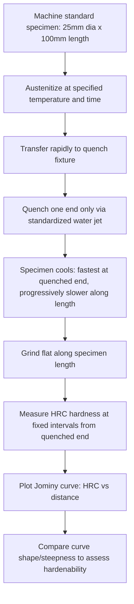

## Hardenability and the Jominy End Quench Test

### Overview

Hardenability is a measure of a steel's ability to form martensite to a given depth below the surface upon quenching—it describes *how deep* hardening penetrates, not the *maximum hardness* achievable (which is governed primarily by carbon content alone). A high-hardenability steel can develop a fully martensitic structure through a thick cross-section with a relatively mild quench, while a low-hardenability steel forms martensite only near the surface even under a severe quench, with the core transforming to softer, non-martensitic products (pearlite or bainite). The Jominy end-quench test is the standard, widely used experimental method for quantifying hardenability.

### Hardenability vs. Hardness: A Critical Distinction

**Key Points**

- **Hardness** (maximum achievable, as-quenched) is controlled primarily by **carbon content**: it reflects the degree of lattice distortion in the martensite that forms, essentially independent of alloying elements other than carbon.
- **Hardenability** (depth/uniformity of hardening) is controlled primarily by **alloying elements** (Mn, Cr, Mo, Ni, B, Si, and others) and by **prior austenite grain size**, both of which affect the *kinetics* of the competing diffusional transformations (pearlite, bainite) by delaying their onset, thereby allowing martensite to form even at the slower cooling rates experienced deeper within a part.
- A common point of confusion: a highly alloyed steel and a plain carbon steel with identical carbon content will exhibit the *same maximum surface hardness* when quenched, but the alloyed steel will harden to a much greater depth (higher hardenability) because its alloying additions retard pearlite/bainite formation, shifting the TTT/CCT curves to longer times.

**[Inference]** This distinction is one of the most frequently misunderstood concepts in introductory steel metallurgy, and instructors commonly emphasize it because selecting a steel grade based on hardness alone, without considering hardenability, can lead to a component that is fully hard at the surface but soft and weak at the core in thicker sections.

### Physical Basis of Hardenability

**Key Points**

- Hardenability is fundamentally a kinetic phenomenon: it reflects how much the C-curve (nose) of the TTT or CCT diagram is shifted to longer times by alloying and grain size effects.
- **Alloying elements** (except cobalt) generally retard the diffusional nucleation and growth of pearlite and bainite by altering the thermodynamics of carbide formation and/or reducing diffusion rates, shifting the transformation start curve to the right (longer times) on a TTT/CCT diagram.
- **Boron** is a notably effective hardenability-enhancing element even at very low concentrations (tens of ppm), acting primarily by segregating to and reducing the energy of prior austenite grain boundaries, thereby suppressing the preferential nucleation of ferrite/pearlite that would otherwise occur there.
- **Larger prior austenite grain size** increases hardenability by reducing the total grain-boundary area available for heterogeneous nucleation of pearlite/ferrite, which are diffusional products that preferentially nucleate at grain boundaries; martensite formation, being diffusionless, is comparatively insensitive to grain boundary area in this regard.

### The Jominy End-Quench Test Procedure

**Key Points**

- A standardized cylindrical specimen (25 mm/1 inch diameter, 100 mm/4 inches long per ASTM A255/SAE J406) is austenitized to a specified temperature and time.
- The heated specimen is transferred to a fixture and quenched from **one end only** by a controlled, standardized jet of water directed axially at the bottom face, while the rest of the specimen air-cools/is shielded from the water spray.
- This produces a continuous range of cooling rates along the length of the bar: the quenched end cools extremely fast (approximating an infinite/ideal quench), while positions progressively farther from the quenched end cool progressively more slowly, simulating the range of cooling rates experienced at different depths beneath the surface of a real, variously-sized quenched part.
- After quenching to room temperature, a flat is ground along the length of the specimen (removing a small amount of decarburized/surface-affected material), and **Rockwell C hardness (HRC)** is measured at fixed intervals (typically every 1/16 inch, or 1.5 mm) starting from the quenched end.
- The resulting **hardenability curve** (Jominy curve) plots hardness (HRC) versus distance from the quenched end, providing a direct, standardized fingerprint of that steel's hardenability.

### Interpreting the Jominy Curve

**Key Points**

- The hardness at the quenched end (distance = 0) approximates the maximum hardness achievable for that steel's carbon content, since this location experiences the fastest possible cooling rate.
- The **shape and steepness of the hardness drop-off** with distance is the key hardenability indicator: a shallow, gradual decline indicates high hardenability (martensite forms even at the slower cooling rates farther from the quenched end), while a steep, rapid decline indicates low hardenability (only positions very close to the quenched end achieve significant martensite; farther positions transform to softer pearlite/bainite).
- Different steel grades with the same carbon content (and thus the same quenched-end hardness) can show dramatically different curve shapes depending on alloy content—this is the direct experimental demonstration of the hardness/hardenability distinction.
- The **distance to 50% martensite** (often correlated with a specific hardness value depending on carbon content) is a commonly used single-number hardenability index for comparing steels or specifying acceptance criteria.

### Representative Jominy Curve Comparison

<svg xmlns="http://www.w3.org/2000/svg" viewBox="0 0 650 420">
<text x="325" y="25" font-size="16" text-anchor="middle" font-family="sans-serif" font-weight="bold">Jominy Hardenability Curves (svg_diagram)</text>
<line x1="80" y1="370" x2="600" y2="370" stroke="black" stroke-width="1.5" />
<line x1="80" y1="370" x2="80" y2="60" stroke="black" stroke-width="1.5" />
<text x="340" y="400" font-size="14" text-anchor="middle" font-family="sans-serif">Distance from Quenched End (1/16 in)</text>
<text x="35" y="220" font-size="14" text-anchor="middle" font-family="sans-serif" transform="rotate(-90 35,220)">Hardness (HRC)</text>

<text x="80" y="385" font-size="11" text-anchor="middle" font-family="sans-serif">0</text>

<text x="240" y="385" font-size="11" text-anchor="middle" font-family="sans-serif">8</text>

<text x="400" y="385" font-size="11" text-anchor="middle" font-family="sans-serif">16</text>

<text x="560" y="385" font-size="11" text-anchor="middle" font-family="sans-serif">24</text>

<text x="65" y="365" font-size="11" text-anchor="end" font-family="sans-serif">20</text>

<text x="65" y="230" font-size="11" text-anchor="end" font-family="sans-serif">40</text>

<text x="65" y="90" font-size="11" text-anchor="end" font-family="sans-serif">60</text>

<path d="M 80,90 L 130,110 L 180,220 L 250,300 L 350,340 L 500,355 L 600,360" fill="none" stroke="#d62728" stroke-width="2.5" />
<text x="450" y="330" font-size="12" font-family="sans-serif" fill="#d62728">Low hardenability (plain C)</text>

<path d="M 80,90 L 150,100 L 250,120 L 350,150 L 450,190 L 550,230 L 600,250" fill="none" stroke="#1f77b4" stroke-width="2.5" />
<text x="420" y="200" font-size="12" font-family="sans-serif" fill="#1f77b4">High hardenability (alloy steel)</text>
</svg>

### Test Procedure Flow

### Correlating Jominy Position to Actual Part Cooling Rates

**Key Points**

- A key practical application of the Jominy test is correlating specific positions along the Jominy bar to the cooling rates experienced at specific locations (surface, mid-radius, center) within actual round bars of various diameters, under various quenching media severities (mild oil, moderate oil, water, brine), using standardized correlation charts.
- This allows a designer or metallurgist to predict, from a single Jominy curve, the expected hardness distribution through the cross-section of an actual production part of a given size quenched in a given medium, without having to quench and section full-size parts for every combination of size and quench severity.
- Quench severity is often expressed via the **Grossmann H-value** (a dimensionless quenching intensity factor), used in conjunction with Jominy data and correlation charts/nomographs to predict as-quenched hardness distribution in actual components.

### Factors Influencing Hardenability

| Factor | Effect on Hardenability |
| --- | --- |
| Alloying elements (Mn, Cr, Mo, Ni, Si) | Increase (retard pearlite/bainite formation) |
| Boron (trace addition) | Significantly increases, especially in low-alloy steels |
| Prior austenite grain size (coarser) | Increases (fewer nucleation sites for diffusional products) |
| Undissolved carbides/inclusions | Decrease (act as heterogeneous nucleation sites for ferrite/pearlite) |
| Cobalt | Decreases (one of the few elements that accelerates diffusional transformation) |
| Carbon content | Primarily affects maximum hardness, with only a secondary effect on hardenability itself |

### Practical Significance in Component Design and Selection

**Key Points**

- Hardenability data is essential for selecting an appropriate steel grade for a component of a given size and required through-hardness: an undersized-hardenability steel in a thick section will harden only at the surface, leaving a soft, potentially lower-strength core that may not meet design requirements, particularly for components loaded in a way that stresses the core (e.g., bending, torsion).
- **Ideal critical diameter ($D_I$)**, a related concept derived from Jominy/Grossmann data, represents the largest bar diameter that can be quenched to achieve 50% martensite at the center under an idealized (infinitely severe) quench; it provides a composition-based, quench-medium-independent hardenability metric useful for alloy comparison and selection.
- Hardenability bands (rather than single curves) are specified in many steel standards (e.g., "H-band" steels in SAE/AISI designations) to account for the normal heat-to-heat compositional variation within a nominal grade, since even small variations in alloy content measurably shift the Jominy curve.

**[Inference]** Because hardenability is sensitive to relatively small compositional variations, mill certification of Jominy hardenability (H-band compliance) is generally treated as an important quality control checkpoint for critical structural or safety components, in addition to standard chemical composition verification.

### Related Topics

- Time-Temperature-Transformation (TTT) and Continuous-Cooling-Transformation (CCT) Diagrams
- Martensite Formation and the Role of Carbon Content in Maximum Hardness
- Grossmann H-Value and Quench Severity Classification
- Ideal Critical Diameter and Alloy Steel Selection
- Boron Hardenability Effect and Boron Steel Grades
- Quenching Media Selection: Water, Oil, Polymer, and Salt Baths
- SAE/AISI H-Band Steel Specifications
- Prior Austenite Grain Size Control and Its Effect on Transformation Kinetics