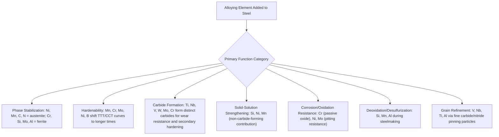

## Effects of Alloying Elements on Steel

### Overview

Alloying elements are deliberately added to iron-carbon alloys to modify phase stability, transformation kinetics, mechanical properties, and corrosion/oxidation resistance beyond what plain carbon steel can achieve. Each element's effect stems from its atomic size, electronic structure, and thermodynamic affinity for carbon (carbide formation) relative to iron, which together determine whether it dissolves preferentially in ferrite or austenite, shifts phase boundaries, forms distinct carbide phases, or alters transformation kinetics. Understanding these effects allows systematic alloy design for target combinations of strength, toughness, hardenability, and environmental resistance.

### Classification by Phase Stabilization

**Austenite stabilizers** expand the γ-phase field, lowering the $A_3$ temperature and, at sufficient concentration, potentially raising the $A_4$ (γ→δ) temperature or eliminating the α-phase field entirely at room temperature:

- **Manganese (Mn)**: Moderate austenite stabilizer; also a strong carbide former at higher concentrations and provides solid-solution strengthening.
- **Nickel (Ni)**: Strong austenite stabilizer; does not form carbides; provides toughness improvement, particularly at low temperature.
- **Carbon (C) and Nitrogen (N)**: Both strong austenite stabilizers as interstitial solutes, in addition to their primary strengthening roles.
- **Copper (Cu)**: Mild austenite stabilizer; used for precipitation hardening and atmospheric corrosion resistance (weathering steels).

**Ferrite stabilizers** contract the γ-phase field, raising $A_3$ and lowering $A_4$, and at sufficient concentration can eliminate the γ-phase field entirely:

- **Chromium (Cr)**: Ferrite stabilizer at higher concentrations; strong carbide former; primary element for corrosion/oxidation resistance and hardenability.
- **Silicon (Si)**: Ferrite stabilizer; does not form carbides (generally excluded from cementite, tends to be rejected into ferrite/austenite during carbide formation); used for deoxidation, solid-solution strengthening, and oxidation resistance.
- **Molybdenum (Mo), Tungsten (W), Vanadium (V), Titanium (Ti)**: Ferrite stabilizers; strong carbide formers; primarily used for hardenability, secondary hardening (tempering resistance), and grain refinement.
- **Aluminum (Al)**: Ferrite stabilizer; used for deoxidation and grain refinement (via AlN formation).

**Key Points**

- The stainless steel family classification (ferritic, austenitic, martensitic, duplex) is a direct practical consequence of balancing austenite-stabilizing (Ni, Mn, N) against ferrite-stabilizing (Cr, Si, Mo) elements to achieve a targeted room-temperature phase structure.
- The **Schaeffler diagram** (and related constitution diagrams) provides a widely used graphical tool for predicting resulting phase structure (ferrite, austenite, martensite fractions) in stainless steel weld deposits based on "chromium equivalent" and "nickel equivalent" calculations that sum the relative ferrite-stabilizing and austenite-stabilizing potency of each alloying element present.

### Classification by Carbide-Forming Tendency

Alloying elements vary in their thermodynamic affinity for carbon relative to iron, determining whether they enter solid solution in ferrite/austenite or preferentially form distinct carbide phases:

| Element | Carbide-Forming Tendency | Typical Carbide Formed |
| --- | --- | --- |
| Ti, Nb, V, Zr | Very strong | MC-type (e.g., TiC, VC, NbC) |
| W, Mo | Strong | M₆C, M₂C |
| Cr | Moderate-strong | M₇C₃, M₂₃C₆ (concentration-dependent) |
| Mn | Weak-moderate | Substitutes into Fe₃C |
| Fe | (Baseline) | Fe₃C (cementite) |
| Si, Ni, Al, Co, Cu | None (non-carbide formers) | Remain in solid solution in ferrite/austenite |

**Key Points**

- **Non-carbide-forming elements** (Si, Ni, Cu, Al, Co) are rejected from carbide phases as they form and instead partition into and strengthen the ferrite/austenite matrix via solid-solution strengthening.
- **Strong carbide formers** (Ti, Nb, V) are used deliberately in **microalloyed steels** to produce fine, stable MC-type carbides/carbonitrides that pin grain boundaries during hot working (restricting austenite grain growth) and provide precipitation strengthening, forming the basis of HSLA (High-Strength Low-Alloy) steel design.
- The relative carbide-forming tendency also governs **tempering behavior**: strong carbide formers resist dissolution and coarsening at elevated temperature, producing **secondary hardening** (a hardness increase or plateau during tempering, rather than the typical monotonic softening) as fine alloy carbides precipitate at temperatures where cementite would normally be coarsening—this is the basis of hot-work and high-speed tool steel design.

### Individual Element Effects Summary

**Manganese (Mn)**

- Universal deoxidizer/desulfurizer (forms MnS, mitigating hot-shortness from iron sulfide films at grain boundaries).
- Moderate hardenability booster; moderate austenite stabilizer; solid-solution strengthener.
- Present in virtually all commercial steels at some minimum level for these reasons.

**Chromium (Cr)**

- Primary element for corrosion and oxidation resistance above approximately 10.5-12 wt%, via formation of a passive Cr₂O₃ surface oxide layer (the defining threshold for "stainless" steel).
- Significant hardenability improvement at lower concentrations (alloy/tool steels).
- Forms hard carbides (Cr₇C₃, Cr₂₃C₆) contributing to wear resistance in tool and bearing steels.

**Nickel (Ni)**

- Improves toughness, particularly low-temperature (impact) toughness, by lowering the ductile-to-brittle transition temperature—critical for cryogenic and structural steels used in cold climates.
- Austenite stabilizer; primary alloying element in austenitic stainless steels (with Cr) and in high-strength low-alloy structural/pressure vessel steels.
- Does not form carbides; contributes purely via solid-solution strengthening and toughness effects.

**Molybdenum (Mo)**

- Strong hardenability enhancer, notably effective at suppressing **temper embrittlement** (a toughness loss that can occur in some alloy steels tempered or slow-cooled through certain intermediate temperature ranges).
- Contributes to secondary hardening in tool steels via fine Mo-carbide precipitation during tempering.
- Improves high-temperature strength (creep resistance) in heat-resistant alloys.

**Vanadium (V)**

- Strong carbide former (VC); used for grain refinement (pinning austenite grain boundaries during hot working/heat treatment) and secondary hardening in tool steels.
- Effective at very low concentrations, making it a common microalloying addition in HSLA steels for grain refinement and precipitation strengthening without significantly raising cost or compromising weldability.

**Silicon (Si)**

- Primary deoxidizer in steelmaking; residual Si content remains in essentially all steels from this role.
- Solid-solution strengthener; used at higher concentrations in spring steels (improves elastic limit/resistance to fatigue) and electrical (silicon) steels (reduces magnetic hysteresis losses).
- Promotes graphitization in cast irons (contrasting with its non-carbide-forming behavior in steel).

**Boron (B)**

- Extremely effective hardenability enhancer at trace concentrations (typically 0.0005-0.003 wt%), acting via grain-boundary segregation that suppresses heterogeneous ferrite nucleation.
- Requires the steel to be fully deoxidized (Al-killed) and free of excess nitrogen (which would tie up boron as BN, negating its hardenability effect), making boron steel production more composition-sensitive than typical alloy additions.

**Sulfur and Phosphorus (generally residual/undesired, though sometimes deliberate)**

- Sulfur is generally an undesirable residual element (causes hot-shortness via low-melting FeS films at grain boundaries) but is deliberately added in free-machining steels (as MnS inclusions) to improve chip formation and machinability at the cost of transverse ductility/toughness.
- Phosphorus is generally minimized due to its tendency to promote temper embrittlement and reduce toughness, though small controlled additions are used in some weathering/atmospheric-corrosion-resistant steels.

**[Inference]** The specific concentration thresholds and quantitative effects cited for many of these elements (e.g., exact hardenability multiplying factors, secondary hardening onset temperatures) are generally alloy-system- and processing-route-dependent; the qualitative roles and relative tendencies described here reflect widely accepted metallurgical principles, but precise numerical design values should be verified against alloy-specific data for engineering applications.

### Alloying Element Roles Overview

### Effect on Phase Diagram: Schematic Shift

<svg xmlns="http://www.w3.org/2000/svg" viewBox="0 0 650 400">
<text x="325" y="25" font-size="16" text-anchor="middle" font-family="sans-serif" font-weight="bold">Alloying Effect on Gamma-Field (svg_diagram)</text>
<line x1="80" y1="350" x2="600" y2="350" stroke="black" stroke-width="1.5" />
<line x1="80" y1="350" x2="80" y2="60" stroke="black" stroke-width="1.5" />
<text x="340" y="380" font-size="14" text-anchor="middle" font-family="sans-serif">Alloying Element Content (wt%)</text>
<text x="35" y="200" font-size="14" text-anchor="middle" font-family="sans-serif" transform="rotate(-90 35,200)">Temperature</text>

<path d="M 100,350 Q 100,100 250,100 Q 400,100 400,350" fill="#dddddd" opacity="0.5" stroke="black" stroke-width="1.5" />
<text x="250" y="200" font-size="13" text-anchor="middle" font-family="sans-serif">gamma-field (baseline)</text>

<path d="M 100,350 Q 100,70 300,70 Q 550,70 550,350" fill="none" stroke="#1f77b4" stroke-width="2.5" stroke-dasharray="6,3" />
<text x="480" y="130" font-size="12" font-family="sans-serif" fill="#1f77b4">Expanded by Ni, Mn (open loop)</text>

<path d="M 100,350 Q 100,160 200,160 Q 300,160 300,350" fill="none" stroke="#d62728" stroke-width="2.5" stroke-dasharray="6,3" />
<text x="150" y="145" font-size="12" font-family="sans-serif" fill="#d62728">Contracted by Cr, Si (closed loop)</text>
</svg>

### Combined Alloy Design Example

**Example**: AISI 4340 (a widely used high-strength low-alloy steel, approximately 0.40% C, 1.8% Ni, 0.8% Cr, 0.25% Mo, 0.7% Mn) illustrates deliberate multi-element alloy design:

- **Ni** provides toughness and mild hardenability without carbide formation.
- **Cr** and **Mo** together provide strong, complementary hardenability (allowing full martensitic hardening in thick sections) and help suppress temper embrittlement (Mo specifically).
- **Mn** assists deoxidation/desulfurization and provides additional hardenability and solid-solution strengthening.
- The combined effect allows 4340 to achieve high strength with good fracture toughness in large cross-sections (landing gear, high-strength shafts) that a plain carbon steel of the same carbon content could not harden through effectively.

### Related Topics

- Hardenability and the Jominy End-Quench Test
- Stainless Steel Classification and the Schaeffler Diagram
- Secondary Hardening and Tool Steel Alloy Design
- HSLA (High-Strength Low-Alloy) and Microalloyed Steel Design
- Temper Embrittlement Mechanisms and Prevention
- Free-Machining Steel Design (Sulfur and Lead Additions)
- Boron Steel Production Requirements (Deoxidation, Nitrogen Control)
- Carbon Equivalent Formulas Incorporating Alloying Element Effects