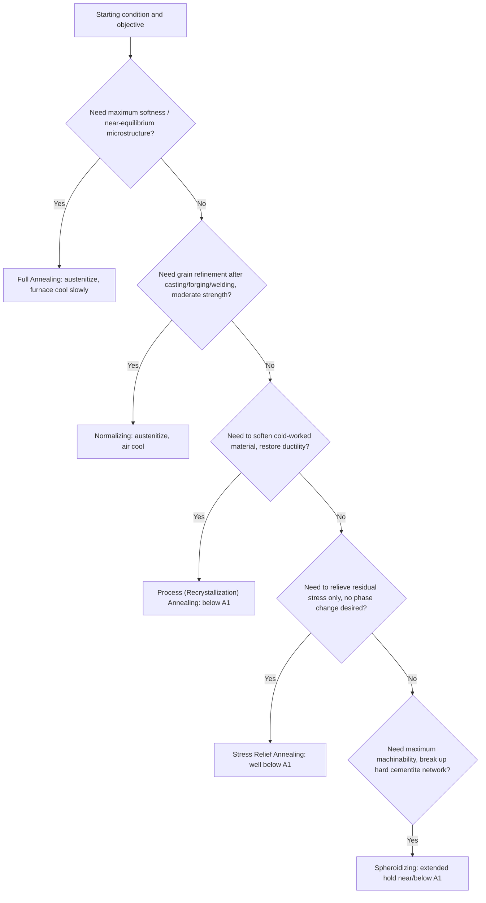

## Annealing and Its Variants

### Overview

Annealing refers to a broad family of heat treatment processes involving heating a steel to an elevated temperature, holding for a specified time, and then cooling—generally slowly—to produce a softer, more ductile, more machinable, or more dimensionally stable condition, and to relieve internal stresses or refine grain structure. Unlike hardening treatments, which aim to maximize strength/hardness via martensite formation, annealing treatments generally aim to move the microstructure toward a more stable, lower-energy, near-equilibrium condition. The specific variant selected depends on the starting condition of the material and the intended purpose (softening, stress relief, grain refinement, machinability improvement, or preparation for subsequent processing).

### Full Annealing

**Key Points**

- The steel is heated to approximately 30-50°C above $A_3$ (hypoeutectoid steels) or above $A_1$ (hypereutectoid steels, deliberately kept below Acm to avoid full dissolution of proeutectoid cementite and excessive austenite grain growth), held to homogenize, then **furnace-cooled** very slowly (often at rates of a few degrees per hour) to room temperature.
- Slow furnace cooling allows near-equilibrium transformation, producing coarse pearlite and, in hypoeutectoid steels, proeutectoid ferrite—the softest, most ductile, and most machinable condition typically achievable via annealing.
- Used to soften steel prior to cold working, to relieve internal stresses from prior processing, to refine a coarse or non-uniform as-cast/as-forged grain structure, and to improve machinability in some medium-to-high carbon steels.
- The primary drawback is long processing time (extended furnace occupancy for slow cooling), making it more costly than alternative softening treatments where full equilibrium softness is not strictly required.

### Normalizing

**Key Points**

- Similar austenitizing temperature range to full annealing (typically 30-50°C above $A_3$/Acm, sometimes somewhat higher to ensure full homogenization), but cooling is performed in **still air** rather than in the furnace.
- Air cooling is faster than furnace cooling, producing **finer pearlite** and generally a finer, more uniform grain structure than full annealing, resulting in moderately higher strength and hardness than fully annealed material, with somewhat reduced ductility.
- A key purpose is **grain refinement**: normalizing is commonly specified after casting, forging, or welding to eliminate the coarse, non-uniform grain structure inherited from those processes, and to homogenize composition and structure prior to final hardening treatments.
- Often used as a final treatment in its own right for structural steels where a moderate strength increase over the annealed condition is desired without the cost and distortion risk of full hardening and tempering.

### Full Annealing vs. Normalizing: Cooling Rate Comparison

<svg xmlns="http://www.w3.org/2000/svg" viewBox="0 0 600 380">
<text x="300" y="25" font-size="16" text-anchor="middle" font-family="sans-serif" font-weight="bold">Cooling Curves: Anneal vs Normalize (svg_diagram)</text>
<line x1="80" y1="330" x2="550" y2="330" stroke="black" stroke-width="1.5" />
<line x1="80" y1="330" x2="80" y2="60" stroke="black" stroke-width="1.5" />
<text x="315" y="360" font-size="14" text-anchor="middle" font-family="sans-serif">Time</text>
<text x="35" y="195" font-size="14" text-anchor="middle" font-family="sans-serif" transform="rotate(-90 35,195)">Temperature</text>

<line x1="80" y1="90" x2="150" y2="90" stroke="black" stroke-width="2" />
<text x="100" y="80" font-size="11" font-family="sans-serif">Austenitize</text>

<path d="M 150,90 L 500,300" fill="none" stroke="#1f77b4" stroke-width="2.5" />
<text x="480" y="290" font-size="12" font-family="sans-serif" fill="#1f77b4">Full Anneal (furnace cool)</text>

<path d="M 150,90 L 300,300" fill="none" stroke="#d62728" stroke-width="2.5" />
<text x="310" y="260" font-size="12" font-family="sans-serif" fill="#d62728">Normalize (air cool)</text>

<text x="150" y="60" font-size="11" text-anchor="middle" font-family="sans-serif">A3/A1 + 30-50C</text>

</svg>

### Process Selection Flow

### Process (Recrystallization) Annealing

**Key Points**

- Applied to cold-worked steel (e.g., after wire drawing, cold rolling) to restore ductility for further cold working, without necessarily austenitizing the material.
- Performed at a temperature below $A_1$ (commonly in the range of 550-650°C for many steels), sufficient to allow recrystallization of the strained ferrite grains but without inducing a phase transformation.
- Removes the dislocation substructure and residual stress introduced by cold working, restoring a strain-free, equiaxed grain structure and the associated ductility, at the cost of the strength gained from cold work.
- Distinguished from full annealing primarily by *not* requiring austenitization—it is a sub-critical (below $A_1$) treatment relying purely on recovery and recrystallization mechanisms rather than phase transformation.

### Stress Relief Annealing

**Key Points**

- Performed at a relatively low temperature, typically well below $A_1$ (often in the range of 500-650°C for steels, though the specific temperature depends on the alloy and the residual stress source), with no intent to alter microstructure or hardness significantly.
- Purpose is purely to relieve internal (residual) stresses arising from prior processing—welding, machining, casting solidification, or uneven cooling—that could otherwise cause distortion or cracking during subsequent operations or in service.
- Cooling rate from the stress-relief temperature is generally controlled (often furnace-cooled or slow air-cooled) to avoid reintroducing new thermal stresses during the treatment itself.
- Commonly specified for weldments (to reduce residual stress and associated distortion or stress-corrosion cracking susceptibility) and for precision machined components (to prevent dimensional distortion during subsequent finish machining).

### Spheroidizing (Spheroidize Annealing)

**Key Points**

- Specifically targets the morphology of cementite: converts lamellar pearlitic cementite (or a proeutectoid cementite network in hypereutectoid steels) into discrete, rounded (spheroidal) carbide particles dispersed in a ferrite matrix.
- Achieved by extended holding at a temperature just below $A_1$ (or by thermal cycling slightly above and below $A_1$), driving cementite to spheroidize via interfacial energy minimization (surface-area-reducing diffusion, analogous to particle coarsening/Ostwald ripening processes).
- Produces the **softest and most machinable** condition achievable for a given steel composition, particularly valuable for high-carbon and hypereutectoid steels (tool steels, bearing steels) that would otherwise be very difficult to machine or cold-form in the pearlitic or as-hardened condition.
- Essential preparatory step before cold forming operations (e.g., cold heading, deep drawing) of medium-to-high carbon steel, and commonly specified prior to final machining of tool steels before hardening.

**[Inference]** Because spheroidizing is a slow, diffusion-driven morphological change rather than a phase-boundary-crossing transformation in the same sense as full annealing, treatment times are often considerably longer (many hours to over a day, depending on starting microstructure and section size) than for full annealing or normalizing at comparable temperatures.

### Comparative Summary Table

| Variant | Austenitizing? | Cooling Method | Primary Purpose | Resulting Hardness (relative) |
| --- | --- | --- | --- | --- |
| Full Annealing | Yes (above A3/A1) | Furnace (very slow) | Maximum softness, coarse pearlite | Lowest (among as-transformed states) |
| Normalizing | Yes (above A3/Acm) | Still air | Grain refinement, moderate strength | Moderate (higher than full anneal) |
| Process Annealing | No (sub-critical) | Furnace or air | Restore ductility after cold work | Depends on prior cold work removed |
| Stress Relief | No (sub-critical, lower T) | Furnace or slow air | Relieve residual stress only | Unchanged (no phase transformation) |
| Spheroidizing | No (near/below A1) | Slow | Maximum machinability, carbide morphology | Lowest achievable for high-C steels |

### Practical Considerations in Process Selection

**Key Points**

- **Full annealing** is selected when maximum softness and ductility are required and processing time/cost is a secondary concern (e.g., prior to extensive cold forming of medium-carbon steel).
- **Normalizing** is often preferred over full annealing when only moderate softening/grain refinement is needed, since it is faster and cheaper (no extended furnace occupancy for slow cooling), and the resulting finer grain structure can also improve toughness relative to the full-anneal condition.
- **Process annealing** is specific to cold-worked stock and is typically integrated as an intermediate step within multi-stage cold forming/wire drawing operations rather than as a final treatment.
- **Stress relief** is applied when dimensional stability or cracking resistance is the concern rather than bulk mechanical property modification, and is frequently specified as a mandatory step in welding procedure specifications for certain steel grades and section thicknesses.
- **Spheroidizing** is reserved for cases where maximum machinability or cold-formability of higher-carbon steel is essential, and is often a required intermediate step in tool and bearing steel manufacturing sequences, performed after initial forging/rolling and before final machining and hardening.

### Related Topics

- The Iron-Iron Carbide (Fe-Fe3C) Phase Diagram and Critical Temperatures (A1, A3, Acm)
- Recovery, Recrystallization, and Grain Growth in Cold-Worked Metals
- Quenching and Tempering: The Hardening Heat Treatment Sequence
- Residual Stress Formation During Welding and Machining
- Spheroidized Carbide Microstructures in Tool and Bearing Steels
- Grain Size Control and Its Effect on Toughness and Hardenability
- Cold Forming Process Design (Wire Drawing, Cold Heading, Deep Drawing)
- Furnace Atmosphere Control and Decarburization During Annealing