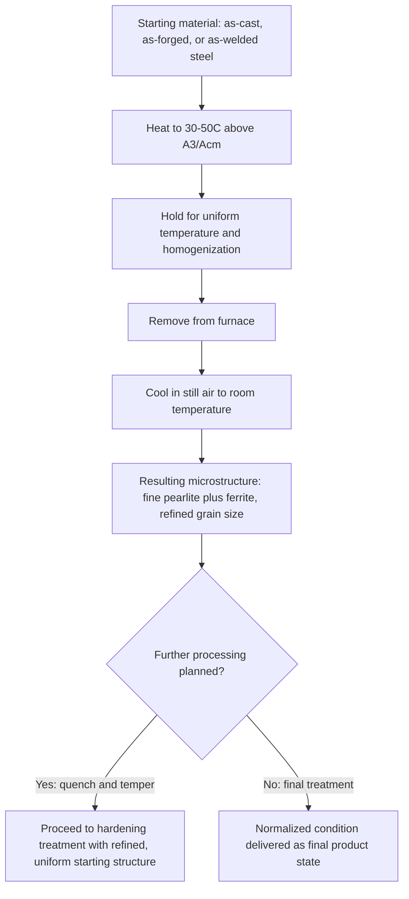

## Normalizing

### Overview

Normalizing is a heat treatment process in which steel is heated into the austenite phase field, held to homogenize, and then cooled in still air to room temperature. It occupies an intermediate position between full annealing (furnace-cooled, slower, softer, coarser microstructure) and hardening treatments (quenched, faster, harder, martensitic microstructure), producing a fine, uniform pearlitic (or ferrite-pearlite) microstructure at moderate cost and processing time. Normalizing is one of the most commonly specified heat treatments in structural steel manufacturing, both as a final treatment and as a preparatory step before further processing.

### Process Parameters

**Key Points**

- **Austenitizing temperature**: Typically 30-50°C (55-90°F) above the $A_3$ line for hypoeutectoid steels, or above the Acm line for hypereutectoid steels—generally somewhat higher than the corresponding full annealing temperature range, to ensure complete austenitization and adequate homogenization given the subsequent faster cooling.
- **Holding time**: Sufficient to achieve uniform temperature throughout the section and to homogenize carbon distribution and dissolve carbides into solution; typically referenced as approximately one hour per inch (25 mm) of section thickness, though exact soak times depend on furnace type, loading, and prior microstructure.
- **Cooling method**: Free (still) air cooling, with the part removed from the furnace and allowed to cool unassisted at ambient conditions—distinguishing it from both the furnace cooling of full annealing and the accelerated quenching (water, oil, polymer) of hardening treatments.

### Resulting Microstructure

**Key Points**

- Air cooling is faster than furnace cooling but far slower than liquid quenching, producing **fine pearlite** (finer interlamellar spacing than the coarse pearlite typical of full annealing) in hypoeutectoid and eutectoid steels, along with a correspondingly finer distribution of proeutectoid ferrite in hypoeutectoid compositions.
- The faster cooling rate also promotes a **finer, more uniform grain size** than full annealing, since less time is available for grain growth during the transformation and cooling process.
- In thicker sections or in steels with sufficient hardenability, normalizing cooling rates may approach or partially enter the bainite formation range near the surface, though for most common structural carbon and low-alloy steels in typical section sizes, the resulting structure remains predominantly fine pearlite plus ferrite.

**[Inference]** The specific balance between fine pearlite and any bainitic contribution during normalizing depends on the interplay between section thickness (which controls actual cooling rate at a given location) and the steel's hardenability (which controls how slow a cooling rate is still sufficient to bypass pearlite formation); for many common normalizing applications, this bainitic contribution is negligible, but it can become relevant in thicker sections of more highly hardenable grades.

### Primary Purposes of Normalizing

**Grain Refinement**

- One of the most common applications: normalizing is specified after casting, forging, or welding to break down and refine the coarse, non-uniform (often dendritic or Widmanstätten) grain structure inherited from high-temperature processing.
- The repeated (or single) thermal cycling through the α↔γ transformation during normalizing nucleates new, fine austenite grains upon heating, which upon subsequent air cooling produce a fine, uniform final grain structure, effectively "resetting" the prior coarse structure.

**Homogenization**

- Normalizing homogenizes compositional segregation (e.g., from as-cast dendritic microsegregation) by allowing diffusion during the austenitizing hold, improving structural uniformity prior to subsequent processing or service.

**Property/Structure Standardization**

- Because as-rolled or as-forged steel properties can vary depending on the specific finishing temperature and cooling history of the mill process, normalizing is sometimes specified simply to produce a known, standardized, reproducible microstructure and property set, independent of the prior thermomechanical history.

**Preparation for Subsequent Heat Treatment**

- Normalizing is commonly used as a preliminary step before final hardening (quench and temper) treatments, ensuring a uniform, fine-grained starting austenite structure that promotes more uniform hardening response and reduces the risk of retained coarse-grain regions that could behave inconsistently during the final quench.
- Also used before machining in some cases, where the moderate hardness and improved uniformity (relative to an as-forged or as-cast condition) improve machinability and surface finish consistency.

**Improved Mechanical Properties (as a final treatment)**

- For some structural steel applications, normalizing itself is specified as the final treatment, since the finer grain size and pearlite compared to full annealing provide a useful increase in strength and often improved toughness (via Hall-Petch-type grain refinement strengthening and its associated toughness benefit), without the cost, distortion risk, or need for tempering associated with full hardening.

### Normalizing Process Flow

### Comparison with Full Annealing

<svg xmlns="http://www.w3.org/2000/svg" viewBox="0 0 600 380">
<text x="300" y="25" font-size="16" text-anchor="middle" font-family="sans-serif" font-weight="bold">Normalizing vs Full Annealing Outcomes (svg_diagram)</text>

<text x="150" y="55" font-size="14" text-anchor="middle" font-family="sans-serif" font-weight="bold">Normalized</text>

<rect x="60" y="70" width="180" height="220" fill="none" stroke="black" stroke-width="1" />

<g stroke="#333" stroke-width="1" fill="none">
<circle cx="90" cy="100" r="15" /><circle cx="120" cy="95" r="14" /><circle cx="150" cy="105" r="16" />
<circle cx="180" cy="98" r="13" /><circle cx="210" cy="102" r="15" />
<circle cx="95" cy="135" r="14" /><circle cx="125" cy="130" r="15" /><circle cx="155" cy="138" r="14" />
<circle cx="185" cy="132" r="16" /><circle cx="210" cy="140" r="13" />
<circle cx="90" cy="170" r="15" /><circle cx="120" cy="165" r="14" /><circle cx="150" cy="172" r="15" />
<circle cx="180" cy="168" r="14" /><circle cx="210" cy="175" r="15" />
</g>
<text x="150" y="315" font-size="11" text-anchor="middle" font-family="sans-serif">Fine grain, fine pearlite</text>

<text x="450" y="55" font-size="14" text-anchor="middle" font-family="sans-serif" font-weight="bold">Full Annealed</text>

<rect x="360" y="70" width="180" height="220" fill="none" stroke="black" stroke-width="1" />

<g stroke="#333" stroke-width="1" fill="none">

<circle cx="410" cy="110" r="30" /><circle cx="480" cy="120" r="32" />

<circle cx="420" cy="200" r="35" /><circle cx="490" cy="190" r="28" />

</g>

<text x="450" y="315" font-size="11" text-anchor="middle" font-family="sans-serif">Coarse grain, coarse pearlite</text>

</svg>

### Effect on Mechanical Properties (Relative to Full Annealing)

| Property | Normalized | Full Annealed |
| --- | --- | --- |
| Hardness/Strength | Moderately higher | Lower |
| Ductility | Moderately lower | Higher |
| Toughness | Often improved (finer grain) | Lower (coarser grain) |
| Grain size | Finer | Coarser |
| Processing time/cost | Lower (air cool) | Higher (furnace cool) |
| Residual stress | Somewhat higher (faster cool) | Lower |

**Key Points**

- The higher cooling rate in normalizing, while producing beneficial grain and pearlite refinement, also generates somewhat greater thermal gradients and residual stress than full annealing's slow furnace cool, though generally far less than a liquid quench.
- Section thickness has a significant effect on normalizing outcomes: thin sections cool quickly and relatively uniformly in air, while thick sections may cool much more slowly at the core than at the surface, potentially producing a less uniform structure (coarser at the center) than in thin sections—an important practical limitation when specifying normalizing for large forgings or castings.

### Applications and Industrial Practice

**Key Points**

- Widely specified for structural steel plate, forgings, and castings (e.g., pressure vessel steels, structural shapes) both to refine grain structure inherited from hot working/casting and to provide a standardized, code-compliant final property set.
- Common intermediate step in forging shops: forgings are frequently normalized immediately after forging (sometimes directly from forging heat, if temperature control allows) to refine the as-forged grain structure before final machining and/or hardening.
- Specified in various material standards and codes (e.g., certain ASTM/ASME pressure vessel and structural steel specifications) as either a mandatory or optional supplementary treatment, reflecting its established role in ensuring predictable, uniform mechanical properties.
- Not typically used for high-hardenability alloy or tool steels where the intended final condition is fully hardened and tempered, since normalizing them serves primarily as a preparatory homogenization/grain-refinement step rather than a final property-generating treatment in those cases.

### Related Topics

- Full Annealing and Its Comparison to Normalizing
- Grain Size Control and Hall-Petch Strengthening
- The Iron-Iron Carbide (Fe-Fe3C) Phase Diagram and Critical Temperatures
- Quenching and Tempering: The Hardening Heat Treatment Sequence
- Forging Process Design and Post-Forge Heat Treatment
- Pearlite Interlamellar Spacing and Cooling Rate Relationships
- Pressure Vessel and Structural Steel Heat Treatment Specifications
- Residual Stress Development During Air Cooling of Thick Sections