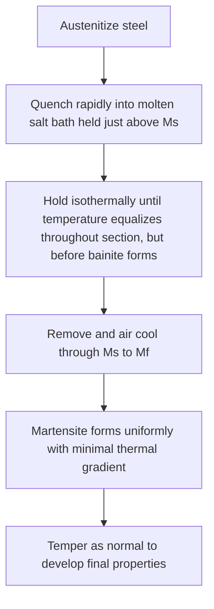

## Quenching Media and Techniques

### Overview

Quenching is the rapid cooling of austenitized steel to suppress diffusional transformation (pearlite/bainite formation) and promote martensite formation. The choice of quenching medium and technique directly controls the cooling rate experienced by a part, which must be fast enough to achieve the desired hardness/microstructure (governed by the steel's hardenability) while remaining slow enough, or sufficiently well-managed, to avoid excessive distortion or cracking from thermal and transformation stresses. Selecting and controlling the quenching medium and technique is therefore a central practical concern in heat treatment, balancing metallurgical requirements against dimensional and structural integrity constraints.

### The Three Stages of Quenching

Quenching in a liquid medium generally proceeds through three physically distinct stages, each with a different heat transfer mechanism and cooling rate:

**Stage A: Vapor Blanket (Film Boiling) Stage**

- Immediately upon immersion, the hot part vaporizes the adjacent liquid, forming a continuous, insulating vapor film around the surface.
- Heat transfer occurs primarily by radiation and conduction through this vapor film, which is a relatively poor heat transfer mechanism—this stage therefore produces the **slowest** cooling rate of the three stages, despite occurring at the highest temperature difference.
- The duration and stability of this stage is a critical variable: a long, stable vapor blanket can delay the onset of faster cooling into a temperature range where slower cooling is actually undesirable (e.g., through the pearlite nose), reducing effective hardenability response.

**Stage B: Nucleate Boiling (Vapor Transport) Stage**

- As the part cools and/or the vapor film becomes locally unstable, violent boiling occurs directly at the part surface, with vapor bubbles forming and departing rapidly.
- This stage provides the **fastest** cooling rate of the three, since latent heat of vaporization is being extracted directly and efficiently at the interface.
- Most of the "useful" rapid quenching (bypassing the pearlite/bainite noses) occurs during this stage for water- and oil-based media.

**Stage C: Convection (Liquid Cooling) Stage**

- Once the part surface temperature drops below the boiling point of the medium, no further vaporization occurs, and heat transfer proceeds by simple liquid convection.
- This is the **slowest** stage overall, since it relies purely on convective heat transfer rather than the more efficient boiling mechanisms of Stage B.
- This slower final-stage cooling occurs through the martensite transformation range in most media, which is generally beneficial, since it reduces the thermal/transformation stress gradient during the martensite formation stage, lowering distortion and cracking risk.

**[Inference]** The transition points between these three stages, and their relative durations, are strongly medium-dependent and are the primary mechanism by which additives (agitation, polymer concentration, salt bath composition) are used to tailor the overall cooling curve to a specific steel's hardenability and cracking sensitivity, rather than the boiling stages themselves being fixed properties of quenching in general.

### Common Quenching Media

| Medium | Relative Severity (Grossmann H-value, approx.) | Characteristics |
| --- | --- | --- |
| Brine (water + salt) | Very high (~2.0-5.0 with agitation) | Fastest, most severe; short/unstable vapor stage; high cracking/distortion risk |
| Water | High (~1.0-1.5, agitated higher) | Fast; prone to unstable, non-uniform vapor blanket ("soft spots") |
| Oil (conventional) | Moderate (~0.25-0.8) | Slower, more uniform than water; reduced distortion/cracking risk; common for alloy steels |
| Polymer (e.g., PAG solutions) | Adjustable (~0.3-1.5, concentration-dependent) | Tunable severity via concentration; combines water's environmental/cost advantages with more oil-like uniformity |
| Molten salt | Low-moderate (~0.5-1.0, isothermal) | Used for isothermal treatments (martempering, austempering); very uniform temperature |
| Air/forced air | Very low (~0.02-0.05) | Mildest; used for high-hardenability steels or air-hardening tool/die steels |

**Key Points**

- **Brine and water** provide the most severe (fastest) quenches but are prone to forming an unstable, non-uniformly collapsing vapor blanket, which can cause uneven cooling and localized "soft spots" as well as high distortion/cracking risk, particularly in parts with sections of varying thickness or sharp geometric features.
- **Oil** quenches more slowly and more uniformly than water because oil's vapor blanket stage is generally more stable and its overall boiling behavior is less violent, substantially reducing distortion and cracking risk—at the cost of reduced hardening depth for lower-hardenability steels.
- **Polymer quenchants** (commonly polyalkylene glycol, PAG, solutions in water) allow the cooling severity to be tuned continuously between water-like and oil-like behavior by adjusting polymer concentration, offering a versatile, more environmentally manageable (fire-safe, easier disposal) alternative to oil for many applications.
- **Molten salt baths** provide very uniform, controllable, isothermal cooling and are the standard medium for martempering and austempering, where the part must be held at a controlled intermediate temperature rather than cooled continuously to room temperature.
- **Air (or forced air/gas) quenching** is reserved for steels with sufficiently high hardenability (many tool steels, some highly alloyed grades) that can form martensite even at the slow cooling rates air cooling provides, minimizing distortion for these premium, often geometrically complex or precision components.

### Agitation and Its Effect

**Key Points**

- Agitating the quenchant (mechanical stirring, pumped circulation, or part movement) disrupts the vapor blanket stage, causing it to collapse sooner and more uniformly, and increases convective heat transfer in the final cooling stage.
- Agitation therefore generally increases the effective severity (Grossmann H-value) of a given quenchant and improves cooling uniformity, reducing the risk of soft spots caused by localized, prolonged vapor blanket persistence.
- Excessive or non-uniform agitation, conversely, can introduce its own non-uniform cooling effects (e.g., uneven flow around a complex part geometry), so agitation design (nozzle placement, flow rate, part orientation/fixturing) is itself an important quenching process variable.

### Cooling Curve Comparison by Medium

<svg xmlns="http://www.w3.org/2000/svg" viewBox="0 0 650 400">
<text x="325" y="25" font-size="16" text-anchor="middle" font-family="sans-serif" font-weight="bold">Cooling Curves by Quench Medium (svg_diagram)</text>
<line x1="80" y1="350" x2="600" y2="350" stroke="black" stroke-width="1.5" />
<line x1="80" y1="350" x2="80" y2="60" stroke="black" stroke-width="1.5" />
<text x="340" y="380" font-size="14" text-anchor="middle" font-family="sans-serif">Time</text>
<text x="35" y="205" font-size="14" text-anchor="middle" font-family="sans-serif" transform="rotate(-90 35,205)">Temperature</text>

<path d="M 80,80 L 110,90 L 140,290 L 250,330 L 400,345 L 600,349" fill="none" stroke="#1f77b4" stroke-width="2.5" />
<text x="150" y="270" font-size="11" font-family="sans-serif" fill="#1f77b4">Water</text>

<path d="M 80,80 L 180,150 L 320,280 L 500,330 L 600,340" fill="none" stroke="#d62728" stroke-width="2.5" />
<text x="330" y="260" font-size="11" font-family="sans-serif" fill="#d62728">Oil</text>

<path d="M 80,80 L 350,180 L 600,290" fill="none" stroke="#2ca02c" stroke-width="2.5" />
<text x="450" y="260" font-size="11" font-family="sans-serif" fill="#2ca02c">Air</text>

<line x1="80" y1="300" x2="600" y2="300" stroke="gray" stroke-dasharray="4,3" />
<text x="610" y="304" font-size="11" font-family="sans-serif" fill="gray">Ms</text>
</svg>

### Special Quenching Techniques

**Martempering (Marquenching)**

- Purpose: minimize distortion and cracking by equalizing part temperature just above $M_s$ before allowing martensite to form, so that the entire cross-section transforms to martensite more nearly simultaneously, reducing the thermal/transformation stress gradients that a direct, continuous quench would produce.
- Requires the steel to have sufficient hardenability to avoid bainite formation during the isothermal hold above $M_s$; not all steels are suitable candidates.
- Still followed by a conventional tempering treatment, since the resulting structure is still (untempered) martensite.

**Austempering**

- Similar initial rapid quench into a salt bath, but held isothermally *within* the bainite transformation range (below the pearlite nose but above $M_s$) until the bainitic transformation is complete, rather than being removed before martensite forms.
- Produces bainite directly rather than martensite, avoiding the need for a separate tempering step and offering the specific bainite-related strength-toughness combination discussed under bainite formation.

**Interrupted/Time Quenching**

- The part is quenched in a severe medium (e.g., water) only long enough to pass through the critical pearlite/bainite nose region, then transferred to a milder medium or air for the remainder of the cooling through the martensite range, combining the speed needed to ensure hardening with the reduced thermal shock of a milder final-stage cool.

### Selecting a Quenching Medium: Key Considerations

**Key Points**

- **Steel hardenability** is the primary driver: high-hardenability steels can be quenched in milder media (oil, polymer, even air) while still achieving full martensitic hardening, whereas low-hardenability plain carbon steels typically require water or brine to achieve significant hardening depth.
- **Part geometry and section variation** strongly influence cracking/distortion risk: parts with sharp corners, keyways, holes, or abrupt section changes concentrate quenching stresses and are more prone to cracking, often necessitating a milder medium or a special technique (martempering) even at some cost to maximum achievable hardness/depth.
- **Environmental, safety, and cost factors**: oil quenching carries fire risk and disposal/environmental considerations; water and polymer quenchants are generally safer and easier to manage but may require careful concentration/temperature control (polymers) or acceptance of higher distortion risk (water).
- **Production consistency**: quenchant temperature, contamination (from oxidation products, dissolved metal, water content in oil), and agitation uniformity must be monitored and controlled over time, since quenchant condition drifts with use and directly affects the reproducibility of quenching results.

**[Inference]** In practice, quenchant selection is generally treated as an iterative, empirically validated decision for a given part-alloy-geometry combination—hardenability calculations and standard severity (H-value) data provide a starting point, but final medium and agitation parameters are frequently confirmed and refined via trial hardening and sectioning/hardness-testing of production or prototype parts, particularly for parts with demanding distortion or cracking tolerance requirements.

### Related Topics

- Hardenability and the Jominy End-Quench Test
- Martensite Formation and Volume Expansion Effects
- Grossmann H-Value and Quench Severity Classification
- Martempering and Austempering Process Comparison
- Quench Cracking: Root Causes and Prevention Strategies
- Tempering of Martensite: Stages and Property Development
- Polymer Quenchant Chemistry and Concentration Control
- Distortion Control in Heat-Treated Precision Components