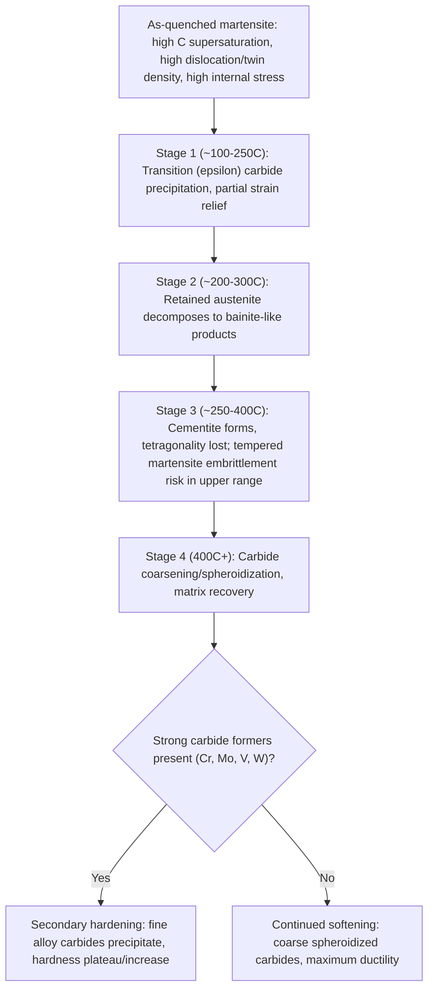

## Tempering and Its Effect on Microstructure

### Overview

Tempering is a heat treatment applied to as-quenched martensitic steel, involving reheating to a temperature below $A_1$ and holding for a specified time, followed by cooling (usually in air). Its purpose is to relieve the internal stresses and reduce the extreme brittleness of as-quenched martensite by allowing controlled, partial decomposition of the metastable martensite and retained austenite toward more stable, lower-energy microstructures, trading some hardness/strength for substantial improvements in ductility and toughness. Tempering is almost universally required after quench-hardening, since as-quenched martensite is rarely usable directly in engineering applications due to its brittleness and high residual stress.

### Why As-Quenched Martensite Requires Tempering

**Key Points**

- As-quenched martensite is a highly metastable, non-equilibrium structure: carbon is trapped in supersaturated solid solution in the body-centered tetragonal (BCT) lattice, and the diffusionless shear transformation leaves a very high density of dislocations (lath martensite) or internal twins (plate martensite).
- This combination of lattice strain, high defect density, and internal (residual/transformation) stress produces very high hardness but extremely low toughness and ductility—as-quenched martensite is typically too brittle for direct structural use and is highly susceptible to cracking, even from minor additional stress.
- Tempering allows the system to relax toward lower free energy by permitting limited atomic diffusion (of carbon, primarily, since substitutional alloying element diffusion requires much higher temperatures and longer times) without fully reverting to the equilibrium ferrite-plus-cementite (or ferrite-plus-alloy-carbide) structure that would form at higher temperature.

### The Stages of Tempering

Tempering of plain carbon and low-alloy steel martensite is generally described in terms of several overlapping stages, distinguished by the specific carbide/microstructural changes occurring within characteristic temperature ranges:

**Stage 1: Formation of Transition (Epsilon) Carbide (~100-250°C)**

- Very fine, transition-phase carbides (often termed epsilon-carbide, a hexagonal iron carbide with a composition close to Fe₂.₄C, distinct from cementite) precipitate within the martensite laths/plates.
- This precipitation reduces the tetragonality of the surrounding martensite (as carbon is removed from solid solution), partially relieving internal strain, though the structure at this stage is still often referred to as "tempered martensite" with substantial hardness retained.
- In higher-carbon steels, this stage can be associated with a measurable but modest volume contraction as tetragonality decreases.

**Stage 2: Decomposition of Retained Austenite (~200-300°C)**

- Any retained austenite present (common in medium-to-high carbon and higher-alloy steels where $M_f$ falls below room temperature) decomposes, typically to bainite-like ferrite plus cementite (or a similar fine carbide), during this temperature range.
- This stage is of particular practical importance because untransformed retained austenite left in service can transform later under stress or thermal cycling, causing dimensional instability; adequate tempering (or supplementary cryogenic treatment before tempering) addresses this.

**Stage 3: Formation of Cementite and Loss of Tetragonality (~250-400°C)**

- Transition carbides convert to cementite (Fe₃C), which begins to coarsen from very fine, closely spaced particles into somewhat larger, more widely spaced particles.
- The martensite matrix loses its tetragonal distortion entirely at this stage, effectively becoming carbon-depleted, dislocation-rich ferrite—this structure, together with the dispersed fine cementite, is termed **tempered martensite**.
- Many plain carbon and low-alloy steels tempered in the upper end of this range (around 260-370°C) can exhibit a toughness minimum known as **tempered martensite embrittlement (TME)**, associated with cementite precipitation in a film-like morphology along prior austenite or lath boundaries; this temperature range is often deliberately avoided in critical high-toughness applications.

**Stage 4: Carbide Coarsening (Spheroidization) and Recovery (~400°C and above)**

- With increasing temperature, cementite particles coarsen (larger particles grow at the expense of smaller ones, reducing total interfacial energy) and become more rounded/spheroidal.
- The ferrite matrix undergoes recovery (and, at the highest tempering temperatures approaching $A_1$, some recrystallization), reducing dislocation density and further softening the structure.
- At sufficiently high tempering temperature and time, the resulting structure approaches (but generally remains finer than) a spheroidized ferrite-cementite structure, providing maximum ductility/toughness among tempered conditions, at the cost of substantially reduced hardness/strength relative to lower-temperature tempers.

**Secondary Hardening (in alloy/tool steels containing strong carbide-forming elements, ~450-600°C)**

- In steels alloyed with strong carbide-forming elements (Cr, Mo, V, W), tempering at higher temperatures can produce a **hardness increase or plateau** rather than continued softening, as fine, highly stable alloy carbides (e.g., $M_2C$, $M_{23}C_6$, $VC$) precipitate, replacing the coarsening cementite.
- This secondary hardening effect is the basis of high-speed steel and hot-work tool steel design, allowing these steels to retain high hardness at elevated service/tempering temperatures where plain carbon steel martensite would have already substantially softened.

### Effect of Tempering Temperature on Mechanical Properties

**Key Points**

- **Hardness and strength decrease** with increasing tempering temperature (except in the secondary hardening range of appropriately alloyed steels), as carbide coarsening and matrix recovery progressively reduce the strengthening contributions of fine precipitates, dislocation density, and lattice distortion.
- **Ductility and toughness generally increase** with increasing tempering temperature, though this trend is not strictly monotonic: the tempered martensite embrittlement dip (Stage 3 region, ~260-370°C) represents a local toughness minimum that interrupts the otherwise general upward trend.
- **Temper embrittlement** (distinct from tempered martensite embrittlement) is a separate phenomenon occurring in some alloy steels (particularly those containing P, Sb, Sn, As as impurities, often in combination with Mn, Cr, Ni) when tempered or slow-cooled through an intermediate temperature range (roughly 375-575°C), attributed to segregation of these impurity elements to prior austenite grain boundaries; this is generally mitigated by rapid cooling through the embrittlement range after tempering, or by using Mo-containing steels, which suppress this segregation.

### Property Trends vs Tempering Temperature

<svg xmlns="http://www.w3.org/2000/svg" viewBox="0 0 650 400">
<text x="325" y="25" font-size="16" text-anchor="middle" font-family="sans-serif" font-weight="bold">Property Trends vs Tempering Temperature (svg_diagram)</text>
<line x1="80" y1="350" x2="600" y2="350" stroke="black" stroke-width="1.5" />
<line x1="80" y1="350" x2="80" y2="60" stroke="black" stroke-width="1.5" />
<text x="340" y="380" font-size="14" text-anchor="middle" font-family="sans-serif">Tempering Temperature</text>
<text x="35" y="205" font-size="14" text-anchor="middle" font-family="sans-serif" transform="rotate(-90 35,205)">Relative Property Value</text>

<text x="80" y="365" font-size="11" text-anchor="middle" font-family="sans-serif">200C</text>

<text x="330" y="365" font-size="11" text-anchor="middle" font-family="sans-serif">300C (TME)</text>

<text x="600" y="365" font-size="11" text-anchor="middle" font-family="sans-serif">600C</text>

<path d="M 80,90 L 200,140 L 330,175 L 450,220 L 600,290" fill="none" stroke="#d62728" stroke-width="2.5" />
<text x="440" y="210" font-size="12" font-family="sans-serif" fill="#d62728">Hardness/Strength</text>

<path d="M 80,300 L 200,240 L 280,260 L 330,280 L 380,250 L 450,180 L 600,100" fill="none" stroke="#1f77b4" stroke-width="2.5" />
<text x="420" y="160" font-size="12" font-family="sans-serif" fill="#1f77b4">Toughness</text>

<line x1="330" y1="350" x2="330" y2="60" stroke="gray" stroke-dasharray="4,3" />
<text x="335" y="70" font-size="11" font-family="sans-serif" fill="gray">TME dip region</text>
</svg>

### Tempering Stage Progression

### Selecting Tempering Temperature for Application

| Tempering Temperature Range | Typical Resulting Hardness | Typical Application |
| --- | --- | --- |
| Low (150-250°C) | High (retains most as-quenched hardness) | Cutting tools, files, wear parts requiring maximum hardness |
| Avoid (260-370°C, TME range) | Moderate | Generally avoided for impact-loaded/critical toughness applications |
| Medium (370-550°C) | Moderate | Springs, structural fasteners requiring strength-toughness balance |
| High (550-650°C) | Lower | Structural shafts, gears requiring maximum toughness at moderate strength |
| Secondary hardening range (450-600°C, alloy tool steels only) | High (plateau/increase) | High-speed steel, hot-work tool steel cutting/forming tools |

**Key Points**

- The specific temperature selected represents a deliberate strength-toughness trade-off dictated by the component's service requirements: wear resistance and edge retention favor lower tempering temperatures, while impact resistance and fracture toughness favor higher tempering temperatures.
- Tempering time also matters, though less strongly than temperature: at a given temperature, longer tempering time produces effects similar to (but generally smaller in magnitude than) a modest increase in tempering temperature, since both drive the same diffusion-controlled carbide precipitation/coarsening processes; this relationship is sometimes approximated using a combined time-temperature parameter (e.g., the Hollomon-Jaffe parameter) for comparing or substituting tempering schedules.

**[Inference]** While time-temperature equivalence parameters like the Hollomon-Jaffe parameter provide a useful engineering approximation for comparing tempering schedules, the precise numerical equivalence between a given time-temperature combination and an alternative one is alloy-specific and is generally validated experimentally (via hardness testing) rather than assumed from the parameter alone in critical applications.

### Practical and Quality Control Considerations

**Key Points**

- **Double tempering** is a common practice, particularly for higher-carbon and higher-alloy steels: a first temper transforms most of the as-quenched martensite and decomposes retained austenite (which may itself partially transform to untempered, brittle martensite upon cooling from the first temper), and a second, identical temper then tempers this newly formed martensite—ensuring no untempered martensite remains in the final structure.
- **Furnace temperature uniformity and control** are critical quality parameters, since even modest temperature variation across a furnace load can produce significant hardness variation between parts (or within a single large part) tempered together.
- **Hardness testing after tempering** is the standard, near-universal quality control check to confirm that the intended tempering response was achieved, since hardness correlates closely and predictably with tempering temperature/time for a given steel composition and prior quench condition.

### Related Topics

- Martensite Formation and the Body-Centered Tetragonal Structure
- Retained Austenite: Causes, Measurement, and Cryogenic Treatment
- Temper Embrittlement vs. Tempered Martensite Embrittlement
- Secondary Hardening and High-Speed/Hot-Work Tool Steel Design
- Hollomon-Jaffe Parameter and Tempering Time-Temperature Equivalence
- Quenching Media and Techniques
- Spring Steel Heat Treatment and Property Requirements
- Quantitative Metallography of Tempered Martensite Structures